# Create an Exadata Cloud Infrastructure resource

## Introduction

This lab walks you through the steps to create an Exadata Cloud Infrastructure resource.

Estimated Time: 15 minutes

### Objectives

-   Create a new Exadata Cloud Infrastructure resource

### Prerequisites

This lab requires completion of the following:

* Completion of Lab 1: Create your Virtual Cloud Network (VCN) and Required IAM Policy for Exadata Database Service on Dedicated Infrastructure section.
* To launch the system, a correctly configured virtual cloud network (VCN). Its related networking resources (gateways, route tables, security lists, DNS, and so on) must also be configured as necessary for the system.
* The right IAM policy is required to proceed. See [Required IAM Policy for Exadata Cloud Infrastructure](https://docs.oracle.com/en-us/iaas/exadatacloud/exacs/preparing-for-ecc-deployment.html#GUID-EA03F7BC-7D8E-4177-AFF4-615F71C390CD).

## Task 1: Create Cloud Exadata Infrastructure Resource

1. Log in to the Oracle Cloud. Once logged in, you are taken to the cloud services dashboard, where you can see all available services.

    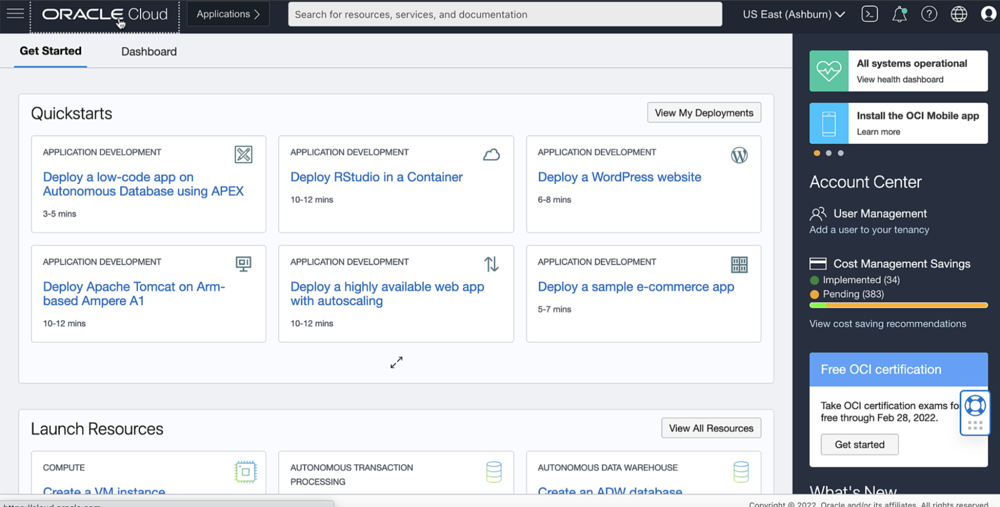

2. Click the navigation menu Click **Oracle Database**, then click **Exadata on Oracle Public Cloud**.

    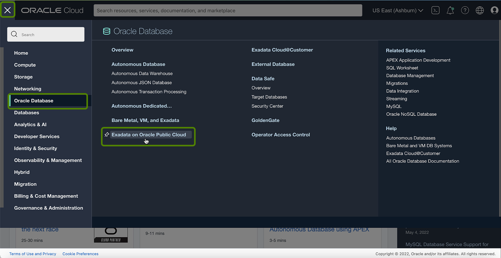

3. Under **Oracle Exadata Database Service on Dedicated Infrastructure**, click **Exadata Infrastructure**.

    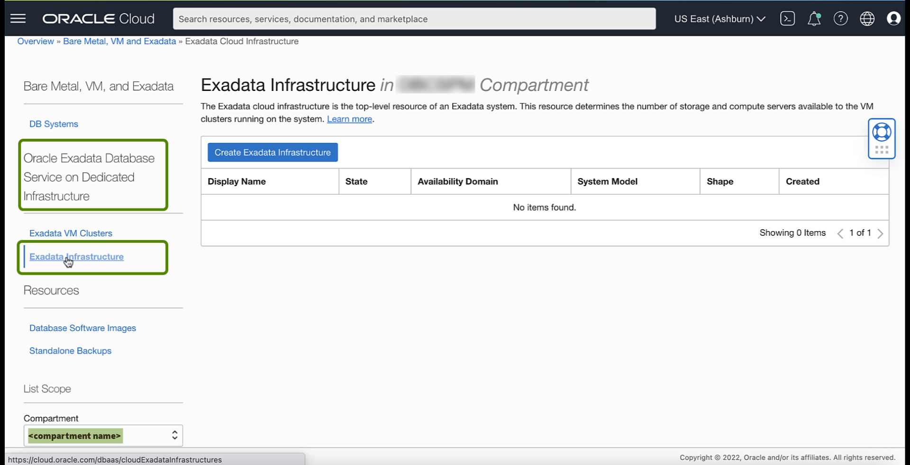

4. Click Create Exadata Infrastructure.

    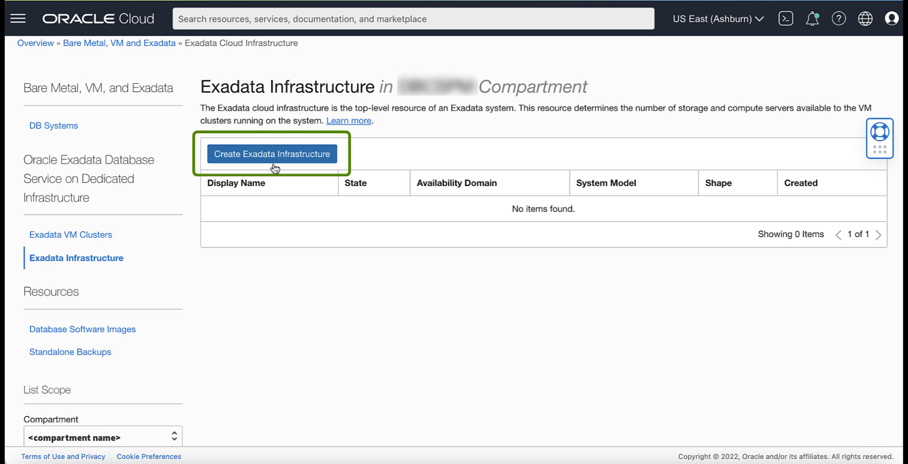

    In the Create Exadata Infrastructure Page, Provide basic information for the Exadata Cloud Infrastructure.

 5. **Compartment**: Select a compartment for the Exadata infrastructure.
    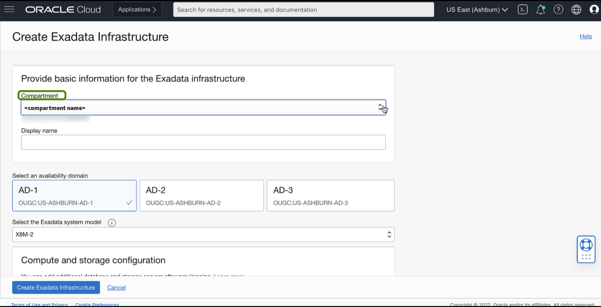
 6. **Display Name**: Enter a display name for the Exadata infrastructure.
 7. **Select an availability domain**: The availability domain in which the Exadata infrastructure resides.

    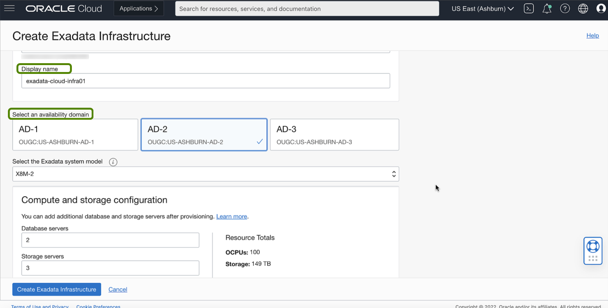

 8. **Select the Exadata system model**: Select either a fixed-shape system (quarter, half, or full rack X7-2  or X8-2 shapes) or a scalable system (X8M-2 or X9M-2).

    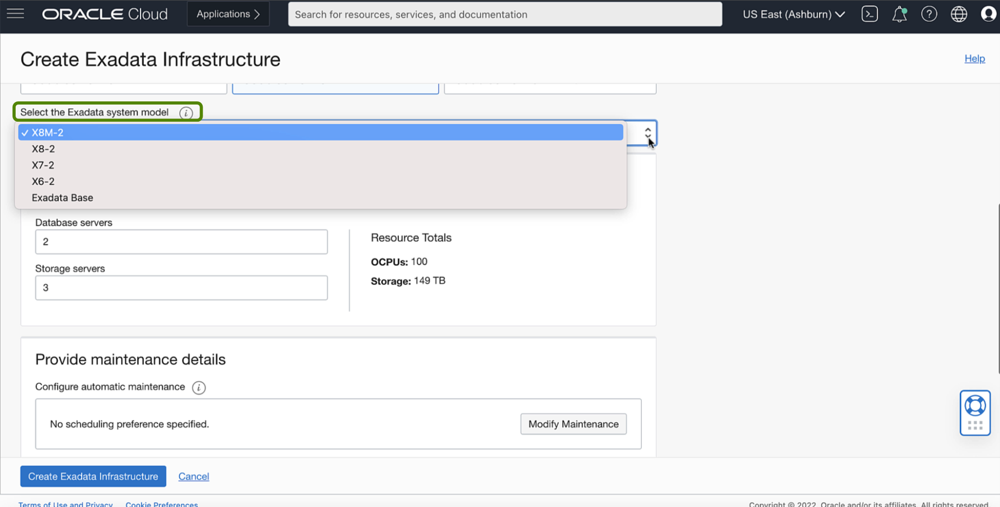

    **Exadata System Model:**

    **X9M-2**: If you select the flexible X9M-2 cloud infrastructure model, your initial Exadata Cloud Infrastructure instance can have a minimum of 2 database servers and three storage servers, up to 32 and 64 storage servers. After Provisioning, you can scale the service instance as needed by adding additional storage servers, compute servers, or both.

    **X8M-2**: If you select the flexible X8M-2 system model, your initial Exadata Cloud Service instance will have two database servers and three storage servers (the equivalents of an X8 quarter rack shape). After Provisioning, you can scale the service instance as needed by adding additional storage servers, compute servers, or both.

    **X7 and X8**: If you select an X7 or X8 system, you are given the choice of provisioning a quarter, half, or full rack. See Exadata Fixed Hardware Shapes: X6, X7, X8, and Exadata Base for hardware and capacity details.

    **Exadata Base**: The Exadata base shape comes in a single configuration and provides an economical alternative to Provisioning a quarter rack system.

    > **Note**: If you selected a flexible shape (X8M-2 or X9M-2), specify the **Compute and storage configuration**. You can specify **Database servers** from a minimum of 2 up to 32. You can specify **Storage servers** from a minimum of 3 up to 64.

    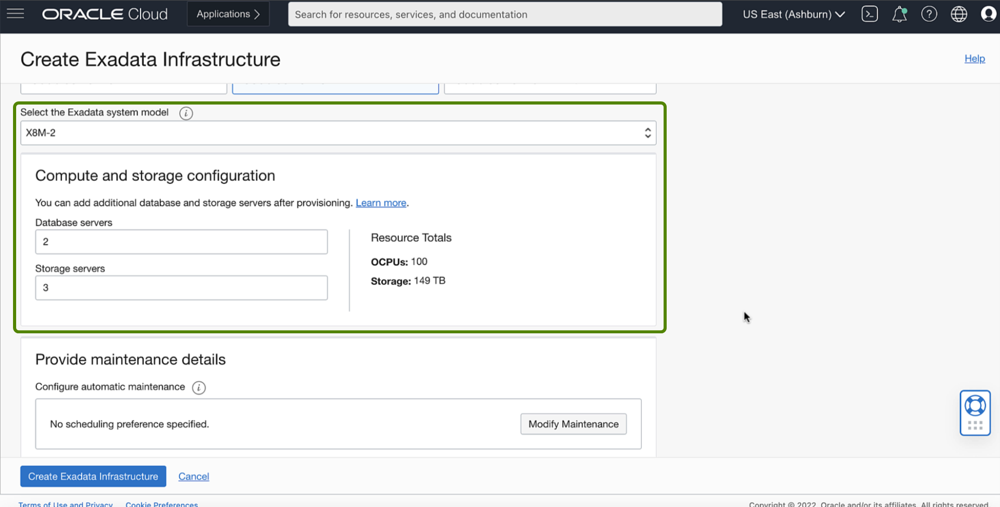

 9. Configure automatic maintenance: Click this button to specify a quarterly automatic infrastructure maintenance schedule.

    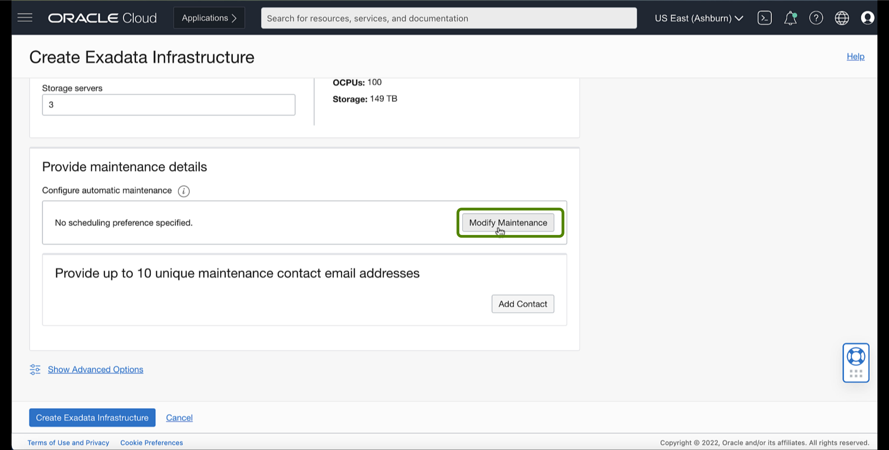

    In the Automatic Infrastructure Maintenance Schedule dialog that opens, do the following:

    Click the **Specify a schedule** radio button to choose your preferred month, week, weekday, and start time for infrastructure maintenance.

    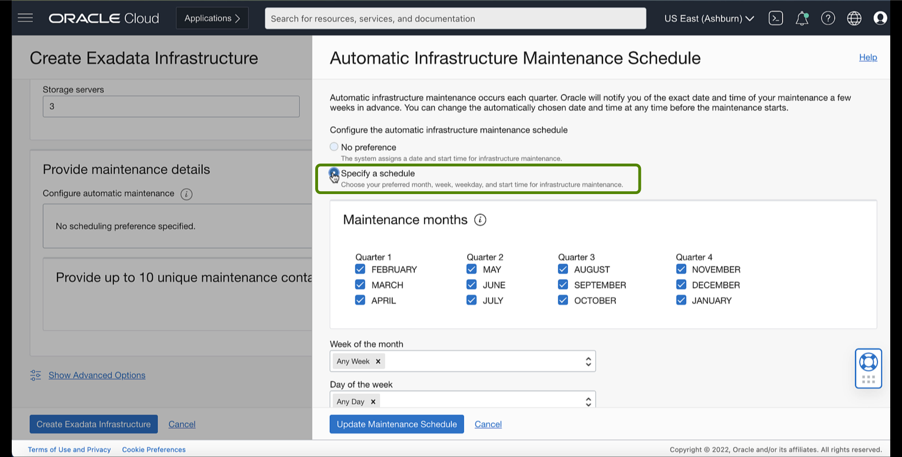

    Under **Maintenance months**, specify at least one month for each quarter during which Exadata infrastructure maintenance will occur.

    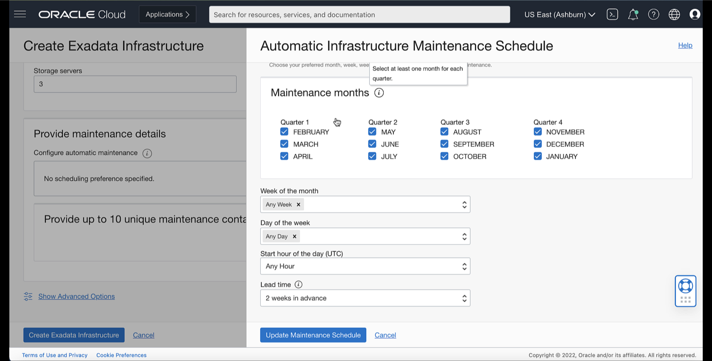

    * Under **Week of the month**, specify which week the monthly maintenance will take place.
    * Under **Day of the week**, specify the Day of the week on which the maintenance will occur.
    * Under **Start hour**, specify the hour during which the maintenance run will begin.
    * Under **Lead Time**, specify the weeks ahead of the maintenance event you would like to receive a notification message. Your lead time ensures that a newly released maintenance update is scheduled to account for your required period of advanced notification.

    Click **Update Maintenance Schedule**.

    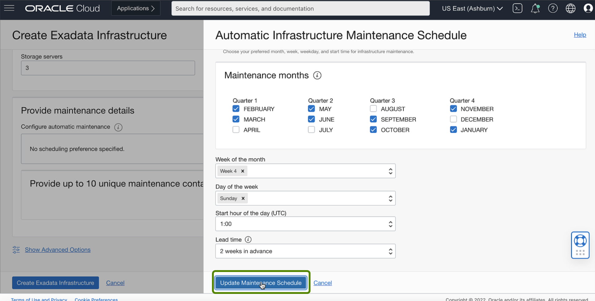

    Provide **Maintenance Contacts**

    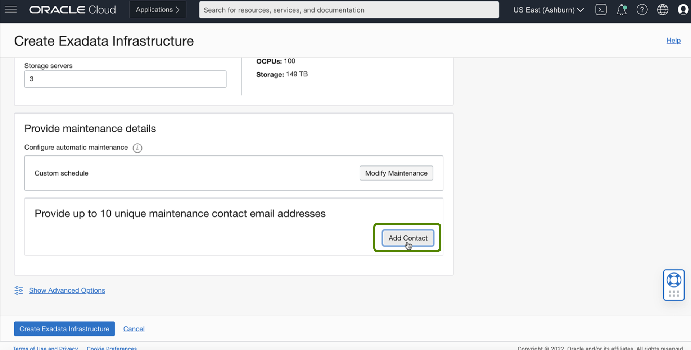

    Maintenance contacts are required for service request-based communications for maintenance events.

 10. Click **Show Advanced Options** to specify advanced options for the initial database.

     In the **Tags** tab, you can add tags to the database. To apply a defined tag, you must have permission to use the tag namespace. For more information about tagging, see Resource Tags. If unsure if you should apply tags, skip this option (you can apply tags later) or ask your administrator.

     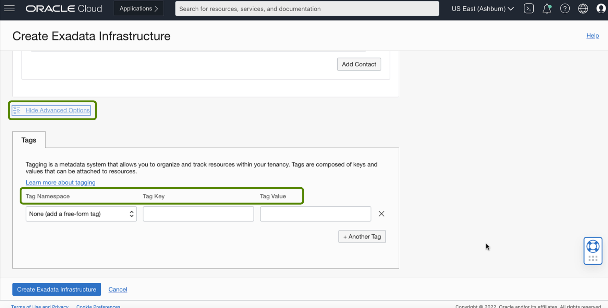

 11. Click **Create Exadata Infrastructure**.

     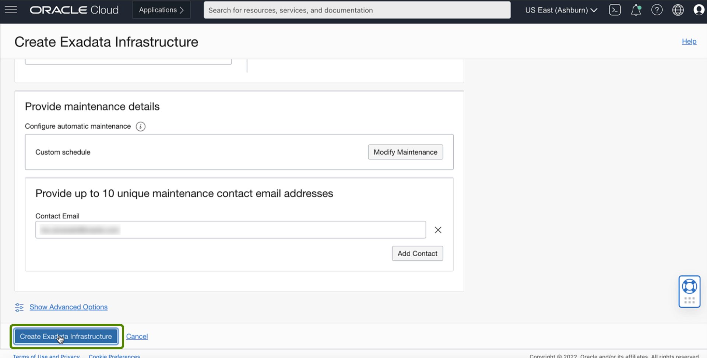

     The Cloud Exadata infrastructure appears in the Exadata Infrastructure list with **Provisioning** status.  

     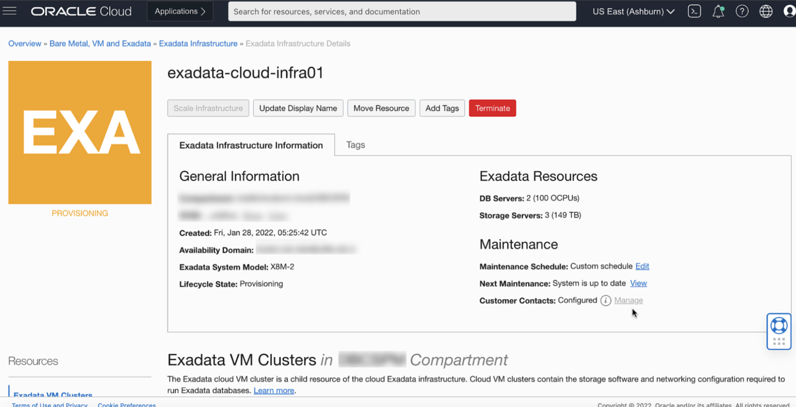

     After the Cloud Exadata infrastructure resource is successfully provisioned, The infrastructure's icon changes from yellow to green. In the **Available** state, you can create a cloud VM cluster.

     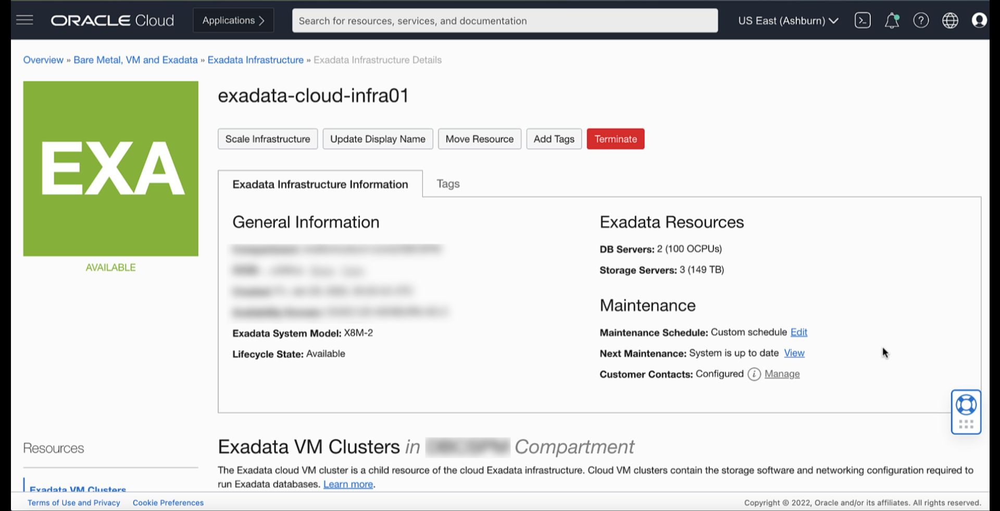

You may now **proceed to the next lab**.

## Learn More

Click [here](https://docs.oracle.com/en-us/iaas/exadatacloud/exacs/ecs-manage-infrastructure.html) for Managing Exadata Cloud Infrastructure Instance.

## Acknowledgements

* **Author** - Leo Alvarado, Product Management

* **Contributors** - Tammy Bednar, Eddie Ambler, Product Management

* **Last Update** - May 2022.
