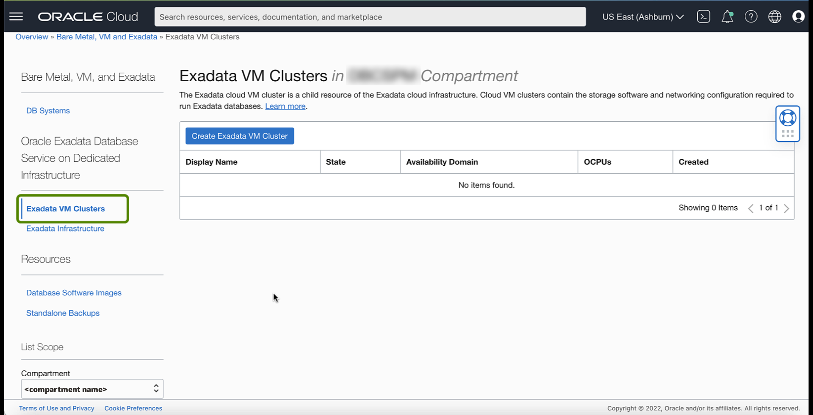
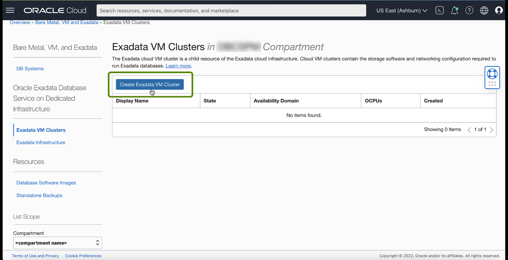
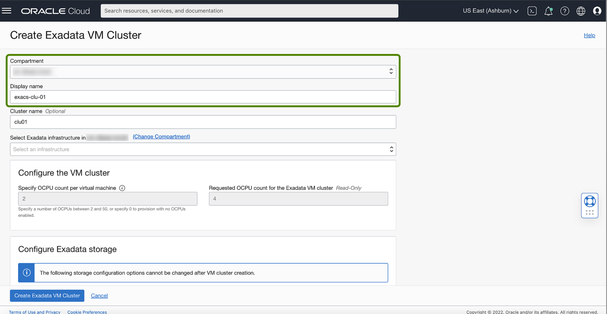
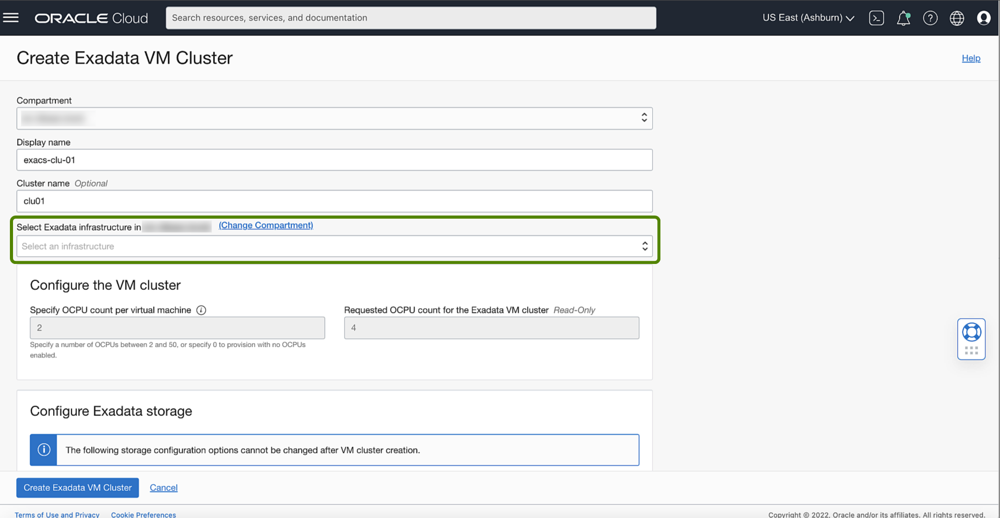
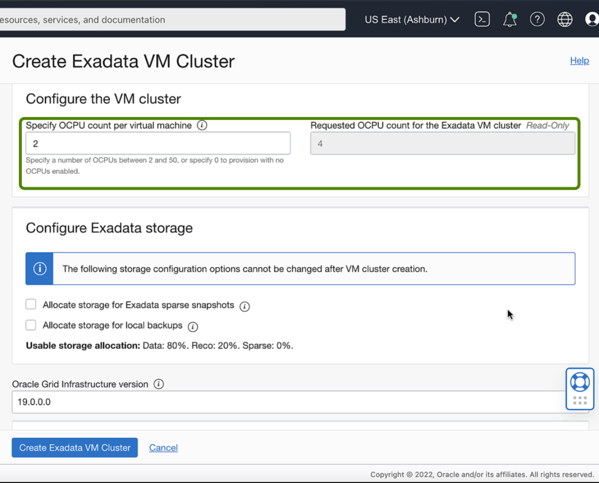
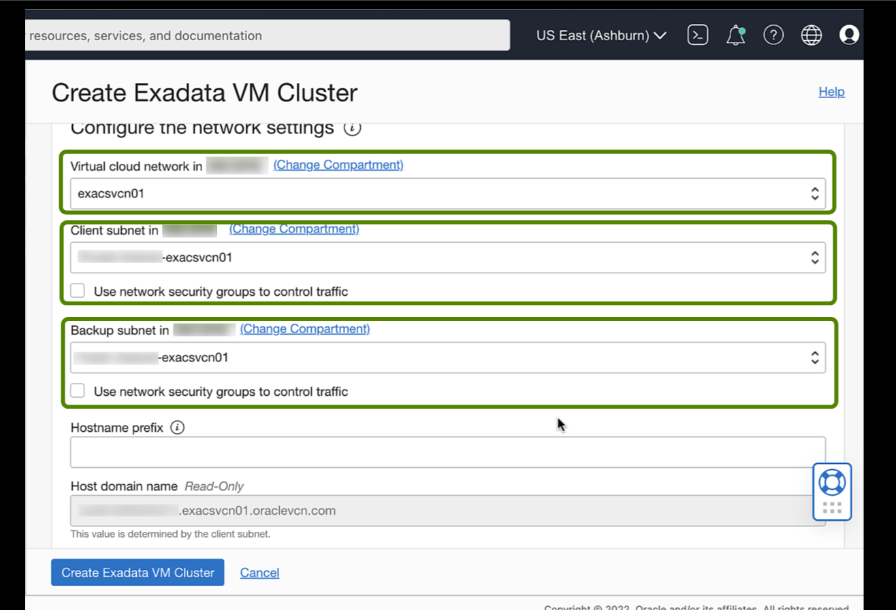
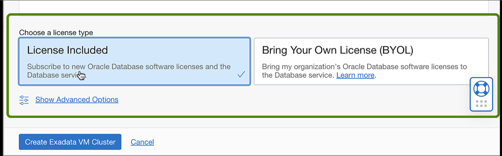
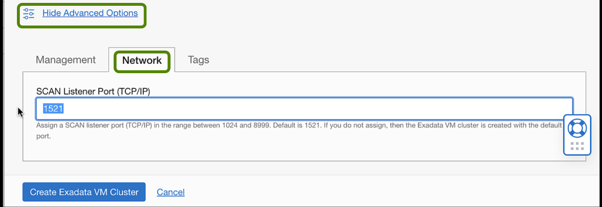
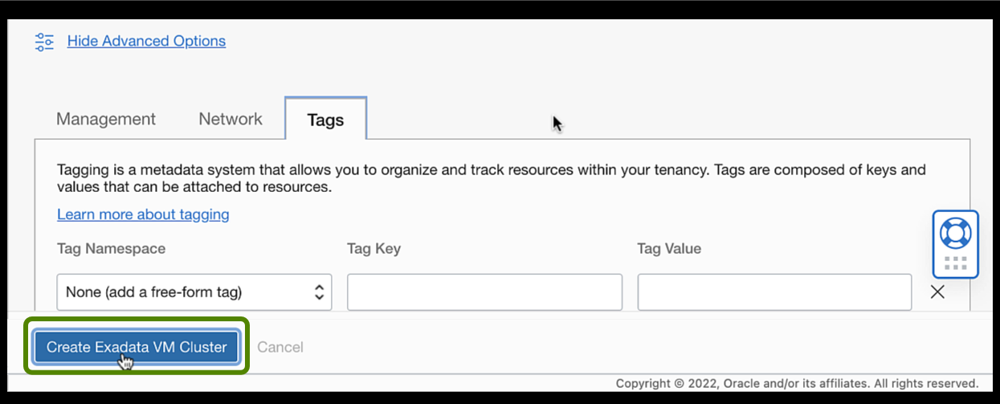
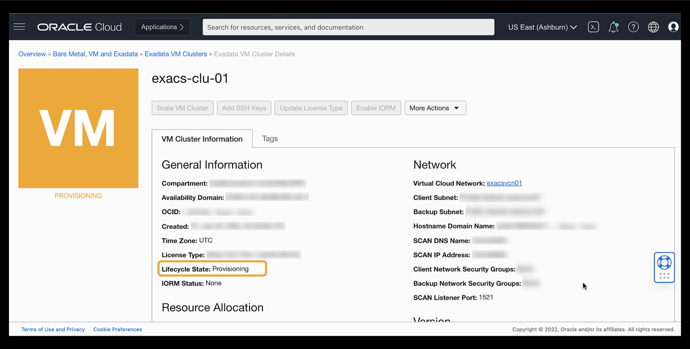

# Create a Cloud VM Cluster resource

## Introduction

This lab walks you through the steps to create a Cloud VM Cluster resource.

Estimated Time: 15 minutes (VM Cluster provisioning might take approximately 4hrs)

### Objectives

-   Create a new Cloud VM Cluster resource

### Prerequisites

This lab requires completion of the following:

* Completion of Lab 2: Create an Exadata Cloud Infrastructure resource section.
* To launch the system, a correctly configured virtual cloud network (VCN). Its related networking resources (gateways, route tables, security lists, DNS, and so on) must also be configured as necessary for the system.
* The right IAM policy is required to proceed. See [Required IAM Policy for Exadata Cloud Infrastructure](https://docs.oracle.com/en-us/iaas/exadatacloud/exacs/preparing-for-ecc-deployment.html#GUID-EA03F7BC-7D8E-4177-AFF4-615F71C390CD).
* The public key, in OpenSSH format, is from the key pair you plan to use to connect to the system via SSH.  

## Task 1: Create a Cloud VM Cluster resource

1. Log in to the Oracle Cloud. Once logged in, you are taken to the cloud services dashboard, where you can see all available services.

    

2. Click the navigation menu Click **Oracle Database**, then click **Exadata on Oracle Public Cloud**.

    

3. Under **Oracle Exadata Database Service on Dedicated Infrastructure**, click **Exadata VM Clusters**.

    

4. Click **Create Exadata VM Cluster**.

    

    In the Create Exadata VM Cluster Page, Provide the required information to configure the VM cluster.

5. **Compartment**: Select a compartment for the VM cluster resource.
6. **Display Name**: Enter a user-friendly display name for the VM cluster.

    

7. **Select Exadata infrastructure**: Select the infrastructure resource containing the VM cluster.     
     Currently, cloud Exadata infrastructure resources support only one VM cluster, so you must choose an infrastructure resource that does not have an existing VM cluster. Click Change Compartment and pick a different compartment from the one you are working in to view infrastructure resources in other compartments.

     

8. **Configure the VM cluster**: Specify the number of OCPU cores you want to allocate to each VM  
     cluster's virtual machine compute nodes. The read-only Requested OCPU count for the Exadata VM cluster field displays the total number of OCPU cores you are allocating.

     

9. **Configure Exadata storage**: Specify the following:

   **Allocate storage for Exadata sparse snapshots**: Select this configuration option if you intend to use snapshot functionality within your VM cluster. If you select this option, the SPARSE disk group is created, enabling you to utilize VM cluster snapshot functionality for PDB sparse cloning. If you do not choose this option, the SPARSE disk group is not created, and snapshot functionality will not be available on any database deployments created in the environment.

   **Allocate storage for local backups**: Select this option if you intend to perform database backups to the local Exadata storage within your Exadata Cloud Service instance. If you select this option, more space is allocated to the RECO disk group, which is used to store backups on Exadata storage. If you do not choose this option, more space is allocated to the DATA disk group, enabling you to store more information in your databases.

      

10. **Add SSH key**: Add the public key portion of each key pair you want to use for SSH access to the DB system.

    **Upload SSH key files**: Select this radio button to browse or drag and drop .pub files.

    **Paste SSH keys**: Select this radio button to paste individual public keys. To paste multiple keys, click + Another SSH Key and supply a single key for each entry.

      

11. **Configure the network settings**: Specify the following:

    **Virtual cloud network**: The VCN in which you want to create the VM cluster. Click Change Compartment to select a VCN in a different compartment.

    **Client subnet**: The subnet to which the VM cluster should attach. Click Change Compartment to select a subnet in a different compartment.

    > **Note**: Do not use a subnet that overlaps with 192.168.16.16/28, which the Oracle Clusterware private interconnect uses on the database instance. Specifying an overlapping subnet causes the private interconnect to malfunction.

    **Backup subnet**: The subnet for the backup network, which is typically used to transport backup information to and from Oracle Cloud Infrastructure Object Storage, and for Data Guard replication. Click Change Compartment to select a subnet in a different compartment, if applicable.

    > **Note**: Do not use a subnet that overlaps with 192.168.128.0/20. This restriction applies to both the client subnet and backup subnet.

    **Network Security Groups**: Optionally, you can specify one or more network security groups (NSGs); for both the client and backup networks. NSGs function as virtual firewalls, allowing you to apply a set of ingress and egress security rules to your Exadata Database Service VM cluster.

      

    **Hostname prefix**: Your choice of hostname for the Exadata DB system. The hostname must begin with an alphabetic character and can contain only alphanumeric characters and hyphens (-). The maximum number of characters allowed for an Exadata DB system is 12.

    > **Note**: The hostname must be unique within the subnet.

    **Host domain name**: The domain name for the VM cluster. If the selected subnet uses the Oracle-provided Internet and VCN Resolver for DNS name resolution, this field displays the subnet's domain name, which can't be changed. Otherwise, you can provide your choice of a domain name. Hyphens (-) are not permitted.

    **Host and domain URL**: This read-only field combines the host and domain names to display the database's fully qualified domain name (FQDN). The maximum length is 64 characters.

        

12. Choose a **license type**: The type of License you want to use for the VM cluster. Your choice affects metering
    for billing.

    **License Included** means the cost of the cloud service includes a license for the Database service.

    **Bring Your Own License (BYOL)** means you are an Oracle Database customer with an Unlimited License Agreement or Non-Unlimited License Agreement and want to use your License with Oracle Cloud Infrastructure. This removes the need for separate on-premises licenses and cloud licenses.

      

13. Click **Show Advanced Options** to specify advanced options for the VM cluster:

    **Time zone**: This option is located in the Management tab. The default time zone for the DB system is UTC, but you can specify a different time zone.

      

    **SCAN Listener Port**: This option is located in the Network tab. You can assign a SCAN listener port (TCP/IP) between 1024 and 8999. The default is 1521

      

    **Tags**: If you have permission to create a resource, then you also have permission to apply free-form tags to that resource. To apply a defined tag, you must have permission to use the tag namespace. For more information about tagging, see Resource Tags. If you are unsure whether to apply tags, skip this option (you can apply tags later) or ask your administrator.

      

14. Click **Create Exadata VM Cluster**

      

    The Cloud VM Cluster resource appears in the Exadata VM Clusters list with a status of **Provisioning**.

      

    After your VM cluster is successfully created, The VM Cluster's icon changes from yellow to green and in the **Available** state. You can view the VM Cluster Details page by clicking the name of the VM cluster in the list of clusters.

      

You may now **proceed to the next lab**.

## Learn More

Click [here](https://docs.oracle.com/en-us/iaas/exadatacloud/exacs/manage-vm-clusters.html) for documentation on Managing VM Clusters.

## Acknowledgements

* **Author** - Leo Alvarado, Product Management

* **Contributors** - Tammy Bednar, Eddie Ambler, Product Management

* **Last Update** - July 2022.
