# Create Oracle Database on Exadata Database Service on Dedicated Infrastructure

## Introduction

This Lab walks you through the steps to create Oracle Database on Exadata Database Service on Dedicated Infrastructure.

Estimated Time: 15 minutes

### Objectives

-   Create a database in an existing Exadata Database Service on Dedicated Infrastructure

### Prerequisites

This Lab requires completion of the following:

* Completion of Lab 4: Create Oracle Database Home on an Exadata Database Service on Dedicated Infrastructure section.
* To launch the system, a correctly configured virtual cloud network (VCN). Its related networking resources (gateways, route tables, security lists, DNS, and so on) must also be configured as necessary for the system.
* The right IAM policy is required to proceed. See [Required IAM Policy for Exadata Cloud Infrastructure](https://docs.oracle.com/en-us/iaas/exadatacloud/exacs/preparing-for-ecc-deployment.html#GUID-EA03F7BC-7D8E-4177-AFF4-615F71C390CD).

## Task 1: Create Oracle Database

1. Click the navigation menu Click **Oracle Database**, then click **Exadata on Oracle Public Cloud**.

    

2. Choose your **Compartment**

    

3. Navigate to the cloud VM cluster you want to create the new database on:

    Under **Oracle Exadata Database Service on Dedicated Infrastructure**, Click **Exadata VM Clusters**. In the list of VM clusters, find the VM cluster you want to access and click its highlighted name to view the details page for the cluster.

    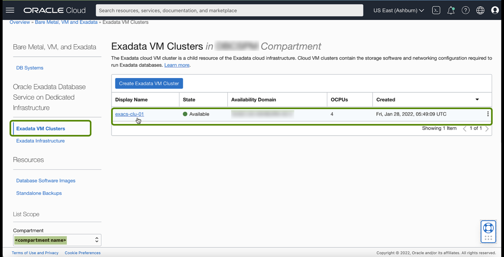

4.  Under **Resources**, click **Databases**, Then Click **Create Database**.

    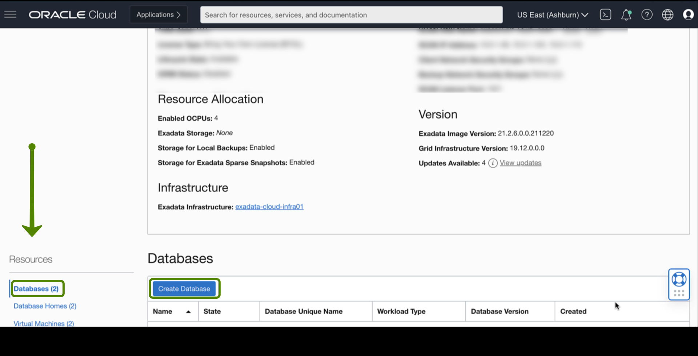

5. In the Create Database dialog, enter the following:

    

    **Database name**: The name for the database. The database name must meet the requirements:
    * Maximum of 8 characters
    * Contain only alphanumeric characters
    * Begin with an alphabetic character
    * Cannot be part of the first eight characters of a **DB\_UNIQUE_NAME** on the VM cluster
    * DO NOT use the following reserved names: grid, ASM.

    **Database unique name suffix**:
    Optionally, specify a value for the **DB\_UNIQUE_NAME** database parameter. The value is case insensitive.

    The unique name must meet the requirements:

    * Maximum of 30 characters
    * Contain only alphanumeric or underscore (_) characters
    * Begin with an alphabetic character
    * Unique across the VM cluster. It is recommended to be unique across the tenancy.

    If not specified, the system automatically generates a unique name value, as follows:

    > *< db\_name >\_< 3\_chars\_unique\_string >\_< region-name >*

    **Database version**: The version of the database. You can mix database versions on the Exadata DB system.

    

    **PDB Name**:*(Optional)* For Oracle Database 12c (12.1.0.2) and later, you can specify the name of the pluggable database. The PDB name must begin with an alphabetic character and can contain a maximum of eight alphanumeric characters. The only special character permitted is the underscore ( _).

    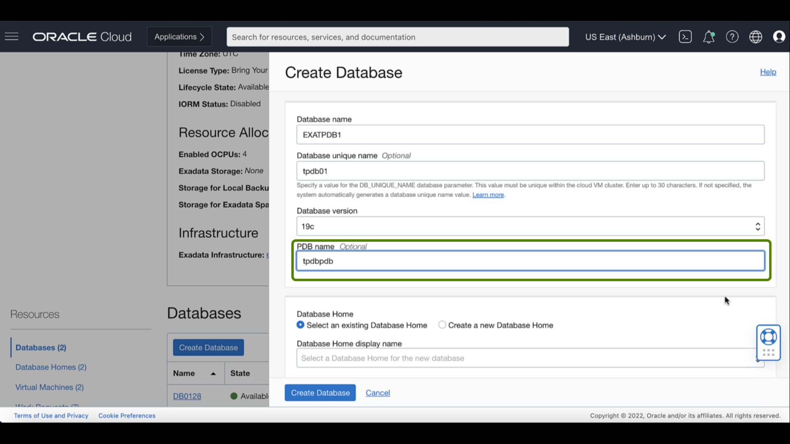

    **Database Home**: The Oracle Database Home for the Database. Choose the applicable option:

    > **Note:** For the Database Home, you can select an existing Database Home created from (Lab 4) OR Create a new Database Home.
For this Lab, we will be using an existing Database Home created from (Lab 4)

    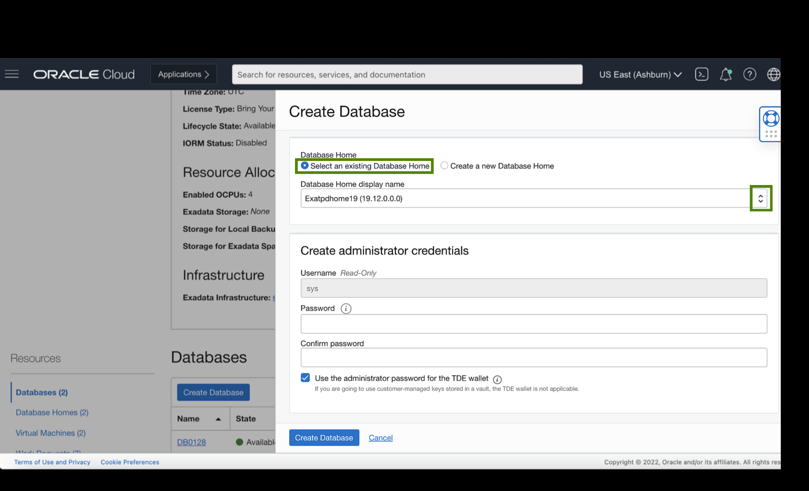

    * **Select an existing Database Home**: The Database Home display name field allows you to choose the Database Home from the existing homes for the specified database version. If no Database Home with that version exists, you must create a new one.

    * **Create a new Database Home**: Use this option to provision a new Database Home for your database.

    **Create administrator credentials**: *(Read-only)* A database administrator SYS user will be created with the Password you supply.

       * **Username**: SYS
       * **Password**: Supply the Password for this user. The Password must meet the following criteria:

         A strong password for SYS, SYSTEM, TDE wallet, and PDB Admin. The Password must be 9 to 30 characters and contain at least two uppercase, two lowercase, two numeric, and two special characters. The special characters must be _, #, or -. The Password must not contain  (SYS, SYSTEM, and so on) or the word "oracle" either in forwarding or reversed order, regardless of casing.

       * **Confirm Password**: Re-enter the SYS password you specified.

    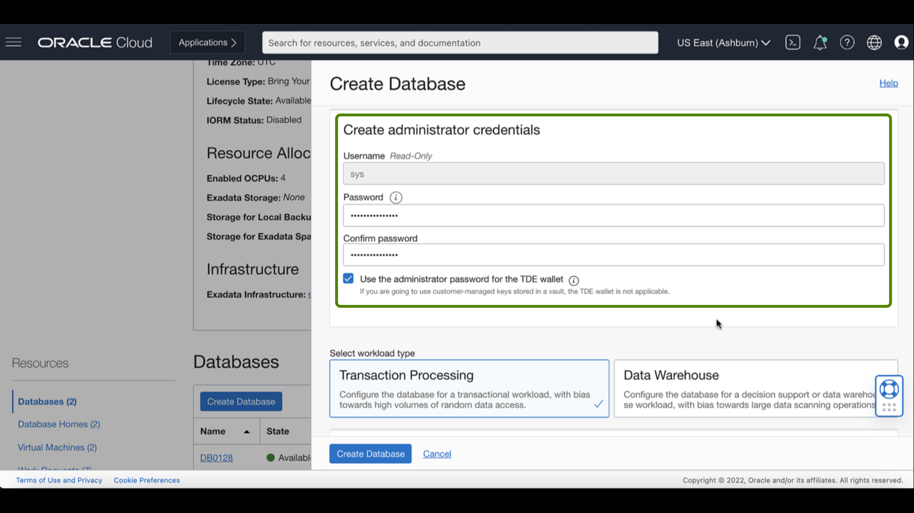

    To manage encryption keys, you can use Oracle-managed keys using a TDE wallet or Customer-managed keys stored in an OCI Vault in your tenancy.  The OCI Vault must be provisioned for Customer-managed keys before you can use it.

    > **Note:** For Customer-managed keys, Use Show Advance Options at the end of the Create Database dialog to configure customer-managed keys. If you are using customer-managed keys or want to specify a different TDE wallet password, uncheck the Use the administrator password for the TDE wallet box. If you are using customer-managed keys, leave the TDE password fields blank. To set the TDE wallet password manually, enter a password in the Enter TDE wallet password field, then confirm by entering it into the Confirm TDE wallet password field.

    **Select workload type**: Choose the workload type that best suits your application:

       * **Transaction Processing** configures the database for a transactional workload with a bias toward high volumes of random data access.

       * **Data Warehouse** configures the database for decision support or data warehouse
         workload, with a bias towards large data scanning operations.

    

    **Configure database backups**: Specify the settings for backing up the Database to Object Storage:

    * **Enable Automatic Backup**: Check the check box to enable automatic incremental backups for this database. You must enable automatic backups if you are creating a database in a security zone compartment.

    > **Note:** All [Prerequisites](https://docs.oracle.com/en-us/iaas/exadatacloud/exacs/ecs-managing-db-backup-and-recovery.html#GUID-41586B8E-FF2F-44B7-827B-D9122289C8AE) for backing up to Oracle Cloud Infrastructure Object Storage must be met for automatic backups to work

    

    * **Backup retention period**: If you enable automatic backups, you can choose one of the following preset retention periods: 7 days, 15 days, 30 days, 45 days, or 60 days. The default selection is 30 days.

    

    

    * **Backup Scheduling**: If you enable automatic backups, you can choose a two-hour scheduling window to control when backup operations begin. If you do not specify a window, the six-hour default window of 00:00 to 06:00 (in the time zone of the DB system's region) is used for your database.

    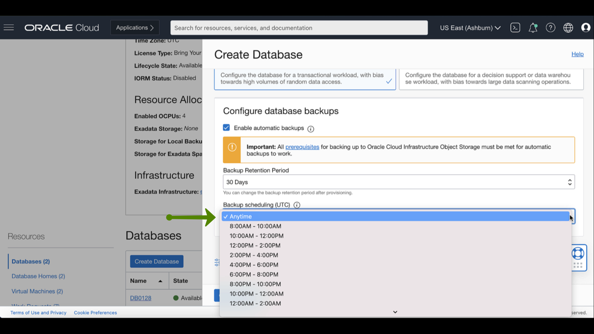

6. Click **Show Advanced Options** to specify advanced options for the database:

     **Management**:

     **Oracle SID prefix**: The Oracle Database instance number is automatically added to the SID prefix to create the **INSTANCE\_NAME** database parameter. The **INSTANCE\_NAME** parameter is also known as the SID. The SID is unique across the cloud VM cluster. If not specified, the SID prefix defaults to the db_name.

     The SID prefix must meet the requirements:

     * Maximum of 12 characters
     * Contain only alphanumeric characters
     * Begin with an alphabetic character
     * Unique in the VM cluster
     * DO NOT use the following reserved names: grid, ASM.

    **Character set**: The character set for the database. The default is AL32UTF8.

    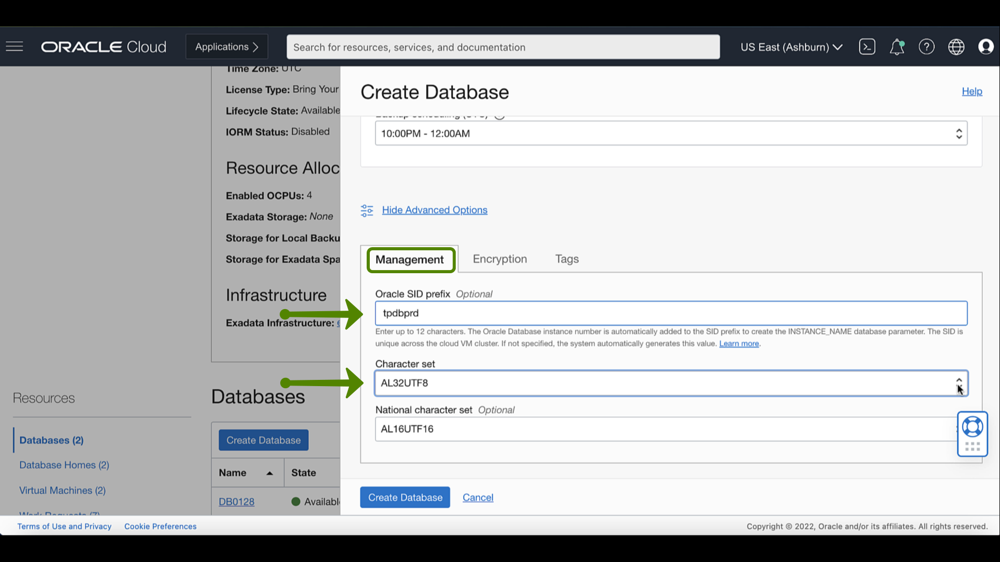

    **National character set**: The national character set for the database. The default is AL16UTF16.

    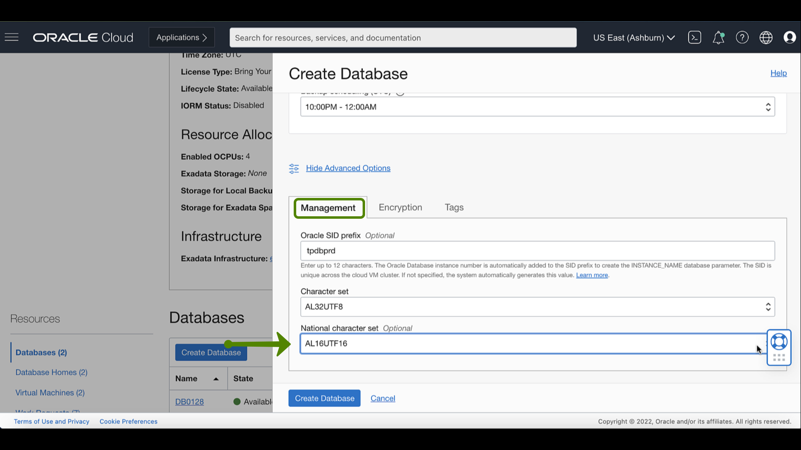

    **Encryption**: If you are creating a database in an Exadata Cloud Service VM cluster, then you can choose to use Encryption based on Encryption keys that you manage. By default, the database is configured using Oracle-managed encryption keys.

     > **Note:** For this Lab, we will use Oracle-Managed encryption keys

     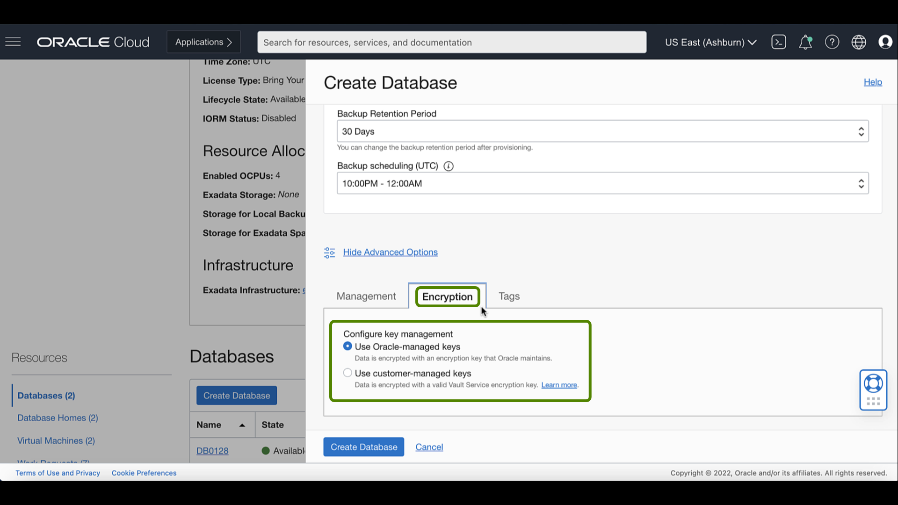

     *Optional* To configure the database with Encryption based on encryption keys you manage:

     * Select **Use customer-managed keys**. You must have a valid encryption key in the Oracle Cloud Infrastructure Vault service. [See Let security admins manage vaults, keys, and secrets](https://docs.oracle.com/iaas/Content/Identity/Concepts/commonpolicies.htm#sec-admins-manage-vaults-keys).

     > **Note:** You must use AES-256 encryption keys for your database.*

     * Choose a **Vault**.
     * Select a **Master encryption key**.
     * To specify a key version other than the latest version of the selected key, check **Choose the key version** and enter the OCID of the key you want to use in the **Key version OCID** field.

    **Tags**: If you have permission to create a resource, you also have permission to apply free-form tags to that resource. To apply a defined tag, you must have permission to use the tag namespace.

     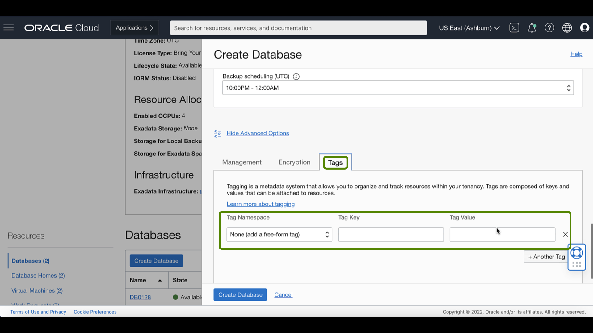

7. Click **Create database**

     

   After database creation is complete, the status changes from **Provisioning** to **Available**.

   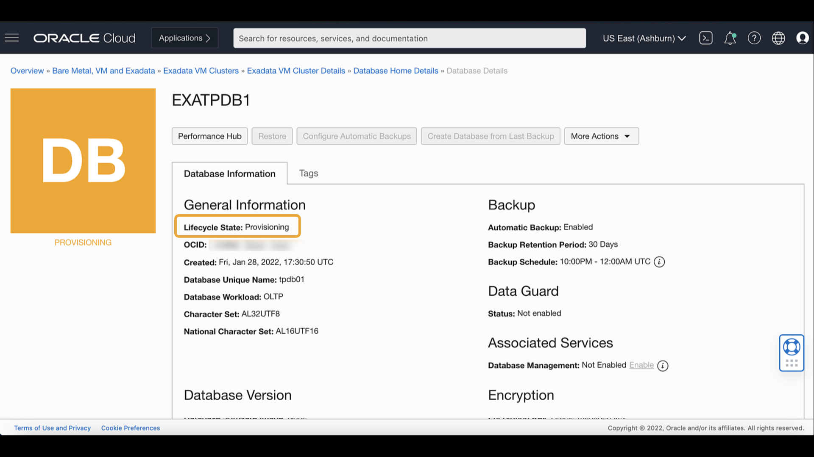

   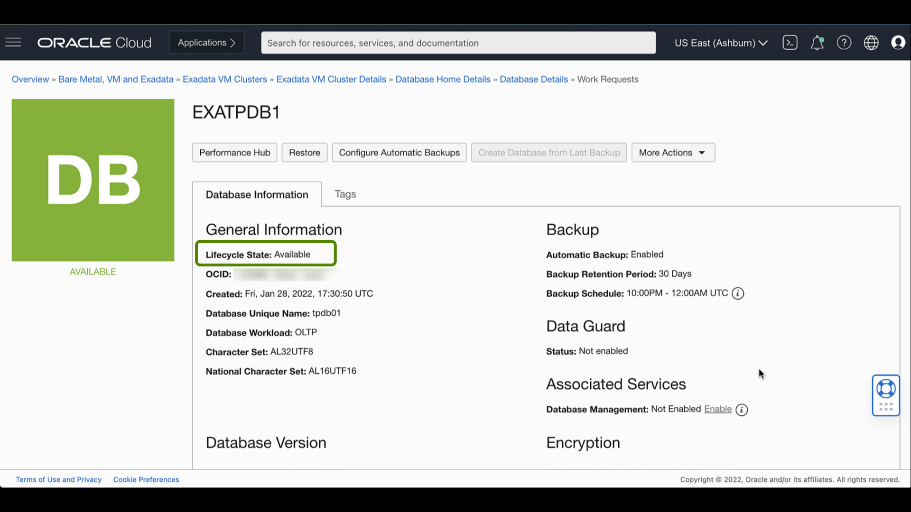

You may now **proceed to the next Lab**.

## Learn More

Click [here](https://docs.oracle.com/en-us/iaas/exadatacloud/exacs/manage-databases.html) for documentation on Managing Oracle Databases on an Exadata Cloud Infrastructure Instance.

## Acknowledgements

* **Author** - Leo Alvarado, Product Management

* **Contributors** - Tammy Bednar, Eddie Ambler, Product Management

* **Last Update** - July 2022.
