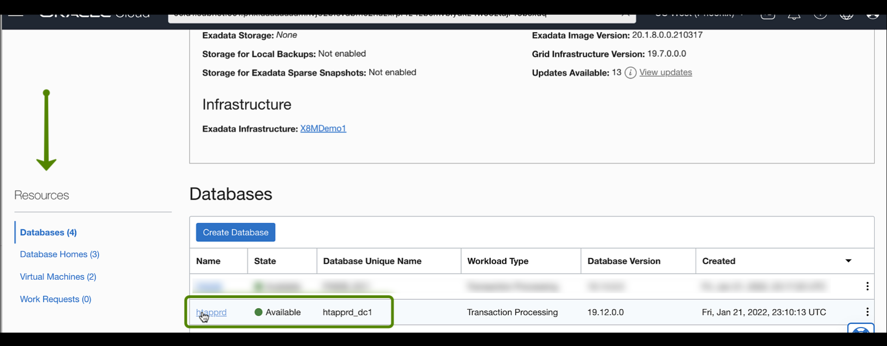
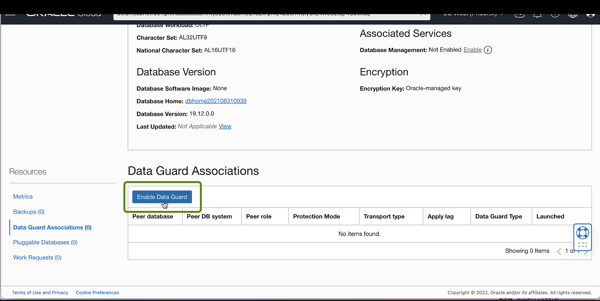
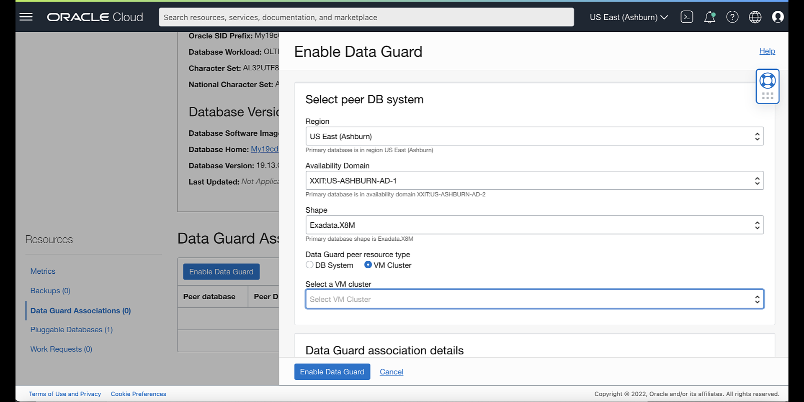
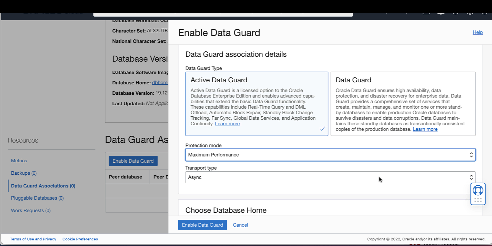
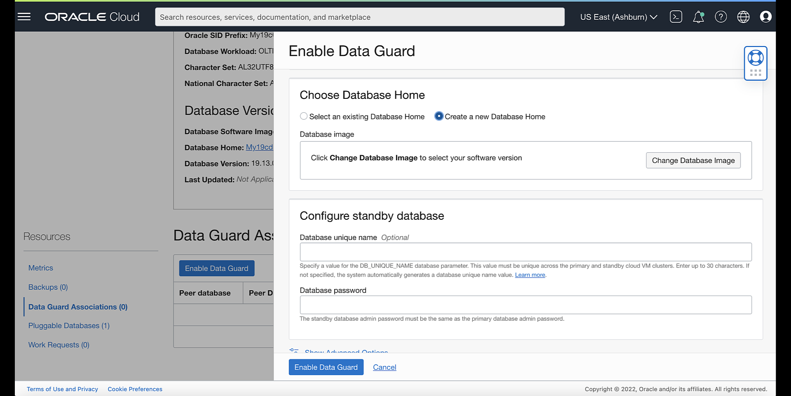
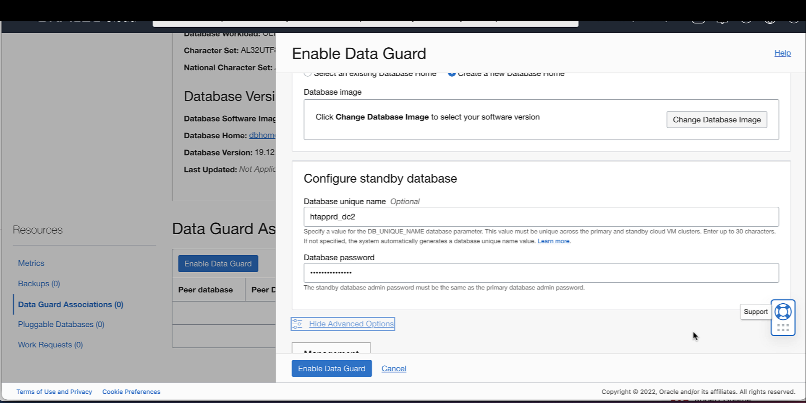
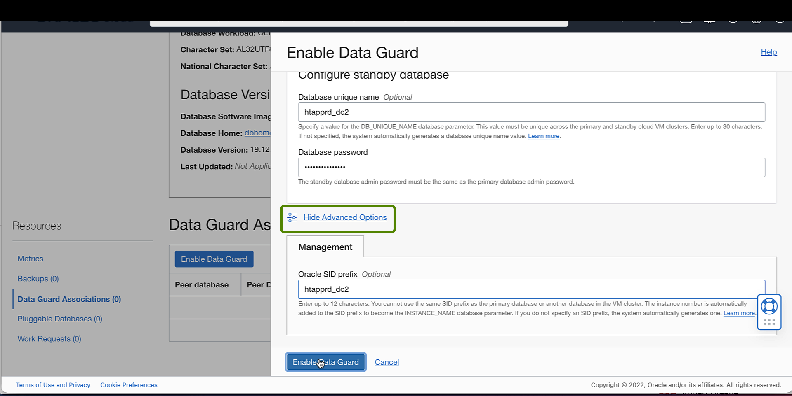
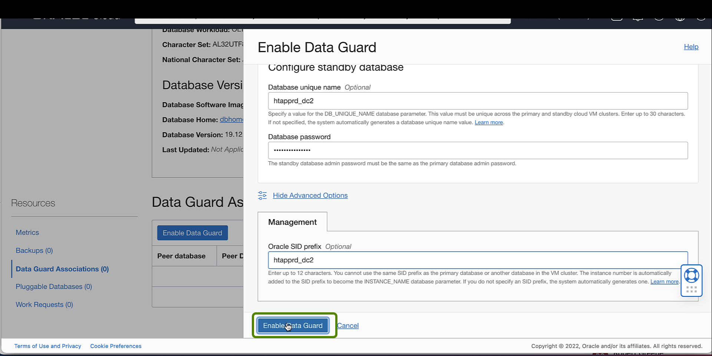
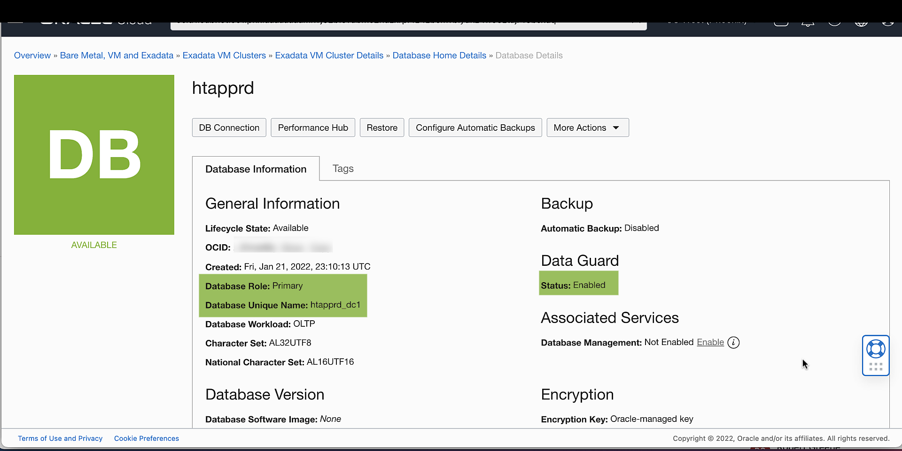
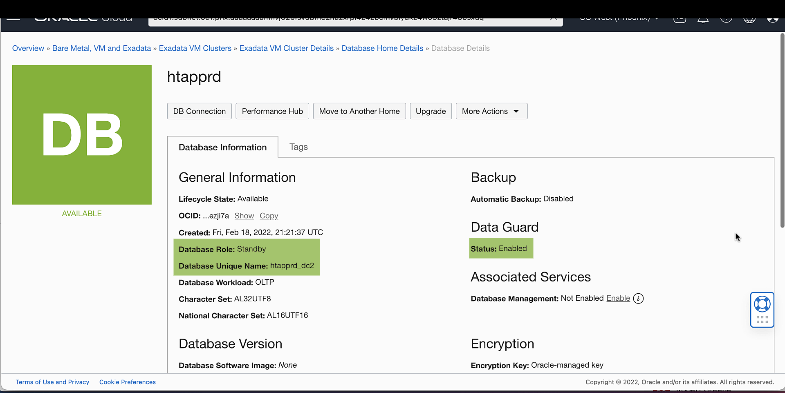

# Enable Data Guard on an Exadata Database Service on Dedicated Infrastructure

## Introduction

This lab walks you through the steps on how to Enable Data Guard.

Estimated Time: 15 minutes

### Objectives

-   Enable Data Guard on an Exadata Cloud Infrastructure

### Prerequisites

This lab requires completion of the following:

* Completion of Lab 5: Create Oracle Database on Exadata Database Service on Dedicated Infrastructure.
* To launch the system, a correctly configured virtual cloud network (VCN). Its related networking resources (gateways, route tables, security lists, DNS, and so on) must also be configured as necessary for the system.
* The right IAM policy is required to proceed. See [Required IAM Policy for Exadata Cloud Infrastructure](https://docs.oracle.com/en-us/iaas/exadatacloud/exacs/preparing-for-ecc-deployment.html#GUID-EA03F7BC-7D8E-4177-AFF4-615F71C390CD)

## Task 1: Using the Console to Enable Data Guard on an Exadata Cloud Infrastructure

1. Click the navigation menu Click **Oracle Database**, then click **Exadata on Oracle Public Cloud**.

    

2. Choose your **Compartment** that contains the Exadata Cloud Infrastructure instance with the Database for which you want to enable Oracle Data Guard

    

3. Navigate to the cloud VM cluster that contains a database you want to assume the primary role:

    Under **Oracle Exadata Database Service on Dedicated Infrastructure**, Click **Exadata VM Clusters**. In the list of VM clusters, find the VM cluster you want to access and click its highlighted name to view the details page for the cluster.

    

4. In the list of **Databases**, click the database name you want to make Primary.

   

   

5. On the Database Details page, under **Resources**, click **Data Guard Associations**.

   

6. In the **Data Guard Associations** section, click **Enable Data Guard**.

   

7. Configure your Data Guard association on the Enable Data Guard page.

   

      * In the **Select peer DB system** section, provide the following information for the standby database to obtain a list of available Exadata systems in which to locate the standby database:

        * **Region**: Select a region where you want to locate the standby database. The hint text associated with this field tells you in which Region the primary Database is located. The Region where the primary Database is located is selected by default. You can choose to locate the standby database in a different region.
        * **Availability domain**: Select an availability domain for the standby database. The hint text associated with this field tells you in which availability domain the primary Database is located.
        * **Shape**: Select the Shape of the standby Exadata system.
        * **Data Guard peer resource type**: Select DB System or VM Cluster.
        * Select a DB system or VM cluster from the drop-down list.

      * **Data Guard association details**:

   

      * Data Guard Type: Select Active Data Guard or Data Guard. Active Data Guard provides additional features, including Real-Time Query and DML Offload, Automatic Block Repair, Standby Block Change Tracking, Far Sync, Global Data Services, and Application Continuity. Note that Active Data Guard requires an Oracle Active Data Guard license.

      For more information on Active Data Guard, see [Active Data Guard](https://www.oracle.com/database/data-guard/).

          * Protection mode: The protection mode can be **Maximum Performance** or **Maximum Availability**.

          * Transport type: The redo transport type used for this Data Guard association.

      * In the **Choose Database Home** section, choose one of the following:

  

     * **Select an existing Database Home**: If you use this option, select a home from the Database Home display name drop-down list.

     * **Create a new Database Home**: If you choose this option, enter a name for the new Database Home in the **Database Home display name** field. Click **Change Database Image** to select a database software image for the new Database Home. In the **Select a Database Software Image** panel, do the following:

        * Select the Compartment containing the database software image you want to use to create the new Database Home.

        * Select the Oracle Database software version that the new Database Home will use, then choose an image from the list
        of available images for your selected software version.

        * Click **Select**.

    * In the **Configure standby database**: section, provide standby database details.

  

     * **Database unique name**: Optionally, specify a value for the DB\_UNIQUE\_NAME database parameter. This value must be unique across the Primary and Standby cloud VM clusters. The unique name must meet the requirements:

       * Maximum of 30 characters
       * Contain only alphanumeric or underscore (_) characters
       * Begin with an alphabetic character
       * Unique across the VM cluster. It is recommended to be unique across the tenancy.

     If not specified, the system automatically generates a unique name value, as follows:

        >  *< db\_name >\_< 3\_chars\_unique\_string >_< region-name >*  

     * **Database password**: Enter the database administrator password of the primary Database. Use this same database administrator password for the standby database.

8. Click **Show Advanced Options** to specify advanced options for the standby database:

      

      * **Management**:

        **Oracle SID prefix**: The Oracle Database instance number is automatically added to the SID prefix to create the **INSTANCE\_NAME** database parameter. The **INSTANCE\_NAME** parameter is also known as the SID. If not provided, the SID prefix defaults to the first 12 characters of the **db\_unique\_name**.

        >  **Note:** Entering a SID prefix is only available for Oracle 12.1 databases and above.

          The SID prefix must meet the requirements:

           * Maximum of 12 characters
           * Contain only alphanumeric characters
           * Begin with an alphabetic character
           * Unique in the VM cluster and across primary and Standby databases      

9. Click **Enable Data Guard**.       

      

      When the association is created, details for a database and its peer display their respective roles as **Primary** or **Standby**.

      

      

      

## Learn More

Click [here](https://docs.oracle.com/en-us/iaas/exadatacloud/exacs/using-data-guard-with-exacc.html) for documentation on using, configuring, and managing Oracle Data Guard with Exadata Cloud Infrastructure.

## Acknowledgements

* **Author** - Leo Alvarado, Product Management

* **Contributors** - Tammy Bednar, Eddie Ambler, Product Management

* **Last Update** - July 2022.
