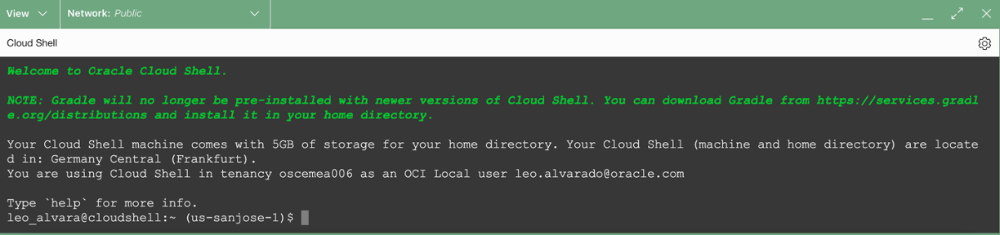

# Discover Environment Details using REST API


## Introduction

This lab walks you through the steps to discover Exadata Database Service on Cloud@Customer environment details using REST API.

Estimated Lab Time: 10 minutes

<!-- Watch the video below for a quick walk-through of the lab.
[Create Oracle Database](youtube:JJ4Wx0l0gkc)
-->
### Objectives

-   After completing this lab, you should be able to discover Exadata Database Service on Cloud@Customer environment details using REST API.


### Prerequisites

This lab requires completion of the following:

* Completion of **Lab3**

## Task 1: Discover Environment Details using REST API

1. Open the Cloud Shell

   This displays the Cloud Shell in a "drawer" at the bottom of the console:

   

2. Make OCI REST API call to get Exadata VM Cluster details using **OCI RAW-REQUEST** Command


    ```
    <copy>

      oci raw-request --http-method GET --target-uri "https://database.us-sanjose-1.oraclecloud.com/20160918/vmClusters/{VMClusterOCID}"

    </copy>
    ```
    Replace the *{VMClusterOCID}* with the **VM Cluster OCID** *copied from Lab 3 Task 1 step 2*

    You will see a similar output as below, pay attention to the **cpusEnabled** field

    ```
    <copy>
    {
  "data": {
    "availabilityDomain": "cuGa:US-SANJOSE-1-AD-1",
    "compartmentId": "ocid1.compartment.oc1.....",
    "cpusEnabled": 6,
    "dataCollectionOptions": {
      "isDiagnosticsEventsEnabled": true,
      "isHealthMonitoringEnabled": true,
      "isIncidentLogsEnabled": true
    },
    "dataStorageSizeInGBs": null,
    "dataStorageSizeInTBs": 30.0,
    "dbNodeStorageSizeInGBs": 120,
    "dbServers": [
      "ocid1.dbserver.oc1.us-sanjose-1.....",
      "ocid1.dbserver.oc1.us-sanjose-1....."
    ],
    "definedTags": {
      "Oracle-Tags": {
        "CreatedBy": "idcs/user@oracle.com",
        "CreatedOn": "2023-06-16T03:57:18.489Z"
      },
      "osc": {
        "automatic_shutdown": "off",
        "automatic_startup": "off"
      }
    },
    "displayName": "ecc4c4",
    "exadataInfrastructureId": "ocid1.exadatainfrastructure.....",
    "freeformTags": {},
    "giSoftwareImageId": null,
    "giVersion": "19.19.0.0.0",
    "id": "ocid1.vmcluster.......",
    "isLocalBackupEnabled": false,
    "isSparseDiskgroupEnabled": true,
    "lastPatchHistoryEntryId": "ocid1.dbpatchhistory......",
    "licenseModel": "BRING_YOUR_OWN_LICENSE",
    "lifecycleDetails": null,
    "lifecycleState": "AVAILABLE",
    "memorySizeInGBs": 60,
    "ocpusEnabled": null,
    "shape": "ExadataCC.Half3.200",
    "sshPublicKeys": null,
    "systemVersion": "22.1.10.0.0.230422",
    "timeCreated": "2023-06-16T03:57:18.773Z",
    "timeZone": "UTC",
    "vmClusterNetworkId": "ocid1.vmclusternetwork......."
  },
  "headers": {
    
  },
  "status": "200 OK"
}
  </copy>
    ```

<!--
## Learn More

* Click [here](https://docs.public.oneportal.content.oci.oraclecloud.com/en-us/iaas/exadata/doc/ecc-create-first-db.html) to learn more about Creating an Oracle Database on Exadata Database Service.
-->

## Task 2: List the Maintenance Updates that can be applied to the specified VM Cluster using REST API

1. Make OCI REST API call to list maintenance updates that can be appliced to the specified VM Cluster


    ```
    <copy>

      oci raw-request --http-method GET --target-uri "https://database.us-sanjose-1.oraclecloud.com/20160918/vmClusters/{VMClusterOCID}/updates"

    </copy>
    ```
    Replace the *{VMClusterOCID}* with the **VM Cluster OCID** 

    

    You will see a similar output as below

    ```
    <copy>

    {
  "data": [
    {
      "availableActions": [
        "ROLLING_APPLY",
        "PRECHECK"
      ],
      "description": "Virtual Machine OS Update 22.1.11.0.0.230516",
      "id": "ocid1.dbupdate.oc1.us-sanjose-1....",
      "lastAction": null,
      "lifecycleDetails": null,
      "lifecycleState": "AVAILABLE",
      "timeReleased": "2023-06-06T19:15:24.842Z",
      "updateType": "OS_UPDATE",
      "version": "22.1.11.0.0.230516"
    },
    {
      "availableActions": [
        "ROLLING_APPLY",
        "PRECHECK"
      ],
      "description": "Virtual Machine OS Update 22.1.10.0.0.230511",
      "id": "ocid1.dbupdate.oc1.us-sanjose-1......",
      "lastAction": null,
      "lifecycleDetails": null,
      "lifecycleState": "AVAILABLE",
      "timeReleased": "2023-05-23T19:20:54.561Z",
      "updateType": "OS_UPDATE",
      "version": "22.1.10.0.0.230511"
    }
  ],
  "headers": {
    
  },
  "status": "200 OK"
}

    ```
    </copy>

## Task 3: Gets a list of Custom Database Software Images in the specified compartment using REST API


You may now **proceed to the next lab**

## Acknowledgements

* **Author** - Leo Alvarado, Eddie Ambler, Product Management

* **Contributors** - Tammy Bednar, Product Management

* **Last Updated By** - Leo Alvarado, Product Management, April 2023.
