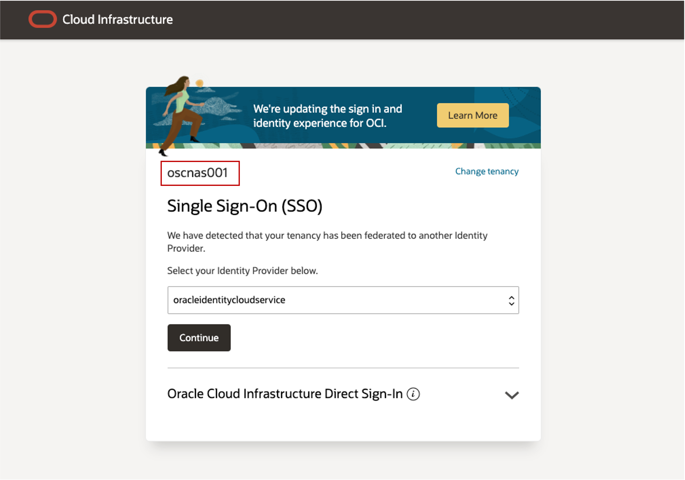

# Get started - Oracle Solution Center login

## Introduction

Introduction
Oracle Cloud is the industry's broadest and most integrated cloud provider, with deployment options ranging from the public cloud to your data center. Oracle Cloud offers best-in-class services across Software as a Service (SaaS), Platform as a Service (PaaS), and Infrastructure as a Service (IaaS).

Estimated Time: 5 minutes

Types of Cloud Accounts
We offer two types of Cloud Accounts:

*Free Tier Accounts*: After you sign up for the free Oracle Cloud promotion or sign up for a paid account, you’ll get a welcome email. The email provides you with your cloud account details and sign in credentials.

*Oracle Cloud Paid Accounts*: When your tenancy is provisioned, Oracle sends an email to the default administrator at your company with the sign-in credentials and URL. This administrator can then create a user for each person who needs access to the Oracle Cloud. Check your email or contact your administrator for your credentials and account name.

<!-- Watch the video below for a quick walk-through of the lab.
[Create Oracle Database](youtube:JJ4Wx0l0gkc)
-->
### Objectives

-   Learn how to log in to Oracle Cloud using **Oracle Solution Center** login

### Prerequisites

* **Cloud Account Name** - The name of your assigned OSC's Oracle Cloud tenancy 

* **Username** - Your assigned username for this workshop

* **Password** - Your assigned password for this workshop

## Task 1: Log in to Oracle Cloud

1. Go to [cloud.oracle.com](https://cloud.oracle.com) and enter your **Cloud Account Name** *(**assigned tenancy**)*  and click **Next**. 
   

   

2. Go to **Oracle Cloud Infrastructure Direct Sign-in** at the bottom of the page and enter your assigned **username** and **password** and click **Sign In** 

   

3. You are now signed in to Oracle Cloud! 
   
   

You may now **proceed to the next lab**

## Acknowledgements

* **Author** - Leo Alvarado, Eddie Ambler, Product Management

* **Contributors** - Tammy Bednar, Product Management

* **Last Updated By** - Leo Alvarado, Product Management, July 2023.
