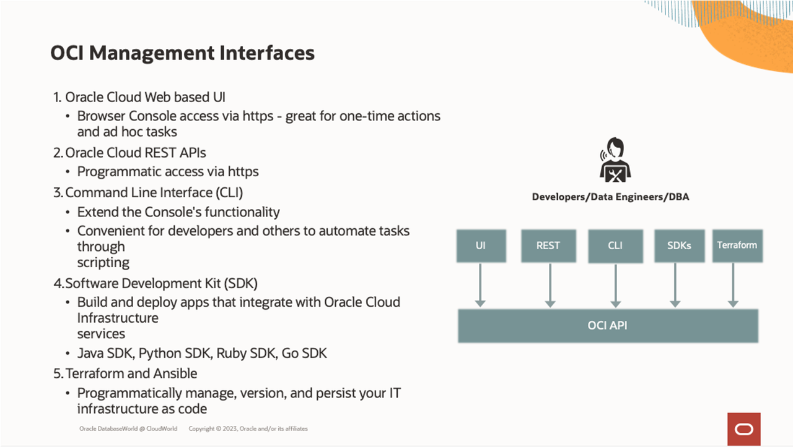

# Introduction

## About this Workshop

This workshop walks you through all the steps to automate the deployment of database environments that will run on the Oracle Exadata Database Service on Cloud@Customer using the OCI Management interfaces (OCI Console, CLI, APIs, SDKs, and Terraform). 

Gain hands-on experience on how to create standard images, discover & capture gold environment images, and use automation to deploy standardized environment stacks.

Estimated Workshop Time: 70 minutes

**OCI Management Interfaces for Database Cloud Services**

Oracle Cloud Infrastructure provides a wide choice of management interfaces that can be used with Oracle Database Cloud Services.  

Oracle Database Cloud Services are created and managed through a variety of interfaces provided to fit your different management use cases.

The easiest to use is the **OCI Console (UI)**, which allows you to use a browser to configure and initiate operations graphically.  

The web console is great for one-time actions. Still, most users prefer a more programmatic interface for executing things done repeatedly, such as provisioning, managing resources, and maintaining updates.  

Any operation that you can do with the web console, you can also do with corresponding **OCI APIs**.  

The OCI APIs are typical **REST APIs** that use HTTPS requests and responses. The **OCI Console**, an intuitive, graphical interface for creating and managing your Database Cloud Services and other OCI resources, is one of the interfaces to the OCI APIs. 

When looking to develop automation utilizing the OCI APIs, several additional interfaces, including kits, tools, and plug-ins, are provided to facilitate development and simplify the management of OCI resources. A subset of these APIs applies to Database Cloud Services and the containing infrastructure. Each of these various interfaces provides the same functionality, all calling the OCI APIs, and are provided to enable flexibility and choice depending on preference and use case.

* **Command Line Interface (CLI)**: The OCI CLI is a small footprint tool that you can use on its own or with the Console to perform Database Cloud Services resource tasks and other OCI tasks. The CLI provides the same core functionality as the Console, plus additional commands. Some of these, such as the ability to run scripts, extend the Console's functionality.
  
* **Software Development Kits (SDK)**: OCI provides SDKs to enable you to develop custom solutions for your Database Cloud Services and other OCI-based services and applications.

* **DevOps Tools, Plug-ins and Infrastructure as Code**: These tools can simplify provisioning and managing infrastructure, enable automated processes, and facilitate development. Tools include the OCI Terraform Provider used with Resource Manager and OCI Ansible Collection.
  
* **Cloud Shell**: Cloud Shell is a free-to-use, browser-based terminal, accessible from the OCI Console, that provides access to a Linux shell with pre-authenticated OCI CLI and other useful developer tools. You can use the shell to interact with Exadata Cloud and other OCI resources, follow labs and tutorials, and quickly run OCI CLI commands.

**What is an Oracle Exadata Database Service?**

Oracle Exadata Database Service is a high-performance, co-managed Oracle Cloud Database service that allows organizations to run databases cost-effectively with extreme performance, availability, and security. Databases run faster and with fewer resources on scale-out Exadata infrastructure that includes unique optimizations for transaction processing, analytics, and mixed workloads. Online scaling of computing resources enables customers to quickly adjust consumption to match workload demands without interrupting operations, while efficient database consolidation further lowers total costs. Full compatibility with on-premises Oracle Database and Exadata environments makes it easy for customers to migrate workloads to the cloud.

Exadata Database Service allows you to leverage the power of Exadata in the cloud. Exadata Database Service’s scale-out architecture allows customers to provision more compute and storage independently easily, right-sizing their service to meet growing demands. Exadata Database Service offer RDMA over Converged Ethernet (RoCE) networking for high bandwidth and low latency, persistent memory (PMEM) modules, and intelligent Exadata software.

Built-in Oracle Maximum Availability Architecture (Oracle MAA) best practices increase database availability, Exadata Database Service reduces downtime and simplifies operational management with zero downtime maintenance, online scaling, and one-click provisioning of Oracle Real Application Clusters (Oracle RAC) and Oracle Active Data Guard using built-in cloud automation

**What is an Oracle Exadata Database Service on Cloud@Customer?**

Oracle Exadata Database Service on Cloud@Customer enables you to apply the combined power of Oracle Exadata and Oracle Cloud Infrastructure inside your own data center. You have full access to the features and capabilities of Oracle Database and the intelligent performance and scalability of Oracle Exadata, but with Oracle owning and managing the Exadata infrastructure. You can use the Oracle Cloud Infrastructure console and APIs to manage Oracle Exadata Database Service on Cloud@Customer, just as with any other cloud resource, while maintaining absolute sovereignty over your data.

Oracle Exadata Database Service on Cloud@Customer is the simplest way to move an organization’s business-critical Oracle Database workloads to the cloud. It simultaneously runs Oracle Exadata Database Service and the fully managed Oracle Autonomous Database Service inside customers’ data centers and behind their firewalls to help meet strict data residency and security requirements.

These hands-on lab guides provide step-by-step directions to Learn how to automate the deployment of database environments that will run on the Oracle Exadata Database Service on Cloud@Customer using the OCI Management interfaces (OCI Console, CLI, APIs, SDKs, and Terraform). 

Gain hands-on experience on how to create standard images, discover & capture gold environment images, and use automation to deploy standardized environment stacks.

You may now **proceed to the next lab**.  

## Learn More

* Click [here](https://docs.oracle.com/en/engineered-systems/exadata-cloud-at-customer/ecccm/ecc-whats-new-in-exadata-cloud-at-customer-gen2.html#GUID-2F27E5A9-67A8-459E-9453-81E1F68043DE) to learn about What's New in Exadata Database Service on Cloud@Customer.

## Acknowledgements

* **Author** - Leo Alvarado, Eddie Ambler, Product Management

* **Contributors** - Tammy Bednar, Product Management

* **Last Updated By** - Leo Alvarado, Product Management, April 2023.
