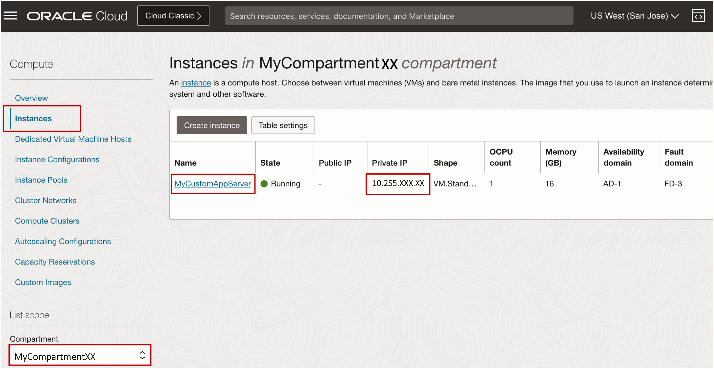

# Review and Connect to Oracle Cloud World Lab Environment


## Introduction

This lab walks you through the steps to review and connect to Oracle Cloud World lab environment.

Estimated Lab Time: 15 minutes

<!-- Watch the video below for a quick walk-through of the lab.
[Create an Exadata Database Service on Cloud@Customer Infrastructure](youtube:DCrivNA5bs8)
-->
### Objectives

-   After completing this lab, you should be able to learn how to navigate, review and connect to the Oracle Cloud World lab environment.

### Prerequisites

This lab requires completion of the following:

* Setting Up Your Tenancy - After Oracle creates your tenancy in OCI, an administrator at your company will need to perform some setup tasks and establish an organizational plan for your cloud resources and users.


## Task 1: Review creating an Exadata Database Service on Cloud@Customer Resource Model

**(For this lab, The Exadata Database Service on Cloud@Customer Resource Model is pre-provisioned - Informational Instructions for navigating the Exadata Database Service on Cloud@Customer environment will be presented by the speakers)**

## Task 2: Discover and Connect to the Application Server (Oracle Cloud Developer Image)

1. Open the navigation menu. Under **Compute**, click **Instances**.
   
   

2. Under Compute Click on **Instances** 
   
3. Select the assigned **Compartment**
   
   The list of Instances displays. For each compute host, the **name**, **state**, and **IP address** are displayed.

   
   
4. Launch the [OSC Secured Global Desktop](https://sgdsca.osc.oracle.com/sgd/thin.jsp?clientmode=installed) 
   
   
   
   Enter the assigned **username** and **Password** for your login

5. Launch the SGD Linux Desktop
   
   

6. Open terminal and type the following command 
   
   
    
      ```
        <copy>

        ssh ocw23bastion.us.osc.oracle.com 

        </copy>
      ```     

7. Use the assigned SSH Key to connect to the application server instance
   
      ```
        <copy>

        ssh -i ~/sshkey_student_xx.key -l opc (Use the IP address of the application server discovered in Step 2)

        </copy>
        ```
## Task 3: Discover and Connect to an Exadata Database Service Virtual Machine with SSH 

1. Open the navigation menu. Under **Oracle Database**, click **Exadata Database Service on Cloud@Customer**.
   
   

2. Select the assigned **Compartment** then Navigate to the **VM Cluster Details** page of the VM Cluster that contains the virtual machine that you are interested in.

    The VM Cluster Details page displays information about the selected VM cluster.

3. In the **Resources** list, click **Virtual Machines**.

    The list of virtual machines displays. For each virtual machine in the VM cluster, the **name**, **state**, and **client IP address** are displayed.

4. In the Virtual Machines list, find the virtual machine that you are interested in and check its state.

    The color of the icon and the associated text it indicates its status.

      * **Available**: Green icon. The node is operational.
      * **Starting**: Yellow icon. The node is starting because of a start or reboot action in the Console or API.
      * **Stopping**: Yellow icon. The node is stopping because of a stop or reboot action in the Console or API.
      * **Stopped**: Yellow icon. The node is stopped.
      * **Failed**: Red icon. An error condition prevents the continued operation of the virtual machine.

    Take note of the client IP address of the virtual machine.

    

5. From your Bastion host *(In Task 2 step 5)* , Run command to connect to the Exadata Database Service Virtual Machine with SSH

      ```
              <copy>

              ssh -i ~/sshkey_student_xx.key -l opc (IP address of the virtual machine, obtained from step 4)

              </copy>
      ```
       

## Task 4: Discover and Connect to the Oracle Database on Exadata Database Service

1. From the Virtual Machines list page, On the left rail, under **Resources**, Click on **Databases** then Click on the **Name of your Container Database** 

  

2. On the left rail, under **Resources**, Click on **Pluggable Databases.** then Click on the **Name of your Pluggable Database.**

  

3. In the **Pluggable Databases section** of the page, Near the top of the page, Click on the **PDB Connection** button

  

4. This will render the **Pluggable Database Connection** Screen, **Click** on the **Copy  Link** and paste the **Connection String** to your notepad or text editor.

  

1. From the application server compute instance, launch Oracle SQL Developer and connect to Oracle Database on Exadata Database Service

      * Select Create New connection Icon
      * Enter a Name for the Connection
      * For the Database Type select Oracle
      * For the Username enter Sys
      * Enter the Sys password
      * For the Role select SYSDBA
      * For Hostname enter localhost
      * For Port enter 1521
      * Enter Database Service Name
      * Test & Save connection

  


You may now **proceed to the next lab**

<!--
## Learn More

* Click [here](https://docs.oracle.com/en/engineered-systems/exadata-cloud-at-customer/ecccm/ecc-provisioning.html#GUID-4CB5B5E1-E853-4CA2-B43D-54CD18A8F28A) to learn more about Creating Infrastructure resource for Exadata Database Service on Cloud@Customer.

-->
## Acknowledgements

* **Author** - Leo Alvarado, Eddie Ambler, Product Management

* **Contributors** - Tammy Bednar, Product Management

* **Last Updated By** - Leo Alvarado, Product Management, April 2023.
