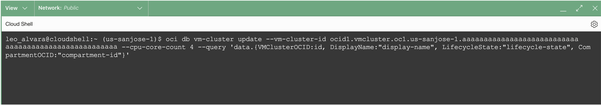

# Scale Exadata VM Cluster OCPU using OCI CLI


## Introduction

This lab walks you through the steps to Scale Exadata VM Cluster OCPU resource using OCI CLI.

Estimated Lab Time: 10 minutes

<!-- Watch the video below for a quick walk-through of the lab.
[Create Oracle Database](youtube:JJ4Wx0l0gkc)
-->
### Objectives

-   After completing this lab, you should be able to scale Exadata VM Cluster OCPU resource using OCI CLI


### Prerequisites

This lab requires completion of the following:

* Completion of **Lab1**

## Task 1: Scale Exadata VM Cluster OCPU using OCI CLI

1. Open the navigation menu. Under **Oracle Database**, click **Exadata Database Service on Cloud@Customer**.
   
   

2. Select the assigned **Compartment** then in the left rail, **Exadata VM Clusters** is selected by default. Click on the name of your assigned VM Cluster 

    The VM Cluster Details page displays information about the selected VM cluster. 
    
    Under the General Information, In the OCID Field. Click on **Show** to display the VM Cluster OCID and Click on **Copy** and paste the **VM Cluster OCID** to your notepad or text editor.

    Under the **Resource allocation**, pay attention to the number of **OCPUs:** which has the value of **4**
  
   

3. Click the Cloud Shell/Code Editor icon in the Console header and select Cloud Shell from the drop-down menu. 
   
   

   This displays the Cloud Shell in a "drawer" at the bottom of the console:

   

4. Run the OCI CLI Command to Scale up the **VM Cluster OCPU Resources** from **4 OCPUs** to **6 OCPUs**


    ```
    <copy>

      oci db vm-cluster update --vm-cluster-id {replace with vmClusterId} --cpu-core-count 6

    </copy>
    ```

  

   After running the command you will see similar output below

  

<!--
## Learn More

* Click [here](https://docs.public.oneportal.content.oci.oraclecloud.com/en-us/iaas/exadata/doc/ecc-create-first-db.html) to learn more about Creating an Oracle Database on Exadata Database Service.

-->

You may now **proceed to the next lab**

## Acknowledgements

* **Author** - Leo Alvarado, Eddie Ambler, Product Management

* **Contributors** - Tammy Bednar, Product Management

* **Last Updated By** - Leo Alvarado, Product Management, April 2023.
