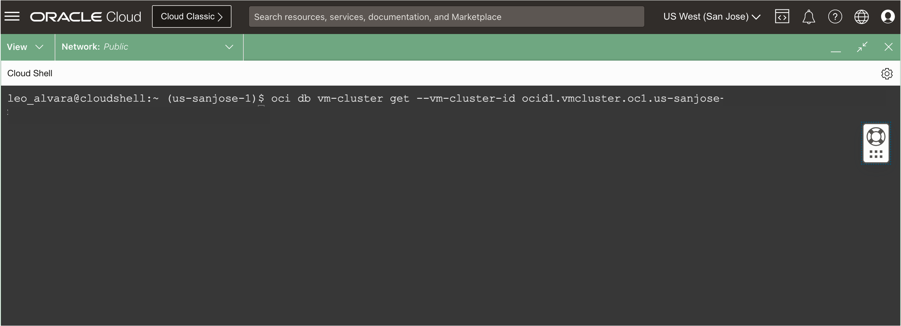
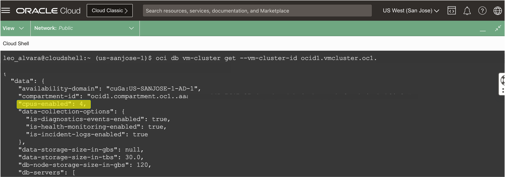
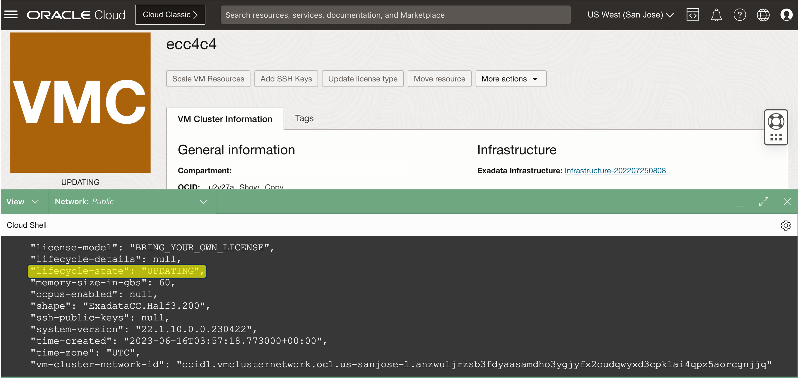

# Scale Exadata VM Cluster OCPU using OCI CLI


## Introduction

This lab walks you through the steps to Scale Exadata VM Cluster OCPU resource using API.

Estimated Lab Time: 10 minutes

<!-- Watch the video below for a quick walk-through of the lab.
[Create Oracle Database](youtube:JJ4Wx0l0gkc)
-->
### Objectives

-   After completing this lab, you should be able to scale Exadata VM Cluster OCPU resource using API


### Prerequisites

This lab requires completion of the following:

* Completion of **Lab1**

## Task 1: Scale Exadata VM Cluster OCPU using OCI CLI

1. Login to the Console.

2. Click the Cloud Shell/Code Editor icon in the Console header and select Cloud Shell from the drop-down menu. 
   
   

   This displays the Cloud Shell in a "drawer" at the bottom of the console:

   

3. Run the OCI CLI Command to Get Exadata VM Cluster Details:


    ```
    <copy>

      oci db vm-cluster get --vm-cluster-id {replace with vmClusterId}

    </copy>
    ```

  
  
  Review the number of **cpus-enabled**

  


4. Run the OCI CLI Command to Get Exadata VM Cluster Details:


    ```
    <copy>

      oci db vm-cluster update --vm-cluster-id {replace with vmClusterId} --cpu-core-count 6

    </copy>
    ```

  

  

<!--
## Learn More

* Click [here](https://docs.public.oneportal.content.oci.oraclecloud.com/en-us/iaas/exadata/doc/ecc-create-first-db.html) to learn more about Creating an Oracle Database on Exadata Database Service.

-->

## Acknowledgements

* **Author** - Leo Alvarado, Eddie Ambler, Product Management

* **Contributors** - Tammy Bednar, Product Management

* **Last Updated By** - Leo Alvarado, Product Management, April 2023.
