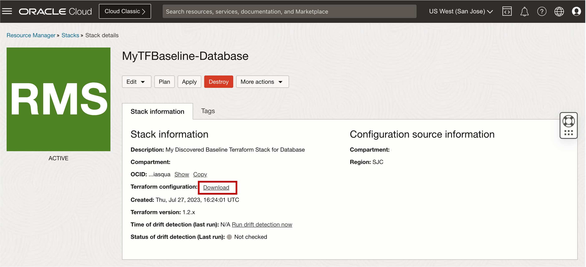
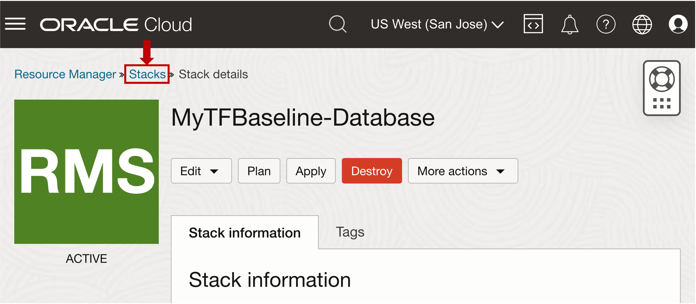

# Use OCI Resource Manager to generate and deploy Terraform for Application and Database Stack


## Introduction

This lab walks you through the steps to generate and deploy Terraform for Application and Database stack using OCI Resource Manage.

Estimated Time: 20 minutes


### Objectives

-   After completing this lab, you should be able to generate and deploy Terraform for Application and Database stack using OCI Resource Manager.


### Prerequisites

This lab requires the completion of the following:

* Completion of **Lab1**

## Task 1: Generate Terraform baseline configuration for Database development environment using OCI Resource Manager

1. Open the navigation menu and click **Developer Services**. Under **Resource Manager**, click **Stacks**.
   
   

2. On the **Stacks** page, select your assigned compartment.

3. Click **Create stack**.

4. On the **Create stack** page, under **Choose the origin of the Terraform configuration**, select **Existing compartment**.

5. Select your assigned **compartment** and assigned **region** containing the Exadata Database Service on Cloud@Customer Resource Model.

    

   This will create a stack that captures resources from the selected assigned compartment using **OCI Resource Manager (resource discovery)**

6. Filter for the specific services supported for resource discovery, select **Selected**, and then select  **database** service. 
   
7. Select your assigned **compartment** where you want to create the stack.
   
    >**Note:** For this lab, you can use **MyTFBaseline-Database** for the name of your discovered database stack.

    

8. Click **Next** twice. No variables are listed for the Existing compartment stack origin because no Terraform configuration exists yet.

9.  In the Review panel, verify the stack configuration.

10. Click **Create**.

    

11. Once the newly created stack is available, On the **Stack details** page, next to **Terraform configuration**, click **Download**.

    

    After downloading the zip file, you can unzip the file and view the generated Terraform configuration file in your text or code editor. 

    View the *database.tf* file. 

    >**Note:** Your database's generated baseline terraform code is similar to the output below. *Resources discovered in the Baseline Terraform configuration will be presented and discussed by the speakers*

     ```
    <copy>

    ## This configuration was generated by terraform-provider-oci
    ## Notes are added on each section of the discovered Exadata Database Service Resource Model

        ## This is the discovered resource for the Custom Database Software image

        resource oci_database_database_software_image export_MyCustomDBSW {
        compartment_id = var.compartment_ocid
        database_software_image_one_off_patches = [
            "29780459",
            "30310195",
            "30432118",
            "31335037",
            "31732095",
            "32327201",
            "32327208",
            "32399816",
            "32490416",
            "32545013",
            "32579761",
        ]
        database_version = "19.0.0.0"
        defined_tags = {
            "Oracle-Tags.CreatedBy"  = "leo.alvarado@oracle.com"
            "Oracle-Tags.CreatedOn"  = "2023-07-21T15:23:47.395Z"
            "osc.automatic_shutdown" = "off"
            "osc.automatic_startup"  = "off"
        }
        display_name = "MyCustomDBSW"
        freeform_tags = {
        }
        image_shape_family = "EXACC_SHAPE"
        image_type         = "DATABASE_IMAGE"
        #ls_inventory = <<Optional value not found in discovery>>
        patch_set = "19.11.0.0"
        #source_db_home_id = <<Optional value not found in discovery>>
        }

        ## This is the discovered resource for the Exadata VM Cluster Resource

        resource oci_database_vm_cluster export_ecc4c4 {
        compartment_id = var.compartment_ocid
        cpu_core_count = "0"
        data_collection_options {
            is_diagnostics_events_enabled = "true"
            is_health_monitoring_enabled  = "true"
            is_incident_logs_enabled      = "true"
        }
        #data_storage_size_in_gb = <<Optional value not found in discovery>>
        data_storage_size_in_tbs    = "30"
        db_node_storage_size_in_gbs = "120"
        db_servers = [
            "ocid1.dbserver.oc1.us-sanjose-1.aaaaaaaaaaaaa",
            "ocid1.dbserver.oc1.us-sanjose-1.aaaaaaaaaaaaa",
        ]
        defined_tags = {
            "Oracle-Tags.CreatedBy"  = 
            "Oracle-Tags.CreatedOn"  = "2023-06-16T03:57:18.489Z"
            "osc.automatic_shutdown" = "off"
            "osc.automatic_startup"  = "off"
        }
        display_name              = "ecc4c4"
        exadata_infrastructure_id = "ocid1.exadatainfrastructure.oc1.us-sanjose-1.a"
        freeform_tags = {
        }
        gi_version                  = "19.19.0.0.0"
        is_local_backup_enabled     = "false"
        is_sparse_diskgroup_enabled = "true"
        license_model               = "BRING_YOUR_OWN_LICENSE"
        memory_size_in_gbs          = "60"
        #ocpu_count = <<Optional value not found in discovery>>
        ssh_public_keys = [
        ]
        time_zone             = "UTC"
        vm_cluster_network_id = "ocid1.vmclusternetwork.oc1.us-sanjose-1.aaaaaaaa"
        }

        ## This is the discovered resource for the Database Home

        resource oci_database_db_home export_MyDBHome {
        #database = <<Optional value not found in discovery>>
        #database_software_image_id = <<Optional value not found in discovery>>
        #db_system_id = <<Optional value not found in discovery>>
        db_version = "19.13.0.0.0"
        defined_tags = {
        }
        display_name = "MyDBHome"
        #enable_database_delete = <<Optional value not found in discovery>>
        freeform_tags = {
        }
        #is_desupported_version = <<Optional value not found in discovery>>
        #kms_key_id = <<Optional value not found in discovery>>
        #kms_key_version_id = <<Optional value not found in discovery>>
        source        = "NONE"
        vm_cluster_id = oci_database_vm_cluster.export_ecc4c4.id
        }

        ## This is the discovered resource for the Container Database

        resource oci_database_database export_MyDBHome_database {
        database {
            admin_password = "<placeholder for database admin password>" 
            #backup_id = <<Optional value not found in discovery>>
            #backup_tde_password = <<Optional value not found in discovery>>
            character_set = "AL32UTF8"
            #database_software_image_id = <<Optional value not found in discovery>>
            #db_backup_config = <<Optional value not found in discovery>>
            db_name        = "MyExaDB"
            db_unique_name = "exadb19"
            db_workload    = "OLTP"
            defined_tags = {
            "Oracle-Tags.CreatedBy"  = 
            "Oracle-Tags.CreatedOn"  = "2023-06-29T18:41:46.041Z"
            "osc.automatic_shutdown" = "off"
            "osc.automatic_startup"  = "off"
            }
            freeform_tags = {
            }
            #kms_key_id = <<Optional value not found in discovery>>
            #kms_key_version_id = <<Optional value not found in discovery>>
            ncharacter_set = "AL16UTF16"
            pdb_name       = "mypdb"
            sid_prefix     = "myexadbcc"
            #tde_wallet_password = <<Optional value not found in discovery>>
            #vault_id = <<Optional value not found in discovery>>
        }
        db_home_id = oci_database_db_home.export_MyDBHome.id
        #db_version = <<Optional value not found in discovery>>
        #key_store_id = <<Optional value not found in discovery>>
        #kms_key_id = <<Optional value not found in discovery>>
        #kms_key_migration = <<Optional value not found in discovery>>
        #kms_key_rotation = <<Optional value not found in discovery>>
        #kms_key_version_id = <<Optional value not found in discovery>>
        source = "NONE" #Required attribute 
        #vault_id = <<Optional value not found in discovery>>
        lifecycle {
            ignore_changes = [source, database[0].admin_password]
        }
        }

        ## This is the discovered resource for the Pluggable Databases

        resource oci_database_pluggable_database export_pluggable_database {
        container_database_id = oci_database_database.export_MyDBHome_database.id
        defined_tags = {
        }
        freeform_tags = {
        }
        #pdb_admin_password = <<Optional value not found in discovery>>
        pdb_name = "MYPDB"
        #rotate_key_trigger = <<Optional value not found in discovery>>
        #should_pdb_admin_account_be_locked = <<Optional value>>
        #tde_wallet_password = <<Optional value not found in discovery>>
        }

        resource oci_database_pluggable_database export_pluggable_database_1 {
        container_database_id = oci_database_database.export_MyDBHome_database.id
        defined_tags = {
        }
        freeform_tags = {
        }
        #pdb_admin_password = <<Optional value not found in discovery>>
        pdb_name = "MYCLONEPDB"
        #rotate_key_trigger = <<Optional value not found in discovery>>
        #should_pdb_admin_account_be_locked = <<Optional value>>
        #tde_wallet_password = <<Optional value not found in discovery>>
        }


    </copy>
    ```

## Task 2: Deploy Gold Image Stack (Database and MyDesktop Application) using OCI Resource Manager and Terraform

1. Click **Stacks**, select your assigned **compartment**, Click **Create stack**.

    

2. On the **Create stack** page, under Choose the origin of the Terraform configuration, select **My configuration**.

3. Click **.Zip file** and add the revised Terraform configuration. You can either drag the file onto the dialog's control or click **Browse** and navigate to the location of the file or folder.
   
    

4. Select your assigned **compartment** where you want to create the stack.

5. For Terraform version, select the version used by the Terraform configuration.

6. Click **Next**. In the Configure variables panel, review the variables listed from the Terraform configuration and change them as needed.

7. In the **Review** panel, verify the stack configuration.

8. Click **Create**

9.  On the Stack details page, click **Plan**. In the Plan panel, edit the default name for the job. For this lab, you can use **MyAppDBStackPlan** for the Plan name 
    
10. Click **Plan**. The plan job is created. The new job is listed under Jobs
    
11. On the Stack details page, click **Apply**. In the Apply panel, edit the default name for the job. For this lab, you can use **MyAppDBStackApply** for the Plan name 
    
12. Click **Apply**. The apply job is created. The new job is listed under Jobs.

<!--
## Learn More

* Click [here](https://docs.public.oneportal.content.oci.oraclecloud.com/en-us/iaas/exadata/doc/ecc-create-first-db.html) to learn more about Creating an Oracle Database on Exadata Database Service.

-->

## Acknowledgements

* **Author** - Leo Alvarado, Eddie Ambler, Product Management

* **Contributors** - Tammy Bednar, Product Management

* **Last Updated By** - Leo Alvarado, Product Management, June 2023.
