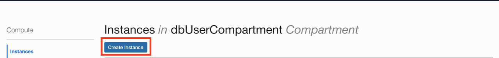
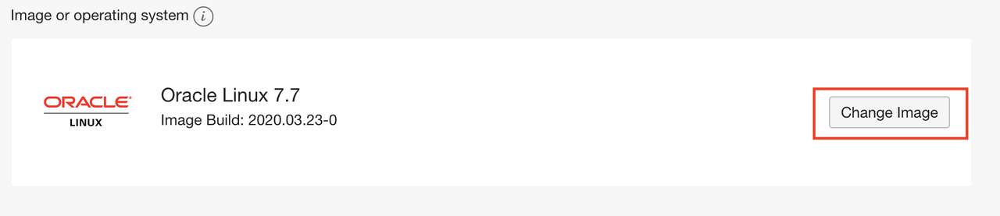
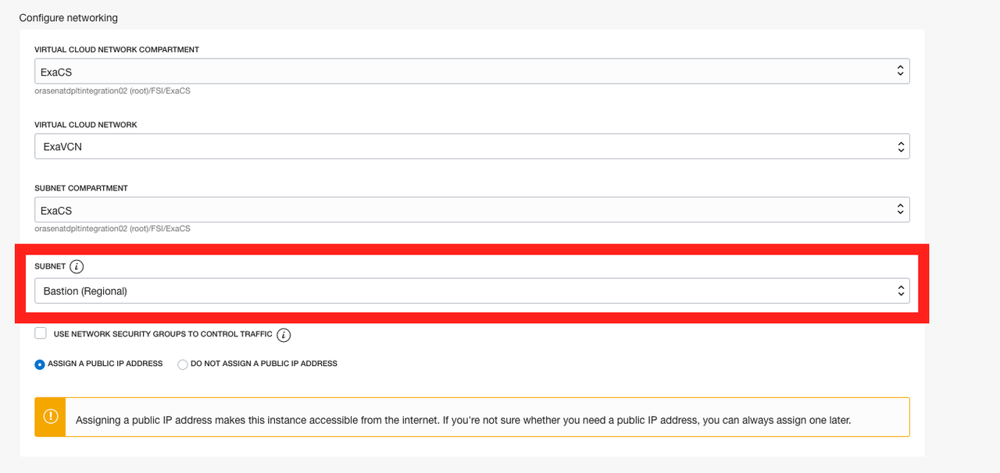
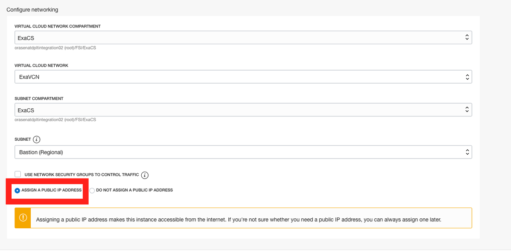
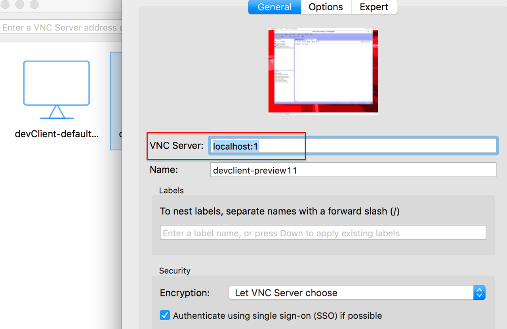
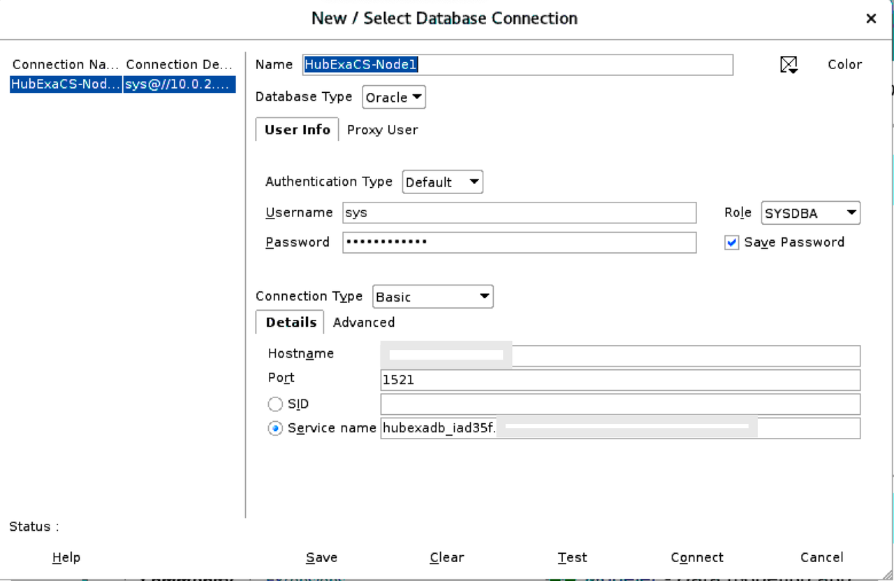
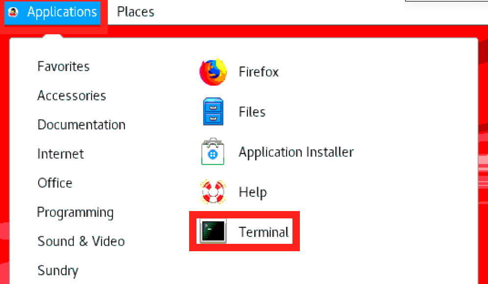
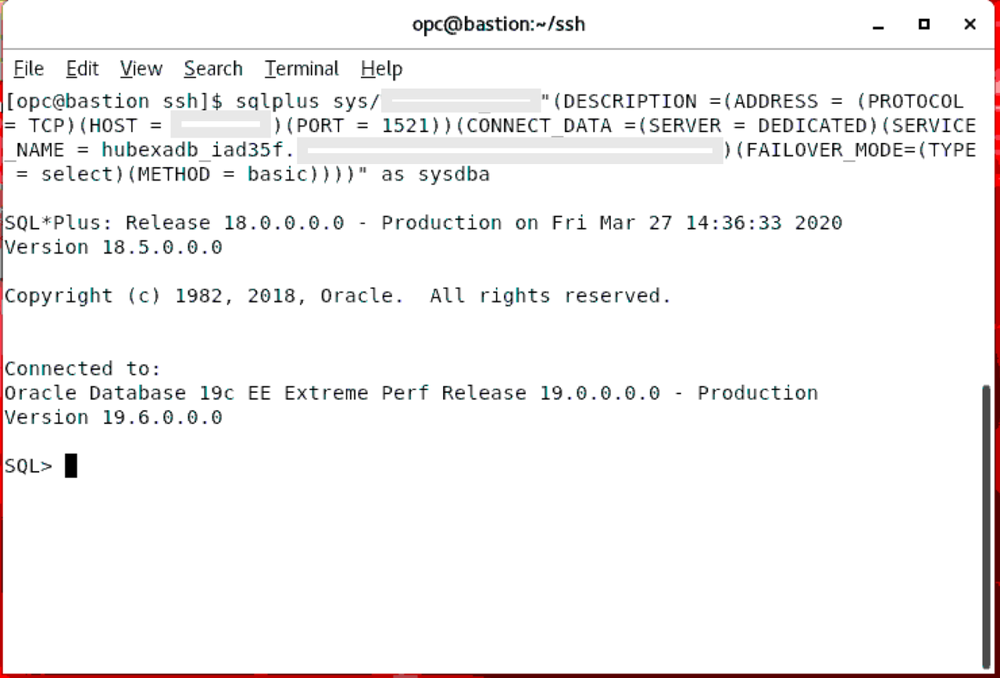

# Configure a Development System

## Introduction

The Oracle Cloud Infrastructure marketplace provides a pre-built image with necessary client tools and drivers to build applications on Exadata Cloud Service databases. As an application developer you can now provision a developer image within minutes and connect it to your database deployment.

The image is pre-configured with tools and language drivers so that you can configure a secure connection using Oracle SQL Developer, SQLcl, and SQL*Plus.
For a complete list of features, login to your OCI account, select 'Marketplace' from the top left menu, and browse details on the 'Oracle Developer Cloud Image'


Estimated Lab Time: 30 minutes.

### Objectives

As a database user, a DBA, or an application developer,
* Configure a development system from a pre-built marketplace image
* Create a ssh tunnel from your local laptop into your development system
* Invoke SQL Developer on your development system over a VNC connection from your local laptop
* Configure a secure connection from your development system to your EXACS database using Oracle SQL Developer and SQL*Plus.

### Prerequisites

* An Oracle Cloud Infrastructure account with IAM privileges to provision compute instances
* A pre-provisioned ExaCS database instance. Refer to [Lab 3](?lab=lab-3-provision-databases-on-exadata-cloud) on how to provision an EXACS database.
* VNC Viewer or other suitable VNC client on your local laptop

## Task 1: Provision an OCI Marketplace Developer Client Image Instance

We start by deploying a pre-configured client machine instance from the OCI marketplace

1. Login to your cloud account using your tenant name, username, and password.

2. Click the **Navigation Menu** in the upper left, navigate to **Compute**, and select **Instances**.

	

3. Click **Create Instance**.

    

4. Specify a name for the compute instance.

    

5. Choose **Change Image** and a pop-up will appear. Select the **Oracle Images** tab and then select **Oracle Cloud Developer Image** from Oracle Image section.

    

    

    

6. Choose the instance type as **Virtual Machine**

    

7. Choose the VCN and subnet where you would like your client machine deployed. This would likely be the application subnet created in previous labs. *Note: Please ensure you have picked the right compartments where network resources exist.*

    

8. Ensure that the **Assign A Public IP Address** button is selected. You will need to ssh into this instance over public internet.

    

9. Add the SSH key. You can choose to import the ssh public key or paste the ssh public key.

    

10. Within a few minutes your development instance will be available and a public IP address will be assigned (if it is provisioned in a public subnet).

11. Once provisioned, you can click on the instance name to see its details.

    

## Task 2: Connect to Dev Client Desktop Over VNC

1. First we shh into the dev client and invoke the VNC server that comes pre-installed.

2. SSH into your dev client compute instance

    ```
    <copy>ssh -i <private-key> opc@PublicIP</copy>
    ```

3. Change the password on the VNC server

    ```
    <copy>vncpasswd</copy>
    ```

4. Once you update the password, start your VNC server with the following command

    ```
    <copy>vncserver -geometry 1280x1024</copy>
    ```

5. Your development system may now be ready for accepting VNC connections

**Mac Users**

6. On your local laptop, open a terminal window and create an ssh tunnel using the following command.

    ```
    <copy>ssh -N -L 5901:127.0.0.1:5901 -i \<priv-key-file\> opc@<publicIP-of-your-devClient></copy>
    ```

**Windows Users**

7. Windows 10 users can use powershell to connect using the command above

8. Alternatively, you may create an ssh tunnel using putty. Detailed instructions on using putty for ssh tunnels are provided in the [Appendix](?lab=appendix)

9. You now have a secure ssh tunnel from your local laptop to your development system in OCI on VNC port 5901. *Note: As mentioned earlier, you need a VNC client installed on your laptop. This lab uses VNC Viewer.*

10. Start VNC Viewer on your laptop and configure a client connection using the settings as shown

    

11. Note how the connect string for VNC Server is simply localhost:1 . That is because the default port 5901 on your local machine is forwarded to 5901 on your OCI dev client over an ssh tunnel.

12. Connect to your VNC desktop and provide the password you changed on the host earlier.

13. You should now see a linux desktop in your VNC window.


## Task 3: Connect to your Database Using SQL Developer and SQL Plus

1. In your VNC session, invoke SQL Developer from the top left Applications menu as shown below

    

2. Note: In the event you have issues launching SQL Developer and it prompts with a java classpath error, simply add the following line to ~/.sqldeveloper/19.1.0/product.conf and retry.

    ```
    <copy>SetJavaHome /usr/java/jdk1.8.0_231-amd64</copy>
    ```

3. Create a new connection in SQL Developer and provide the following information

    **Connection Name**: Name of your connection

    **Username**: sys

    **Password**: (choose a password)

    **Connection Type**: Basic

    **Role**: sysdba

    **Hostname**: Private IP of the node in EXACS

    **Port**: 1521

    **Service name**: DatabaseUniqueName.HostDomainName (This can be found in the cloud console)

    

4. Test your connection and save. The **Status** bar will show **Success** if it is a successful connection! Let's also test connectivity through some command line client tools like SQL Plus.

5. For SQL*Plus, you will need to have tnsnames.ora to connect to your database from your Bastion Server

6. You can either ssh into your EXACS VM to get the connection string (tnsnames.ora), or you could ask you DBA to provide you with the necessary details.

7. Open Terminal from you Bastion Server

    

8. Type SQLPLUS and enter the required details to connect it to your database

    ```
    <copy>sqlplus sys/DBpassword@"(DESCRIPTION =(ADDRESS = (PROTOCOL = TCP)(HOST = 'EXACS_VM_IP')(PORT = 1521))(CONNECT_DATA =(SERVER = DEDICATED)(SERVICE_NAME = databaseUniqueName.hostDomainName)(FAILOVER_MODE=(TYPE = select)(METHOD = basic))))" as sysdba</copy>
    ```

9. Note: Please make sure to change you Database Password, Host, and Service_Name in the above command.

10. When succesfully connected, you should see the below image or something similar to it.

    


Great Work! You successfully created a client machine and connected to your EXACS database instance using SQL Developer and SQL*PLUS.

You may proceed to the next lab.

## Acknowledgements

- **Author** - Tejus Subrahmanya, Phani Turlapati, Abdul Rafae, Sathis Muniyasamy, Sravya Ganugapati, Padma Natarajan, Aubrey Patsika, Jacob Harless
- **Last Updated By/Date** - Jess Rein - Cloud Engineer, November 2020


