# Preparing Your Data Center in OCI

## Introduction

The Oracle Exadata Cloud Service runs on dedicated Exadata hardware in the Oracle Cloud Infrastructure. That means you have your own personal slice of high performance hardware akin to running your own private cloud in a public cloud setting. In this hands-on lab we take a look at some best practices to setting up a secure networking in OCI.

When configuring the Exadata Cloud Service, you need to ensure that your cloud users have access to use and create only the appropriate kinds of cloud resources to perform their job duties. Additionally, you need to ensure that only authorized personnel and applications have network access to the databases created on Exadata Cloud DB System.

Estimated Lab Time: 45 minutes.

### Objectives

As an OCI account administrator with network resource privileges,

* Create compartments and user groups with the right set of access policies for separation of duties
* Layout a secure network for the database and application infrastructure

### Prerequisites

* An Oracle Cloud Infrastructure account with privileges to create users, IAM policies and networks.
* Since this is the starting point to building your Exadata Cloud Service platform, an admin account is recommended.

## Task 1: Create Compartments, Groups, Users and Policies

We will use the following IAM structure in line with the bare minimum isolation recommended.

* An exacs compartment to hold the Network resources, Exadata Cloud DB System, and various applications that are going to interact with the database..

* The respective admin/admins will have IAM policies to create and manage Exadata cloud service, Databases and network resources in the exacs compartment.

* Alternatively, a network admin may first provision the VCN and Subnets while a database admin then provisions the Exadata cloud service infrastructure and databases. The exadata may be hosted in its own separate compartment and subnet.


1. Lets create compartment called "exacs" which will store our database system as well as other applications as shown below

    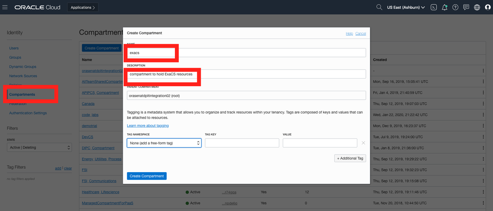

2. Create an IAM group exacsUsers to group all the ExaCS users.

    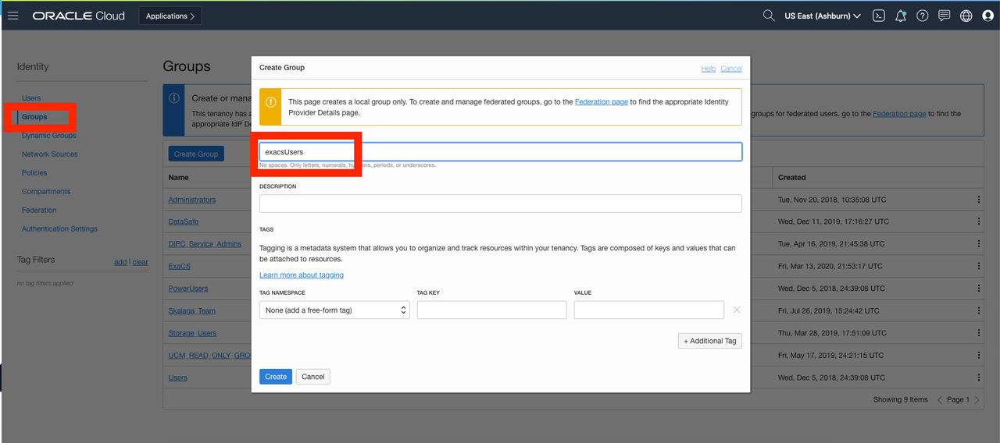

3. Now, add the following IAM policies on the exacs Compartment.

    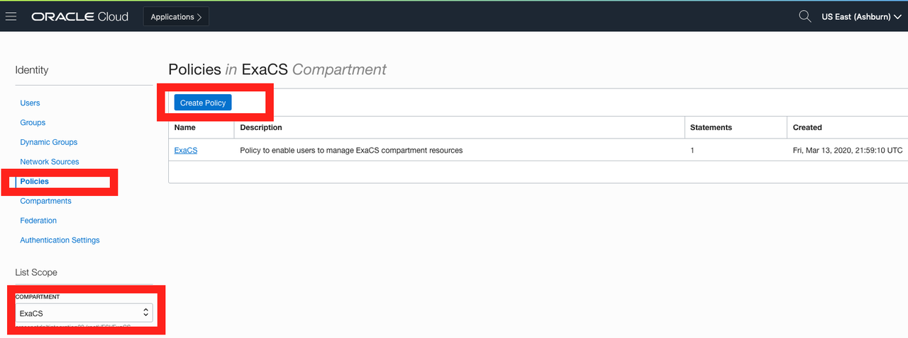

4. The following policy statement on the exacs Compartment ensure group exacsUsers have the right privileges as explained earlier. To launch Exadata in Oracle Cloud Infrastructure, you must be given the required access via an IAM policy. The following is a sample IAM policy that provides this access to group exacsUsers at tenancy level. To reduce the scope of access to just the database systems in a particular compartment, specify that compartment instead of the tenancy.

    ```
    <copy> Allow group exacsUsers to MANAGE database-family in compartment exacs </copy>
    ```
    ```
    <copy> Allow group exacsUsers to MANAGE exadata-infrastructures in compartment exacs </copy>
    ```
    ```
    <copy> Allow group exacsUsers to MANAGE virtual-network-family in compartment exacs </copy>
    ```
    ```
    <copy> Allow group exacsUsers to MANAGE tag-namespaces in compartment exacs </copy>
    ```
    ```
    <copy> Allow group exacsUsers to MANAGE tag-defaults in compartment exacs </copy>
    ```

5. The only privilege exacsUsers need on the compartment is READ privilege on the ExaCS to create their own databases. Therefore, we add a policy statement on the exacs compartment as shown below.

    ```
    <copy> Allow group exaUsers to READ databases in compartment exacs </copy>
    ```

6. The final set of policy statements on the exacs compartment appear as shown below.


    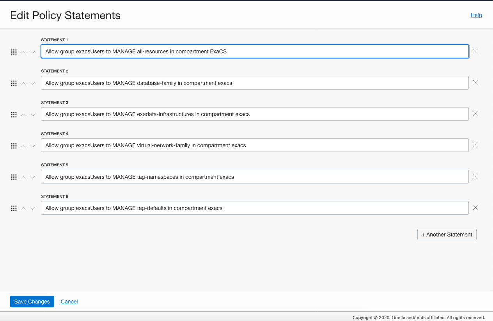

7. Similarly, you can create another policy dbUserPolicy, to restrict access on the exacs Compartment as shown. Make sure you pick the right compartment before you hit the 'Create Policy' button. *Note: The assumption here is that the DB user will need to create other resources such as network, compute instances, storage buckets etc in their own compartment. This is highly dependent on a your business requirement and can be configured in many different ways.*

    ```
    <copy> Allow group dbUsers to MANAGE autonomous-databases in compartment dbUserCompartment </copy>
    ```
    ```
    <copy> Allow group dbUsers to MANAGE autonomous-backups in compartment dbUserCompartment </copy>
    ```
    ```
    <copy> Allow group dbUsers to USE virtual-network-family in compartment dbUserCompartment </copy>
    ```
    ```
    <copy> Allow group dbUsers to MANAGE instance-family in compartment dbUserCompartment </copy>
    ```
    ```
    <copy> Allow group dbUsers to MANAGE buckets in compartment dbUserCompartment </copy>
    ```
    ```
    <copy> Allow group dbUsers to MANAGE objects in compartment dbUserCompartment </copy>
    ```
    ```
    <copy> Allow group dbUsers to MANAGE app-catalog-listing in compartment dbUserCompartment </copy>
    ```

8. You may alternatively choose to grant 'MANAGE all-resources' privileges to users that need to provision databases and other cloud resources in their own private compartment.


9. Finally, lets create an admin user and add it to the respective group. Similarly, any additional admins or database users will simply need to be added to their groups and they will automatically assume their group privileges.

    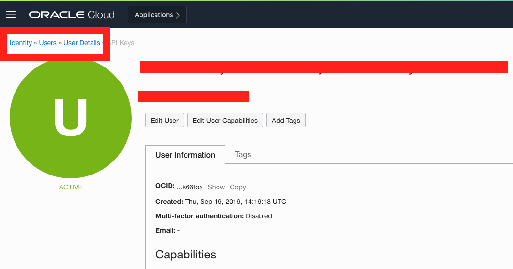

    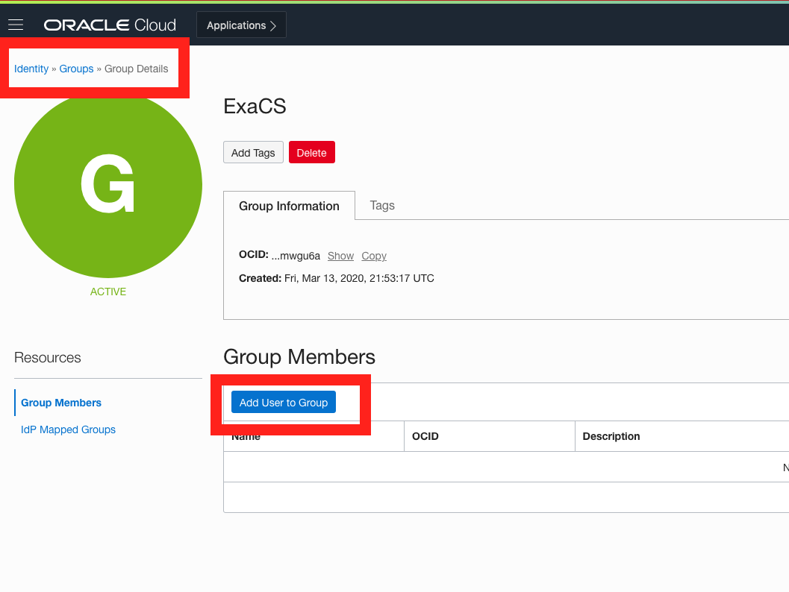


You now have the users, groups and compartments setup to provision an Exadata Cloud Service database system


## Task 2: Secure Network for DB and Application Infrastructure

If you are new to cloud Networking concepts, please refer to the OCI network documentation to get an understanding of VCNs, Subnets, Security lists, routers, gateways etc.

Your OCI network can be treated as your own private datacenter. While various network topologies are possible, we pick a topology here where the database infrastructure is in a private subnet while the application and VPN infrastructure is in a public subnet. For more practical scenarios, the VPN and application servers can be further separated into their own subnets and additional firewalls setup.


We will also follow these security guidelines as we build the network,

1. Each subnet we build will have its own security list and route table. We will not use the default seclist or route table or share them among subnets.

2. Database infrastructure will be in a private subnet with no internet access.

3. Ingress ports for exadata subnet will be opened on an as-needed basis.

4. Only external facing public subnets will have an internet gateway.

5. External facing hosts will have port 22 open for ingress ssh traffic.

6. For this workshop, four subnets are being created here - a private subnet for exadata db system, a private subnet to host your applications, a private subnet for Database backups and a public network for a jump server/bastion host and anything else you might need according to your architecture. In practice, multiple subnetworks may be tiered to host webservers, app servers, VPN servers in perimeter networks etc.

7. Login to  OCI as a network admin or an cloud admin.

8. Create a VCN in <u>exacs Compartment</u> with CIDR block 10.0.0.0/16 which provide for 64k IP addresses for the various subnets within this network.

    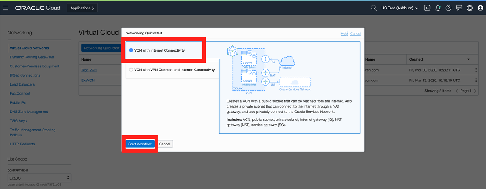

    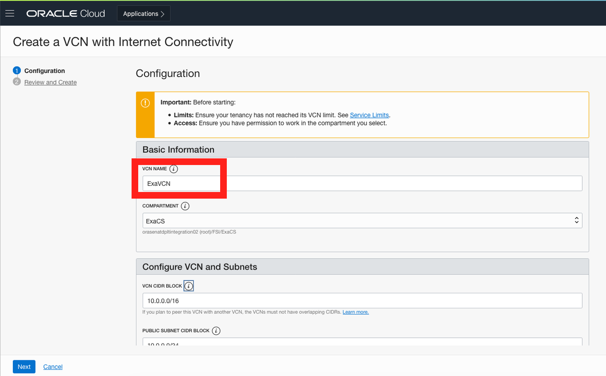

9. Add security lists to this VCN, one for each of the four subnets we would deploy for the database, backup and application networks. For production deployments, it is recommended to have a separate security list for each subnet.

10. Create a security list for exadata cloud service subnets which include (client, App, and DatabaseBackup Subnets). We start with creating a security list for the client, app, and databaseBackup subnet based on rules defined in the table above. When completed, our security list appears as shown below. We can have any naming convention but in this case we are going to name the Security List as 'Security List for Private Subnet-ExaVCN'.

    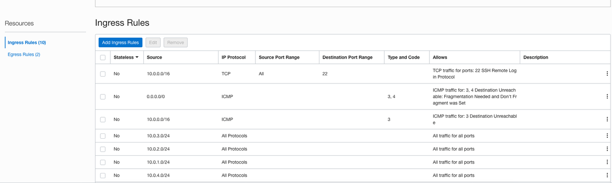

    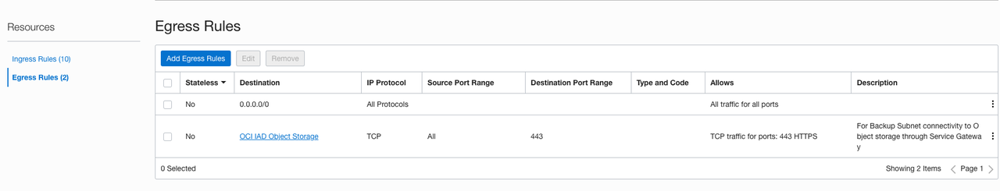

11. Create a security list for the Bastion subnet.

12. Next, add a security list for the Bastion subnet. We can name Security List as 'Default Security List for ExaVCN'. When deployed, your Bastion subnet's security list appears as follows.

    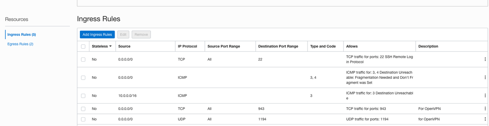

    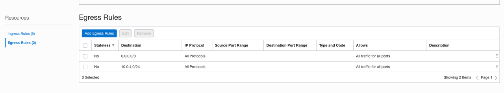

13. Create a route table for the Application Subnet** to route traffic to the internet gateway. Note the destination CIDR block 0.0.0.0/0 indicate ALL IP addresses globally i.e. to any host anywhere on the internet. You can limit it to specific hosts or network as desired. For eg, you can limit it to hosts in your corporate network or to a specific host such as your personal laptop as long as it has a unique public ip address. Select the Internet Gateway you created earlier from the dropdown and click on "Add Route Rules" to save the rules.

    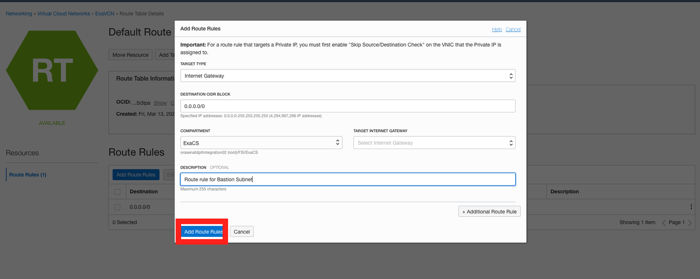


14. Now that we have build all the required network resources, we are ready to deploy the client, App, DatabaseBackup and Bastion subnets. Start by provisioning the client Subnet with CIDR 10.0.2.0/24 as shown below. The default route table associated with the client Subnet does not have any route rules. Similar to client subnet, add App, DatabaseBackup and Bastion Subnet with the following CIDR and Security Lists.

    a. **client subnet:
    CIDR: 10.0.2.0/24
    Security List: Security List for Private Subnet-ExaVCN**

    b. **App Subnet:
    CIDR: 10.0.4.0/24
    Security List: Security List for Private Subnet-ExaVCN**

    c. **DatabaseBackup Subnet:
    CIDR: 10.0.3.0/24
    Security List: Security List for Private Subnet-ExaVCN**

    d. **Bastion Subnet:
    CIDR: 10.0.1.0/24
    Security List: Default Security List for ExaVCN**

    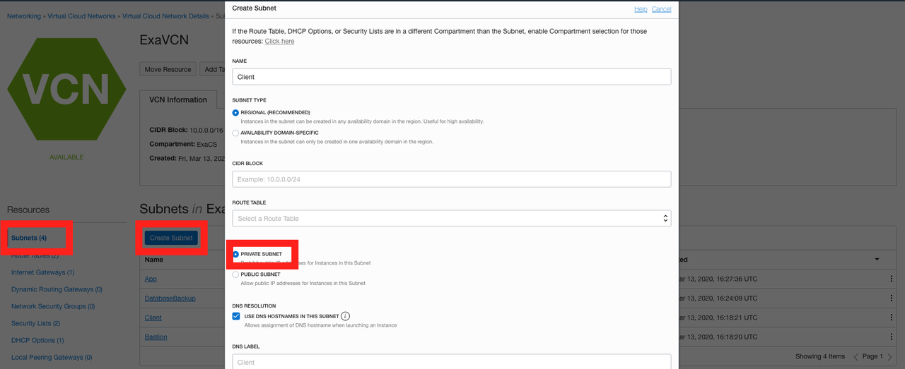

15. Next, provision the application subnet with CIDR 10.0.1.0/24. Note that we associate our custom route table to this subnet for internet access.

    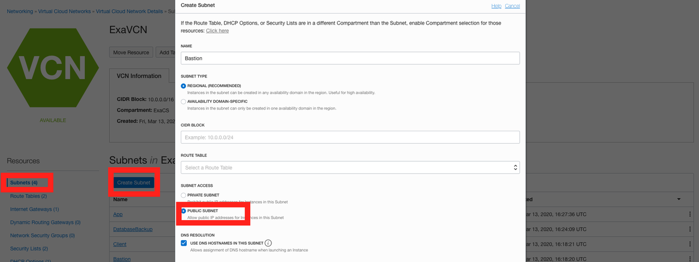

16. Fantastic! You have now setup your OCI network and users and are ready to deploy EXACS infrastructure, databases and applications.

You may proceed to the next lab.

## Acknowledgements

- **Author** - Tejus Subrahmanya, Phani Turlapati, Abdul Rafae, Sathis Muniyasamy, Sravya Ganugapati, Padma Natarajan, Aubrey Patsika, Jacob Harless
- **Last Updated By/Date** - Jess Rein - Cloud Engineer, November 2020


