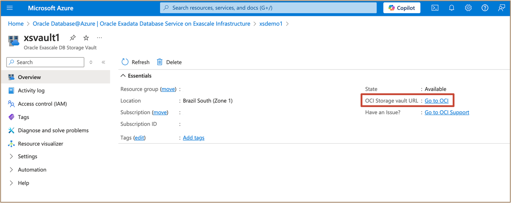
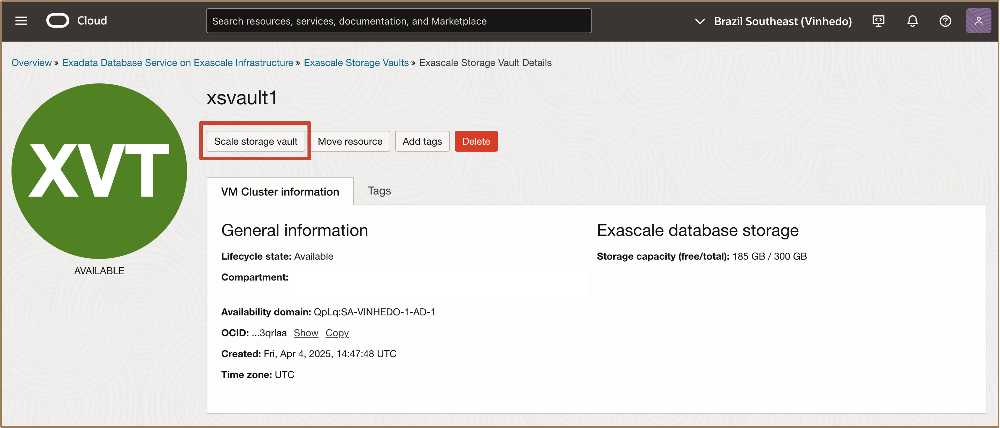
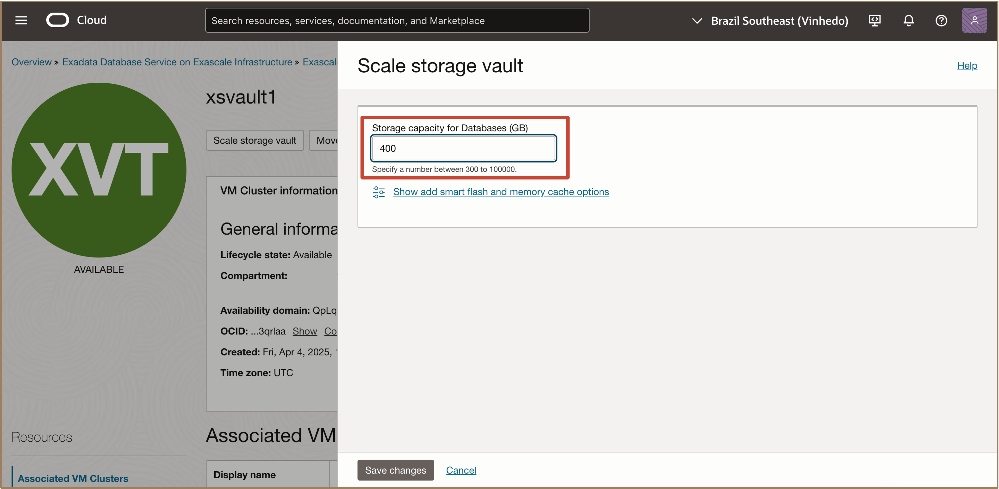
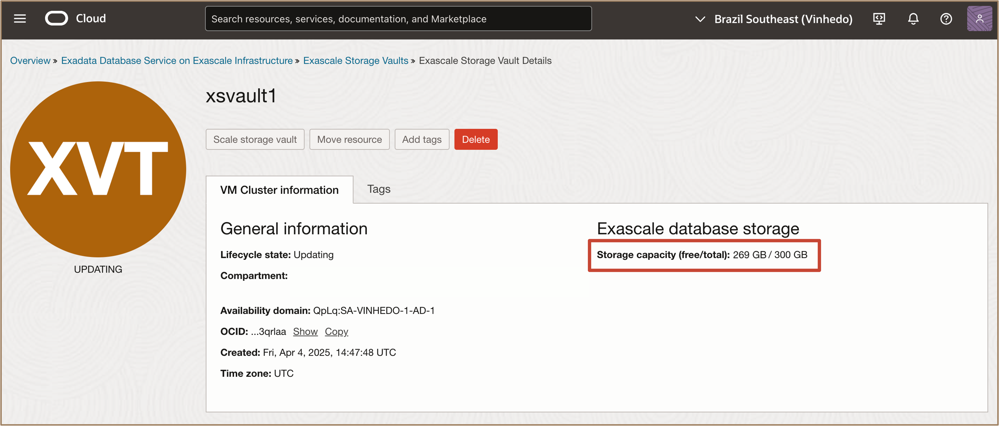
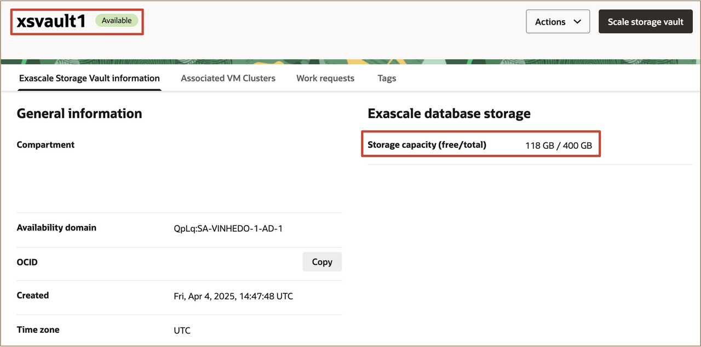
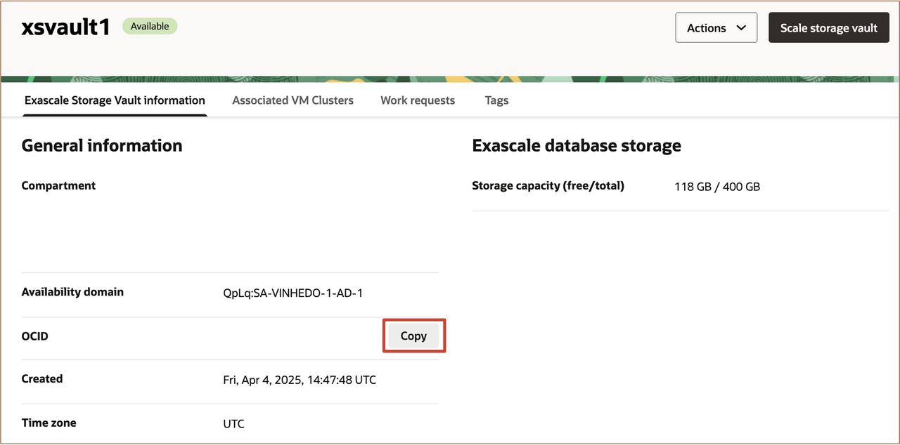
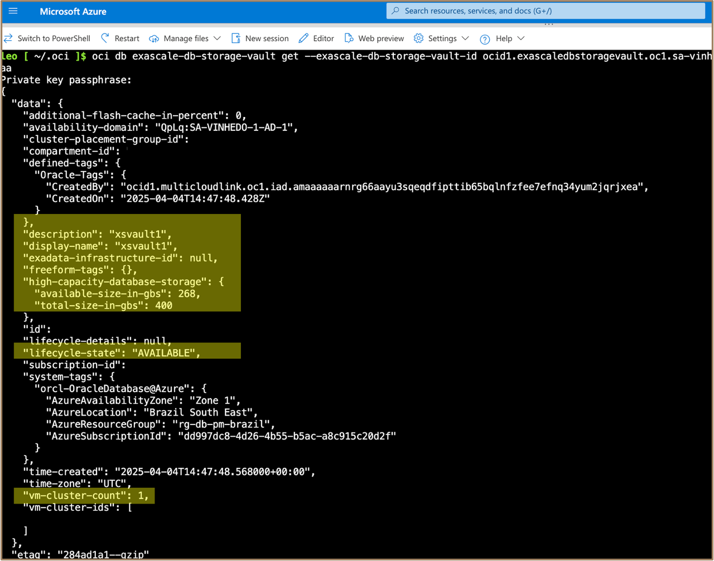

# Scale Exascale Storage Vault Resources


## Introduction

This lab walks you through the steps to Scale the Exascale Storage Vault Resources using the OCI Console.

**Estimated Time:** ***10 minutes***


### Objectives

-   After completing this lab, you should be able to scale the Exascale Storage Vault Resources using the OCI Console.
-   List Exascale Storage Vault configuration using **OCI CLI**


### Prerequisites

This lab requires the completion of the following:

* Completion of **Lab1**


## Task 1: Scale an Existing Exascale Storage Vault

1. Go to the **Oracle Exascale DB Storage Vault** **Overview** page. In the OCI Storage vault URL, click the ***Go to OCI*** link. 

   

2. In the **Exascale Storage Vault details** page, select **Scale Storage Vault**.

   

3. In **Scale Storage Vault**, enter a value for the desired storage capacity for databases. This number should be the value for the total storage that you want to have provisioned after the scaling operation completes.

   

   Click **Scale**.

   The **Exascale Storage Vault details** page is now displayed. While the scale storage vault process is running, the lifecycle state of the Exascale storage vault shows ***UPDATING***.

   

   When the scale storage vault process completes, the state of the Exascale storage vault changes to ***AVAILABLE***.

   

   The **Exascale Storage Vault information** page displays information about the new allocated Exascale database storage.

   In the Exascale Storage Vault Details page, Copy the Storage Vault OCID by clicking the ***copy*** button in the ***OCID*** field under the **General Information** section. 
   Paste the copied ***Exascale Storage Vault OCID*** to a text editor.

   

## Task 2: List Exascale Storage Vault Configuration using CLI

   >**Note:** For this lab, we will be using the ***Azure Cloud Shell tool*** with an **OCI CLI** configured. 

1. Click the **Azure Cloud Shell** icon in the console header. 
   
   

   This displays the Azure Cloud Shell in a "drawer" at the bottom of the portal.

2. Run the OCI CLI Command to get the Exascale Storage Vault Configuration.

      >**Note:** Replace ***{ExascaleVaultID}*** with the Exascale Storage Vault OCID copied from *(Task 1 Step 4)*

    ```
    <copy>

      oci db exascale-db-storage-vault get --exascale-db-storage-vault-id {ExascaleVaultID}

    </copy>
    ```

   **<u>Description:</u>** 

   The OCI CLI command syntax is: **oci** ***db*** ***exascale-db-storage-vault*** ***get*** ***--exascale-db-storage-vault-id*** ***{ExascaleVaultID}***

   **<u>Where:</u>**

      * ***db*** is the **service type** for the Oracle Database Cloud Services.
      * ***exascale-db-storage-vault*** is the **resource type** for the Exascale Storage Vault.
      * ***get*** is the **action** to get information about the Exascale Storage Vault Configuration.
      * ***--exascale-db-storage-vault-id*** is the **parameter** for the Exascale Storage Vault OCID.

   After running the command, you will see similar output below.

   

   The output of the command displays information about the configuration of the selected  ***Exascale Storage Vault***, such as:

      * ***Storage Vault Display Name***
      * ***Exascale Database Storage Capacity Available size in gbs***
      * ***Exascale Database Storage Capacity Total size in gbs***
      * ***Lifecycle state***
      * ***Exascale Storage Vault Associated VM Cluster Count and OCID***

***Congratulations!!!*** You may now **proceed to the next lab**.

## Acknowledgements

* **Author** - Leo Alvarado, Tammy Bednar, Product Management
  
* **Last Updated By** - Leo Alvarado, Product Management, August 2025.
