# Lab 2: Build Enterprise AI Agents with Oracle Private Agent Factory

## Introduction

In this lab, you will explore **Oracle AI Database Private Agent Factory**, a no-code environment for building, deploying, and managing AI agents grounded in enterprise data.

You will begin by accessing Private Agent Factory and creating a **Knowledge AI Agent** grounded in workshop documentation. You will then create a **Deep Data Research Agent** for more comprehensive research-oriented responses. Finally, you will use **Agent Builder** to create a custom AI agent that connects to the managed MCP Server configured in Lab 1.

This lab demonstrates how Oracle AI Database Private Agent Factory can combine enterprise knowledge, AI models, agent workflows, and Model Context Protocol (MCP) tools while keeping enterprise data and database access governed.

**Estimated Time:** 20 minutes

### Objectives

In this lab, you will:

- Access Oracle AI Database Private Agent Factory.
- Create a Knowledge AI Agent grounded in enterprise documentation.
- Create a Deep Data Research Agent for research-oriented questions.
- Create a custom AI agent using Agent Builder.
- Connect a custom agent to the managed MCP Server configured in Lab 1.
- Test grounded responses using natural language.

### Prerequisites

Before starting this lab, verify that the following resources are available:

- Access to the Oracle AI Database Private Agent Factory workshop environment.
- The workshop user credentials provided to you.
- The enterprise documents provided for this workshop.
- Access to the AI and embedding models configured for the workshop.
- The OCI Database Tools MCP Server configured in **Lab 1: Configure MCP Server for Oracle AI Database**.
- The MCP Server authentication information required by the workshop.

> **Note:** The database, AI models, network access, IAM configuration, and supporting resources required for this workshop are provided as part of the workshop environment unless otherwise specified.

## Task 1: Access Oracle AI Database Private Agent Factory.

In this task, you will access Oracle AI Database Private Agent Factory and familiarize yourself with the capabilities that you will use throughout this lab.

1. Open the **Oracle AI Database Private Agent Factory** URL provided for the workshop.

   > **Note:** Your instructor or workshop environment provides the URL and credentials required to access Private Agent Factory.

2. Sign in using the credentials provided for the workshop.
   
   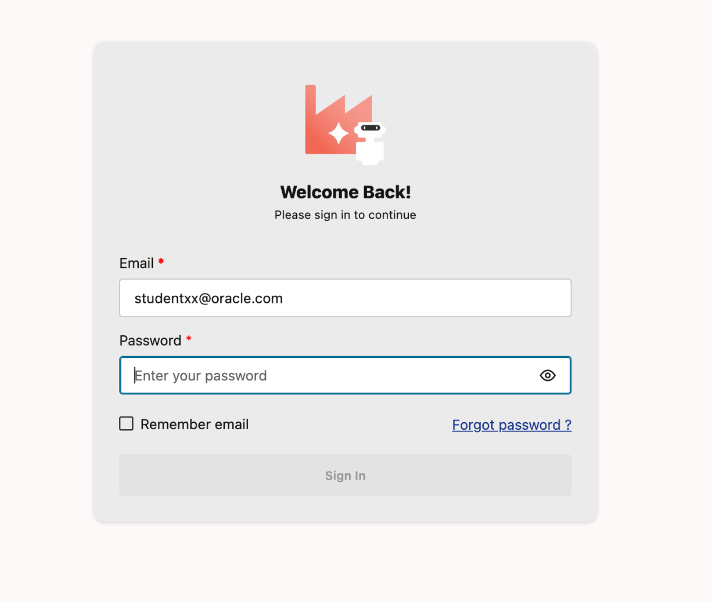

3. After signing in, verify that the Private Agent Factory home page is displayed.

   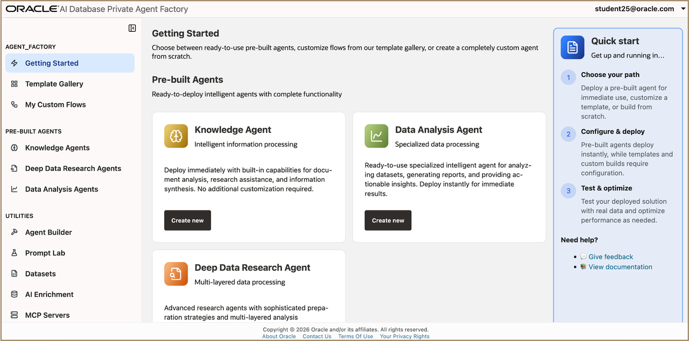

4. Review the available Private Agent Factory capabilities.

   Depending on the workshop environment and installed version, you will use capabilities for:

   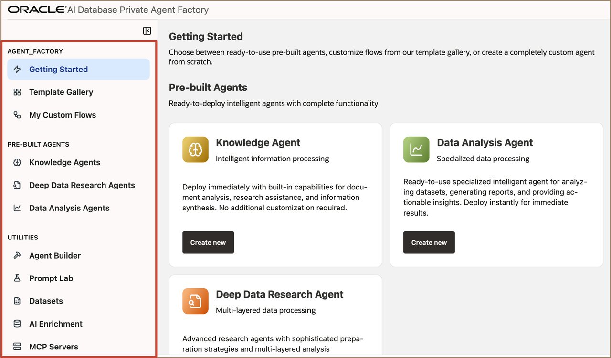

   - Creating and managing **Knowledge Agents**.
   - Creating **Deep Data Research Agents**.
   - Managing enterprise **Data Sources**.
   - Building custom agent workflows with **Agent Builder**.
   - Configuring external **MCP Servers**.
   - Testing agents and workflows in **Playground**.

5. Locate the area used to manage **Data Sources**.
   
   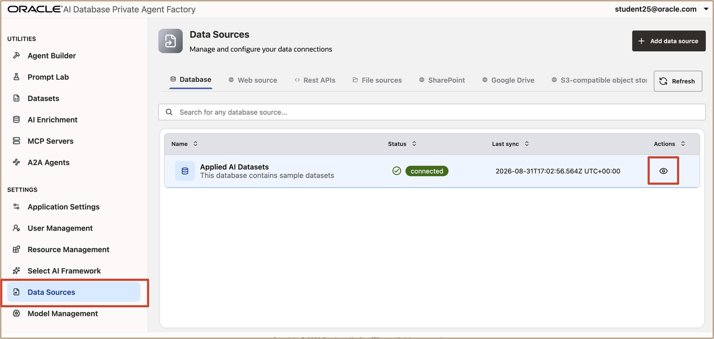

6. Verify that you can access the area used to create agents.

   Locate **Agent Builder**.

   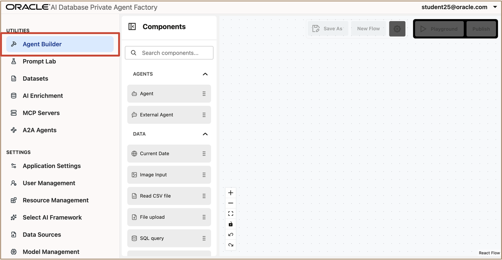
   

7. Locate **MCP Servers**.
   
   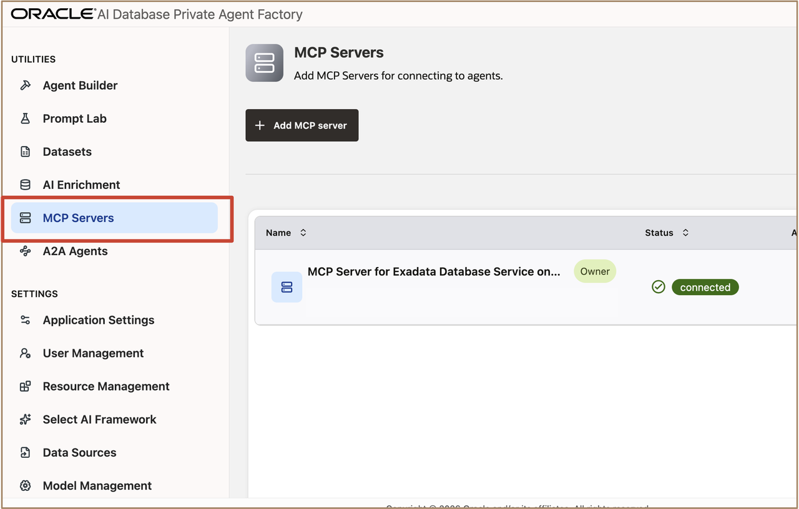

   You will use these capabilities later in this lab to build a custom agent that can interact with Oracle AI Database through the MCP Server created in Lab 1.

You are now ready to create your first enterprise AI agent.

## Task 2: Create a Knowledge AI Agent

In this task, you will create a Knowledge AI Agent grounded in enterprise documentation.

A Knowledge Agent uses enterprise content as a knowledge source so that responses can be grounded in information provided by your organization rather than relying only on the language model's general knowledge.

### **Locate the Preconfigured Knowledge Source**

1. In Private Agent Factory, navigate to **Data Sources**.

2. Review the available data sources and locate the knowledge source provided for this workshop.

   Your instructor will identify the appropriate data source if multiple sources are available.

3. From the **Data Sources** navigtate to **Web source** and **File sources**. Review its details, including its name, description, documents, and processing status.

   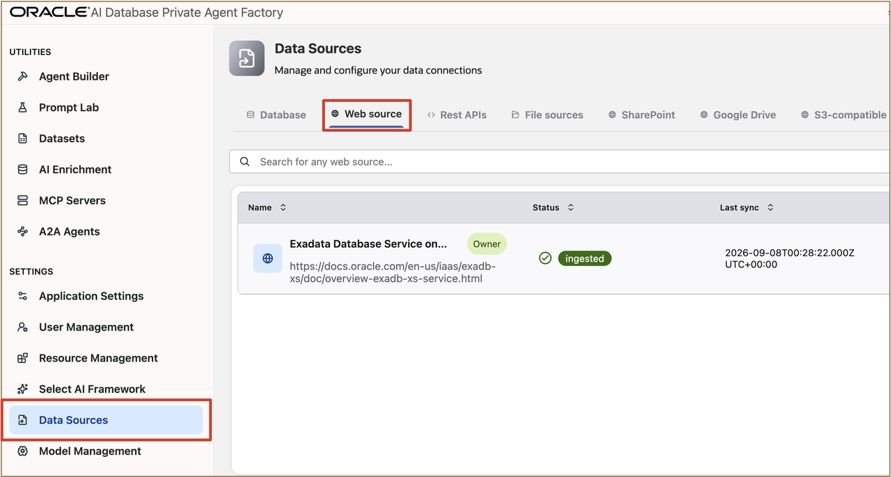

   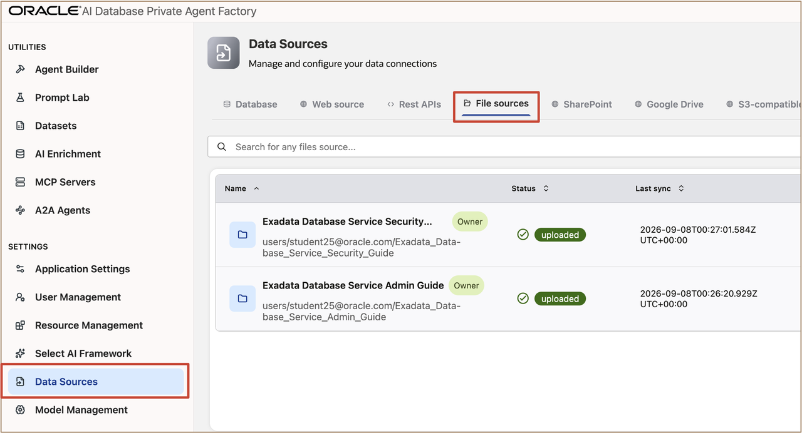

4. Confirm that the data source is available and ready to use.

   > **Important:** The workshop knowledge sources have already been uploaded for you. **Do not create a new data source or upload additional documents unless instructed.**

### **Create the Knowledge Agent**

5. Navigate to **Pre-Built Agents** then select **Knowledge Agent**.

   Click **Create agent**. 

   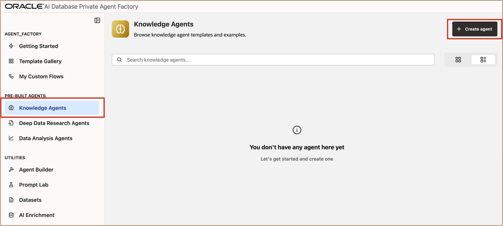

6. Select the data (knowledge) sources for your agent to learn from:
   
   Select the knowledge source from **Web sources**

   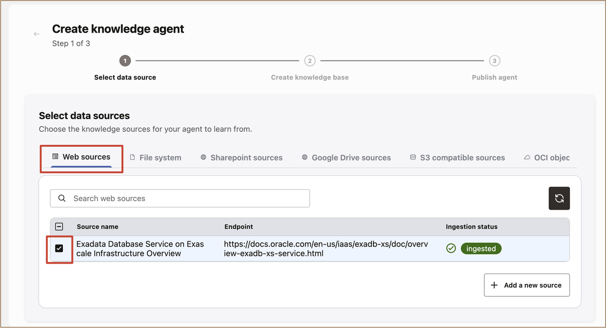

   Select the PDF file knowledge source from the **file system**

   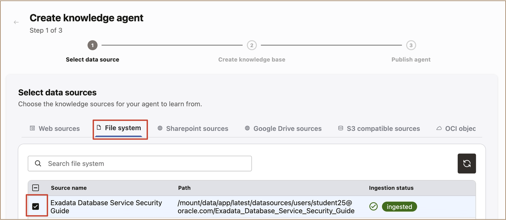

7. In the **Knowledge base configuration** form, enter the following values:

   **Agent name** *(required)*

        <copy>Exascale AI Development Advisor</copy>

   **Description** *(required)*

        <copy>Provides practical guidance on Oracle Exadata Database Service with Exascale, including architecture, development, storage, security, and operations.</copy>

   For **Generative Model** *(required)*, select **llm-model-entry**

   **Help description** *(optional)*

        <copy>Ask about designing and operating AI development environments on Exascale. I can help with architecture, databases, storage, security, connectivity, backup, monitoring, and operational decisions. I provide concise, practical answers with short bullets and source references. Include the service type, database version, region, workload, and environment scale when known.</copy>

   Review the information and click on **Next**.

   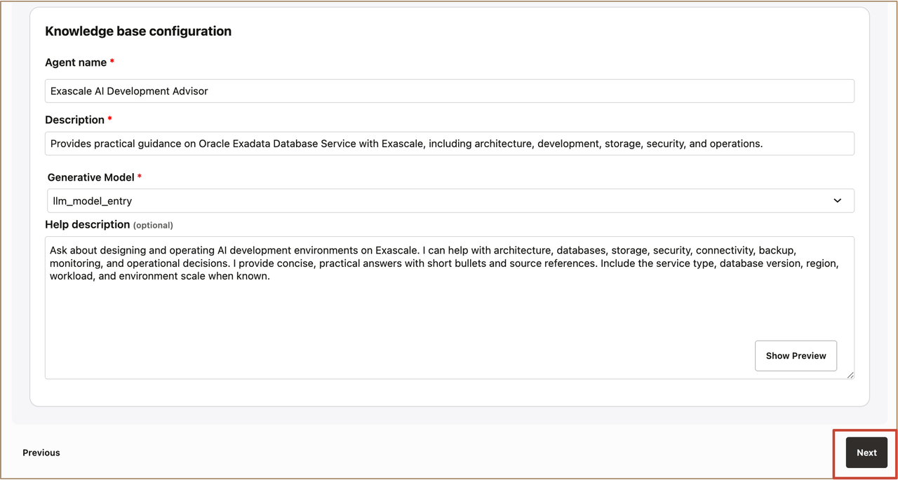

8. Review and deploy your knowledge agent. Click **Publish agent**

   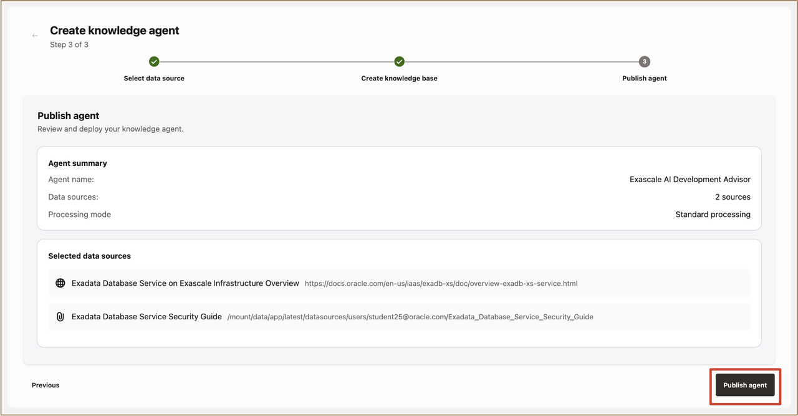

   Wait until the agent is ready.


### Test the Knowledge Agent

1. Click **Open agent** to open the Knowledge Agent chat interface.

    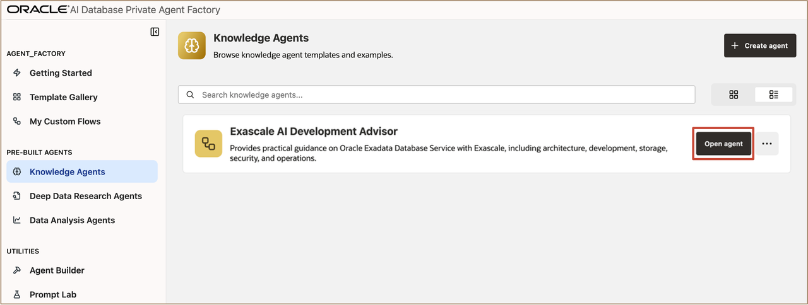

2. Enter a question about information contained in the preconfigured workshop knowledge source.
   
   Expand the editor mode

    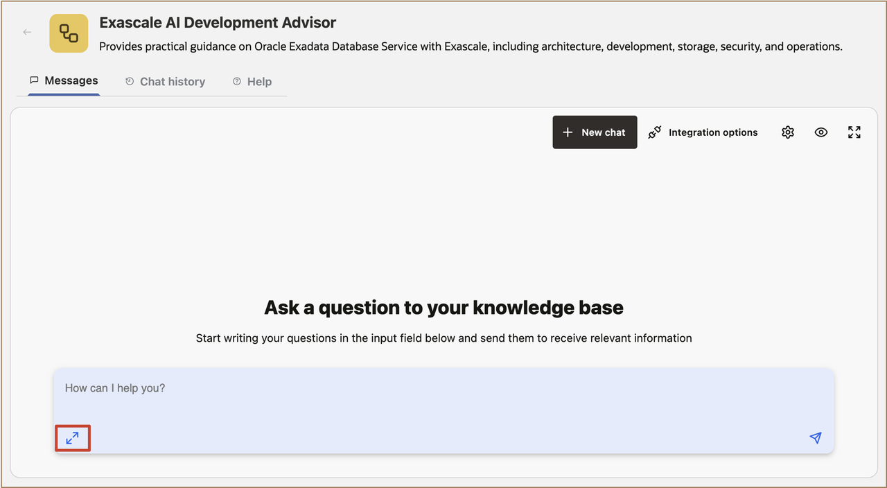

   Use the following sample question:

    ```nohighlight
    <copy>I’m designing an AI development environment on Exadata Database Service on Exascale Infrastructure. We need 20 isolated development PDBs for teams testing AI workloads, including RAG applications, vector search, model evaluation, prompt engineering, and different AI model versions against representative copies of database data.

    Recommend the most suitable way to provision these environments based on the supplied documentation.

    Compare the available PDB provisioning or cloning approaches, considering:

    - Initial storage consumption
    - Capacity growth as teams modify their environments
    - Performance and production representativeness
    - Refresh and retirement procedures
    - Data isolation and security
    - Operational effort
    - Version, region, and service prerequisites

    Select one recommended approach and explain why it is better than the alternatives. Start with a concise recommendation, then use short bullet points and finish with a brief validation checklist. Use the Exascale overview as the primary reference.</copy>
    ```

    > **Note:** Choose a question that can be answered using the information in the preconfigured workshop knowledge source. 
   
   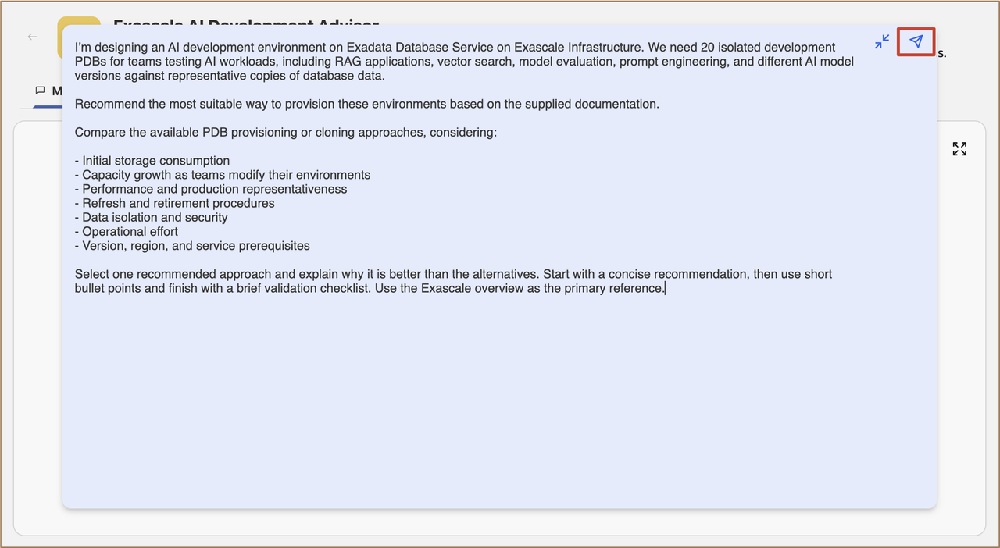

   Click the **Send Message** button to submit the question.


3. Review the Knowledge Agent’s response.
   
   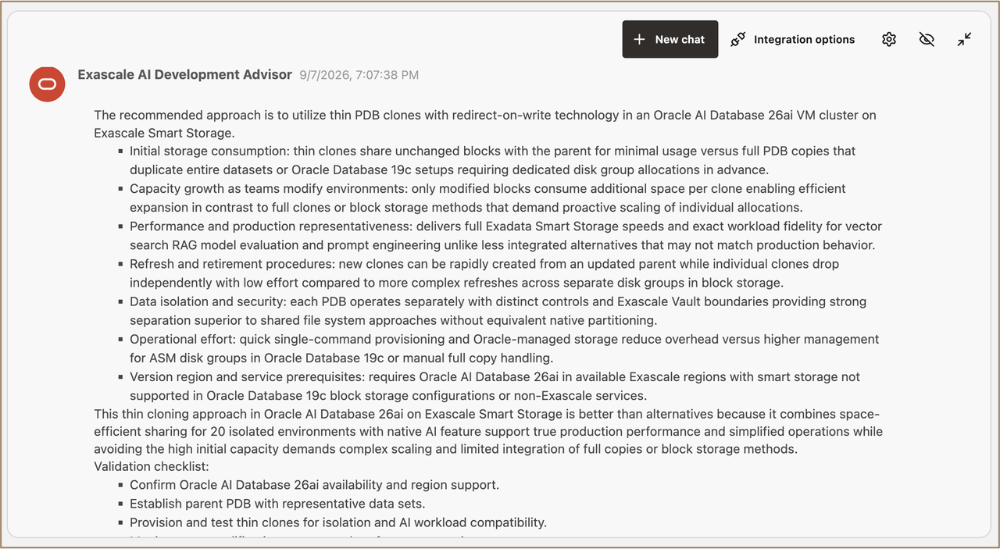

   Confirm that the response is grounded in information from the workshop documentation.

   If source references or citations are displayed, review them and confirm that they point to the appropriate workshop documentation.

4. Ask a follow-up question related to the initial response.
   
   Use the following sample question:

    ```nohighlight
    <copy>Now act as a security and compliance reviewer for the proposed 20-PDB AI development environment.

The platform will support RAG, vector search, model evaluation, prompt engineering, and testing different AI model versions against representative database data.

Using the supplied Exascale overview and Oracle Exadata Database Service security documentation, assess the security posture of the proposed environment.

Focus on:

- Data classification, handling, and protection requirements
- Private connectivity and network segmentation
- Encryption in transit and at rest
- Identity, access control, and privileged operations
- Database auditing, monitoring, and alerting
- Backup protection, retention, and recovery
- Isolation and access boundaries between development teams

For each area, summarize the relevant controls and validation actions, focusing on how they apply to the Exascale environment.

Begin with a concise security recommendation, use short bullet points, and conclude with the most important security action, the top three validation steps, and relevant source references.</copy>
    ```

   Click the **Send Message** button to submit the question.

   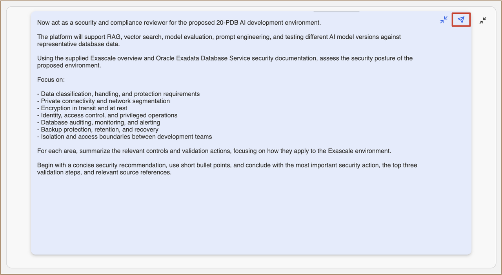

5. Confirm that the Knowledge Agent continues to use the configured knowledge source when answering the follow-up question.
   
   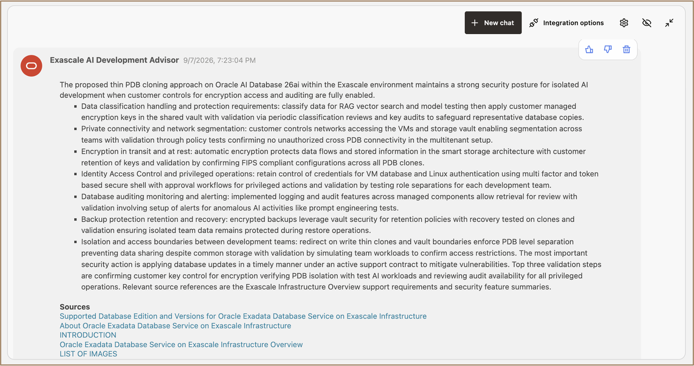

Congratulations! You have successfully created and tested a Knowledge Agent grounded in your organization’s internal knowledge source. The agent can retrieve relevant information from the supplied enterprise documentation and use it to generate grounded responses.


## Task 3: Create a Custom AI Agent with MCP Tool

In this task, you will use **Agent Builder** to create a custom AI agent that interacts with Oracle AI Database through the managed MCP Server configured in Lab 1.

Model Context Protocol provides a standardized interface through which an AI agent can discover and invoke approved tools. In this workshop, the MCP Server provides the governed connection between Private Agent Factory and Oracle AI Database.

The resulting flow is:

```text
User
  |
  v
Oracle AI Database Private Agent Factory
  |
  v
Custom AI Agent
  |
  v
MCP Tool
  |
  v
OCI Database Tools MCP Server
  |
  v
Oracle AI Database
```

### **Review the Preconfigured MCP Server**

In this task, you will locate and review the MCP Server that has already been configured in Oracle AI Database Private Agent Factory.

1. In the left navigation menu, scroll to **Utilities**.

2. Select **MCP Servers**.

3. Locate the preconfigured MCP Server named: ***MCP Server for Exadata Database Service on Exascale Infrastructure***
   

4. Confirm that the MCP Server status is **Connected**.
   
   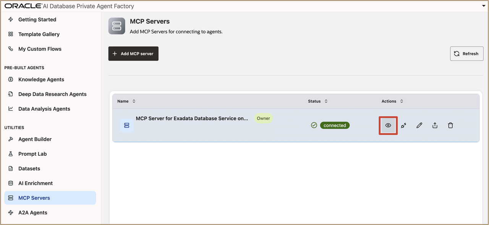

   > **Important:** The MCP Server has already been configured for you. Do not click **Add MCP server**, modify the configuration, enter credentials, or delete the existing MCP Server.


5. In the **Actions** column, click the **View** icon.

6. Review the MCP Server details displayed in the dialog, including:

   - MCP Server name
   - Resource access
   - Sharing information
   - Ownership

   <!--  -->

You have now located and reviewed the preconfigured MCP Server in Private Agent Factory.

### **Create a Custom Agent Flow**

7. Navigate to **Agent Builder**.
   
   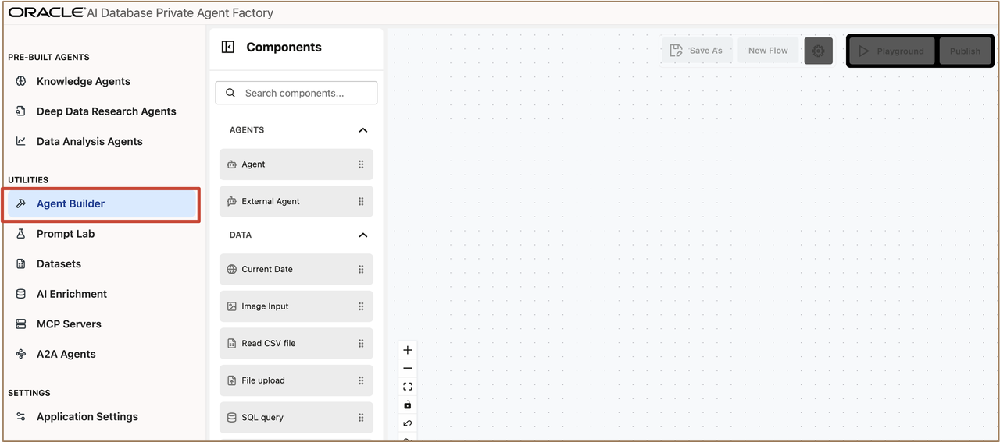

8. On the Agent Builder canvas, add the components required for the custom agent workflow.
   
   Add the **Agent** component 

    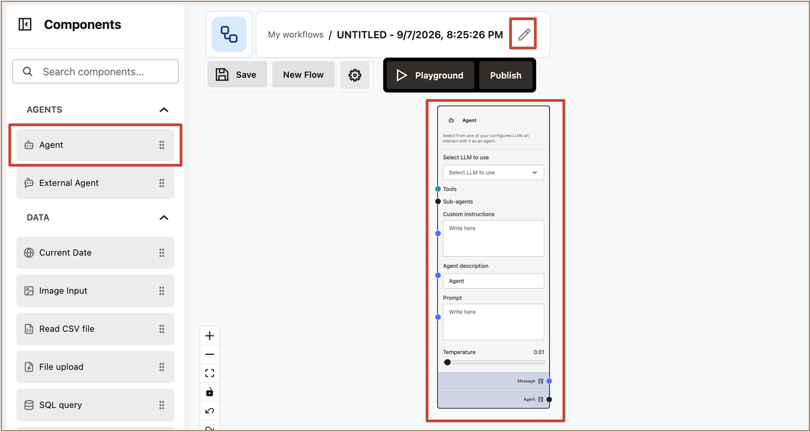

9. Enter a name for the flow.
    
    For example:

    ```text
    <copy>Database MCP Agent</copy>
    ```

   Enter a description.

    For example:

    ```text
    <copy>Custom AI agent that interacts with Oracle AI Database using MCP</copy>
    ```

   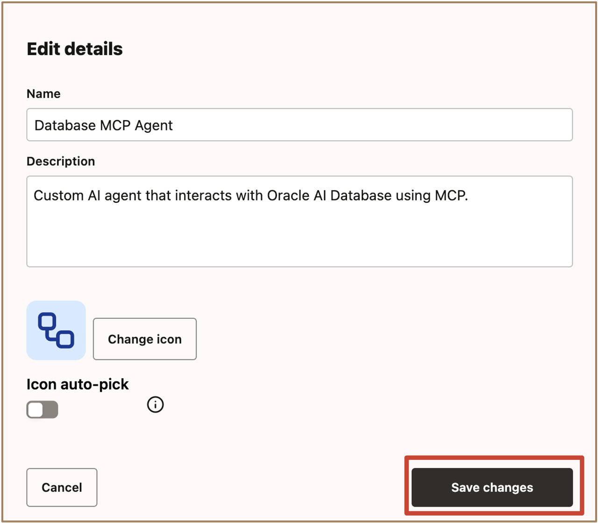

10. Click **Save changes** to create the flow.


### **Configure the Agent**

11. Select the **Agent** component on the canvas.

12. Under **Select LLM to use**, select the LLM provided for the workshop environment:

    select ***llm-model-entry (oci)***

13. In **Custom instructions**, enter the following:

    ```nohighlight
    <copy>You are an enterprise database assistant.

    Use the connected MCP tools whenever information must be retrieved from Oracle AI Database.

    Base database-related answers on information returned by the MCP tools. Do not invent database records, values, or query results.

    Provide clear and concise responses using short bullet points. When appropriate, include the tool or database information used to support the answer.</copy>
    ```

14. In **Agent description**, enter the name of the agent:

    ```nohighlight
    <copy>Exascale Data Assistant</copy>
    ```

15. Leave the **Prompt** field blank.

16. Leave **Temperature** at the workshop default of `0.01`.

17. Review the Agent configuration 

   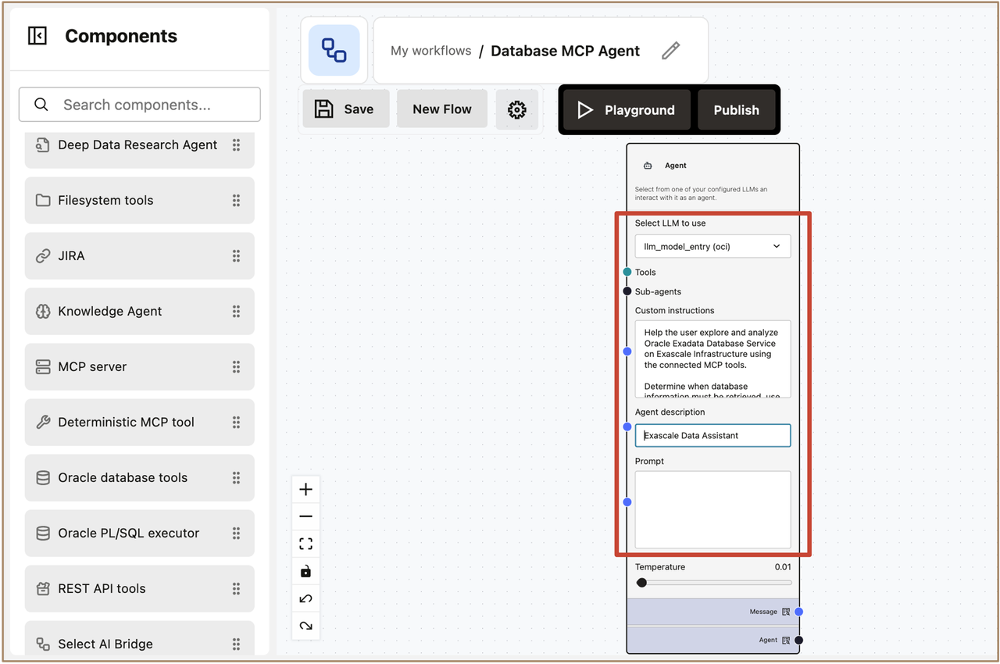


### **Add the MCP Tools**

18. Add an **MCP Server** component to the workflow. Select the MCP Server connection configured earlier.

    Review the tools available from the MCP Server.

   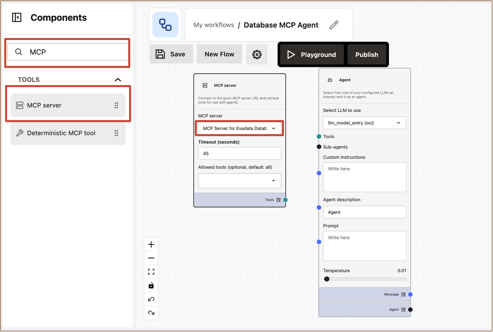

   Select only the tools required by this custom agent.

    > **Note:** Limiting an agent to the tools required for its intended task reduces unnecessary capabilities and helps maintain a governed agent workflow.

19. Connect the MCP Server component to the **Tools** input of the Agent component.
    
   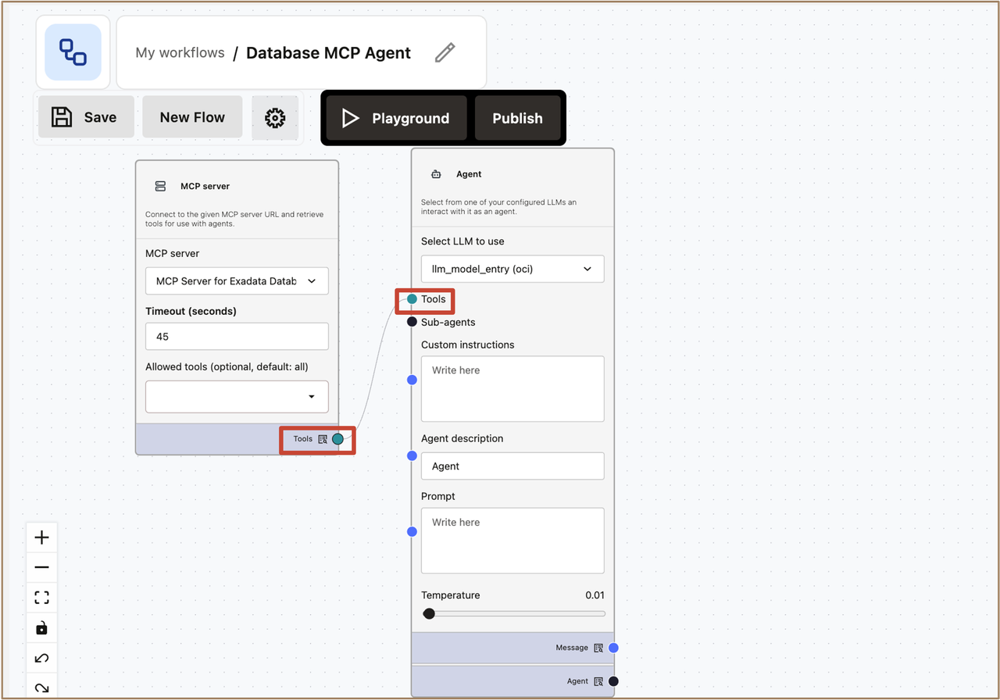

20. Verify that the remaining workflow components are connected correctly.
    
    Add the Chat Input and Chat Output components.

   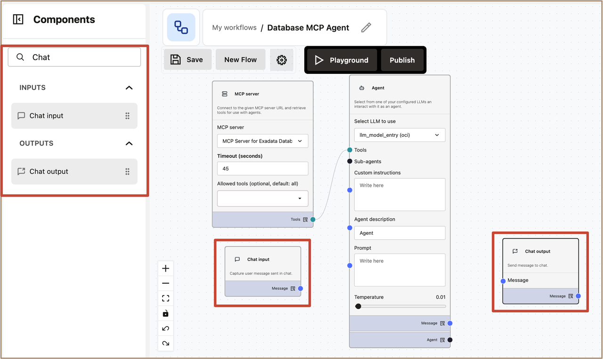

    Connect both components to the Agent 

   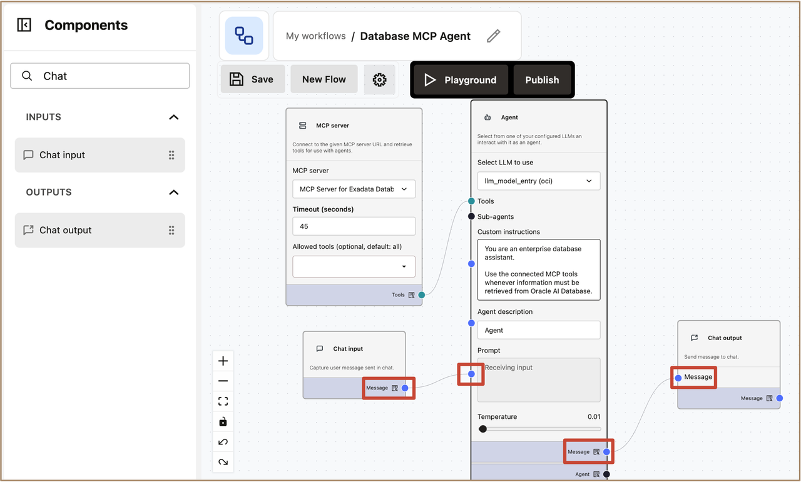


21. Click **Save** to save the custom agent flow.
    
   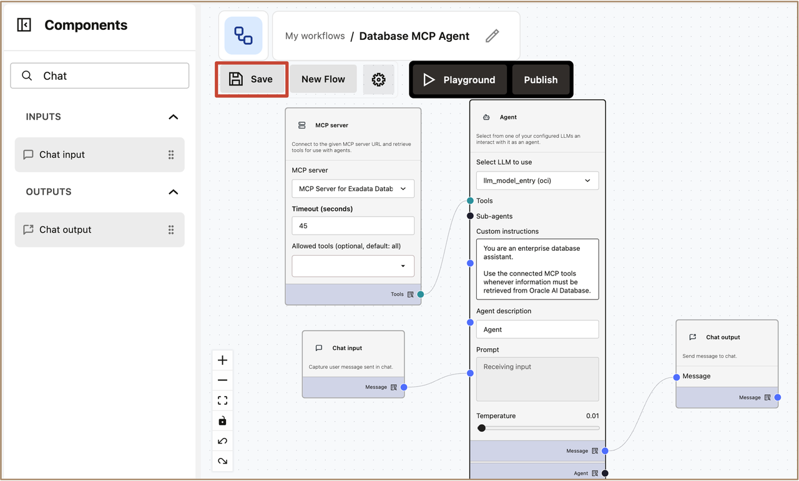

### **Test the MCP Connection in Playground**

22. Open the completed workflow in **Playground**.
    
   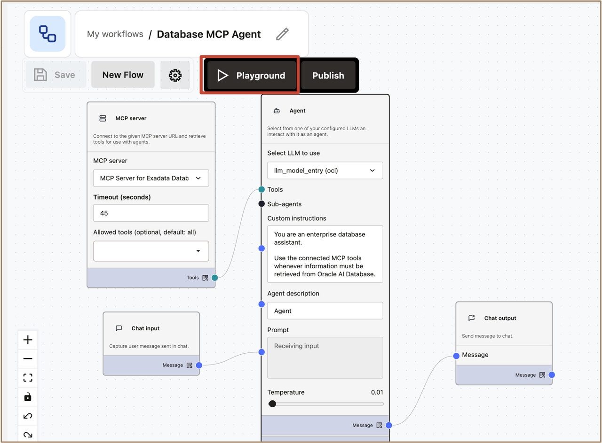

23. Enter a prompt that asks the agent about its available database capabilities.
   
   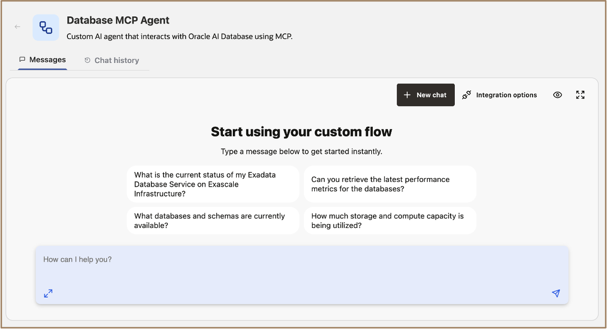

    For example:

    ```text
    <copy>What database tools do you have available?</copy>
    ```

   Submit the prompt.

   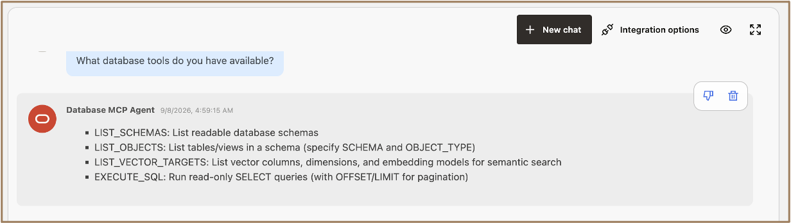

24. Verify that the agent recognizes the tools exposed through the MCP Server.

25. Enter a natural-language question that requires information from the Oracle AI Database.

    > **Note:** Use a question that corresponds to the sample database objects and data provided with the workshop. For this demonstration, we are using a sample retail sales dataset containing transaction, product, channel, regional, sales, margin, and return information.

    For example:

    **Establish the data scope**

    ```text
    <copy>Give me an executive summary of the retail sales data for the full available period. Include the date range, total net sales, total orders, total refunds, and sales by channel.</copy>
    ```

26. Submit the question.

27. Observe the agent execution.

28. Verify that the agent invokes an appropriate MCP tool rather than attempting to answer the database-specific question using only the language model.

29. Review the response returned by the agent.

    Ask more sample questions:

    **Analyze regional performance**

    ```text
    <copy>For the full available period, show total net sales by region. Include order count and each region’s percentage of total net sales. Sort from highest to lowest.</copy>
    ```

    **Analyze sales trends**

    ```text
    <copy>Show monthly net sales trends for the full available period. Include net sales, order count, and month-over-month change. Identify the highest and lowest sales months.</copy>
    ```

    **Compare sales channels**

    ```text
    <copy>Compare WEB, STORE, and MOBILE for the full available period using total net sales, order count, average order value, gross margin amount, and margin percentage. Sort by net sales.</copy>
    ```

    **Analyze product profitability**

    ```text
    <copy>Using gross margin amount, defined as net sales minus cost, which five products generated the highest total gross margin? Include product name, category, net sales, cost, gross margin, and margin percentage.</copy>
    ```

     **Ask a cross-analysis question**

    ```text
    <copy>Among the five highest-margin products, which channel and region generated the most net sales?</copy>
    ```

    **Identify improvement opportunities**

    ```text
    <copy>Which region has the highest return rate? Calculate return rate as returned transactions divided by total transactions, and include net sales and refund amount.</copy>
    ```


30. Verify that the answer is based on information returned from Oracle AI Database.


Congratulations! You have now created a custom AI agent that can interact with Oracle AI Database through the managed MCP Server.

This architecture enables AI applications to use enterprise database capabilities through a standardized MCP interface while database access remains governed independently from the agent.

## Acknowledgements

**Authors** 

* Leo Alvarado, Vishal Patil, Tammy Bednar, Product Management, Oracle Database Cloud Services, Multicloud 

**Last Updated Date** - August, 2026

