# Lab 1: Create and Configure the MCP Server for Oracle AI Database

## Introduction

In this lab, you will configure an **OCI Database Tools Model Context
Protocol (MCP) Server** to provide managed, governed access to Oracle AI
Database.

Database Tools MCP Server is a managed, multi-tenant OCI service that
enables MCP-compatible AI applications and agents to access Oracle AI
Database through the Model Context Protocol. The MCP Server uses an
existing **Database Tools Connection** to reach the database and exposes
approved database capabilities through MCP toolsets.

The MCP Server is secured using **OCI IAM Identity Domains**, OAuth 2.0,
application roles, and OCI IAM policies. In this lab, you will configure
the identity and authorization layers required by the MCP Server, use
**Resource Principal** as the MCP Server runtime identity, create an MCP
toolset, and prepare the MCP Server for use by an agent
in the next lab.

**Estimated Time:** 30 minutes

### Objectives

In this lab, you will:

-   Review the Database Tools MCP Server security and identity model.
-   Verify the IAM Identity Domain used by the MCP Server.
-   Create the IAM Identity Domain groups used for MCP access.
-   Create an OCI Database Tools managed MCP Server for Oracle AI
    Database.
-   Configure the MCP Server to use **Resource Principal** as its
    runtime identity.
-   Map IAM Identity Domain groups to MCP application roles.
-   Configure the OCI IAM policies required to invoke the MCP Server and
    access supporting OCI resources.
-   Create a sample **Built-in SQL tools** MCP toolset.
-   Validate the MCP Server configuration.
-   Register an MCP client and obtain the remote MCP Server URL for the
    next lab.

### Prerequisites

Before starting this lab, verify that the following resources are
available:

-   An Oracle AI Database database supported by OCI Database
    Tools.
-   An existing **Database Tools Connection** for the Oracle AI
    Database database. For information about creating a Database Tools Connection, see [Creating a Connection](https://docs.oracle.com/en-us/iaas/database-tools/doc/creating-connection.html).
-   An OCI Vault, encryption key, and secrets used by the Database Tools
    Connection, when using password-based database authentication.
-   An OCI IAM Identity Domain where you have permission to manage MCP
    resources and application roles.
-   Permissions to create and manage Database Tools MCP Servers,
    toolsets, connections, and the supporting IAM policies.
-   An Object Storage bucket if asynchronous MCP operations will be
    used.

> **Note:** The Database Tools Connection, Vault resources, networking,

> and Oracle AI Database database are provided as part of the

> workshop environment unless otherwise specified.


## Task 1: Prepare the IAM Identity Domain for the MCP Server

In this task, you will review the IAM Identity Domain used by the MCP
Server and create the groups that will later be mapped to MCP
application roles.

### **Understand the IAM Identity Domain**

When you create a Database Tools MCP Server, you associate it with an
**OCI IAM Identity Domain**. The domain provides the authentication and
authorization layer for the MCP Server.

The MCP Server is registered in the selected domain as a resource
server. MCP clients are registered in the same domain as applications.
OAuth access tokens issued by the domain contain the application roles
used by the MCP Server to determine which tools the authenticated
identity is allowed to invoke.

> ***Important:*** Select an IAM Identity Domain where you have permission

> to create and manage IAM resources and assign application roles. For

> the workshop environment, use the domain specified by your instructor.


### **Access the IAM Identity Domain**

1. In the Oracle Cloud Console, open the **Navigation menu**.

2. Select **Identity & Security**, and then select **Domains**.
   
    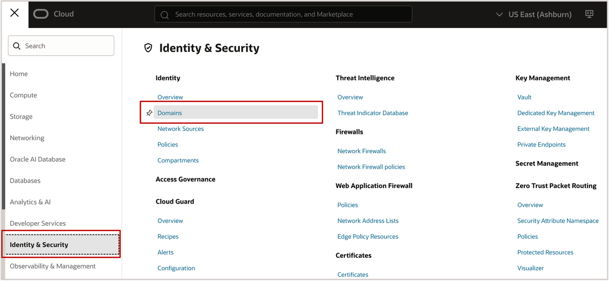

3. Select the IAM Identity Domain provided for the workshop.

4. Record the domain name. You will select this domain when creating the MCP Server.

### **Create IAM Identity Domain Groups**

The Oracle Database Tools MCP Server provides the following predefined application roles:

   | Application Role | Purpose |
   | --- | --- |
   | `MCP_Administrator` | Enables tools used to manage the MCP Server. |
   | `MCP_Operator` | By default, provides access to all tools in every toolset and all SQL Reports. |
   | `MCP_User` | By default, provides access to basic SQL Reporting tools and all SQL Reports. |

5. In the selected domain, select **User management**, and then select **Groups**.

6.  Create the following groups if they are not already available in the workshop environment:

    | Group | Assigned MCP Application Role |
    | --- | --- |
    | `MCP_Administrators` | `MCP_Administrator` |
    | `MCP_Operators` | `MCP_Operator` |
    | `MCP_Users` | `MCP_User` |

    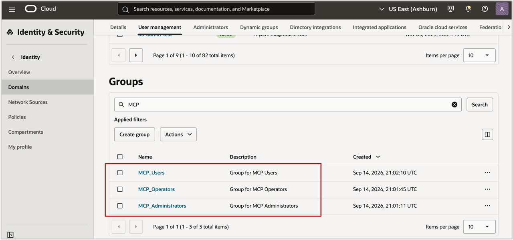

    > **Note:** The `MCP_All_Users` group is used by the OCI IAM policy that authorizes members to invoke the MCP Server. It is not an MCP application-role mapping.


7. Add your workshop user to the group specified.
   
   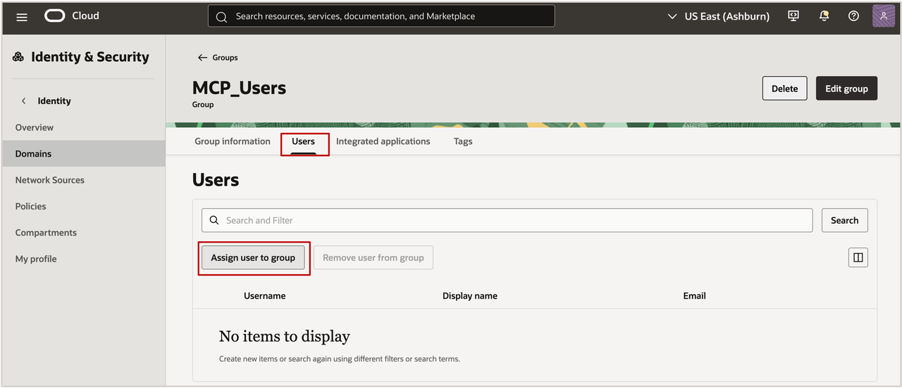

> **Note:** For this workshop, a user who needs to exercise the Built-in SQL tools should be assigned the role required by that toolset. In a production environment, follow least privilege and provide users only the MCP and database privileges required for their responsibilities.
***Important:*** OCI IAM **Identity Domain application roles** and OCI IAM **policies** serve different purposes. Application roles control what an authenticated identity can do inside the MCP Server. OCI IAM policies authorize identities and resource principals to invoke the MCP Server and access OCI resources such as Database Tools Connections, Vault secrets, work requests, and Object Storage.


## Task 2: Create the MCP Server for Oracle AI Database 

In this task, you will create the managed MCP Server and configure its
runtime identity.

### Create the MCP Server

1. Open the **Navigation menu** of your OCI Console.

2. Select **Developer Services**.

3. Under **Database Tools**, select **Model Context Protocol Servers**.

    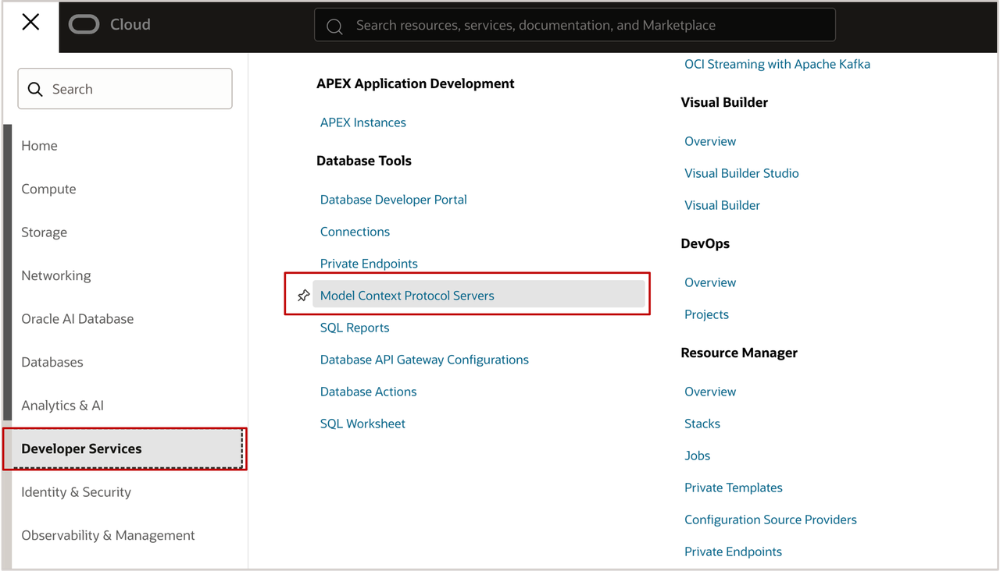

4. On the **Model Context Protocol Servers** page, click **Create Model
    Context Protocol server**.

5. Configure the MCP Server using the workshop resources.

    | Field | Value |
    | --- | --- |
    |  Name | `mcpserver` |
    | Compartment  | Select the workshop compartment |
    | Domain | Select the IAM Identity Domain reviewed in Task 1 |
    | Connection | Select the Database Tools Connection for Oracle AI Database |
    | Object Storage bucket | Select the workshop bucket if asynchronous operations will be used |

    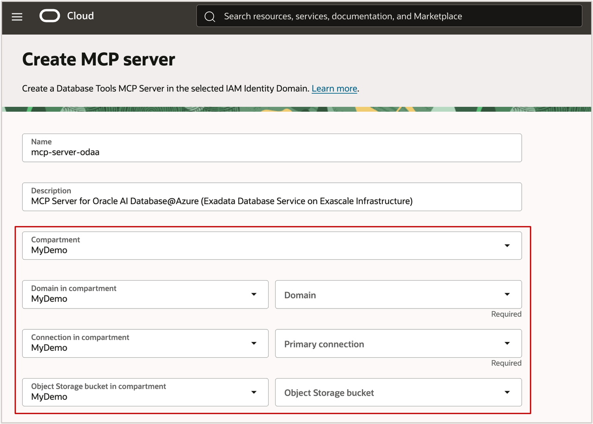

    > **Note:** The selected Database Tools Connection determines which Oracle AI Database the MCP Server accesses. For information about creating a Database Tools Connection, see [Creating a Connection](https://docs.oracle.com/en-us/iaas/database-tools/doc/creating-connection.html).

### **Configure OAuth Options**

6. Expand **Advanced options**.

7. Under **OAuth options**, review **Access token expiration
    (seconds)**.

    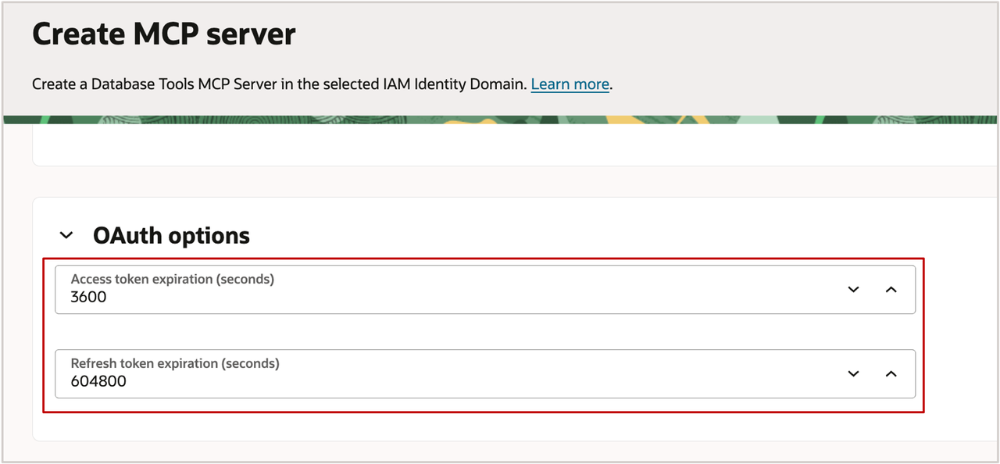

    The access token expiration determines how long an access token is valid. The default is one hour. If Personal Access Tokens will be used by a client, the Oracle tutorial suggests increasing this value when a longer workshop session is required.


    For example, one week is:

      ``` text
      <copy>604800</copy>
      ```

8. Review **Refresh token expiration (seconds)**. This determines how long a client can continue renewing access tokens before the user must authenticate again.

### **Configure Runtime Identity**

9. Under **Settings**, locate **Runtime Identity**.

10. Select **Resource principal**.
    
    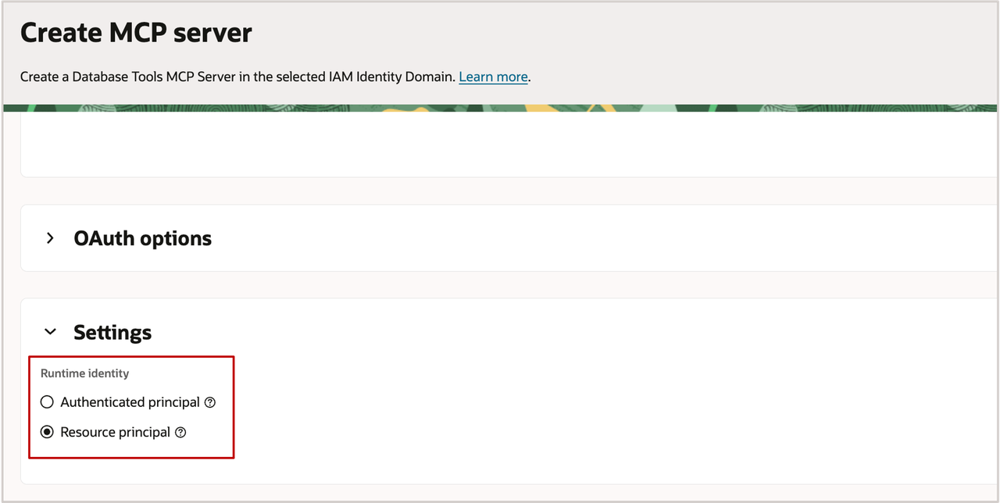
    

    The MCP Server runtime identity determines which identity is used when the server accesses OCI resources:

    -   **Authenticated principal** runs requests using the authenticated
    user's identity.
    -   **Resource principal** runs requests using the MCP Server's own
    workload identity.

    For this workshop, use **Resource principal**.

    > **Why Resource Principal?** The MCP Server can access authorized OCI resources using its own temporary workload identity instead of requiring each user to be granted direct access to the underlying connection credentials and supporting resources. The MCP Server resource principal is governed by OCI IAM policies.

    > **Important:** The MCP Server runtime identity and the **Database Tools Connection runtime identity** are separate settings. The policies required by the MCP Server depend on both runtime identities and on whether the Database Tools Connection uses password-based or token-based database authentication.

11. Click **Create**.

12. Wait until the MCP Server is created successfully.

13. Open the MCP Server details page.

14. Copy the **MCP Server OCID**.
    
   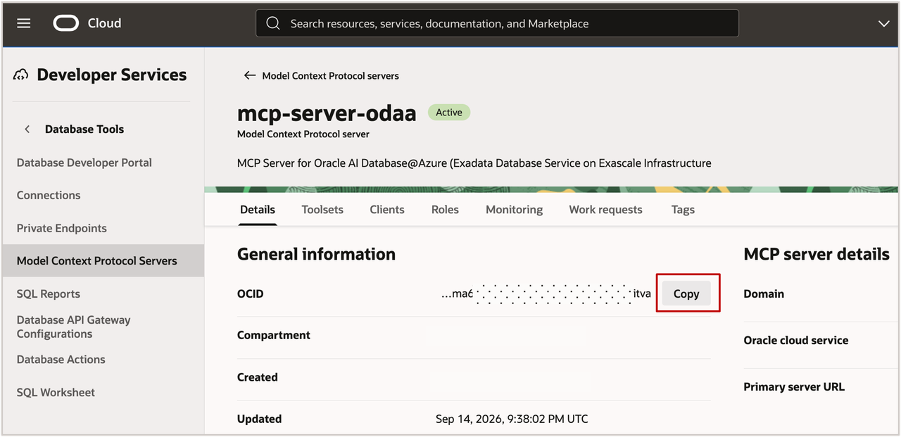

You will use this OCID when configuring the resource-principal IAM policies.

## Task 3: Configure MCP Application Roles and OCI IAM Policies

In this task, you will map the IAM Identity Domain groups to MCP application roles and configure the OCI IAM policies required by the MCP Server.

### Assign Groups to MCP Application Roles

1. On the MCP Server details page, select the **Roles** tab.

2. Click **Assign Roles**.

    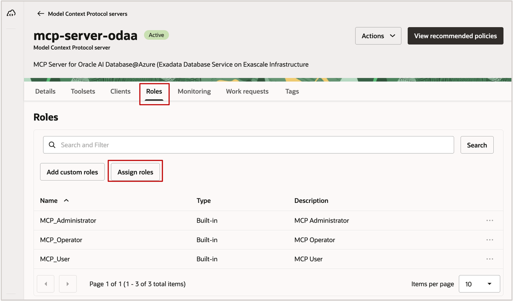

3. For `MCP_Administrator`, open the Actions menu and select **Manage groups**.
   
    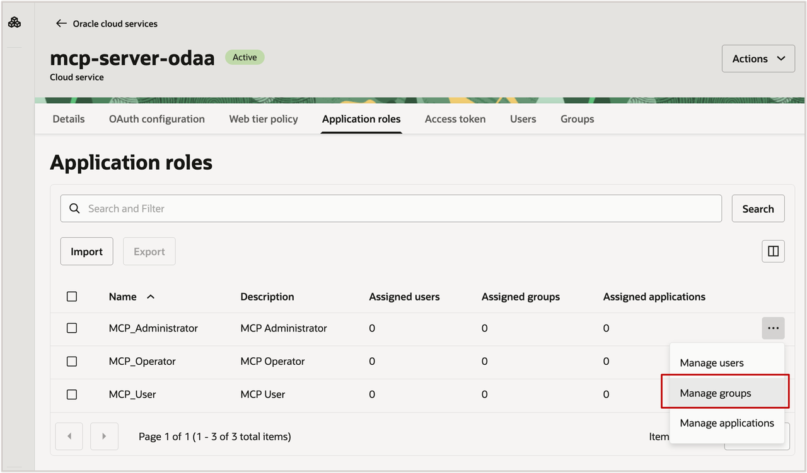

4. Click **Assign groups**.

5. Select: **MCP_Administrators**

6. Click **Assign**.

    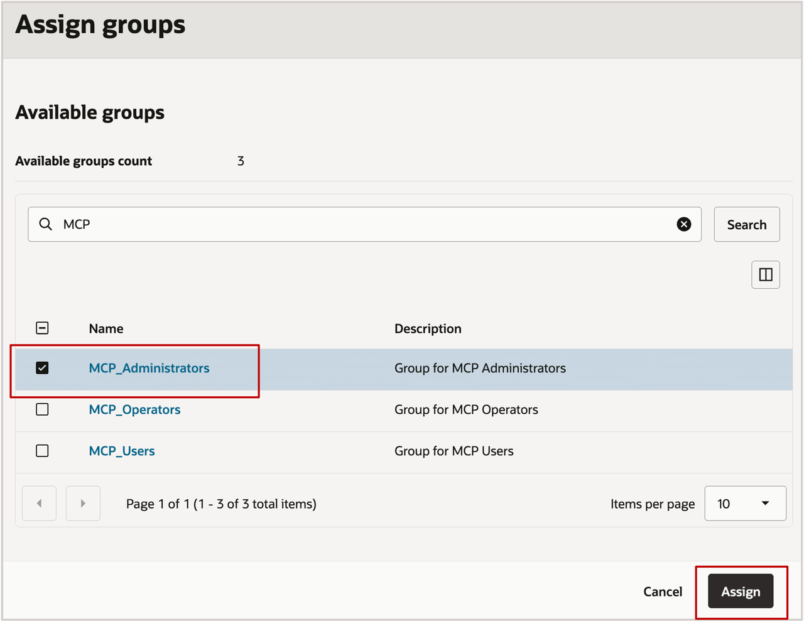

7. Repeat the process to map the remaining groups:
    
    | Application Role | IAM Identity Domain Group |
    | --- | --- |
    |  `MCP_Administrator` | `MCP_Administrators` |
    | `MCP_Operator`  | `MCP_Operators` |
    | `MCP_User` | `MCP_Users` |

8. Verify that your workshop user belongs to the group required for the
    lab.

    > **Important:** A user must have an MCP application role assigned to use the MCP Server and to download a Personal Access Token.

### **Configure OCI IAM Policies**

The exact IAM policies required depend on:

-   MCP Server runtime identity.
-   Database Tools Connection runtime identity.
-   Database authentication type.
-   Whether asynchronous work requests or Object Storage are used.

For this workshop, the following example assumes:

   | Setting | Workshop Configuration |
   | --- | --- |
   |  MCP Server Runtime Identity | **Resource Principal** |
   | Database Tools Connection Runtime Identity  | **Resource Principal** |
   | Database Authentication | **Password** |
   | Policy Scope | **Compartment** |

This corresponds to the **Resource Principal / Resource Principal / Password** configuration in the Database Tools MCP Server policy documentation.

9. Open the **Navigation menu**.

10. Select **Identity & Security**, and then select **Policies**.
    
    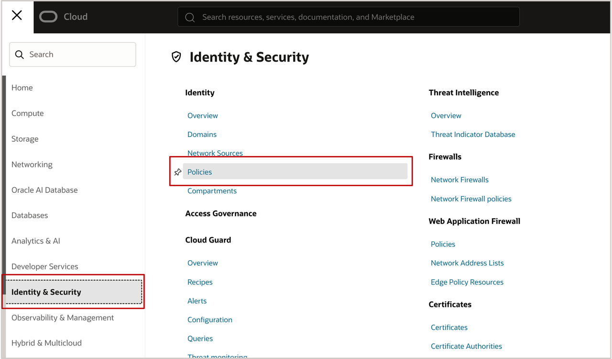

11. Select the compartment where the workshop policy will be created, or
    use the location specified by your workshop administrator.

12. Create a policy named:

    ``` text
    <copy>mcp-policy</copy>
    ```

13. Add the policy that allows members of the MCP group to invoke the
    MCP Server:

    ``` text
    <copy>allow group '<domain_name>'/'MCP_All_Users' to use database-tools-mcp-servers-invocation in compartment <compartment_name></copy>
    ```

14. Allow the MCP Server resource principal to use Database Tools
    Connections:

    ``` text
    <copy>allow any-user to use database-tools-connections in compartment <compartment_name> where request.principal.id = '<mcp-server-ocid>'</copy>
    ```

15. Because the workshop Database Tools Connection uses **Resource Principal**, allow the connection resource principal to read the Vault secrets used by the connection:

    ``` text
    <copy>allow any-user to read secret-bundles in compartment <compartment_name> where request.principal.id = '<connection-ocid>'</copy>
    ```

16. If the MCP Server will use asynchronous work requests, add:

    ``` text
    <copy>allow any-user to use database-tools-runtime-work-requests in compartment <compartment_name> where request.principal.id = '<mcp-server-ocid>'</copy>
    ```

17. If the workshop uses Object Storage for asynchronous results, allow the Database Tools Connection resource principal to use the bucket and manage objects:

    ``` text
    <copy>allow any-user to use buckets in compartment <compartment_name> where request.principal.id = '<connection-ocid>'
    allow any-user to manage objects in compartment <compartment_name> where request.principal.id = '<connection-ocid>'</copy>
    ```

18. Replace the placeholders with the values from your workshop environment and save the policy.

> **Note:** OCI also provides **View recommended policies** for an MCP Server. Use it to generate policy statements appropriate for the actual MCP Server, Database Tools Connection, authentication type, and policy scope in your environment.

> **Important:** The policies above are specifically for the workshop's **Resource Principal / Resource Principal / Password** configuration. Do not copy these policies unchanged into an environment that uses Authenticated Principal or token-based database authentication. Those configurations require different policy statements.

> **Note:** If you plan to use the **Generative AI SQL Assistant** toolset, add the following policy to allow the MCP Server resource principal to use the OCI Generative AI NL2SQL service:

 ```text
 <copy>allow any-user to use generative-ai-nl2sql in compartment <compartment_name> where request.principal.id = '<mcp-server-ocid>'</copy>
 ```

> This policy is not required when using only the **Built-in SQL tools**, **Custom SQL tools**, or **Customizable reporting tools** configured in this workshop.

### **Understand Resource Principal Acces**

With this workshop configuration:

``` text
Private Agent Factory / MCP Client
          |
          | OAuth identity + MCP application role
          v
OCI Database Tools MCP Server
          |
          | MCP Server Resource Principal
          v
Database Tools Connection
          |
          | Connection Resource Principal
          v
OCI Vault Secrets
          |
          v
Oracle AI Database
```

The MCP application role authorizes the user or client to use MCP capabilities. The OCI IAM policies authorize the MCP Server and Database Tools Connection resource principals to access the OCI resources required to execute the request.


## Task 4: Create an MCP Toolset

An MCP Server does not expose arbitrary database functionality automatically. You create one or more **MCP toolsets** to define the database capabilities that MCP clients can discover and invoke.

Database Tools supports the following MCP toolset types:

-   **Custom SQL tool** -- exposes predefined, parameterized SQL or
    PL/SQL.
-   **Built-in SQL tools** -- provides built-in tools for SQL execution
    and common database operations.
-   **Customizable reporting tools** -- exposes predefined Database
    Tools SQL Reports.
-   **Generative AI SQL Assistant** -- translates natural-language
    requests into SQL using the configured semantic resources.

### Create a Built-in SQL Tools Toolset

1. From the MCP Server details page, select the **Toolsets** tab.

2. Click **Create Model Context Protocol Toolset**.

    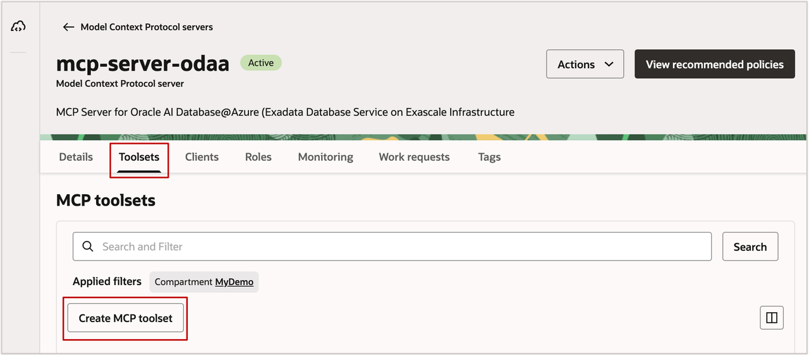

3. Enter the following information:

    | Field | Value |
    | --- | --- |
    |  Name | `SQL Tools` |
    | Description  | `Built-in SQL tools for the workshop Oracle AI Database database` |
    | Compartment | Select the workshop compartment |
    | Type | **Built-in SQL tools** |
    | Default execution type | **Synchronous** |

    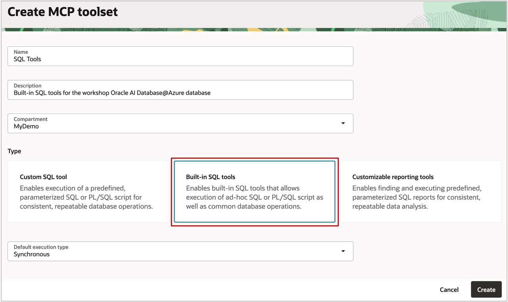

4. Review the tools provided by the Built-in SQL tools toolset.

    The built-in toolset includes capabilities such as:

    | Tool | Purpose |
    | --- | --- |
    |  `sql_run` | Executes SQL against the connected Oracle database. |
    | `schema_information`  | Retrieves and enriches database schema metadata. |
    | `request_status` | Retrieves the status and result of an asynchronous tool request.  |

    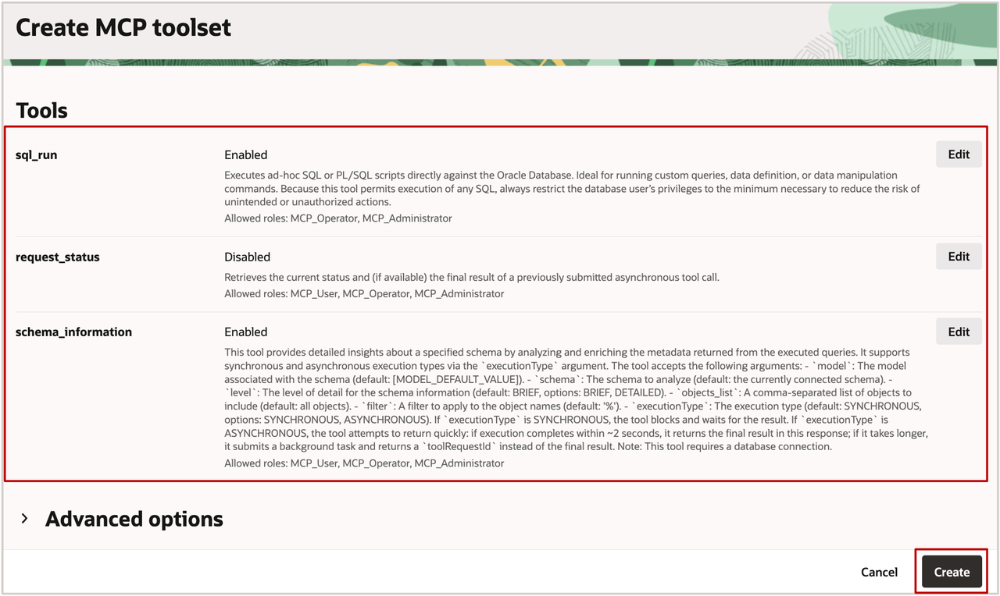

5. Create the toolset.

6. Wait until the toolset is available.

    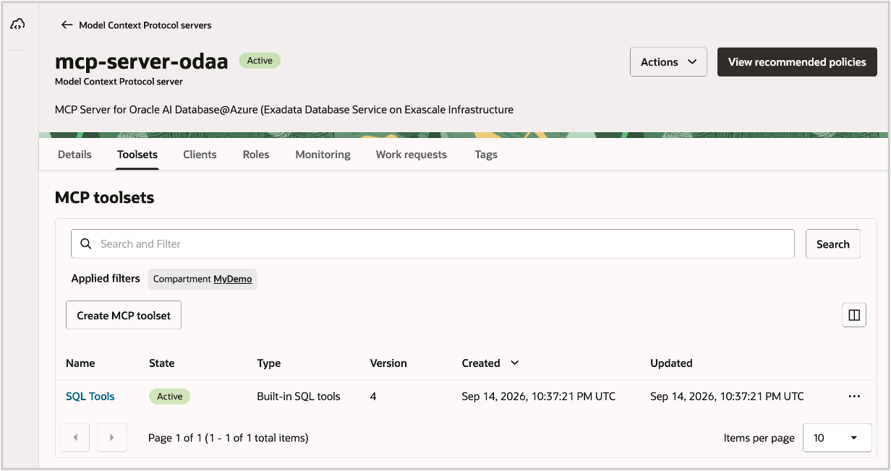

7. Verify that `SQL Tools` appears on the **Toolsets** tab.

   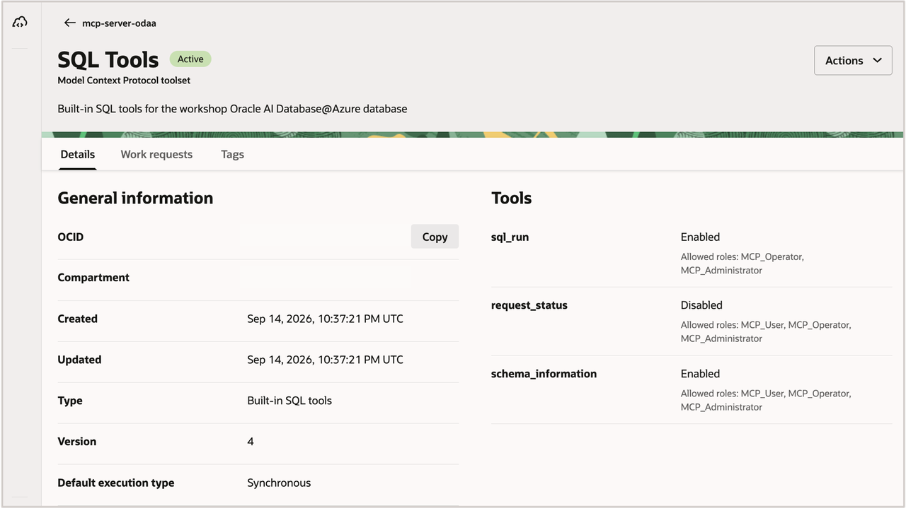

> **Important:** `sql_run` can execute ad-hoc SQL and PL/SQL using the privileges of the database user configured in the Database Tools Connection. Restrict that database user's privileges to the minimum required for the agent's use case. **Security Recommendation:** For production environments, prefer predefined, parameterized Custom SQL tools or SQL Reports when unrestricted ad-hoc SQL is not required. Use application roles and least-privilege database accounts to restrict access.

## Task 5: Validate the MCP Server and Register an MCP Client

In this task, you will validate the MCP Server configuration and prepare the information required to connect it to Private Agent Factory.

### **Validate the MCP Server**

1. From **Developer Services**, select **Database Tools**, and then
    select **Model Context Protocol Servers**.

2. Open `mcpserver`.

3. Verify the following:

    -   The MCP Server is in the expected compartment.
    -   The correct IAM Identity Domain is associated with the server.
    -   The expected Database Tools Connection for Oracle AI Database
    is selected.
    -   **Runtime Identity** is set to **Resource Principal**.
    -   The expected application-role mappings are configured.
    -   The `SQL Tools` toolset is available.

4. Select the **Roles** tab and verify the expected group-to-role mappings.

5. Select the **Toolsets** tab and verify that the Built-in SQL tools toolset is available.

### **Register an MCP Client**

MCP clients are registered in the same IAM Identity Domain as the MCP Server. The registration creates an integrated application used for OAuth authentication.

6. Select the **Clients** tab.

7. Click **Register Model Context Protocol client**.

    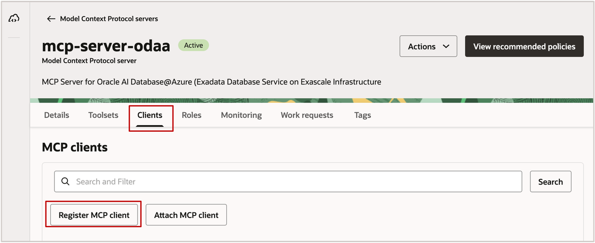

8. Enter a client name.

    ``` text
    <copy>mcp-client</copy>
    ```

9. Enter a description.

    ``` text
    <copy>MCP client registration for the Private Agent Factory workshop agent</copy>
    ```

10. Select the client type and OAuth configuration specified for the
    workshop.

11. Complete the client registration.

    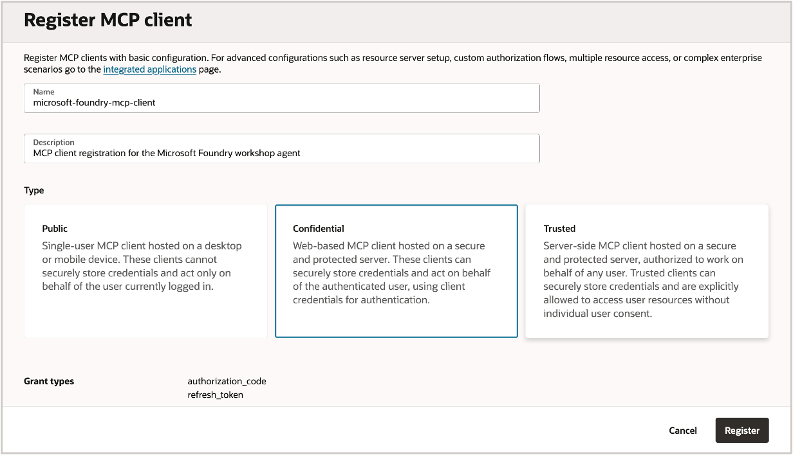

12. Open the registered client.

13. On **Registration Details**, record the following values for Lab 2:

    -   **Server URL**
    -   **Client ID**
    -   OAuth authorization and token information required by the selected
    client type

    > **Important:** Do not share client secrets, access tokens, Personal Access Tokens, or other authentication credentials.

### **Verify Access Requirements**

Before an MCP client can successfully invoke a tool, all of the
following authorization layers must be satisfied:

``` text
1. The client authenticates through the MCP Server's IAM Identity Domain.
2. The authenticated identity has the required MCP application role.
3. OCI IAM policy permits invocation of the MCP Server.
4. The MCP Server/Connection runtime principal can access required OCI resources.
5. The Database Tools Connection can connect to Oracle AI Database.
6. The database user has the privileges required by the invoked MCP tool.
    ```

    You have now configured the managed Oracle MCP Server and the identity,
    policy, role, and toolset layers required for an MCP client to access
    Oracle AI Database.

## Summary

In this lab, you:

-   Reviewed how OCI IAM Identity Domains secure Database Tools MCP
    Servers.
-   Created IAM Identity Domain groups for MCP access.
-   Created an OCI Database Tools managed MCP Server for Oracle AI
    Database.
-   Configured the MCP Server to use Resource Principal.
-   Mapped IAM Identity Domain groups to MCP application roles.
-   Configured OCI IAM policies for MCP invocation and
    resource-principal access.
-   Created a Built-in SQL tools MCP toolset.
-   Reviewed a more restrictive Custom SQL tool pattern.
-   Validated the MCP Server configuration.
-   Registered an MCP client and recorded the information required for
    MCP client.

In the next lab, you will add the Oracle MCP Server as a tool and build an agent that uses the MCP tools to retrieve live information from Oracle AI Database.

## Learn More

-   [Database Tools MCP Server
    Overview](https://docs.oracle.com/en-us/iaas/database-tools/doc/mcp-servers.html)
-   [Tutorial: Set Up a Database Tools MCP Server and Integrate with an
    MCP
    Client](https://docs.oracle.com/en-us/iaas/database-tools/doc/tutorial.html)
-   [Creating a Database Tools MCP
    Server](https://docs.oracle.com/en-us/iaas/database-tools/doc/creating-mcp-server.html)
-   [IAM Domains and Model Context Protocol
    Server](https://docs.oracle.com/en-us/iaas/database-tools/doc/iam-domains.html)
-   [Database Tools MCP Server
    Policies](https://docs.oracle.com/en-us/iaas/database-tools/doc/policies-mcp-server.html)
-   [Application
    Roles](https://docs.oracle.com/en-us/iaas/database-tools/doc/application-roles.html)
-   [Database Tools MCP
    Toolsets](https://docs.oracle.com/en-us/iaas/database-tools/doc/database-tools-mcp-toolsets.html)

-   [Creating a Database Connection](https://docs.oracle.com/en-us/iaas/database-tools/doc/creating-connection.html).

## Acknowledgements

**Authors**

*   Leo Alvarado, Tammy Bednar, Product Management, Oracle Database Cloud Services, Multicloud

**Last Updated Date** - September, 2026
