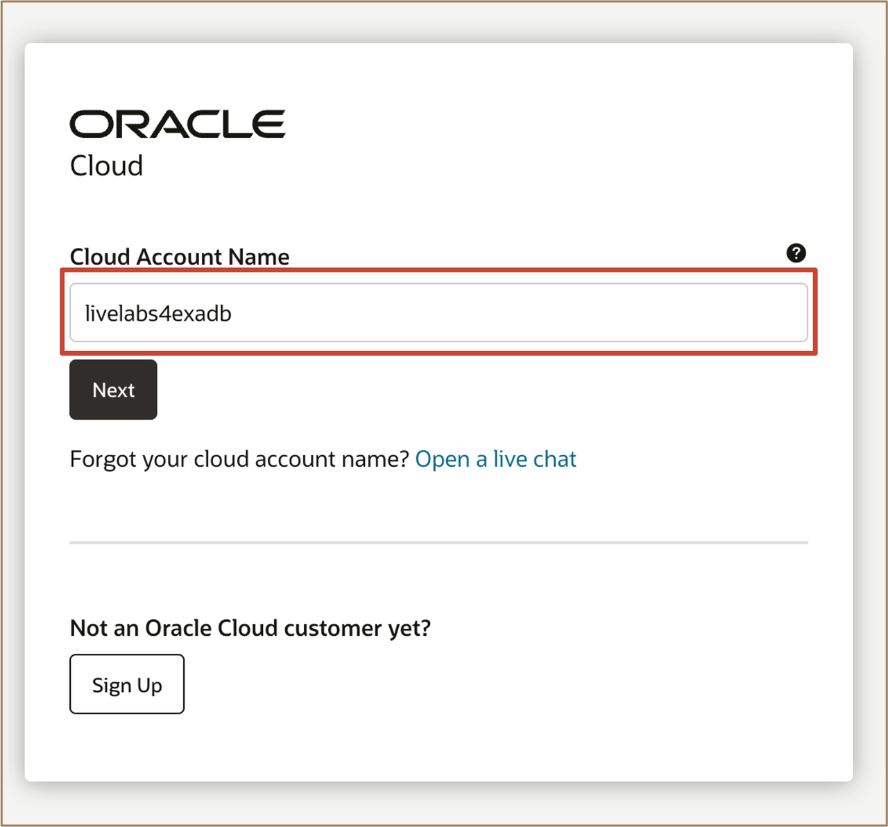
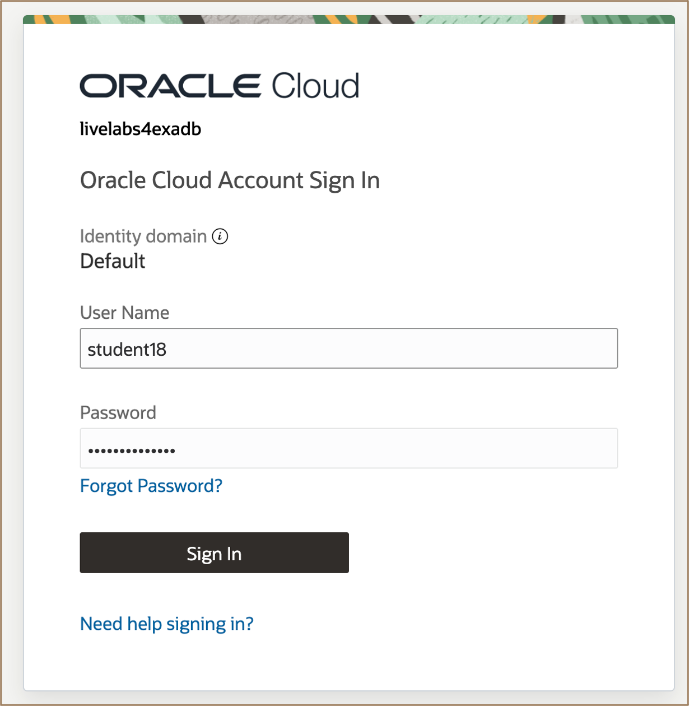
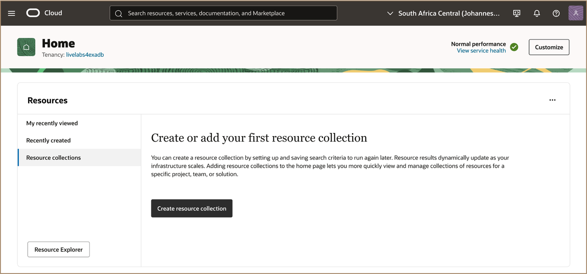

# Get Started

## Introduction

In this lab, you will login to your OCI environment to launch the Oracle AI Database Private Agent Factory.

**Estimated Time:** ***3 minutes***

<u>**Types of Cloud Accounts that can be used for this workshop:**</u>

   * ***Customer Tenancy (Paid)***: When your tenancy is provisioned, the default administrator receives a welcome email with the sign-in URL and credentials. The administrator can then create users and assign access using Identity and Access Management (IAM).
    
    * Ensure your tenancy has access to the required regions and service limits
    * Contact your administrator if you need credentials or permissions

   * ***Oracle-Provided Workshop Environment***: This is a temporary OCI environment provided by Oracle for training and workshop purposes. Access is typically granted through an event or workshop code, coordinated by your Oracle Sales Engineer or event organizer.
    
    * Preconfigured environment with required permissions
    * No setup required
    * Time-limited access

### Objectives
* Understand prerequisites and gather required information for installation

## Task 1: Log in to Oracle Cloud Tenancy

1. Go to [<u>**cloud.oracle.com**</u>](https://cloud.oracle.com/?region=af-johannesburg-1&tenant=livelabs4exadb) and enter your **Cloud Account Name** *(**OCI Tenancy**)*. 

    

2. Enter your assigned **username** and **password** and click **Sign In** 

    

3. You are now signed in to Oracle Cloud! 
   
    

4. Select the **South Africa Central** Region.

You may now **proceed to the next lab**

## Acknowledgements

**Authors** 

* Leo Alvarado, Vishal Patil, Tammy Bednar, Product Management, Oracle Database Cloud Services, Multicloud 

**Last Updated Date** - April, 2026
