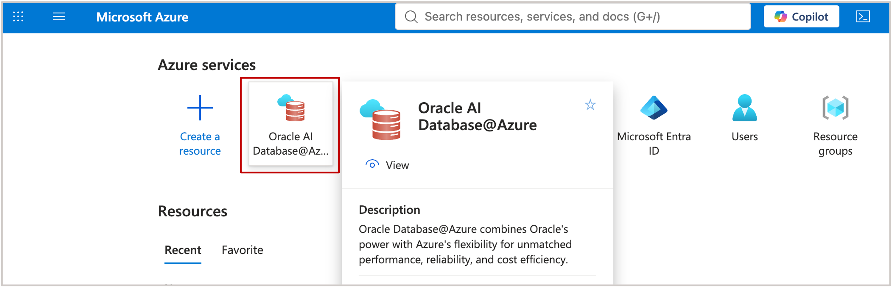
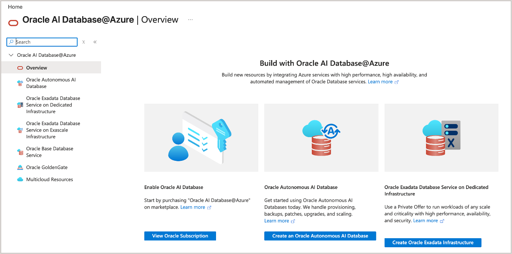

# Get Started

## Introduction

In this lab, you will log in to your ***Azure Regular Account*** to complete the hands-on exercises.

**Estimated Time:** ***3 minutes***

<u>**Types of Cloud Accounts that can be used for this workshop:**</u>

   * ***Customer Tenancy (Azure Regular Account)***: When your tenancy is provisioned, The administrator can then create users and assign access using Azure Identity and Access Management.
    
    * Ensure your tenancy has access to the required regions and service limits
    * Contact your administrator if you need credentials or permissions

   * ***Oracle-Provided Workshop Environment (Azure Event Account)***: This is a temporary multicloud environment provided by Oracle for training and workshop purposes. Access is typically granted through an event or workshop code, coordinated by your Oracle Sales Engineer or event organizer.
    
    * Preconfigured environment with required permissions
    * No setup required
    * Time-limited access

### Objectives
* Log in to your Oracle AI Database@Azure Environment to complete the hands-on exercises.

## Task 1: Log in to your Azure Account

1. Login to your Azure Account.
   
2. Enter your **email address** or **username**, then click **Next**.
   
3. Type your password, then click **Sign in**. 
   
4. Complete any Multi-Factor Authentication (MFA) prompts if required.
   
5. Navigate to your **Oracle AI Database@Azure** environment.
   
   

   

You may now **proceed to the next lab**

## Acknowledgements

**Authors** 

* Leo Alvarado, Tammy Bednar, Product Management, Oracle Database Cloud Services, Multicloud 

**Last Updated Date** - August, 2026
