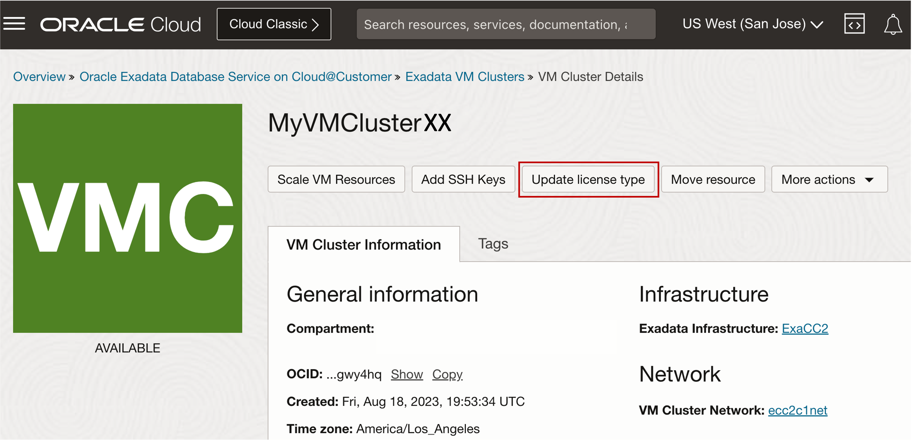

# Change License Type using OCI Console

## Introduction

This lab walks you through the steps to Change License Type using OCI Console.

Estimated Lab Time: 15 minutes

<!-- Watch the video below for a quick walk-through of the lab.
[Create an Exadata Database Service on Cloud@Customer Infrastructure](youtube:DCrivNA5bs8)
-->
### Objectives

-   After completing this lab, you should be able to Change License Type using OCI Console

### Prerequisites

This lab requires completion of the following:

* Completion of **Lab4**

## Task 1: Change License Type using OCI Console 

1. Open the navigation menu. Under **Oracle Database**, click **Exadata Database Service on Cloud@Customer**.
   
2. Select your ***Assigned Compartment***, and Click your assigned **VM Cluster** named ***MyVMClusterXX***.
   
3. In the VM Cluster Details page, Click **Update License Type** 
   
   

4. Change the license type from **Bring Your Own License (BYOL)** to ***License Included***
   
   
   
5. Click **Save Changes**

You may now **proceed to the next lab**

## Learn More

* Click [here](https://docs.oracle.com/en/engineered-systems/exadata-cloud-at-customer/ecccm/ecc-provisioning.html#GUID-4CB5B5E1-E853-4CA2-B43D-54CD18A8F28A) to learn more about Creating Infrastructure resource for Exadata Database Service on Cloud@Customer.

## Acknowledgements

* **Author** - Leo Alvarado, Eddie Ambler, Product Management

* **Contributors** - Tammy Bednar, Product Management

* **Last Updated By** - Leo Alvarado, Product Management, April 2023.
