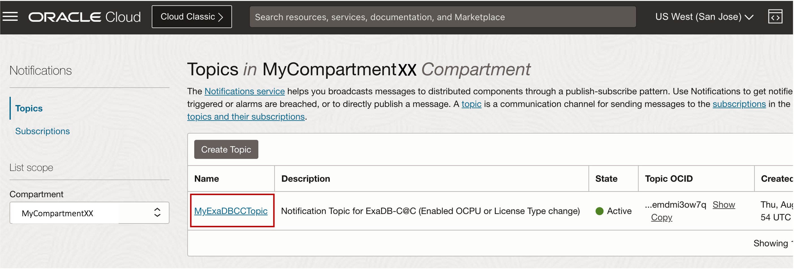
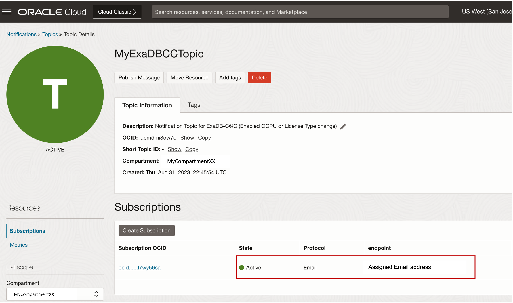

# Configure Notifications for Enabled OCPU or License Type change

## Introduction

This lab walks you through the steps to configure notifications to get notified for VM Cluster Event Types such as Enabled OCPU or License Type change.

Estimated Lab Time: 15 minutes

<!-- Watch the video below for a quick walk-through of the lab.
[Create an Exadata Database Service on Cloud@Customer Infrastructure](youtube:DCrivNA5bs8)
-->
### Objectives

-   After completing this lab, you should be able to configure notifications and events rules for Exadata Database Service on Cloud@Customer

### Prerequisites

This lab requires completion of the following:

* Completion of **Lab3**

## Task 1: Configure Notification Topic and Subscription for Enabled OCPU or License Type change

1. Open the navigation menu and click **Developer Services**. Under **Application Integration**, click **Notifications**.
   
   

2. **Topics** page is selected by default, select your ***Assigned Compartment*** and Click **Create Topic**.
   
   

3. Provide the Topic name. For this lab, use ***MyExaDBCCTopic*** for the Topic name. 
   
   
   
4. Click **Create**.
   
   

   Once Topic has been created you will see the created Topic with the state of ***Active***

   

5. Click the name of the Topic you created to open the **Topic Details** page 
   
   

6. On the Topic Details page, click **Create Subscription**.
   
   

7. In the Create Subscription panel, for **Protocol**, select ***Email***. Provide your ***assigned Email Address*** then Click **Create**
   
   

    >**Note:** Notifications creates the email subscription and sends a confirmation URL to your assigned email address. 
   
   The subscription is ***pending*** until confirmation is received

   

8. Open your assigned Email, Check for the ***OCI Notifications Service Subscription Confirmation*** email and Click on the ***Confirm subscription*** link
   
   

   By clicking the confirmation link, it will launch a browser displaying subscription has been confirmed and that you have subscribed your assigned Email to the Topic you have selected. 

   

   You can now see the subscription is now ***Active*** 

    

## Task 2: Create Events Rule to create notification automation based on Enabled OCPU or License Type change 

1. Open the navigation menu and click **Observability & Management**. Under **Events Service**, click **Rules**.
    
    

2. Select your ***Assigned Compartment*** and Click **Create Rule**
   
    

3. In the Create Rule panel, provide the Rule name. For this lab, use ***MyExaDBCCEventsRule***.
   
    

4. Configure **Rule Conditions**:
   
      * In the **Rule Conditions** section, For Condition, Select ***Event Type***. 
      * For **Service Name**, select ***Database*** 
      * For **Event Type**, Select ***VM Cluster - Update Begin*** and ***VM Cluster - Update End***
    
    

5. Configure **Actions**:
   
      * In the **Actions** section, For **Action Type**, Select ***Notifications***. 
      * For **Notifications Compartment**, select your ***Assigned Compartment*** 
      * For **Topic**, Select ***MyExaDBCCTopic*** 
  
    

6. Click **Create Rule**
   
    

You may now **proceed to the next lab**

## Learn More

* Click [here](https://docs.oracle.com/en/engineered-systems/exadata-cloud-at-customer/ecccm/ecc-provisioning.html#GUID-4CB5B5E1-E853-4CA2-B43D-54CD18A8F28A) to learn more about Creating Infrastructure resource for Exadata Database Service on Cloud@Customer.

## Acknowledgements

* **Author** - Leo Alvarado, Eddie Ambler, Product Management

* **Contributors** - Tammy Bednar, Product Management

* **Last Updated By** - Leo Alvarado, Product Management, September 2023.
