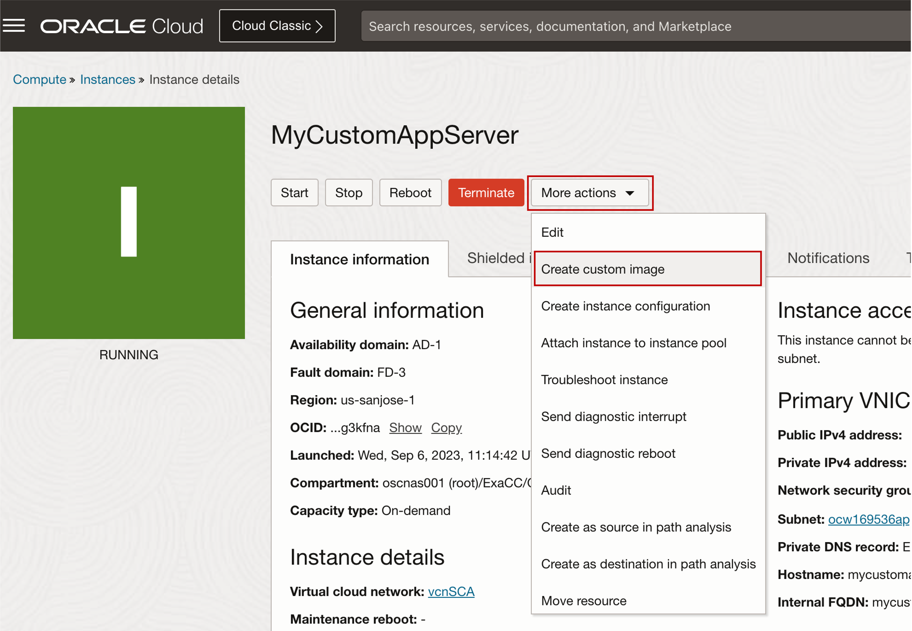
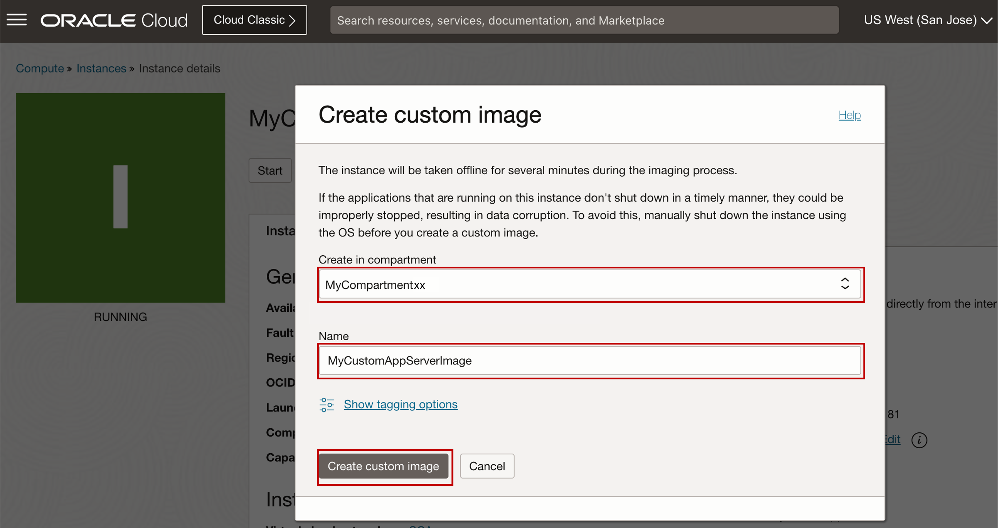
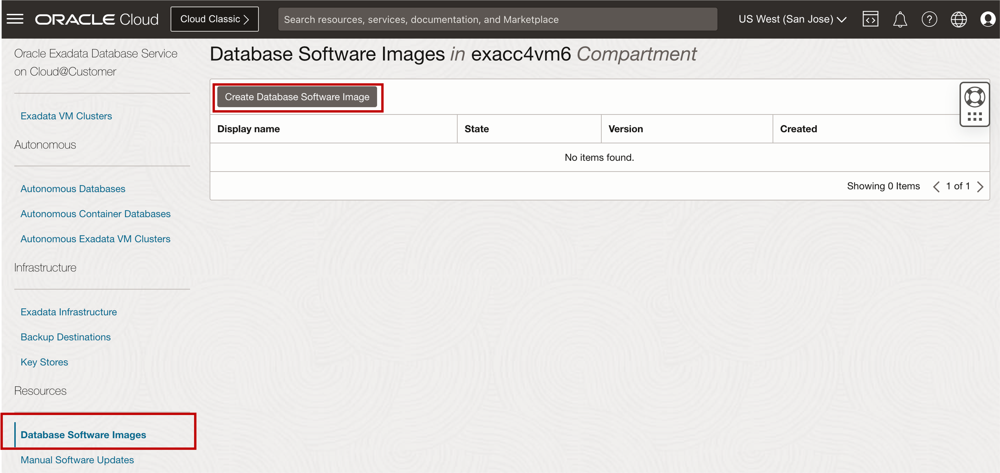
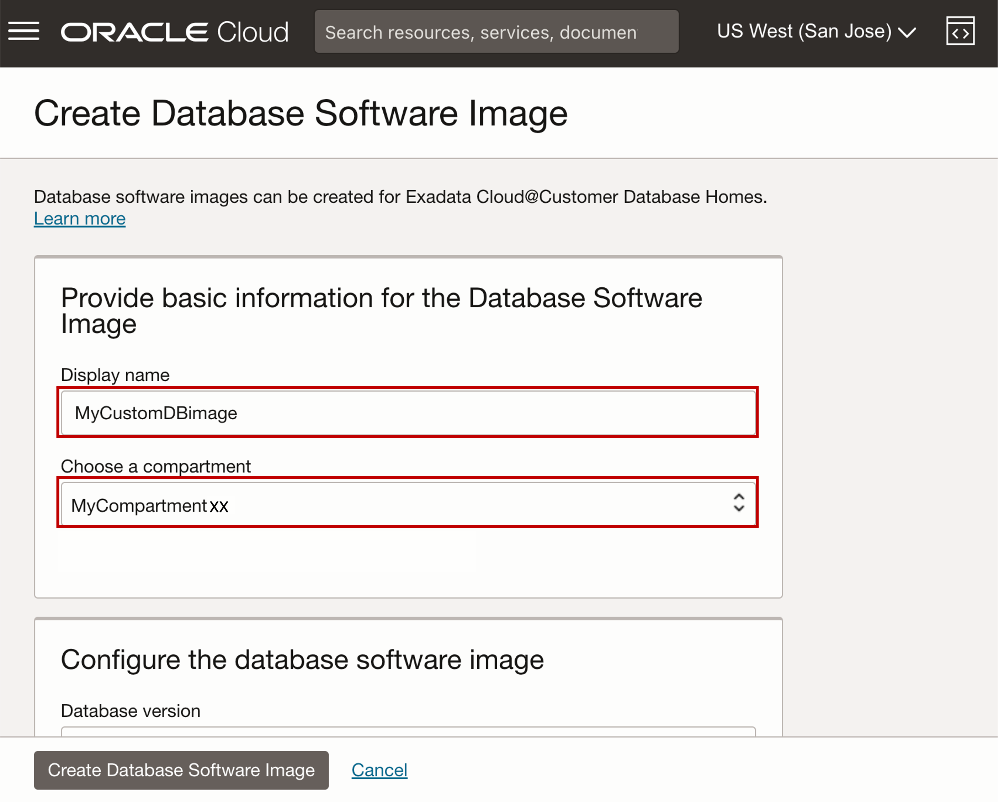
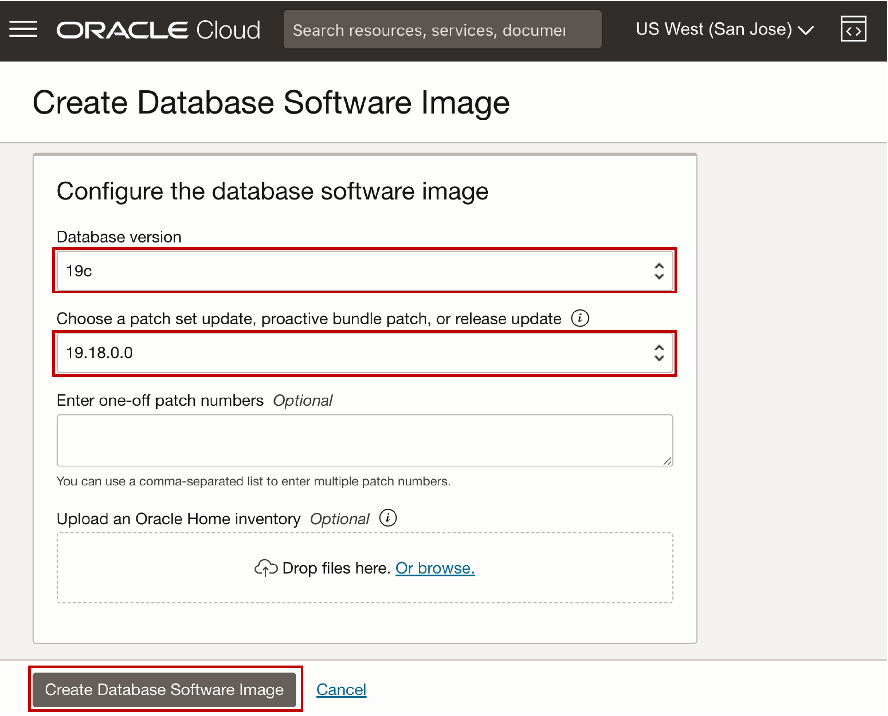

# Create Application and Database Custom Image using OCI Console

## Introduction

This lab walks you through creating Application and Database Custom Image using the OCI Console. 
 
  * **Database software images** are resources containing Oracle Database software used to provision and patch Oracle Databases and Oracle Database Homes.
  * **Database software images** are either **Oracle-published software releases** or **custom software images you create**.
  * **Custom Database Software Images** include specified patches and updates that meet your organization's standards.

Estimated Time: 10 minutes

Watch the video below for a quick walk-through of the lab.
  [Create a Custom Database Software Image](youtube:jwxxIih3brQ)

### Objectives

-   After completing this lab, you should be able to create application and database custom image using the OCI Console.

### Prerequisites

This lab requires the completion of the following:

* Completion of **Lab1**

## Task 1: Create Application Custom Image using OCI Console

1. Open the navigation menu and click **Compute**. Under Compute, click **Instances**.

  

2. In the left rail, **Instances** is selected by default. Select your assigned compartment named ***MyCompartmentXX***. 
   
   Click on the name of your **Assigned Custom Application Server** named ***MyCustomAppServer***.

  

3. Click **More Actions**, and then click **Create custom image**.

  

4. In the **Create in compartment** list, Select your assigned compartment ***MyCompartmentXX***
   
   Enter a **Name** for the image. For this lab, use the name ***MyCustomAppServerImage***

   

5. Click **Create custom image**.

## Task 2: Create Custom Database Software Image using OCI Console

1. Open the navigation menu. Under **Oracle Database**, click **Exadata Database Service on Cloud@Customer**.

2. Under **Resources**, click **Database Software Images**.

3. Click **Create Database Software Image**.

    

4. In the **Display name** field, provide a name for your database software image. For this lab, use the name ***MyCustomDBimage***
   
5. Choose your **assigned compartment** ***MyCompartmentXX***. 
   
    

6. Choose the **Database version** for your image. For this workshop, select the ***19c*** version.

7. Choose the **patch set update, proactive bundle patch, or release update**. For this workshop, choose ***19.18.0.0***

8. Click **Create Database Software Image**.

    

You may now **proceed to the next lab**. 

<!--
## Learn More

* Click [here](https://docs.public.oneportal.content.oci.oraclecloud.com/en-us/iaas/exadata/doc/ecc-create-first-db.html) to learn more about Creating an Oracle Database on Exadata Database Service.

-->

## Acknowledgements

* **Author** - Leo Alvarado, Eddie Ambler, Product Management

* **Contributors** - Tammy Bednar, Product Management

* **Last Updated By** - Leo Alvarado, Product Management, September 2023.
