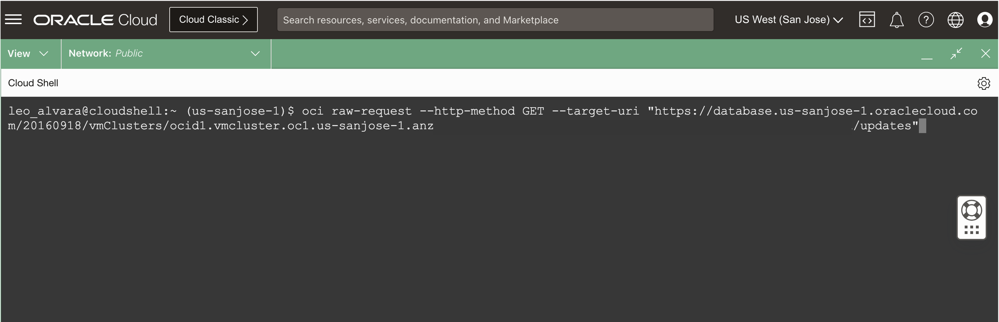

# Discover Environment Details using REST API


## Introduction

Any operation that you can do with the web console, you can also do with a corresponding REST API. Like the web console, the REST APIs transit the Internet via HTTPS, requiring no special software to be installed on the local system. The Oracle Cloud Infrastructure APIs are typical REST APIs that use HTTPS requests and responses.

This lab walks you through the steps to discover Exadata Database Service on Cloud@Customer environment details using REST API.

Estimated Time: 10 minutes

### Objectives

-   After completing this lab, you should be able to discover Exadata Database Service on Cloud@Customer environment details using REST API.


### Prerequisites

This lab requires the completion of the following:

* Completion of **Lab6**

## Task 1: List the available Database Homes in a compartment using REST API

1. Open the Cloud Shell. This displays the Cloud Shell at the bottom of the console:

   


2. Make an OCI REST API call to get a list of available Database Homes in a compartment by running the **OCI RAW-REQUEST** command below:
   
    > **Note:** Replace the API endpoint region "***{region}***" with your **assigned region** and ***"{CompartmentOCID}"*** with the **Compartment OCID** obtained from ***Lab6***.
   
      ```
      <copy>

          oci raw-request --http-method GET --target-uri "https://database.us-{region}-1.oraclecloud.com/20160918/dbHomes?compartmentId={CompartmentOCID}&lifecycleState=AVAILABLE&limit=10"

      </copy>
      ```
3. You will see a similar output as below. Having a Response ***"status": "200 OK"*** means the request was successfully received and was able to get a list of all available DB Homes in the specified compartment.
   
   

   Look for the Database Home with the **displayName** named ***MyCustomDBHome***. 
   
   Observe the following objects and values from the API response such as: 
   
      * ***databaseSoftwareImageId*** - If this field is populated then this is the **Custom Database Software Image** used for the Database Home  
      * ***dbVersion*** - The **Database Version** of the Database Home


## Task 2: List all the Container Databases in a Compartment

1. From the Cloud Shell terminal, run the **OCI CLI command** below to get a list of the Container Databases in a Compartment.
   
    > **Note:** Replace the ***"{CompartmentID}"*** with the **Compartment OCID** used in ***Task 1***
   
      ```
        <copy>

          oci db database list --compartment-id {CompartmentID}  --query "data[*].{ContainerDatabase:\"db-name\",ContainerDatabaseOCID:id,State:\"lifecycle-state\"}" --output table

        </copy>
      ```

2. You will see a similar output as below. Copy the **Container Database OCID** value and paste it in your notepad or text editor. 
   
   

## Task 3: List all the Pluggable Databases in a Container Database using REST API

1. From the Cloud Shell terminal, make an OCI REST API call to get a list of the Pluggable Databases in a Container Database by running the **OCI RAW-REQUEST** command below:
   
    > **Note:** Replace the API endpoint region "***{region}***" with your **assigned region** and ***"{ContainerDatabaseOCID}"*** with the **Container Database OCID** obtained from ***Task 2***
   
      ```
        <copy>

          oci raw-request --http-method GET --target-uri "https://database.us-{region}-1.oraclecloud.com/20160918/pluggableDatabases?databaseId={ContainerDatabaseOCID}&limit=10"

        </copy>
      ```

2. You will see a similar output as below. Having a Response ***"status": "200 OK"*** means the request was successfully received and was able to get a list of all the pluggable databases in the specified container database. 
   
3. Copy the **PDB OCID** value from the **"id"** field and paste it in your notepad or text editor. 

    

    
## Task 4: Clone and start a pluggable database (PDB) in the same database (CDB) using REST API

1. From the Cloud Shell terminal, create the JSON file for the REST API request body that contains the local clone pluggable database details resource.

   For this lab, the JSON file is pre-created; you can view the local clone pluggable database details by reading the JSON file.
   
    ```
      <copy>

        cat MyClonePDB.json

      </copy>
      ```
    

2. Make an OCI REST API call to clone and start a pluggable database (PDB) in the same container database (CDB) by running the **OCI RAW-REQUEST** command below:
   
    > **Note:** Replace the API endpoint region "***{region}***" with your **assigned region** and ***"{pluggableDatabaseID}"*** with the **Pluggable Database OCID** copied from ***Task3 Step 3***
   
      ```
      <copy>

        oci raw-request --http-method POST --target-uri "https://database.us-sanjose-1.oraclecloud.com/20160918/pluggableDatabases/{pluggableDatabaseID}/actions/localClone" --request-body file://MyClonePDB.json

      </copy>

      ```

   
   
3. You will see a similar output as below; you will see that the local clone pluggable database is on a lifecycle state of **PROVISIONING**

  


## Task 5: Discover Exadata VM Cluster Details using REST API

1. Open the Cloud Shell. This displays the Cloud Shell at the bottom of the console.

   

2. Make an OCI REST API call to get Exadata VM Cluster details by running the **OCI RAW-REQUEST** command below. 
   
    > **Note:** Replace the ***"{VMClusterOCID}"*** with the **VM Cluster OCID** copied from ***Lab 6 (Task 1 step 2)***


    ```
    <copy>

      oci raw-request --http-method GET --target-uri "https://database.us-sanjose-1.oraclecloud.com/20160918/vmClusters/{VMClusterOCID}"

    </copy>
    ```
    

    You will see a similar output below; pay attention to the **cpusEnabled** field.

    ```
    <copy>
    {
  "data": {
    "availabilityDomain": "cuGa:US-SANJOSE-1-AD-1",
    "compartmentId": "ocid1.compartment.oc1.....",
    "cpusEnabled": 4,
    "dataCollectionOptions": {
      "isDiagnosticsEventsEnabled": true,
      "isHealthMonitoringEnabled": true,
      "isIncidentLogsEnabled": true
    },
    
  "status": "200 OK"
}
  </copy>
    ```


## Task 6: List the Maintenance Updates that can be applied to the specified VM Cluster using REST API

1. Make OCI REST API call to list maintenance updates that can be applied to the specified VM Cluster by running the **OCI RAW-REQUEST** Command below.
   
    > **Note:** Replace the ***"{VMClusterOCID}"*** with the **VM Cluster OCID** copied from ***(Lab 6 Task 1 step 2)***


      ```
      <copy>

        oci raw-request --http-method GET --target-uri "https://database.us-sanjose-1.oraclecloud.com/20160918/vmClusters/{VMClusterOCID}/updates"

      </copy>
      ```
    

    

    You will see a similar output as below. Having a Response ***"status": "200 OK"*** means the request was successfully received and was able to get a list of all the maintenance updates that can be applied to the specified VM Cluster using REST API

    ```
    <copy>

    {
  "data": [
    {
      "availableActions": [
        "ROLLING_APPLY",
        "PRECHECK"
      ],
      "description": "Virtual Machine OS Update 22.1.11.0.0.230516",
      "id": "ocid1.dbupdate.oc1.us-sanjose-1....",
      "lastAction":,
      "lifecycleDetails":,
      "lifecycleState": "AVAILABLE",
      "timeReleased": "2023-06-06T19:15:24.842Z",
      "updateType": "OS_UPDATE",
      "version": "22.1.11.0.0.230516"
    }
  ],
  "headers": {
    
  },
  "status": "200 OK"
}

    ```
    </copy>

You may now **proceed to the next lab**.

## Acknowledgements

* **Author** - Leo Alvarado, Eddie Ambler, Product Management

* **Contributors** - Tammy Bednar, Product Management

* **Last Updated By** - Leo Alvarado, Product Management, September 2023.
