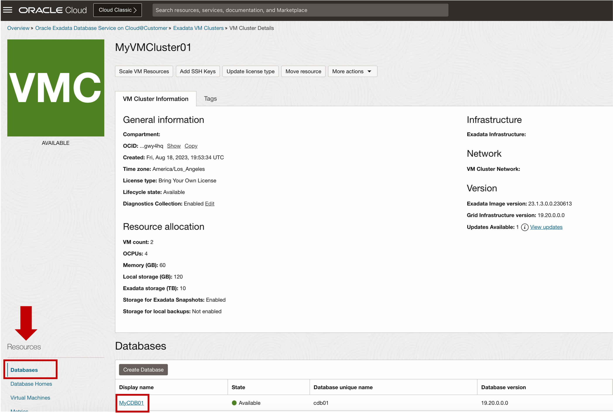
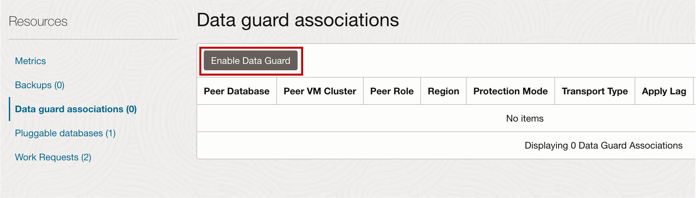
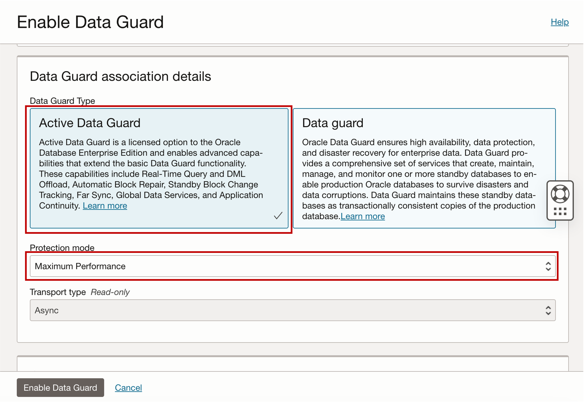

# Enable Data Guard using OCI Console

## Introduction

This lab walks you through the steps to Enable Data Guard using OCI Console.

Estimated Lab Time: 15 minutes

<!-- Watch the video below for a quick walk-through of the lab.
[Create an Exadata Database Service on Cloud@Customer Infrastructure](youtube:DCrivNA5bs8)
-->
### Objectives

-   After completing this lab, you should be able to Enable Data Guard using OCI Console

### Prerequisites

This lab requires completion of the following:

* Completion of **Lab1**

## Task 1: Enable Data Guard using OCI Console

1. In the Breadcrumb link, Click on **Oracle Exadata Database Service on Cloud@Customer**. 
   
   
   
2. In the left rail, **Exadata VM Clusters** is selected by default. Select your assigned Compartment ***MyCompartmentXX*** then Click on the name of your assigned VM Cluster ***MyVMClusterXX***.
   
   

3. On the left rail, under **Resources** of the VM Cluster details page, select **Databases** and from the list of the displayed databases click the container database named ***MyCDB01***. 
   
   

4. In the Container Database details page, under **Resources**, click **Data Guard Associations**.
   
   

5. Click **Enable Data Guard**. 

   

   In the Enable Data Guard page, configure your Data Guard association.
    
    **Select Peer VM Cluster**: 

       * **Peer Region**: Select ***US East (Ashburn)*** for the peer region.
  
         >**Note:** The primary and standby databases could be running on two different VM clusters on a shared ExaDB-C@C system or on two geographically separated ExaDB-C@C systems managed from the same or different Oracle Cloud Infrastructure regions. For this lab, the primary and standby database will be running on a shared ExaDB-C@C system on the same region.
    
       * **Exadata Cloud@Customer Infrastructure**: Select the Exadata Database Service on Cloud@Customer infrastructure where the standby database is located. Click the **Change Compartment** hyperlink and select ***OCW23ExaDBCC*** for the compartment. Select ***osc-rst-exacca*** for the Exadata Cloud@Customer Infrastructure
    
       * **Peer VM Cluster**: Select the Exadata VM Cluster that contains the standby database. Click the **Change Compartment**, select ***MyStandByCompartment*** then select ***MyStandbyVMCluster*** for the Peer VM Cluster
  
   
    
    **Data Guard Assocation Details:**
    
       * **Select the Data Guard type**: Select Active Data Guard or Data Guard. For this lab, select ***Active Data Guard***
    
       * **Protection mode**: Select a protection mode the Data Guard association. For this lab, select ***Maximum Performance***

   

    **Choose Database Home**: Choose ***Select an existing Database Home*** then select ***MyStandbyDBHome*** for the Database Home.

  
   

    **Configure standby database**: Provide the unique name for the standby database. 
    
       * Provide the **Database password**. For this lab, use the assigned password **Pass4-Student*XX*#** 

6. Click **Enable Data Guard**.

   
   
   The Data Guard Association process will run in the background. When the association is created, the details for a database and its peer display their respective roles as ***Primary*** or ***Standby***.
  

You may now **proceed to the next lab**

## Learn More

* Click [here](https://docs.oracle.com/en/engineered-systems/exadata-cloud-at-customer/ecccm/ecc-provisioning.html#GUID-4CB5B5E1-E853-4CA2-B43D-54CD18A8F28A) to learn more about Creating Infrastructure resource for Exadata Database Service on Cloud@Customer.

## Acknowledgements

* **Author** - Leo Alvarado, Eddie Ambler, Product Management

* **Contributors** - Tammy Bednar, Product Management

* **Last Updated By** - Leo Alvarado, Product Management, April 2023.
