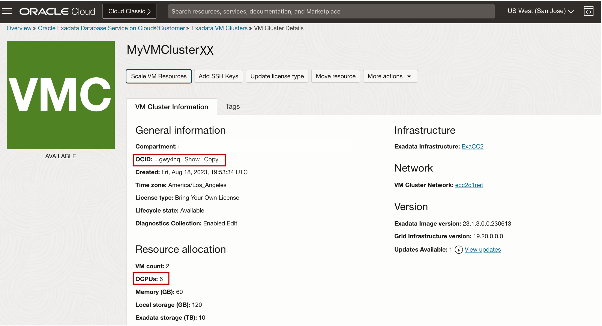
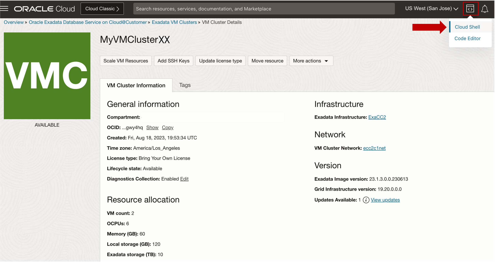
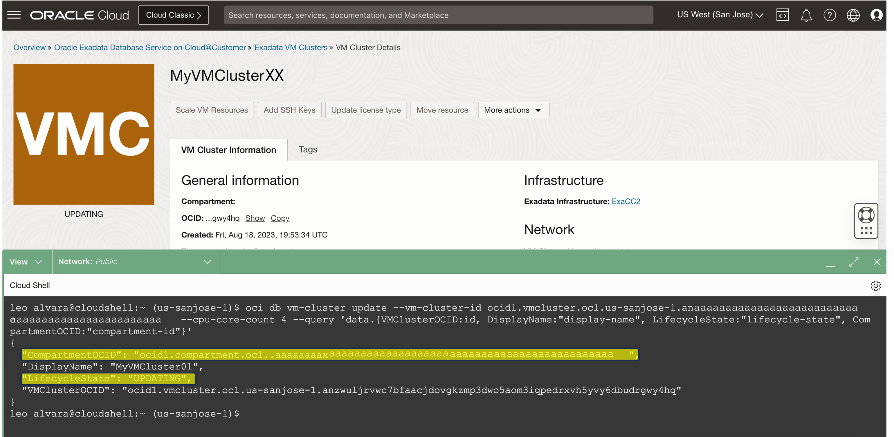

# Scale Exadata VM Cluster Resources using OCI CLI


## Introduction

The OCI CLI is a small footprint tool that you can use on its own or with the Console to perform Database Cloud Services resource tasks and other OCI tasks. The CLI provides the same core functionality as the Console, plus additional commands. Some of these, such as the ability to run scripts, extend the Console's functionality.

**Cloud Shell**: The CLI is pre-configured with your credentials and ready to use immediately from within Cloud Shell. 

**Oracle Linux Cloud Developer image**: The CLI is pre-installed on the Oracle Linux Cloud Developer platform image. For more information.

The CLI is built on the Oracle Cloud Infrastructure SDK for Python and runs on Mac, Windows, or Linux. The Python code makes calls to Oracle Cloud Infrastructure APIs to provide the functionality implemented for the various services. These are REST APIs that use HTTPS requests and responses.

This lab walks you through the steps to Scale the Exadata VM Cluster OCPU resource using OCI CLI.

Estimated Time: 10 minutes

<!-- Watch the video below for a quick walk-through of the lab.
[Create Oracle Database](youtube:JJ4Wx0l0gkc)
-->
### Objectives

-   After completing this lab, you should be able to scale Exadata VM Cluster OCPU resource using OCI CLI


### Prerequisites

This lab requires the completion of the following:

* Completion of **Lab5**


## Task 1: Scale Exadata VM Cluster OCPU using OCI CLI

1. Open the navigation menu. Under **Oracle Database**, click **Exadata Database Service on Cloud@Customer**.
   
   

2. In the left rail, **Exadata VM Clusters** is selected by default. Select your assigned Compartment ***MyCompartmentXX***. 
   
   Click on the name of your assigned VM Cluster ***MyVMClusterXX***. The VM Cluster Details page displays information about the selected VM cluster. 
    
   Under the **General Information**, In the OCID Field. Click on **Show** to display the VM Cluster OCID, and Click on **Copy** and paste the **VM Cluster OCID** to your notepad or text editor.

   Under the **Resource allocation**, pay attention to the number of ***OCPUs:*** which has the value of ***6***
  
   

3. To use OCI CLI for this lab, we will be using the ***Cloud OCI Shell tool***, where CLI is pre-configured with your credentials and ready to use immediately from within Cloud Shell in the OCI Web Console. 
   
   Click the Cloud Shell/Code Editor icon in the Console header and select Cloud Shell from the drop-down menu. 
   
   

   This displays the Cloud Shell in a "drawer" at the bottom of the console:

   

4. Run the OCI CLI Command to Scale down the **VM Cluster OCPU Resources** from **6 OCPUs** to **4 OCPUs**

      >**Note:** Replace ***{vmClusterId}*** with VM Cluster OCID copied from *(Task 1 Step 2)*

    ```
    <copy>

      oci db vm-cluster update --vm-cluster-id {vmClusterId} --cpu-core-count 4 --query 'data.{VMClusterOCID:id, DisplayName:"display-name", LifecycleState:"lifecycle-state", CompartmentOCID:"compartment-id"}'

    </copy>
    ```

  

   After running the command, you will see similar output below.

  

   While the scale up process is running, you can see the LifecycleState of the VM cluster is changed to ***Updating***. Copy the ***Compartment OCID*** from the extracted values of the OCI CLI command results and paste it in your notepad or text editor for later use.

You may now **proceed to the next lab**

## Learn More

* Click [here](https://docs.oracle.com/en/engineered-systems/exadata-cloud-at-customer/ecccm/ecc-provisioning.html#GUID-4CB5B5E1-E853-4CA2-B43D-54CD18A8F28A) to learn more about Creating Infrastructure resource for Exadata Database Service on Cloud@Customer.

## Acknowledgements

* **Author** - Leo Alvarado, Eddie Ambler, Product Management

* **Contributors** - Tammy Bednar, Product Management

* **Last Updated By** - Leo Alvarado, Product Management, April 2023.
