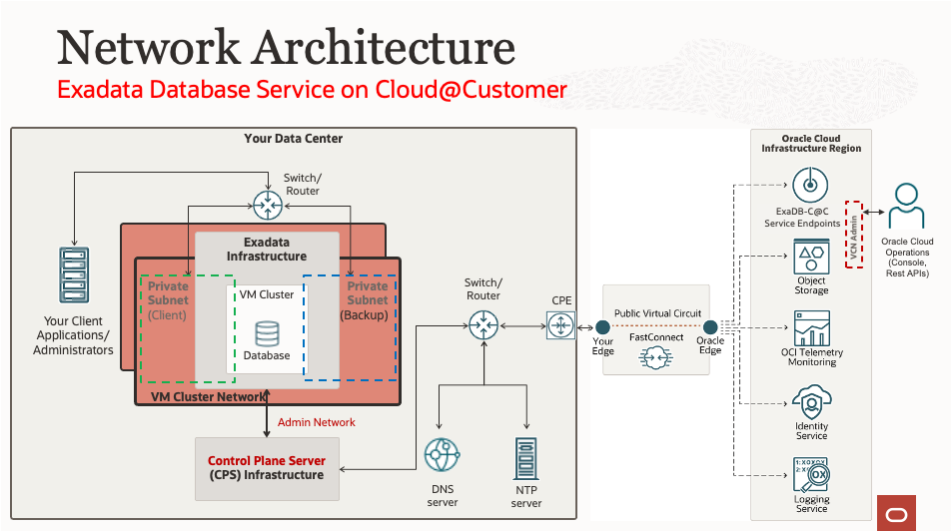

# Introduction

The labs in this workshop walk you through all the steps to get started using the Oracle Exadata Database Service to perform lifecycle tasks and procedures.

**What is an Oracle Exadata Database Service?**

Oracle Exadata Database Service is a high-performance co-managed Oracle Cloud Database service that allows organizations to run databases with extreme performance, availability, and security cost-effectively. Databases run faster and with fewer resources on scale-out Exadata infrastructure that includes unique optimizations for transaction processing, analytics, and mixed workloads. Online scaling of computing resources enables customers to quickly adjust consumption to match workload demands without interrupting operations, while efficient database consolidation further lowers total costs. Full compatibility with on-premises Oracle Database and Exadata environments makes it easy for customers to migrate workloads to the cloud.

Exadata Database Service allows you to leverage the power of Exadata in the cloud. Exadata Database Service’s scale-out architecture allows customers to provision more compute and storage independently easily, right-sizing their service to meet growing demands. Exadata Database Service offer RDMA over Converged Ethernet (RoCE) networking for high bandwidth and low latency, persistent memory (PMEM) modules, and intelligent Exadata software.

Built-in Oracle Maximum Availability Architecture (Oracle MAA) best practices increase database availability, Exadata Database Service reduces downtime and simplifies operational management with zero downtime maintenance, online scaling, and one-click provisioning of Oracle Real Application Clusters (Oracle RAC) and Oracle Active Data Guard using built-in cloud automation

**What is an Oracle Exadata Database Service on Cloud@Customer?**

Oracle Exadata Database Service on Cloud@Customer enables you to apply the combined power of Oracle Exadata and Oracle Cloud Infrastructure inside your own data center. You have full access to the features and capabilities of Oracle Database along with the intelligent performance and scalability of Oracle Exadata, but with Oracle owning and managing the Exadata infrastructure. You can use the Oracle Cloud Infrastructure console and APIs to manage Oracle Exadata Database Service on Cloud@Customer just as with any other cloud resource, while maintaining absolute sovereignty over your data.

Oracle Exadata Database Service on Cloud@Customer is the simplest way to move an organization’s business-critical Oracle Database workloads to the cloud. It simultaneously runs Oracle Exadata Database Service and the fully managed Oracle Autonomous Database Service inside customers’ data centers and behind their firewalls to help meet strict data residency and security requirements.

**Network Overview: Exadata Database Service on Cloud@Customer**

The Diagram outlines the high-level network architecture for Exadata Database Service on Cloud@Customer.

**Oracle Exadata Database Service on Cloud@Customer** provides the same user experience as Exadata Database Service on Dedicated Infrastructure with Oracle-owning and managing the infrastructure that is located in your data center.

On Exadata Cloud@Customer your client applications and administrators connect to your VM clusters and databases over the private client and backup subnets
that you access through a switch or router in your data center. These connections do not need fast connect, VPN, or a gateway to make their connections or guarantee bandwidth.
Since the Exadata Cloud@Customer system is physically installed in your data center and connected to your corporate network, the client and backup subnets are created in a component called the VM Cluster Network instead of inside of your cloud tenancy VCN.
It is worth noting that the Exadata Cloud@Customer infrastructure deployment is capable of  supporting multiple VM Cluster Networks.
However, each VM Cluster Network can only be associated to one VM Cluster.

On the diagram you will notice that the Exadata Database Service on Cloud@Customer also includes **Control Plane Server (CPS) infrastructure** that connects the Exadata Cloud@Customer deployment to an Oracle Cloud Infrastructure (OCI) region for cloud automation and administration.

The **Control Plane Network** is a virtual private network (VPN) that connects the two control plane servers that are located in the Exadata Cloud@Customer rack to Oracle Cloud Infrastructure.
The VPN connection facilitates secure customer-initiated operations using the Oracle Cloud Infrastructure Console and APIs.

It also facilitates secure monitoring and administration of the Oracle-managed infrastructure components in Exadata Cloud@Customer.

In order for the control plane to function, the control plane server must be able to connect to certain Oracle Cloud Infrastructure (OCI) addresses.
You must enable TCP port 443 outbound access endpoints in the region selected for the Exadata Cloud@Customer Infrastructure association.

Your data center connects to that OCI region to access Exadata Cloud@Customer service endpoints like Object Storage, OCI telemetry monitoring, identity service, and logging service.

The **Administration Network** connects Exadata Cloud@Customer servers and switches to the two control plane servers that are located in the Exadata Cloud@Customer rack.
It facilitates customer-initiated operations using the Oracle Cloud Infrastructure Console and APIs.
It also facilitates monitoring and administration of the Oracle-managed infrastructure components in Exadata Cloud@Customer.
This network is fully contained within the Exadata Cloud@Customer rack and does not connect to your corporate network.
However, the Exadata infrastructure is indirectly connected to your corporate network through the control plane servers to obtain Domain Name System (DNS) and Network Time Protocol (NTP) services to the Exadata Cloud infrastructure.
Therefore, the IP addresses that are allocated to the administration network must not exist elsewhere in your corporate network.

Oracle requires that you register the host names and IP addresses for the Exadata Cloud@Customer client and backup network interfaces in your corporate DNS.
As part of the deployment process, you will define the host names and IP addresses to be used for the various Exadata Cloud@Customer network interfaces.  
The Exadata Cloud@Customer deployment requires that at least one reliable DNS server be available and that it must be accessible to the control plane servers and to all of the servers on the client network.
You can register up to three DNS servers as part of the Exadata Cloud@Customer deployment to ensure coverage in case a server becomes unavailable.

Exadata Cloud@Customer uses your NTP service to ensure that all of the system components are synchronized to the same time.
The deployment will require that at least one reliable NTP server is available and is accessible to the control plane servers and to all of the servers on the client network.
You can register up to three NTP servers as part of the Exadata Cloud@Customer deployment to ensure coverage in case a server becomes unavailable.

The Oracle Cloud Operations team can use the OCI Console or REST APIs over an HTTPS or SSH connection to manage the infrastructure.
Their HTTPS connections travels to the infrastructure through the Oracle service tenancy via the admin VCN, and then through the persistent, secure automation tunnel.

These hands-on lab guides provide step-by-step directions to setting up and using your Exadata Database Service on Cloud@Customer

## Lab Breakdown

* Lab 1. Create Infrastructure Resource for Exadata Database Service on Cloud@Customer
* Lab 2. Create a VM Cluster Network
* Lab 3. Create a VM Cluster Resource for Exadata Database Service on Cloud@Customer
* Lab 4. Create an Oracle Database on Exadata Database Service     

## Learn More

* Click [here](https://docs.oracle.com/en/engineered-systems/exadata-cloud-at-customer/ecccm/ecc-whats-new-in-exadata-cloud-at-customer-gen2.html#GUID-2F27E5A9-67A8-459E-9453-81E1F68043DE) to learn about What's New in Exadata Database Service on Cloud@Customer.

## Acknowledgements

* **Author** - Leo Alvarado, Eddie Ambler, Product Management

* **Contributors** - Tammy Bednar, Product Management

* **Last Updated By** - Leo Alvarado, Product Management, April 2023.

**You are all set. Let us begin!**
