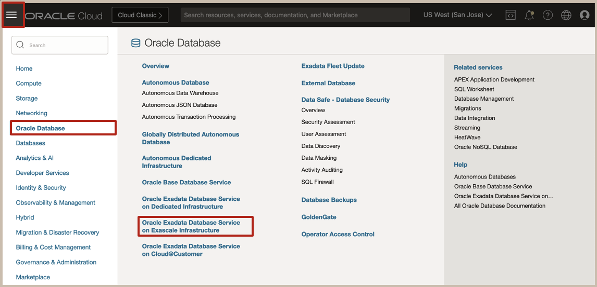
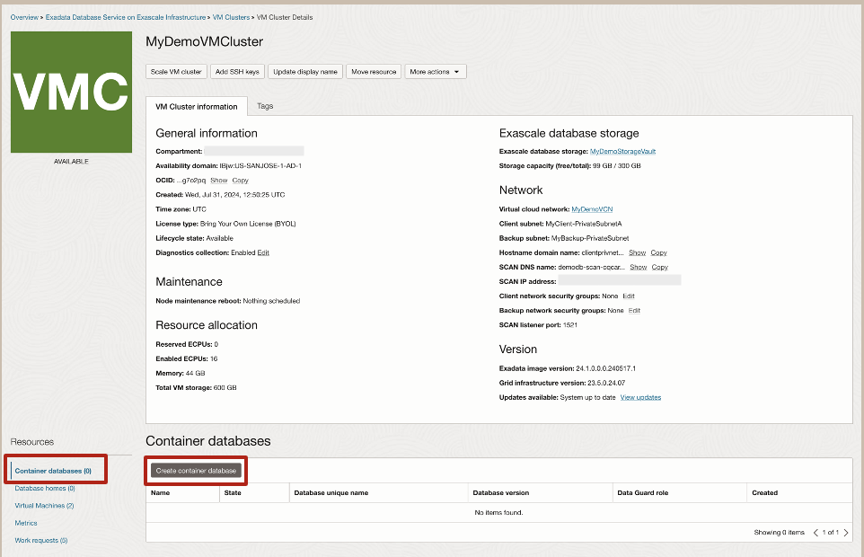
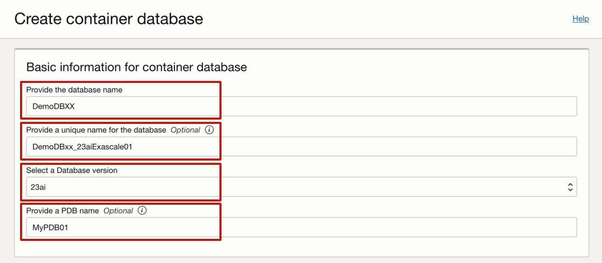
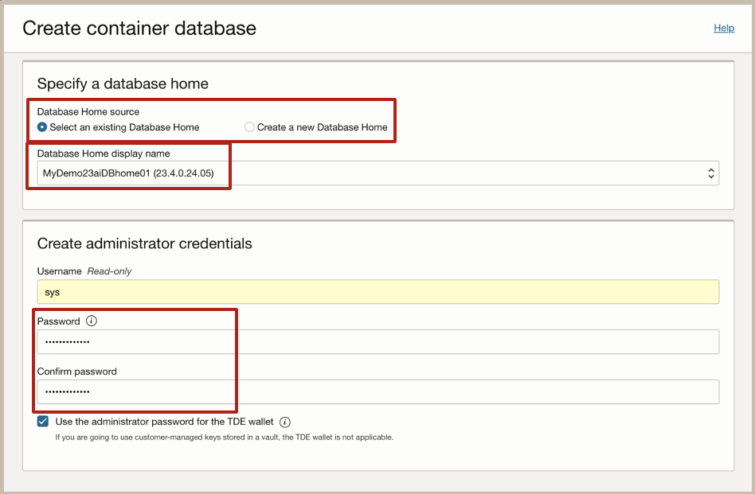
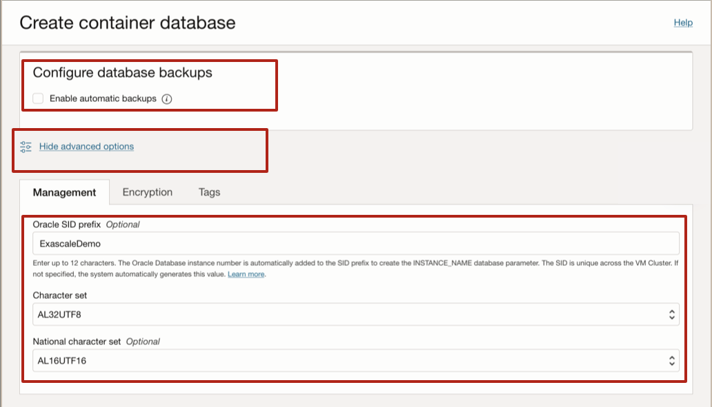
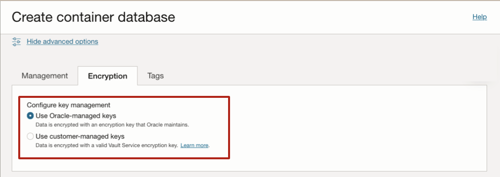
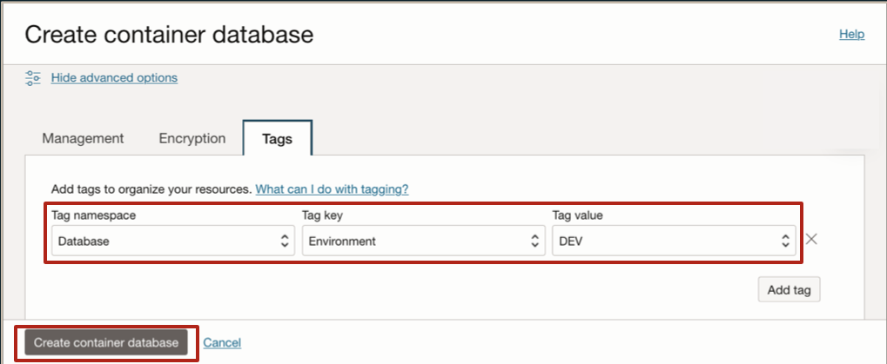
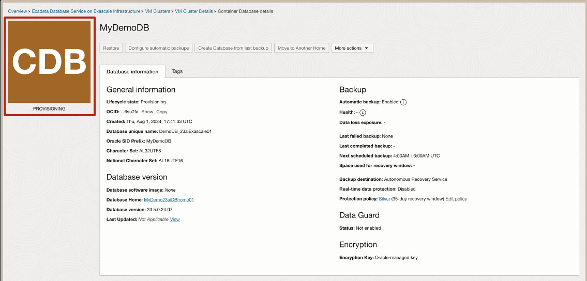
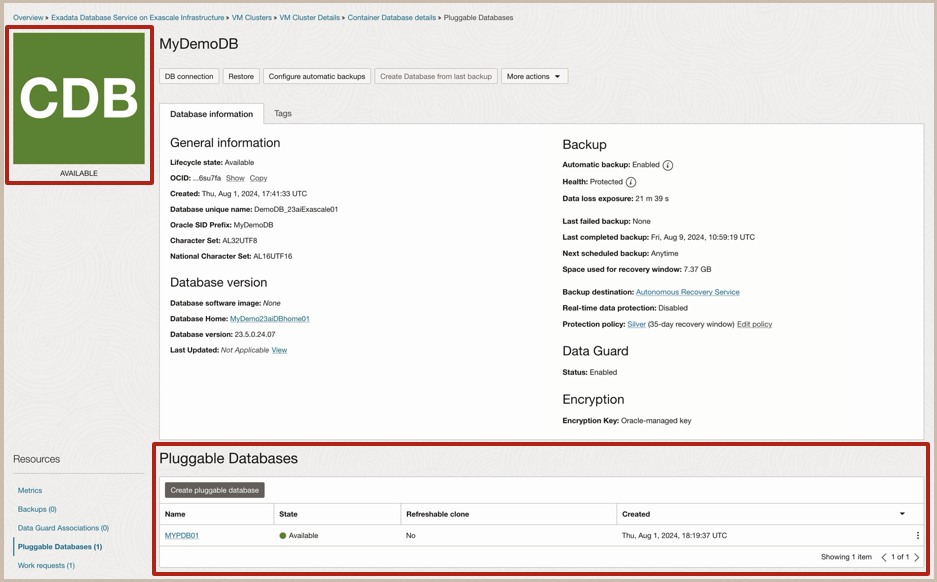

# Create CDB and PDB on Exascale Infrastructure

## Introduction

This lab walks you through the steps to create a Container and Pluggable Database on the Exadata VM Cluster.

Estimated Lab Time: 20 minutes

### Objectives

-   After completing this lab, you should be able to create a Container and Pluggable database on the Exascale Infrastructure.

### Prerequisites

This lab requires completion of the following:

* Complete Lab 1 - **Create an Exadata VM Cluster on the Exadata Database Service on Exascale Infrastructure**

## Task 1: Configure and create a Container and Pluggable Database

1. Once you login to the Oracle Cloud Console, open the navigation menu by clicking on the Menu Icon on the upper left of the page.
Then click on **Oracle Database** and select the **Exadata Database Service on Exascale Infrastructure** from the list of available database services.
   

2.  The VM Clusters page is now displayed. In the left rail, ensure that VM Clusters is selected. In the List Scope, select the compartment where you would like your VM Cluster to reside, then Click on the name of the VM Cluster on which you want to create your database on.

   

3. The VM Cluster Details page is now displayed. On the left rail under RESOURCES, ensure that Container databases is selected, then click on the **Create Container Database** button.

   

4. In the Create Container Database page enter the basic information for creating the container database:
      * For the Database Name: Enter your desired Database Name
      * For the Database Unique Name: Enter your desired Database Unique Name
      * For the Database Version: For this lab, select 23ai from the available choices in the dropdown list
      * For the Pluggable Database Name: Enter your desired Pluggable Database Name

   

5. For the Database Home source you can choose between selecting an existing database home or creating a new one. For this lab we will Select an Existing Database Home, by selecting an available Database Home from the dropdown list. If no Database Homes are displayed, you will need to Create a New Database Home by providing a display name and selecting a database version to use.

   Also configure your Administrator Credentials by entering your desired admin password for the sys username.

   

6. Since Automatic backups can be configured during the database creation process or afterwards, for this lab, we will not be enabling Automatic Backups during the create database workflow.
      * Uncheck the box for: Enable Automatic Backups

   We'll also review & configure Advanced Options for the Container Database by clicking on the Show Advanced Options link. Under the Management tab, set the Oracle_SID to your desired Value and adjust the database character sets as required.

   

7. Under the Encryption tab you can choose if you want to use Oracle-managed keys or Oracle-managed keys for the database encryption key management method. For this lab, we will select Use Oracle-managed keys.

   

8. Under the Tags tab: you can add free-form tags to your resource. If you want to apply a defined tag, you must have permissions to use the tag namespace. 
      >Remember that you can also apply tags to your resources after they are provisioned.

      Click on the **Create Container Database** button to proceed with creating the Container Database.

   

9. This will cause the Container Database Details page to be displayed. 
      >Note that it shows a redwood brown State Icon with a State of PROVISIONING.

   

10. Once the Create Database provisioning process completes, the State Icon will turn green and have a State of AVAILABLE.
Also note that our Pluggable Database is also created and available for use.

   

You have now successfully provisioned your Container & Pluggable Database.

You may now **proceed to the next lab**

## Acknowledgements

* **Author** - Eddie Ambler, Product Management

* **Contributors** - Tammy Bednar, Product Management

* **Last Updated By** - Hope Fisher, Product Management, November 2024
