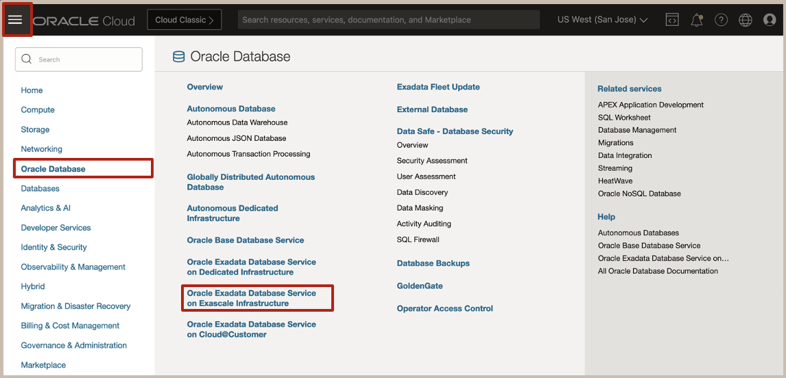
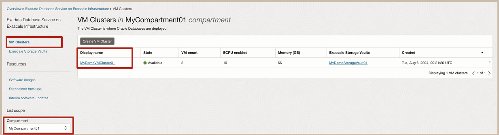
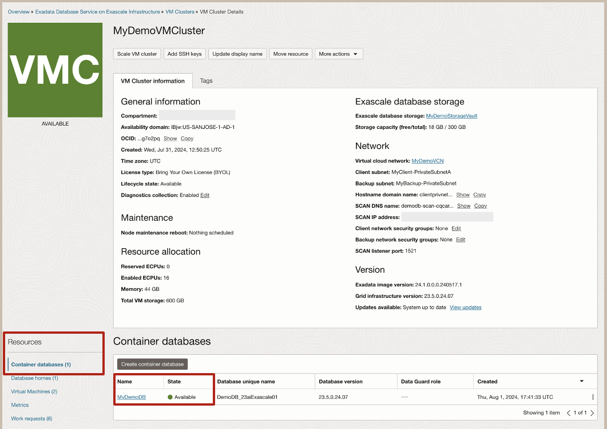
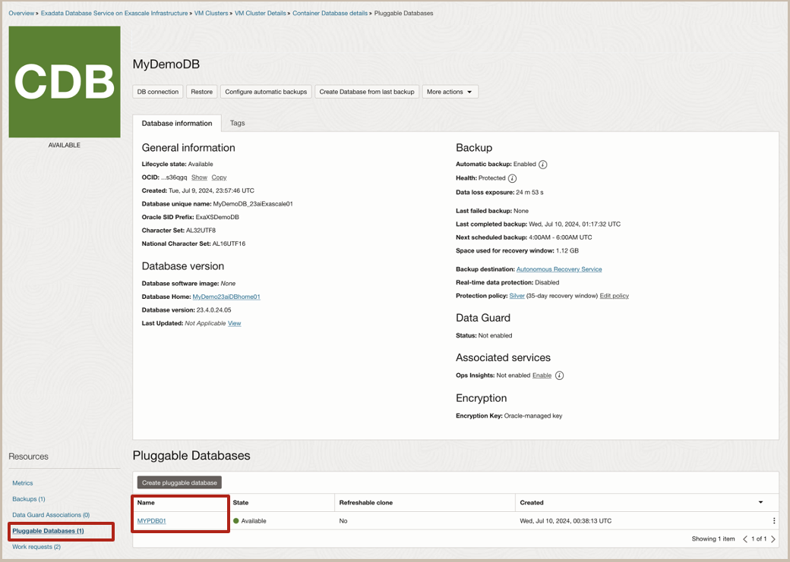
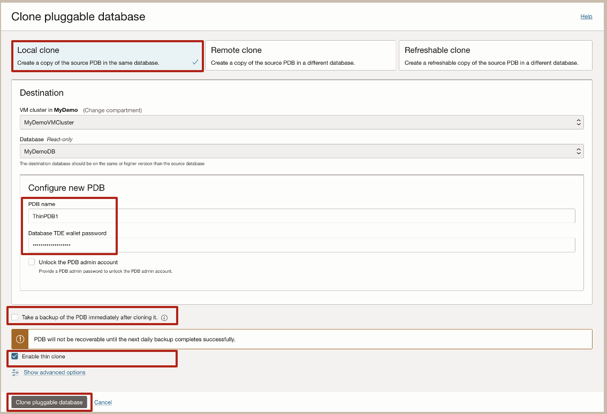
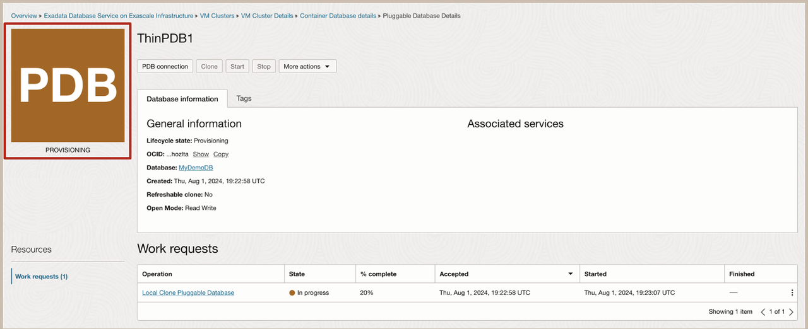
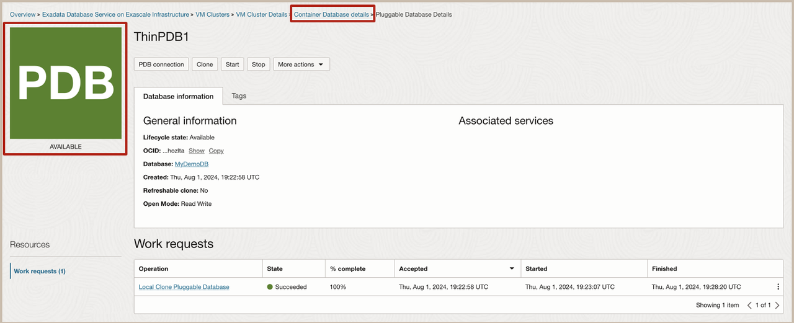
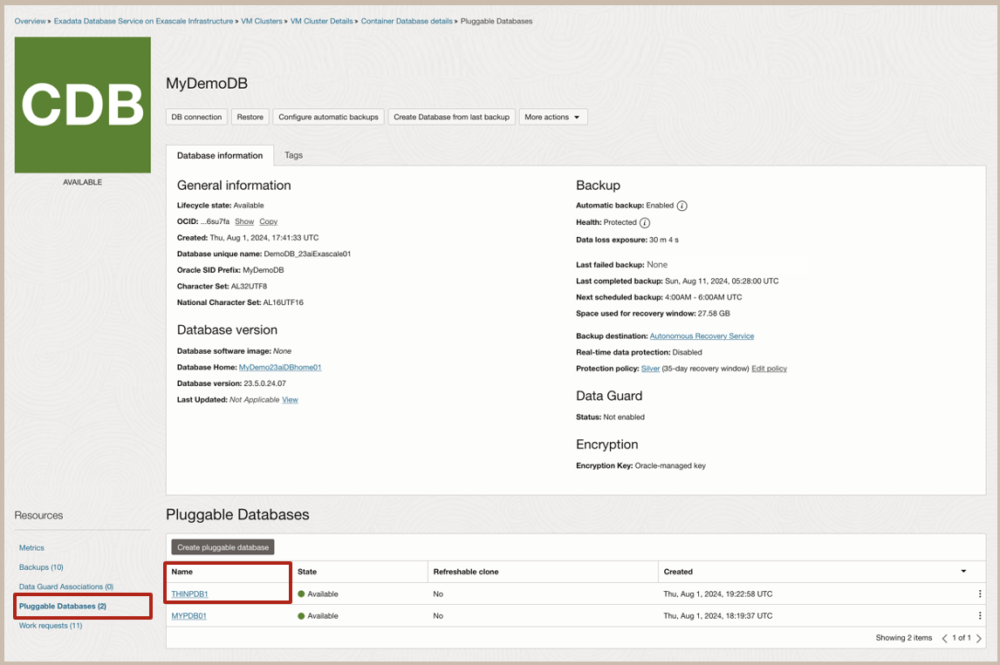

# Create a thin clone of a PDB on an Exadata VM Cluster on Exascale Infrastructure

## Introduction

This lab walks you through the steps to create a thin clone of a PDB on an Exadata VM Cluster on Exascale Infrastructure .

Estimated Lab Time: 15 minutes

### Objectives

-   After completing this lab, you should be able to create a thin clone of a Pluggable Database on the Exascale Infrastructure.

### Prerequisites

This lab requires completion of the following:

* Complete Lab 2 - **Create CDB and PDB on Exascale Infrastructure**

## Task 1: Configure and create a thin clone of your Pluggable Database

1. Once you login to the Oracle Cloud Console, open the navigation menu by clicking on the Menu Icon on the upper left of the page.
Then click on **Oracle Database** and select the **Exadata Database Service on Exascale Infrastructure** from the list of available database services.
   

2. The VM Clusters page will be displayed. In the left rail, ensure that VM Clusters is selected and in the List Scope, select the compartment where you would like your VM Cluster to reside. Then Click on the Name of the VM Cluster on which you want to create your database on.

   

3. This will cause the VM Cluster Details page to be displayed. To Navigate from the VM Cluster to the Container Database, on the left rail in the Resources section, ensure that Container Databases is selected. In the list of Container Databases displayed, click on the name of the Container Database whose PDB we will create a thin clone of.

   

4. This will cause the Container Database Details page to be displayed. On the left rail in the Resources section, click on Pluggable Databases. From the list of available Pluggable Databases displayed, click on the name of the Pluggable Database we will create a thin clone of.

   

5. This will cause the Pluggable Database Details page to be displayed Initiate the Clone PDB action by clicking on the Clone action button.

   

6. The Clone Pluggable Database configuration page is now displayed. In the Clone Pluggable Database configuration page, you will have a choice of clone types to choose from such as Local Clone Remote Clone, or Refreshable Clone. For this lab, we will select Local Clone for the PDB Clone type. Here, we will provide the information to configure the new PDB.
      * For the PDB Name enter the desired PDB Name
      * For the Database TDE wallet password enter the admin password of the source PDB
      * For this lab we will defer the initial PDB backup by unchecking the box to Take a backup of the PDB immediately after cloning

      Ensure to check the box to Enable our PDB as a Thin Clone and click on the **Create Pluggable Database** button to start the clone provisioning process.

   

7. The Pluggable  Database Details page will be displayed.
      >Note that it shows a redwood brown State Icon with a State of PROVISIONING.

   

8. Once the Clone Pluggable Database provisioning process completes, the State Icon will turn green and have a State of AVAILABLE. Click on Container Database Details in the breadcrumb link near the top of the page to return to the Container Database view.

   

9. On the left rail in the Resources section of the Container Database Details page, click on Pluggable Databases. In the list of available Pluggable Databases displayed, you will see the name of the Pluggable Database that was created as a thin clone.
      >Note that the Thin Clone PDB is listed, as just another PDB.

   

You have now successfully provisioned your thin clone of a Pluggable Database.

Congratulations! **You have now completed this workshop**.

## Acknowledgements

* **Author** - Eddie Ambler, Product Management

* **Contributors** - Tammy Bednar, Product Management

* **Last Updated By** - Hope Fisher, Product Management, November 2024
