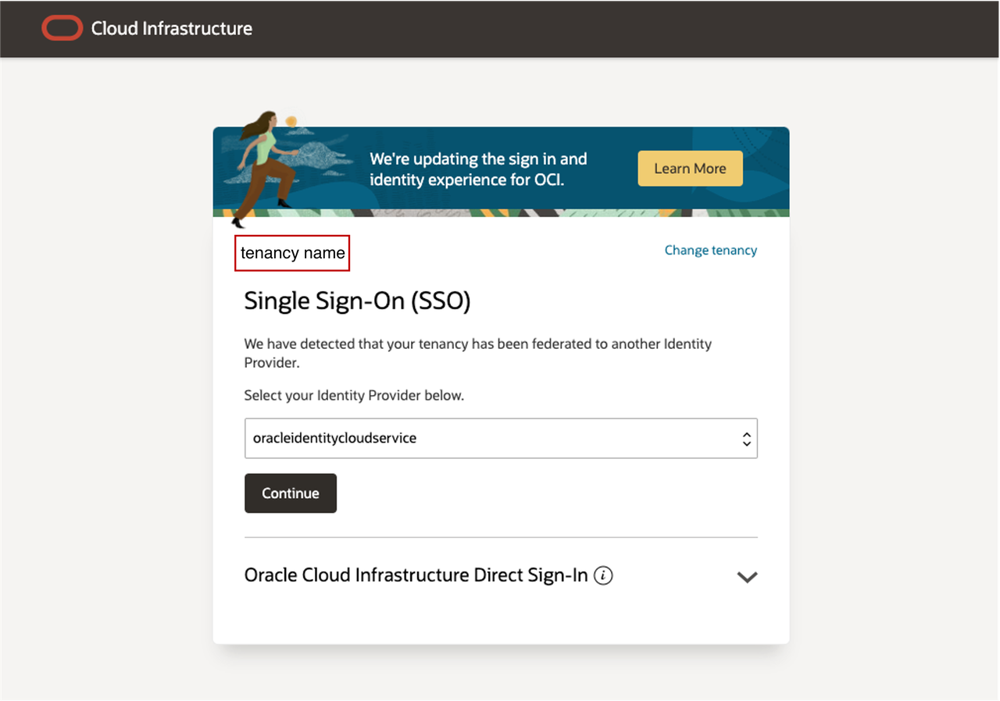
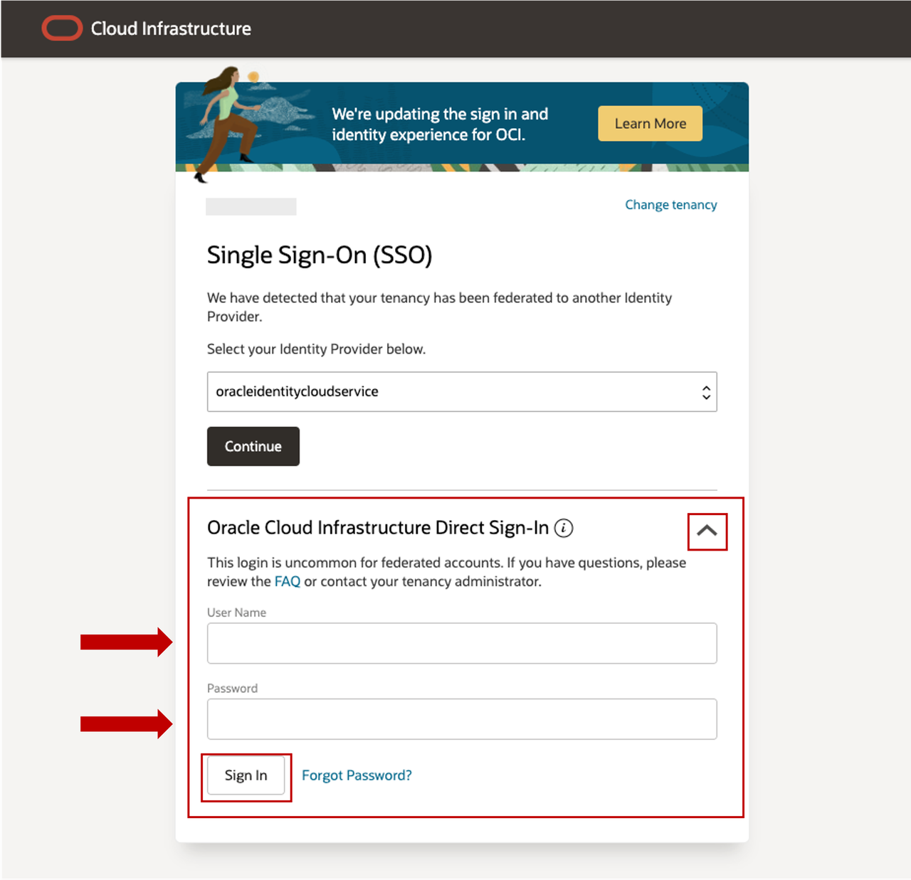

# Get started - Connect to Oracle Cloud Tenancy

## Introduction

Oracle Cloud is the industry's broadest and most integrated cloud provider, with deployment options ranging from the public cloud to your data center. Oracle Cloud offers best-in-class services across Software as a Service (SaaS), Platform as a Service (PaaS), and Infrastructure as a Service (IaaS).

Estimated Time: 5 minutes

<u>**Types of Cloud Accounts that can be used for this workshop:**</u>

**Oracle Cloud Paid Accounts**: When your tenancy is provisioned, Oracle sends an email to the default administrator at your company with the sign-in credentials and URL. This administrator can then create a user for each person who needs access to the Oracle Cloud. Check your email or contact your administrator for your credentials and account name.

**Global Oracle Solutions Center (OSC) provided Account**: This type of environment can be obtained by engaging with your Sales Engineer to coordinate obtaining approval to obtain an Event Code which will provide access to an OSC provided environment.

### Objectives

-   For this workshop we will learn how to login to a tenancy provided by the **Global Oracle Solutions Center**.

### Prerequisites

* **Cloud Account Name** - The name of your assigned OSC's Oracle Cloud tenancy

* **Username** - Your assigned username for this workshop

* **Password** - Your assigned password for this workshop

## Task 1: Log in to Oracle Cloud Tenancy provided by Global Oracle Solutions Center

1. Go to [<u>**cloud.oracle.com**</u>](https://cloud.oracle.com/?region=us-sanjose-1&tenant=oscnas001) and enter your **Cloud Account Name** *(**Assigned Tenancy**)*.

   For this workshop, make sure to select your OSC assigned tenancy name.

   

2. Go to **Oracle Cloud Infrastructure Direct Sign-in** at the bottom of the page and enter your assigned **username** and **password** and click **Sign In**

   

3. You are now signed in to Oracle Cloud!

   

## Task 2: Review Exadata Database Service, Exadata Cloud Infrastructure, Custom Database & Application Images, and Oracle Database Cloud MAA

  *(For this lab, The Exadata Database Service on Cloud@Customer Resource Model is pre-provisioned - Informational Instructions for navigating the Exadata Database Service on Cloud@Customer environment will be presented by the speakers)*

You may now **proceed to the next lab**.

## Acknowledgements

* **Author** - Leo Alvarado, Eddie Ambler, Product Management

* **Contributors** - Tammy Bednar, Product Management

* **Last Updated By** - Hope Fisher, Product Management, November 2024
