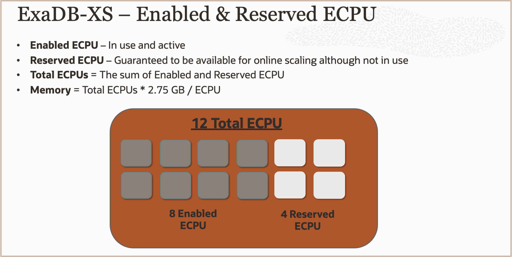

# Introduction

## About this Workshop

This workshop is designed to provide you with hands on experience using the Exadata Database Service on Exascale Infrastructure, which is Oracle’s next generation architecture of the Exadata Database Service.

In this workshop, you will use several of the OCI management interfaces to conduct various database lifecycle tasks on the Exadata Database Service on Exascale Infrastructure.

The workshop exercises are designed to provide you with operational experience creating & managing the Exascale Storage Vault, the Exadata VM Cluster, Container Databases, Pluggable Databases, and thin clones that leverage the Exascale technology stack.

Don’t miss your chance to be one of the first to gain hand-on experience with Exadata & the Exascale technology stack.

**Estimated Workshop Time:** ***60 minutes***

### **What is an Oracle Exadata Database Service?**

The **Oracle Exadata Database Service** is a high-performance co-managed Oracle Cloud Database service that allows organizations to run databases with extreme performance, availability, and security cost-effectively. Databases run faster and with fewer resources on scale-out Exadata infrastructure that includes unique optimizations for transaction processing, analytics, and mixed workloads. Online scaling of computing resources enables customers to quickly adjust consumption to match workload demands without interrupting operations, while efficient database consolidation further lowers total costs. Full compatibility with on-premises Oracle Database and Exadata environments makes it easy for customers to migrate workloads to the cloud.

Exadata Database Service allows you to leverage the power of Exadata in the cloud.
Exadata Database Service’s scale-out architecture allows customers to provision more compute and storage independently, to be able to
easily right-size their service to meet their growing workload demand.
Exadata Database Service offer RDMA over Converged Ethernet (RoCE) networking for high bandwidth and low latency, Exadata RDMA Memory (XRMEM) Cache, and intelligent Exadata software.

Exadata Database Service reduces downtime and simplifies operational management with zero downtime maintenance, online scaling, and one-click provisioning of Oracle Real Application Clusters (Oracle RAC) and Oracle Active Data Guard using built-in cloud automation. Exadata Database Service has built-in Oracle Maximum Availability Architecture (Oracle MAA) best practices that help it to increase database availability out of the box.

### **What is an Oracle Exadata Database Service on Exascale Infrastructure?**

The **Exadata Database Service on Exascale Infrastructure** (***ExaDB-XS***) is Oracle’s next generation architecture of the Exadata Database Service.
 
**Exascale** is the underlying technology that serves as the foundation for this service.
The Exadata Database Service on Exascale Infrastructure provides a cloud service experience that is similar to that of the Exadata Database Service on Dedicated Infrastructure. The Exadata Database Service on Exascale Infrastructure is a multitenant service in which Oracle manages all of the physical infrastructure including the allocation of compute and storage servers.
This service alows customers to start with a small virtual machine (VM) cluster, and easily scale as their workload demands grow. With this service, there is no infrastructure to provision just elastically specify the amount of compute and storage that you need.

**Exascale** increases storage efficiency, simplifies database provisioning, and combines the extreme performance of Exadata smart software with the cost and elasticity benefits of modern clouds.
When databases are deployed on the Exadata Database Service on Exascale Infrastructure the **storage for the database files will resides in an Oracle Exadata Exascale Storage Vault**.
**The Exascale Storage Vault provides** high performance and scalable Exadata smart storage.
This storage can be scaled online as needed with a single command, and becomes available for immediate use.

**The Exadata Database Service on Exascale Infrastructure architecture consists of the following elements**:
     **1.** A set of VMs provisioned for the Exadata VM Cluster that runs on Oracle-managed multitenant physical database servers.
     **2.** VM filesystems, which will reside on Oracle managed cloud storage that is not located on Compute servers. The VM File system will hold the VM image, and the Grid Infrastructure & Database Software
     **3.** A single Exascale Vault, which runs on the Exadata Storage Servers to provides the storage for the database data files and the integration to the Intelligent Exadata Storage Software & Exascale Architecture.

**The basic unit of consumption in ExaDB-XS is a VM cluster.**
The VM Cluster provide the compute environment where your Oracle Database instances will run.
The data for the databases, which are accessed by those Oracle Database instances, are stored in the Exascale Storage Vault.
Each VM Cluster has an Exascale Storage Vault assigned to it.
You will create and associate the Exascale Storage Vault when creating the VM Cluster as a single, inline experience.

**The Exadata Exascale Storage Vault is built for consolidation**.
Multiple GI Clusters and Databases are supported in the same Vault.
Multiple tenants can share common Exascale Storage which allows for efficient storage usage, while each tenant still has their own Vault for Isolation and direct resource allocation for their VM Clusters.

**<ins>To facilitate VM portability</ins>**, the Exadata Database Service on Exascale Infrastructure  hosts storage for VM file systems on shared storage that is fully managed by Oracle.
This allows Oracle to migrate VMs across a pool of physical servers, because the VM filesystems that host the database binaries do not reside on local physical servers.
VMs are migrated automatically as required for maintenance, or in the event of a system failure.
VMs can be scaled vertically by changing the number of Exadata CPU (ECPU) units, and changing VM memory allocation.

**What is an ECPU**?
 An ECPU is an abstracted measure of compute resources.
ECPUs are based on the number of cores elastically allocated from a pool of compute servers.
You need at least 8 ECPUs per VM to provision a VM Cluster.

**Scaling ECPUs:**
 VMs can be scaled in increments of 4 ECPUs.
In addition to the ECPUs that are active in a VM, you can reserve additional inactive cores in a physical server for your VM. **With reserved inactive cores on standby, you can request Oracle to scale up your VM to meet future workload demands without requiring a system restart or relocating the VM**.
This option helps to control costs for variable workloads, because database licensing is based on enabled ECPUs.

**The illustration below shows the configuration for our lab, which has 12 Total ECPUs per VM**:
     **1.** Eight Enabled ECPUs, which are in use and active.
     **2.** Four Resrved ECPUs, which are guaranteed to be available for online ECPU scaling, and contribute to the allocated Memory.
 **Note:** that the **Total ECPUs** in the VM is the sum of the **Enabled ECPUs** and **Reserved ECPUs**.
 Also note that **Memory** is alloccated based on the **Total ECPU** * 2.75 GB and that the VMs can be scaled in increments of 4 ECPUs per VM.

### **Exascale Thin Clones**
Exascale also provides the benefits of redirect-on-write storage technology. With ExaDB-XS, you can provision thin clones of pluggable databases (PDBs) quickly, with space efficiency, because unchanged blocks are shared between parent and clone PDBs without being duplicated. This feature can be especially useful for development and test environments. You can create numerous thin clones of a PDB economically. For example, you can potentially give each of your developers their own PDB clone on which to work. Because Exadata Exascale has all of the performance advantages of Exadata, development environments provisioned with thin clones are highly representative of Exadata production environments, and not merely copies of the data.

You may now **proceed to the next lab**

## Learn More

* Click [here](https://docs.oracle.com/en-us/iaas/exadb-xs/index.html) to learn more about the Exadata Database Service on Exascale Infrastructure.

## Acknowledgements

* **Author** - Eddie Ambler, Leo Alvarado,  Product Management

* **Contributors** - Tammy Bednar, Product Management

* **Last Updated By** - Hope Fisher, Product Management, November 2024