# Create an Exadata VM Cluster on the Exadata Database Service on Exascale Infrastructure

## Introduction

This lab walks you through the steps to create an Exadata VM Cluster on the Exadata Database Service on Exascale Infrastructure.

Estimated Lab Time: 20 minutes

### Objectives

-   After completing this lab, you should be able to create a VM Cluster on the Exascale Infrastructure.

### Prerequisites

This lab requires completion of the following:

* Access to an Exadata Database Service on Exascale Infrastructure.

## Task 1: Configure and create a VM Cluster

1. Once you login to the Oracle Cloud Console, open the navigation menu by clicking on the Menu Icon on the upper left of the page.
Then click on **Oracle Database** and select the **Exadata Database Service on Exascale Infrastructure** from the list of available database services.
   

2. This will cause the VM Clusters page to be displayed. In the left rail, ensure that VM Clusters is selected and in the List Scope, select the compartment where you would like your VM Cluster to reside. Then, click on the Create VM Cluster button.
   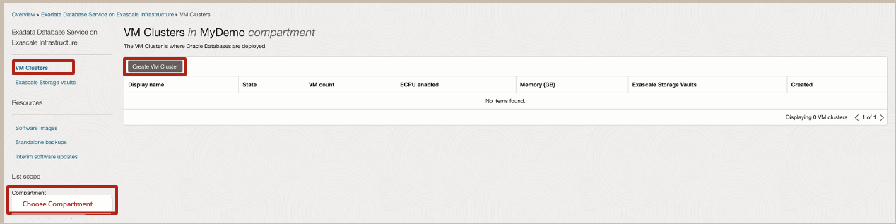

3. The Create VM Cluster page is now displayed. Now lets provide the basic information to configure the Exadata VM cluster:
      * For the Compartment field, ensure to select the compartment that you want the VM Cluster to be created in
      * For the Display Name field, Enter the desired Display Name for the VM Cluster
      * For the Cluster Name: Enter the desired name for the Cluster Name
      * For the Availability Domain: Select the availability domain where you would like for the VM Cluster to reside from the displayed options available.

   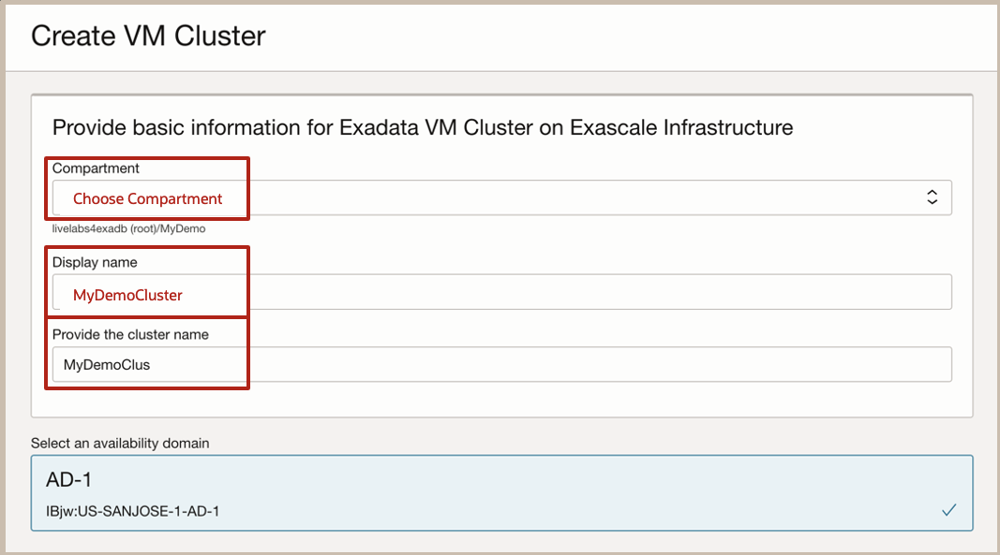

4. Now enter the information to configure the VM Cluster:
      * For the number of VMs in the cluster: 2 is the default value but you can select up to 32  for your configuration.
      * For the number of ECPUs enabled per VM: 8 is the default value but you can increase this value increments of 4 ECPU per VM.
      * The **Total ECPU per VM field** is where you configure Reserved ECPUs that can be used for online CPU scaling.
      * In the Total ECPUs per VM field: You will provide the total number of ECPUs to allocate per VM that includes the enabled and reserved ECPUs. If you Enter 12 as shown, then the ECPUs additional reserved per VM field which is (read only) will now indicate that there are now 4 reserved ECPUs per VM.
      >Note that the Memory per VM (GB) field is (read only) and will display the amount of memory allocated to each VM based on 2.75 GB times the total ECPU count.

      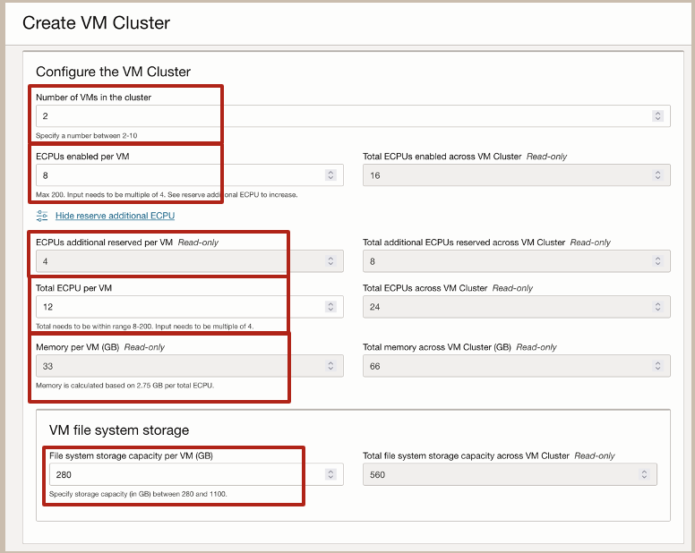

5. Now let’s specify the desired size for the VM file system storage:
    * In the file system storage capacity per VM (GB) field: Enter the desired amount of local VM storage in GB
      >Note: That the minimum VM Filesystems storage size of 280GB includes space for /u02 capacity, which is where your Database Homes will go, along with all of the other VM filesystems. Any extra capacity selected beyond system minimums will go into /u02.

6. Now let’s enter the Configuration Details for the Exascale Database Storage Vault. Start by deciding if you want to Create a new Vault or use an Existing Vault. For this lab we will Select to Create a new vault.
      * For the Exascale Vault name: enter the desired name for your vault
      * For the Storage Capacity for Databases (GB): enter the amount of Exadata Storage that you want to allocate to your VM Cluster.
      >Note: The minimum size configuration for an Exascale Database Storage Vault is 300 GB. 50 GB of the space that you allocate in your Vault is reserved for a 50 GB ACFS file system that resides within your Exascale Database Storage Vault, but is reserved for system use. Thus, if you provisioned the minimum of 300 GB in your Exascale Database Storage Vault, then 250 GB of that 300 GB capacity will be available storage for your databases.

   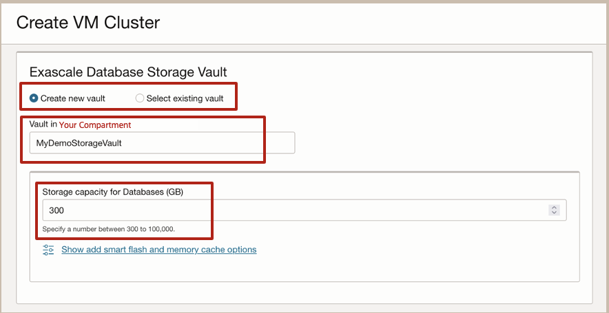

7. Now lets select our desired Oracle Grid Infrastructure version and add an SSH key to provide you access to the VMs:
      * In the Grid Infrastructure Release and Version fields: select your desired versions
         * For this lab we will Accept the default values for the 23ai release.
      * To Add your SSH Key for future access to your VMs. You can Choose from:
         * Generate SSH key pair(Default option). When you choose this option, In the dialog box that is displayed click on the Save Private Key button to download the private key, and optionally click on Save public key to download the public key.
         * If you choose Upload SSH key files: You will be able to browse or drag and drop a .pub file.
         * If you choose Paste SSH keys: You can simply paste in an individual public key that you already have.

   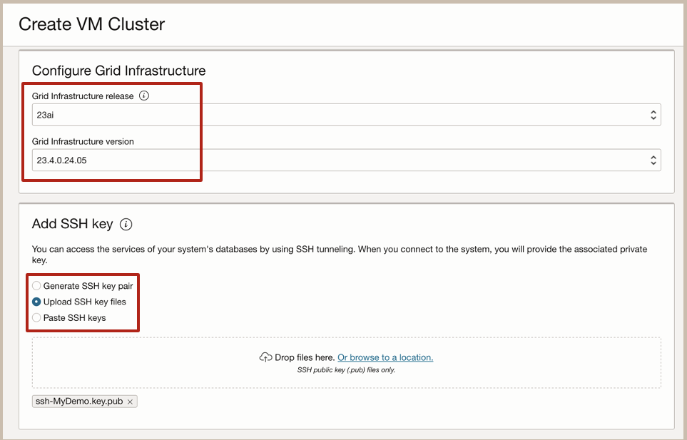

8. Now lets configure the network settings:
      * For the Virtual Cloud Network (VCN): select the desired Virtual Cloud Network that should be used for your VM Cluster. Since your VCN and VM Cluster do not have to be in the same compartment, you can Click on the Change Compartment link  to change to a compartment where your VCN exists.
      * For the Client subnet: Select the client subnet from the list shown as available in the chosen compartment
      * For the Backup Subnet: Select the client subnet from the list shown as available in the chosen compartment
      * For the Hostname Prefix: Enter your desired hostname prefix

   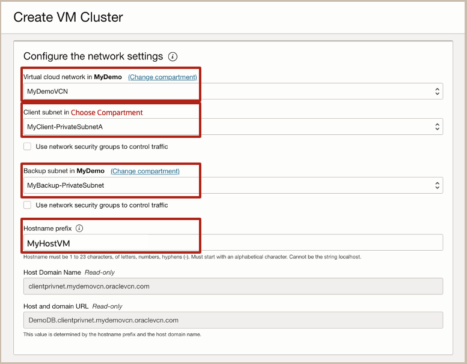

9. Next we will choose a license type that you want to use for the VM cluster. For this lab we will select the Bring Your Own License (BYOL) option. Your choices are:
      * License Included, which allows you to use the database service and all of the available database features and options
      * Bring Your Own License, which allows you to leverage database features already licensed by your organization.
      > Note that this choice affects metering for billing.

   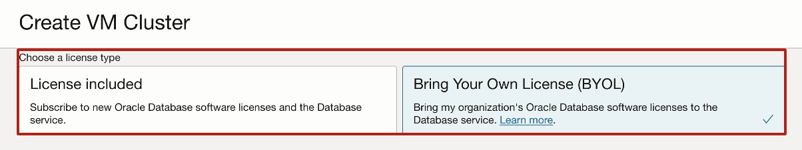

10. In the Diagnostics Collection Section, you can enable or disable any of the Diagnostics Collections options. By enabling diagnostics collection and notifications, Oracle Cloud Operations and you will be able to identify, investigate, track, and resolve guest VM issues quickly and effectively. For this lab, we will accept the default values to Opt-in.
      * The Enable Diagnostics Events Option: Allows Oracle to collect and publish critical, warning, error, and information events to me. For more information, see Overview of Database Service Events
      * The Enable Health Monitoring Option: Allows Oracle to collect health metrics/events such as Oracle Database up/down, disk space usage, and so on, and share them with Oracle Cloud operations. You will also receive notification of some events.
      * The Enable Incident logs and trace collection option: Allows Oracle to collect incident logs and traces to enable fault diagnosis and issue resolution.

   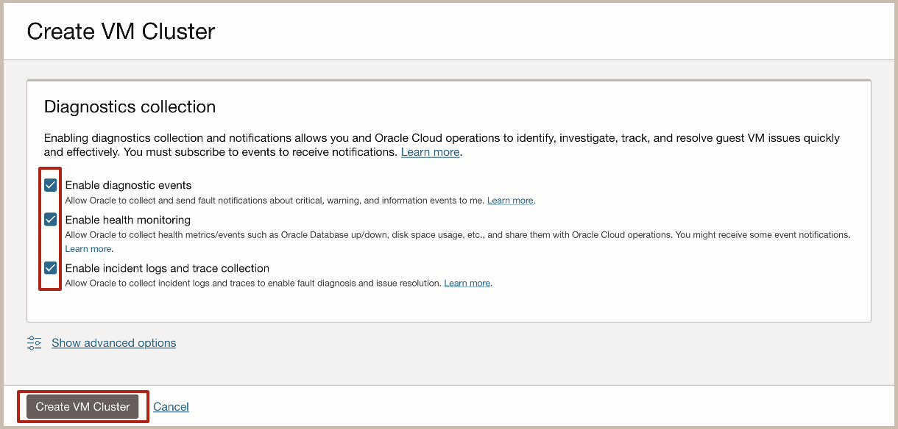

   Click on the Create VM Cluster button to proceed with provisioning.

11. Since we elected to Create a new Vault for our Demo, the first thing that happens once we hit the Create VM Cluster button is
that the Provisioning Status box displays the progress of the Vault Creation

   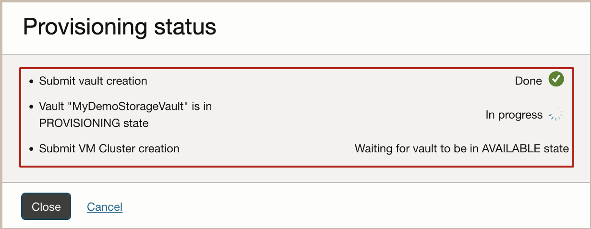

12. Once the Exascale Storage Vault is successfully created, the VM Cluster Details page is displayed.
      >Note that it shows a redwood brown State Icon with a State of PROVISIONING.

   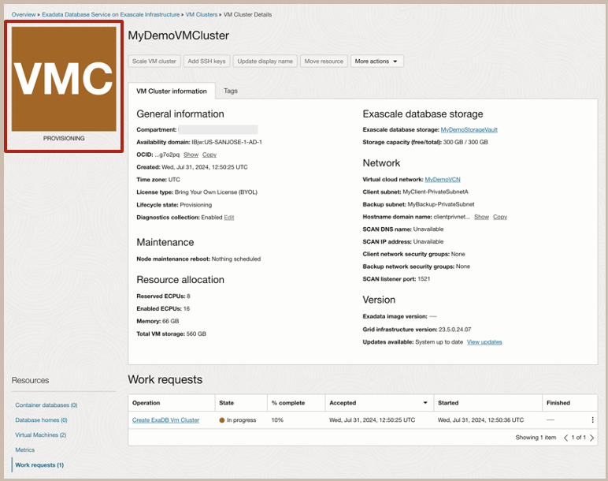

13. Once the VM Cluster provisioning process completes, the State Icon will turn green and have a State of AVAILABLE.

   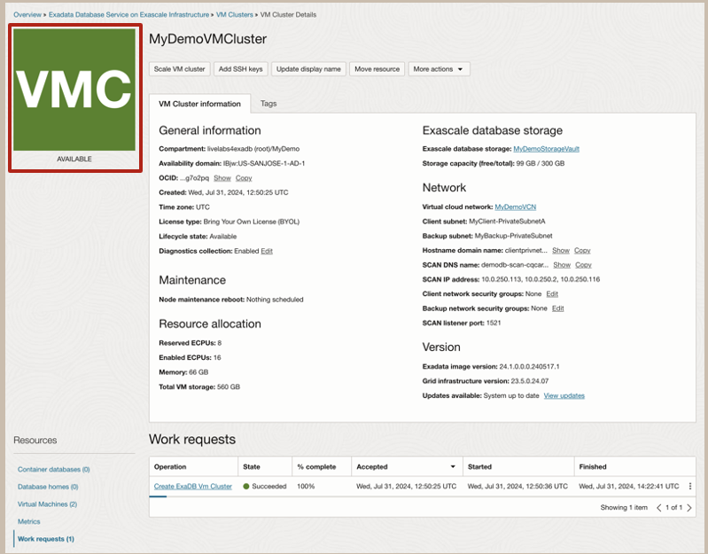

You have now successfully provisioned your VM Cluster.

You may now **proceed to the next lab**

## Acknowledgements

* **Author** - Eddie Ambler, Product Management

* **Contributors** - Tammy Bednar, Product Management

* **Last Updated By** - Hope Fisher, Product Management, November 2024
