# Create a Snapshot and Thin Clone of an Oracle Pluggable Database (PDB) 

## Introduction

This lab walks you through how to create thin clone of an Oracle Pluggable Database on the Exadata Database Service on Exascale Infrastructure using the OCI Console.

Users can create pluggable database (PDB) snapshots for Exadata Database Service on Exascale Infrastructure. When using Oracle Database 23ai on Exadata Database Service on Exascale Infrastructure, you can now create point-in-time snapshots at the PDB level for future use. The snapshots can later be used to efficiently facilitate dev and test environments or to efficiently provide a point-in-time view of PDB data. These PDB snapshots leverage Exascale redirect-on-write technology so that they are created quickly, consume little storage space upon initial creation, and can be created in practically unlimited numbers. This exciting feature is an important enhancement for dev and test environments and enhances operational agility and developer productivity.
 

**Estimated Time:** ***10 minutes***

### **Objectives**

- Create a pluggable database (PDB) snapshot in Oracle Exadata Database Service on Exascale Infrastructure.
- Thin clone a PDB snapshot. 

### **Prerequisites**

This lab requires the completion of the following:

* Successful creation of a VM Cluster on Exadata Database Service on Exascale Infrastructure.
* Successful creation of Container Database on the VM Cluster, which will also includes the initial PDB.
* Completion of **Lab 3**

## Task 1: Create a Pluggable Database (PDB) Snapshot

1. Open the navigation menu. Under **Oracle Database**, click **Exadata Database Service on Exascale Infrastructure**.

   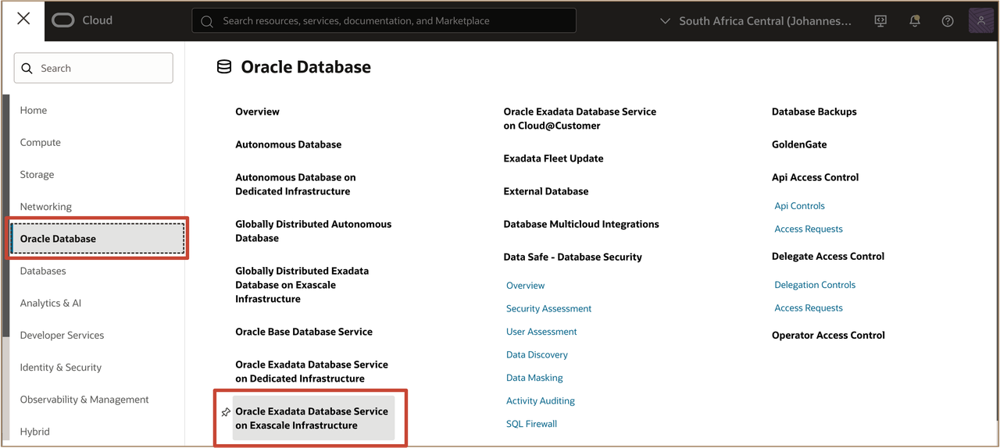

2. Select your assigned **Region** and select your assigned **compartment** from the applied filter to navigate to your assigned **Exascale VM Cluster**.  
   
   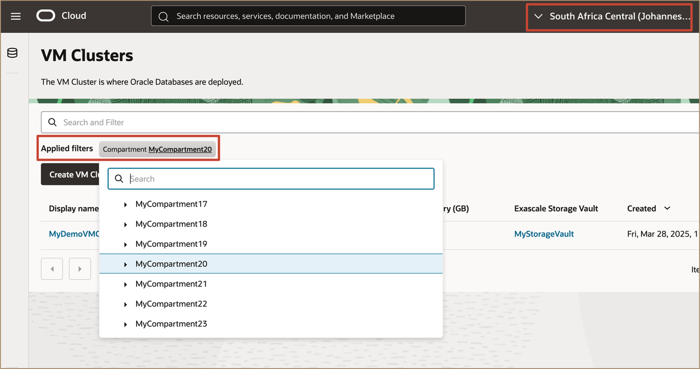
   
   Click the name of your assigned VM Cluster to open the **VM Cluster** page.
   
   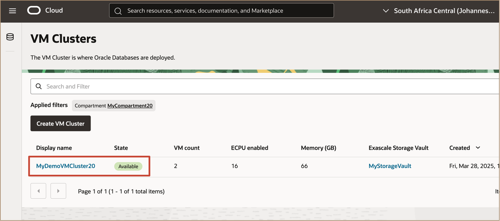

3. In the **VM Clusters** page, click on the **Container databases** tab and click ***AIDemoDB*** Container Database. 

   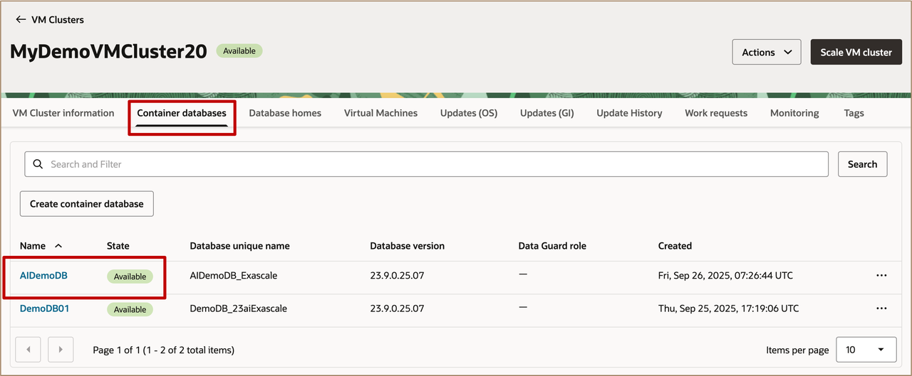

   In the Database page, Navigate to the **Pluggable Databases** tab and select the ***PDB1*** Pluggable Database you want to create a snapshot of.

   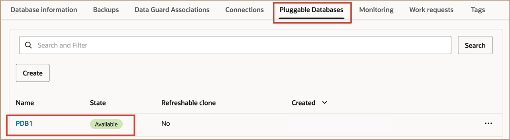

4. From the PDB main page, under the **Exascale PDB snapshot** tab, click **Create Exascale PDB Snapshot**.

   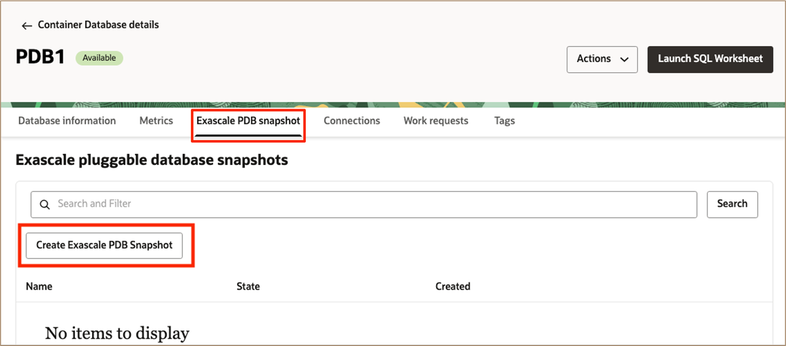
   

5. Enter a name for the snapshot and click **Create**.
   
   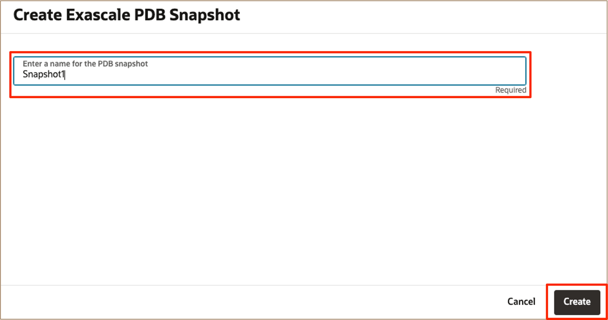

6. As the snapshot is being created, it will appear itemized under the **Exascale PDB snapshot** tab on the parent PDB page.

   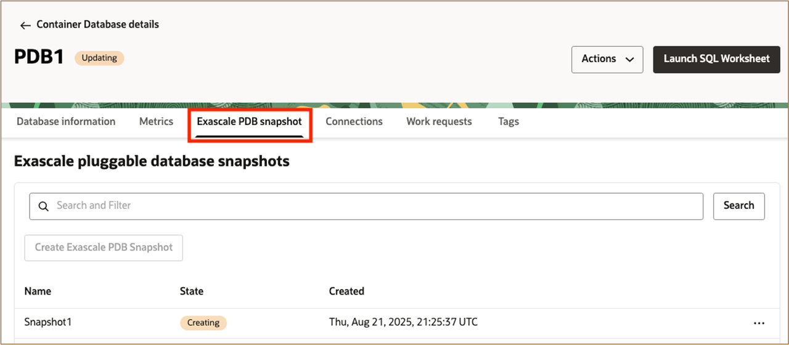

   > **Note**: Once the snapshot has been created, it serves as a point-in-time view of the data state that can be cloned in the future. Snapshots leverage Exascale redirect-on-write technology and consume very little storage upon initial creation. As data in the parent PDB continue to change, the snapshot will grow in size in order to keep track of the data changes so that the snapshot can maintain the former point in time accurately. Note that the snapshot itself cannot be directly used, instead, it simply maintains the state of the data from the point of time when it was created. To use the snapshot, you must clone it.
   

## Task 2: Thin Clone a PDB Snapshot

Now that you have created a snapshot, you can use it to provision thin clones. Thin clones are space efficient because unchanged blocks are shared between the snapshot and the thin clone without being duplicated. Aside from the starting point, the user experience for creating a clone from a snapshot parallels the familiar user experience of directly cloning a PDB. PDB clones that originate from a snapshot behave the same as any other PDB and can be used normally.

 

1. From the snapshot you created previously, click the three-dot icon **actions** menu and Select **Clone from snapshot**. 
   
   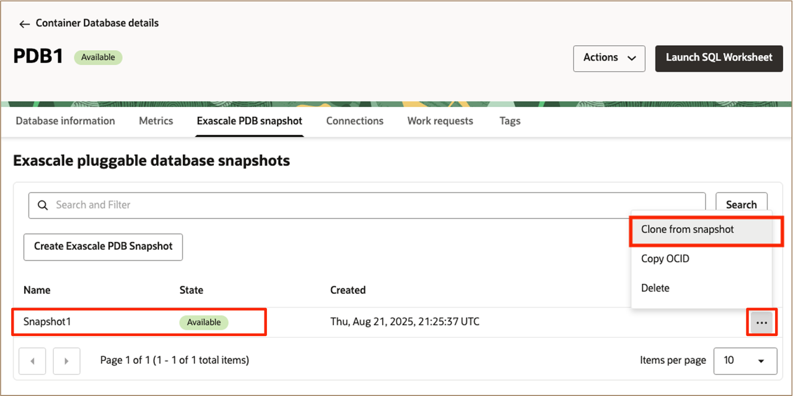
   
2. Configure clone PDB options and complete all the required fields for creating a new PDB in the **Clone from snapshot** page.
   
   In the **Clone Pluggable Database** configuration page, select ***Local Clone*** as PDB clone type.

   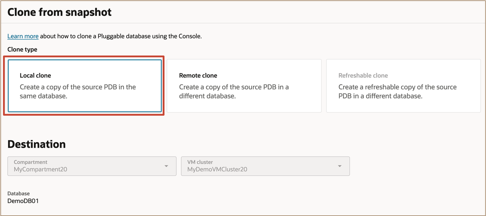

   Enter the information to configure the new PDB.

      * Enter ***THINPDB1*** for **PDB Name**
      * Enter ***Pass4AIW25Student-#*** for **Database TDE Wallet password**
   
   Select ***Enable Thin Clone***. Enable Thin Clone checkbox will be checked by default. Unchecking this box will create a thick clone instead of a thin clone of a pluggable database.

   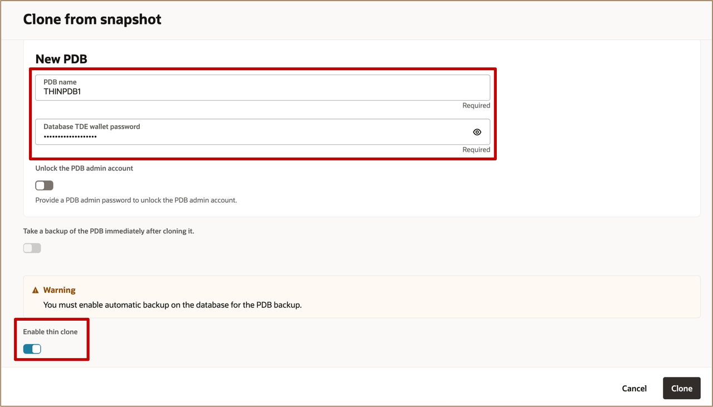

   
3. Click **Clone** to start the clone provisioning process. Once provisioned, the new clone appears along with all other PDBs associated with the corresponding Container Database (CDB).
   
   

   The clone can then be given to a developer or a test team to use. The snapshot can be cloned multiple times in order to give the same data state to multiple individuals or teams to be used independently.

    
***Congratulations!!!*** You may now **proceed to the next lab**. 

## Learn More

* Click [here](https://docs.public.oneportal.content.oci.oraclecloud.com/en-us/iaas/exadata/doc/ecc-create-first-db.html) to learn more about Creating an Oracle Pluggable Database on Exadata Database Service on Exascale Infrastructure.

## Acknowledgements

* **Author** - Leo Alvarado, Christian Craft  Product Management

* **Last Updated By** - Leo Alvarado, Product Management, Aug 2025.
