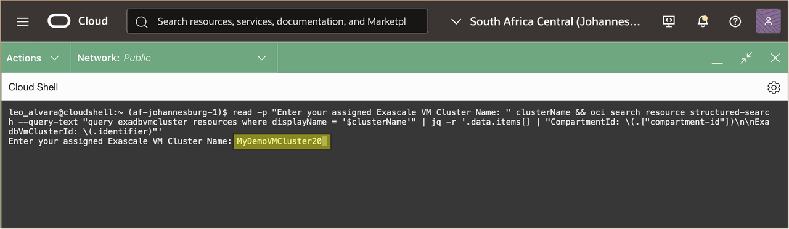
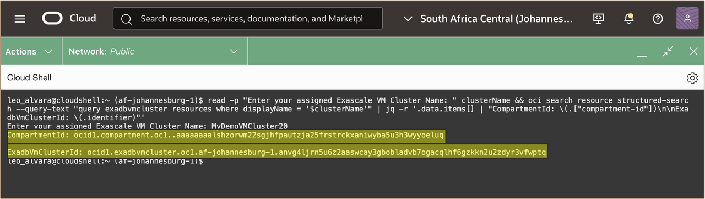
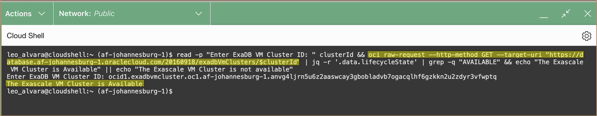
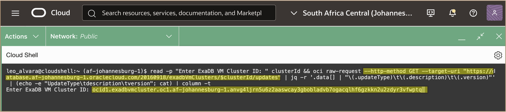
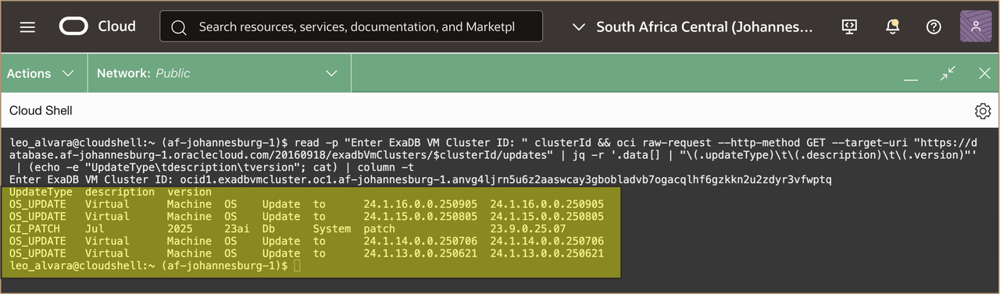
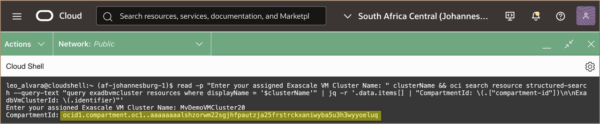
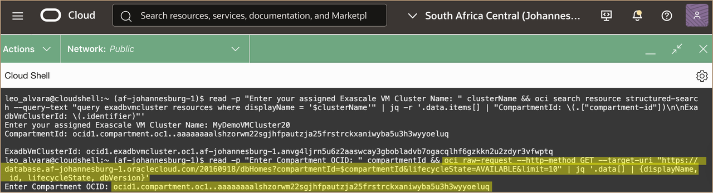
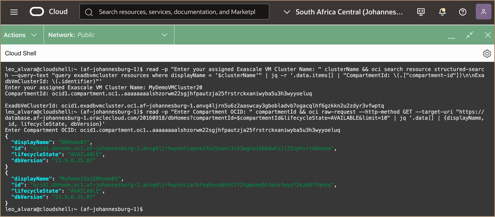

# Discover Environment Details using OCI API


## Introduction

This lab walks you through the steps to discover how to navigate to the Exadata Database Service on Exascale Infrastructure and discover the environment details for the Exadata VM Cluster, Container Database, Pluggable Database, and the Exascale Storage Vault using the OCI API.

**Estimated Time:** ***10 minutes***

### Objectives

-   After completing this lab, you should be able to discover Exadata Database Service on Exascale Infrastructure environment details using the OCI API.


### Prerequisites

This lab requires the completion of the following:

* Completion of **Lab 1**
* Required IAM Policies to [<u>**Access OCI Cloud Shell**</u>](https://docs.oracle.com/en-us/iaas/Content/API/Concepts/cloudshellintro.htm#Required_IAM_Policy). 


## Task 1: List the available Exascale VM Cluster using REST API 

1. From the Cloud Shell terminal, make an OCI REST API call to get a list of the available Exascale VM Cluster. 
   
   Get your assigned **Compartment OCID** and **Exascale VM Cluster OCID** by running the command below:

    ```
    <copy>

          read -p "Enter your assigned Exascale VM Cluster Name: " clusterName && oci search resource structured-search --query-text "query exadbvmcluster resources where displayName = '$clusterName'" | jq -r '.data.items[] | "CompartmentId: \(.["compartment-id"])\n\nExadbVmClusterId: \(.identifier)"'

    </copy>
    ```
  

    > **Note:** Enter the name of your **assigned VM Cluster**  "***MyDemoVMClusterXX***"
  
    Take note of the Compartment OCID and Exascale VM Cluster OCID by copying to a text editor for later use.

   


2. Check the lifecycle state of the Exascale VM Cluster by running the REST API **OCI RAW-REQUEST** command below:
   
    ```
    <copy>

          read -p "Enter ExaDB VM Cluster ID: " clusterId && oci raw-request --http-method GET --target-uri "https://database.af-johannesburg-1.oraclecloud.com/20160918/exadbVmClusters/$clusterId" | jq -r '.data.lifecycleState' | grep -q "AVAILABLE" && echo "The Exascale VM Cluster is Available" || echo "The Exascale VM Cluster is not available"

    </copy>
    ```
    **<u>Description:</u>** 

    The REST API Request is: ***GET /20160918/exadbVmClusters/{exadbVmClusterId}***

    **<u>Where:</u>** 

      * ***exadbVmClusterId*** is the ***Exascale VM Cluster OCID*** 
      * ***lifecycleState*** is the current state of the Exadata VM cluster on Exascale Infrastructure. Allowed values are **PROVISIONING**, **AVAILABLE**, **UPDATING**, **TERMINATING**,**TERMINATED**, **FAILED**, and **MAINTENANCE\_IN\_PROGRESS**.
      
   

    > **Note:** paste the OCID of your **assigned VM Cluster** obtained from ***Task 1 Step 1***
  
  The provided Exascale VM Cluster OCID will be passed to the REST API call to check for the  lifecycle state field and confirm if it is **AVAILABLE**.

   


## Task 2: List the available updates for the Exascale VM Cluster using REST API 

1. From the Cloud Shell terminal, make an OCI REST API call to get a list of the available updates for a specified Exascale VM Cluster by running the **OCI RAW-REQUEST** command below:
   
    ```
    <copy>

          read -p "Enter ExaDB VM Cluster ID: " clusterId && oci raw-request --http-method GET --target-uri "https://database.af-johannesburg-1.oraclecloud.com/20160918/exadbVmClusters/$clusterId/updates" | jq -r '.data[] | "\(.updateType)\t\(.description)\t\(.version)"' | (echo -e "UpdateType\tdescription\tversion"; cat) | column -t

    </copy>
      ```
    
    **<u>Description:</u>** 

    The REST API Request is: ***GET /20160918/exadbVmClusters/{exadbVmClusterId}/updates***

    **<u>Where:</u>** 

      * ***exadbVmClusterId*** is the ***Exascale VM Cluster OCID*** 
      * ***updates*** is the type of cloud VM cluster maintenance update. Allowed values are **GI\_UPGRADE**, **GI\_PATCH**, and **OS\_UPDATE**.
  
   

    > **Note:** paste the OCID of your **assigned VM Cluster** obtained from ***Task 1 Step 1***
  
  You will see a similar output as below. Review the **Update Type**, **Description** and **Version** from the REST API call results.

   

## Task 3: List the available Database Homes in a specified compartment

1. Get your assigned **Compartment OCID** and **Exascale VM Cluster OCID** by running the command below:

    ```
    <copy>

          read -p "Enter your assigned Exascale VM Cluster Name: " clusterName && oci search resource structured-search --query-text "query exadbvmcluster resources where displayName = '$clusterName'" | jq -r '.data.items[] | "CompartmentId: \(.["compartment-id"])\n\nExadbVmClusterId: \(.identifier)"'

    </copy>
    ```
  
  You will see a similar output as below. Copy the **Compartment** OCID for later use

  

  

2. From the Cloud Shell terminal, make an OCI REST API call to get a list of the available Database Homes in a compartment by running the **OCI RAW-REQUEST** command below:
   
    ```
        <copy>

          read -p "Enter Compartment OCID: " compartmentId && oci raw-request --http-method GET --target-uri "https://database.af-johannesburg-1.oraclecloud.com/20160918/dbHomes?compartmentId=$compartmentId&lifecycleState=AVAILABLE&limit=10" | jq '.data[] | {displayName, id, lifecycleState, dbVersion}'

        </copy>
    ```

    Paste the OCID of your **assigned Compartment** obtained from ***Step 1***.

    


    **<u>Description:</u>** 

    The REST API Request is: ***GET /20160918/dbHomes?compartmentId={CompartmentOCID}&lifecycleState=AVAILABLE&limit=10***

    **<u>Where:</u>** 

      * ***dbHomes*** is the **resource type** for the Oracle Database Home.
      * ***compartmentId*** is the ***Compartment OCID*** of the Compartment where you want to list the available Database Homes.
      * ***lifecycleState=AVAILABLE*** is the **query** to include a filter to return only Database Homes with the lifecycle state of Available.
      * ***limit*** is the **query** to define the maximum number of items to return per page
   

3. You will see a similar output as below. 
   
   
   
   Database Home fields such as **Display Name**, **Database Home OCID**, **Lifecycle State** and **Version** are displayed from the REST API call output.

***!!! Congratulations:*** this is the end of the Lab. 
   

## Acknowledgements

* **Author** - Leo Alvarado, Christian Craft  Product Management

* **Last Updated By** - Leo Alvarado, Product Management, Aug 2025.


