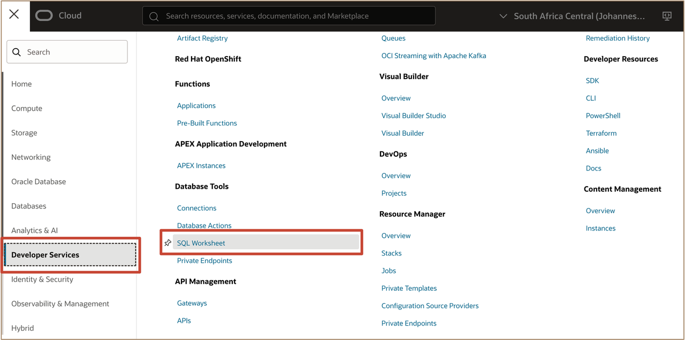
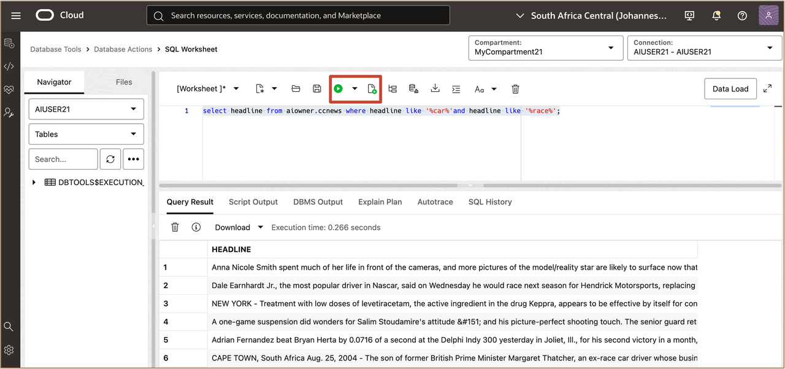
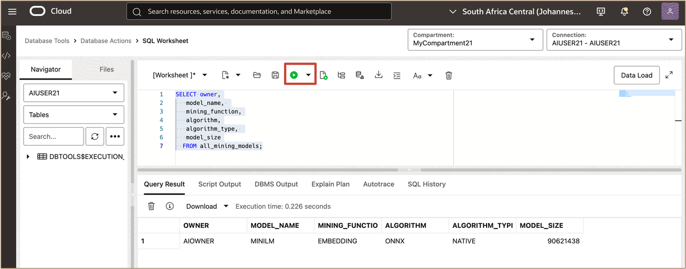
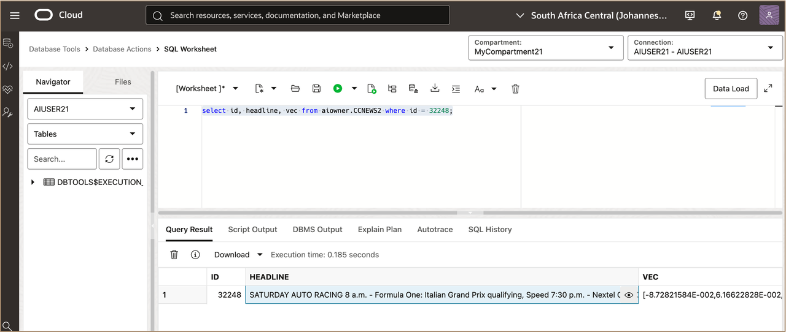
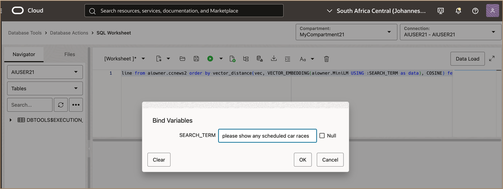
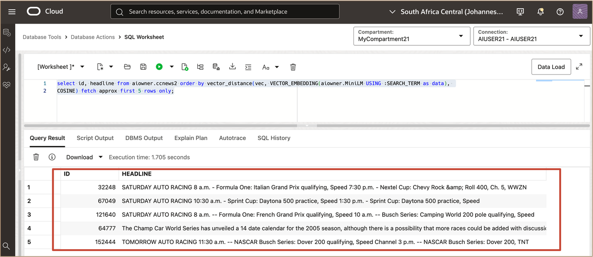
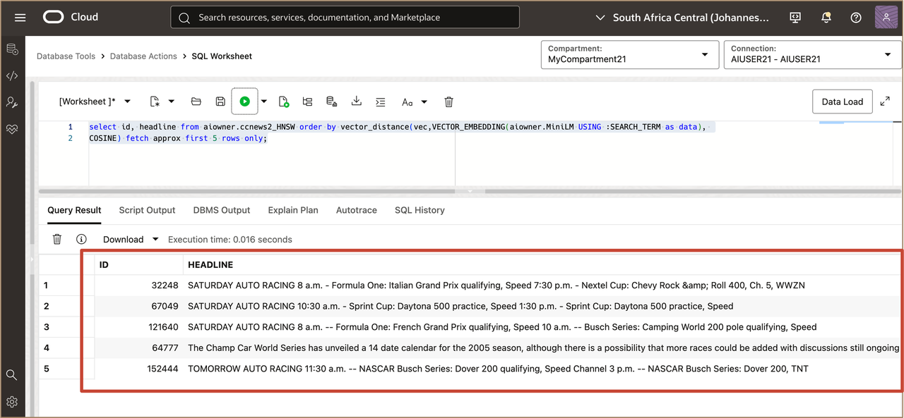
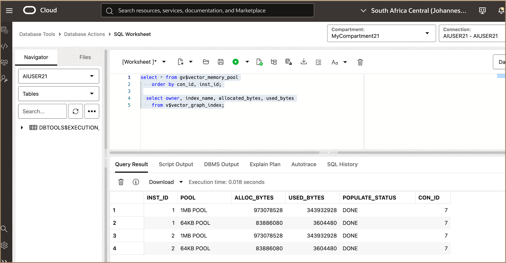

# Explore Oracle Exadata Performance Features for building GenAI Apps

## Introduction

This lab walks you through exploring Oracle Exadata Performance Features for building GenAI Apps.
 

**Estimated Time:** ***15 minutes***

### **Objectives**

-   After completing this lab, you should be able to. 


### **Prerequisites**

This lab requires the completion of the following:

* Successful creation of a VM Cluster on Exadata Database Service on Exascale Infrastructure.
* Successful creation of Container Database on the VM Cluster, which will also includes the initial PDB.
* Completion of **Lab 1**

## Task 1: Connect to the AI Demo Database


1. Open the navigation menu, select **Developer Services** and under the **Database Tools** section, select **SQL Worksheet**.

   

2. On the SQL Worksheet page, use the Connection menu to select a database connection. Select your assigned **Compartment** and assigned **database connection**.

   


## Task 2: Execute a traditional Keyword Search on unstructured text

1. Using the SQL Worksheet, query the data using traditional keyword search.

    ```
    <copy>

      select headline from aiowner.ccnews where headline like '%car%'and headline like '%race%';
    </copy>
    ```
   
   

## Task 3: Exploring AI Vectors and how they are created

* Vectors are a mathematical representation of unstructured data
* Model used in this lab… all-MiniLM-L6-v2
   * https://huggingface.co/onnx-models/all-MiniLM-L6-v2-onnx
   * https://huggingface.co/sentence-transformers/all-MiniLM-L6-v2
   * Embedding dimension: 384
   * Max sequence length: 256
   * Data Type: Float32

1. Run a query to show What AI Models are installed in this database.
   
    ```
    <copy>

      SELECT owner,
       model_name, 
       mining_function,
       algorithm,
       algorithm_type, 
       model_size
      FROM all_mining_models; 
    </copy>
    ```
   
   

2. Run the AI Model on a sample search term.
   
    ```
    <copy>

      select VECTOR_EMBEDDING(aiowner.MiniLM USING :SEARCH_TERM as data)SEARCH_TERM from dual;
      

    </copy>
    ```


3. See a row of data from the table

    ```
    <copy>

      select id, headline, vec from aiowner.CCNEWS2 where id = 32248;
   
    </copy>
    ```
   
   
    


## Task 4: Execute AI Vector Search on the same unstructured text to see the benefits

1. Query the data using AI Vector Search
   
    ```
    <copy>

      select id, headline from aiowner.ccnews2 order by vector_distance(vec, VECTOR_EMBEDDING(aiowner.MiniLM USING :SEARCH_TERM as data), COSINE) fetch approx first 5 rows only;

    </copy>
    ```
   

   You can use ***please show any scheduled car races*** for the **search_term**


   

   * Notice the benefits over keyword
   * Look at the SQL access path (scan)
   * Check Autotrace for **physical read total IO requests**


   

## Task 5: Explore AI Vector Indexing strategies to accelerate AI Vector Search at any scale

1. Query a copy of the table that has an HNSW index.

   
      ```
      <copy>

      select id, headline from aiowner.ccnews2_HNSW order by vector_distance(vec,VECTOR_EMBEDDING(aiowner.MiniLM USING :SEARCH_TERM as data), COSINE) fetch approx first 5 rows only;
      
      </copy>
      ```
   

   Look at the SQL access path (HNSW index)
   
   Check Autotrace for **physical read total IO requests**
   

2. Look at the amount of Vector Memory used
   
    ```
    <copy>

      select * from gv$vector_memory_pool
        order by con_id, inst_id;
      
      select owner, index_name, allocated_bytes, used_bytes
        from v$vector_graph_index;
   
    </copy>

    ```

    

3. Query a copy of the table that has IVF index
   
    ```
    <copy>

      select id, headline from aiowner.ccnews2_IVF
      order by vector_distance(vec, 
                               VECTOR_EMBEDDING(aiowner.MiniLM USING :SEARCH_TERM as data), 
                               COSINE) 
      fetch approx first 5 rows only;


    </copy>

    ```

   * Look at the SQL Access path (IVF Index)
   * Check Autotrace for “physical read total IO requests”
    
    
    
***Congratulations!!!*** You may now **proceed to the next lab**. 


## Learn More

* Click [here](https://docs.public.oneportal.content.oci.oraclecloud.com/en-us/iaas/exadata/doc/ecc-create-first-db.html) to learn more about Creating an Oracle Pluggable Database on Exadata Database Service on Exascale Infrastructure.


## Acknowledgements

* **Author** - Leo Alvarado, Christian Craft  Product Management

* **Last Updated By** - Leo Alvarado, Product Management, Aug 2025.
