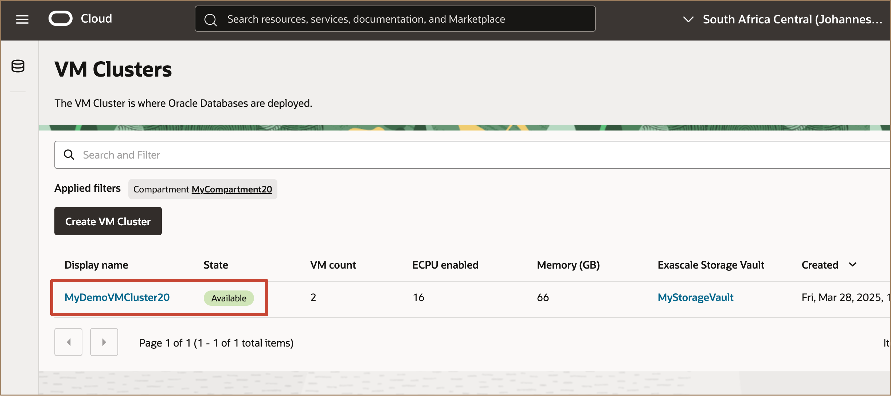
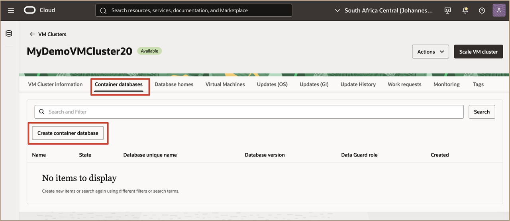
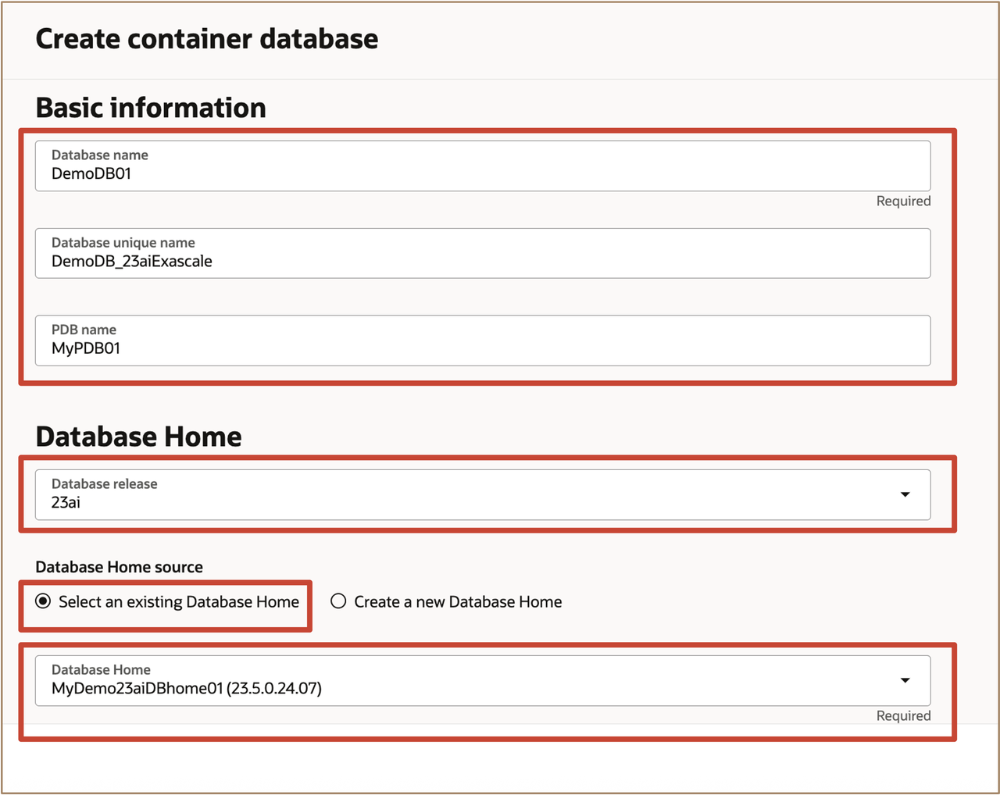
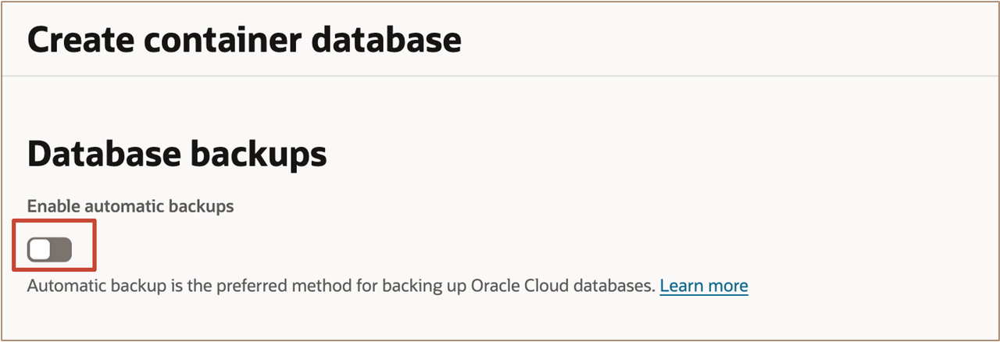
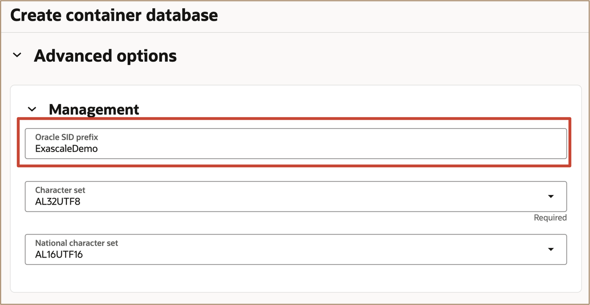
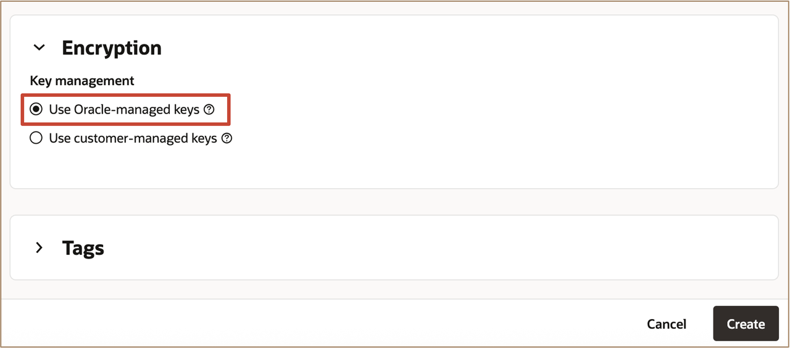
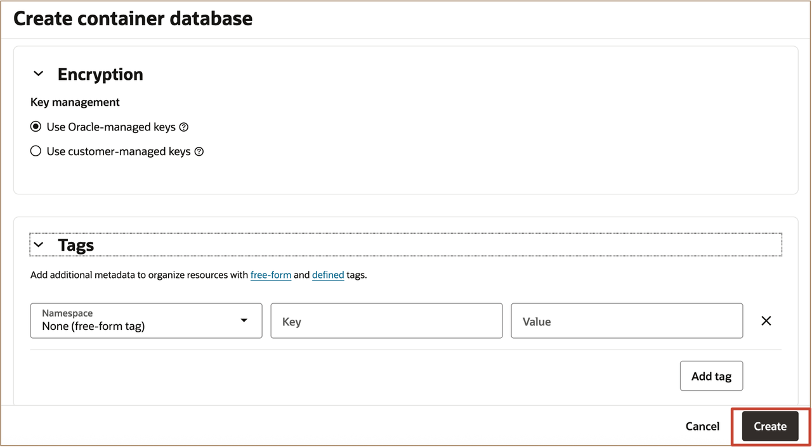

# Create an Oracle Database on Oracle Exadata Database Service on Exascale Infrastructure

## Introduction

This lab walks you through how to create an Oracle Database on the Oracle Exadata Database Service on Exascale Infrastructure using the OCI Console. 
 

**Estimated Time:** ***10 minutes***

### Objectives

-   After completing this lab, you should be able to create an Oracle Database on Oracle Exadata Database Service on Exascale Infrastructure using the OCI Console.

### Prerequisites

* A provisioned Oracle Exadata Database Service on Exascale Infrastructure VM Cluster to host the database.

## Task 1: Provision an Oracle Database

1. Open the navigation menu. Under **Oracle Database**, click **Exadata Database Service on Exascale Infrastructure**.

   

2. Select your assigned **Region** and select your assigned **compartment** from the applied filter to navigate to your assigned **Exascale VM Cluster**.  
   
   
   
   Click the name of your assigned VM Cluster to open the **VM Cluster** page.
   
   

3. In the **VM Clusters** page, click on the **Container databases** tab and click ***Create container database***.

   

4. In the **Create Container Database** page enter the **basic information for creating the container database:**
   
     * For the **Database Name:** Enter ***DemoDB01***
     * For the **Database Unique Name Suffix:** Enter ***DemoDB_23aiExascale***
     * For the **Pluggable Database Name:** Enter ***MyPDB01***
     * For the **Database release:** Select ***23ai***  
     * For the **Database Home source** choose: ***Select an existing Database Home***
     * Select Database Home with display name of ***MyDemo23aiDBhome01***

   

     * Next configure your **Administrator Credentials:** by entering ***Pass4AIW25Student-#*** as the password for the ***sys*** username

   

5. In the **Configure Database backups** page, if you accept the defaults setting, the database will be backed up using the Oracle Database Autonomous Recovery Service. You have the option to use OCI Object Storage by changing the **Backup destination**. 
   
   
   
   For this lab, we will not be enabling **Automatic Backups** for the database during the create database workflow.
    * ***Uncheck*** **the box for:** ***Enable Automatic Backups***

   
      
6. **Review & Configure Advanced Options** for the Container Database by clicking on the ***Show Advanced Options*** link.
   
   Under the **Management tab** set the Oracle_SID to ***ExascaleDemo***

   

   Under the **Encryption tab** you can select the desired key management method. Select ***Use Oracle-managed keys***.

   

   Under the **Tags tab:** you can add free-form tags to your resource.  If you want to apply a defined tag, you must have permissions to use the tag namespace. Remember that you can also apply tags to your resources after they are provisioned.

   
7. Click ***Create*** to create the container database.

   

***!!! Congratulations:*** You may now **proceed to the next lab**. 
 

## Learn More

* Click [here](https://docs.oracle.com/en-us/iaas/exadb-xs/index.html) to learn more about the Exadata Database Service on Exascale Infrastructure.

## Acknowledgements

* **Author** - Leo Alvarado, Christian Craft Product Management

* **Last Updated By** - Leo Alvarado, Product Management, Aug 2025.
