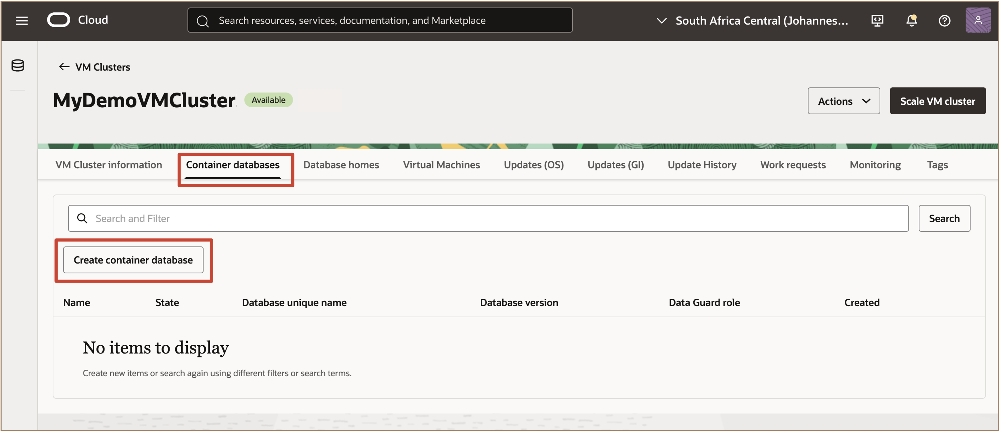
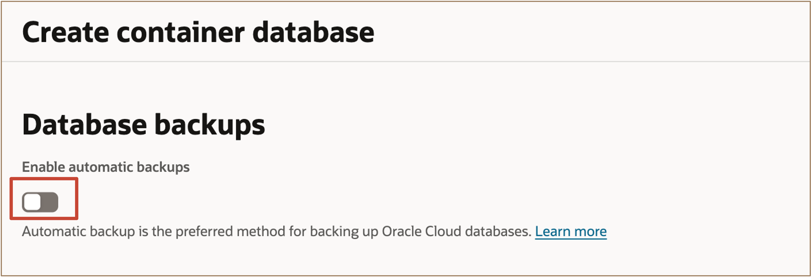

# Provision Oracle Exadata Database Service on Exascale Infrastructure using the OCI Console

## Introduction

This lab walks you through how to create an instance of the Exadata Database Service on Exascale Infrastructure using the OCI Console. 
 

**Estimated Time:** ***1 Hour 10 minutes***

Watch the video below for a quick walk-through of the lab.
  [Create a Custom Database Software Image](youtube:ggh0pIuPj2g)

### Objectives

-   After completing this lab, you should be able to create an Exadata VM cluster and an Oracle Database on Oracle Exadata Database Service on Exascale Infrastructure using the OCI Console.

### Prerequisites

This lab requires completion of the following:

* Successful Login to a Tenancy with a service limit assigned for the **Oracle Exadata Database Service on Exascale Infrastructure**

## Task 1: Create an Exadata VM Cluster Resource on Oracle Exadata Database Service on Exascale Infrastructure 

1. Open the navigation menu. Under **Oracle Database**, click **Exadata Database Service on Exascale Infrastructure**.

  

2. In the left rail, **VM Clusters** is selected by default. In the **Applied filters**, Select your compartment. Click the **Create VM Cluster** button. 
  
  
    
    This causes the **Create VM Cluster** page to be displayed.  

3. **Provide the basic information to configure the VM cluster** in an Oracle Exadata Database Service on Exascale Infrastructure.

    * For **Compartment**: Ensure that the compartment that you want the VM Cluster to be created in is displayed.

    * Enter the **Display Name** for the VM Cluster 

    * Enter the **Cluster Name** 

    * For **Availability Domain**: Select the availability domain from the displayed options available. 

 

4. **To Configure the VM cluster, provide the following information:** 
    * For the **Number of VMs in the cluster**: ***Enter 2***
    * For **ECPUs enabled per VM**: ***Enter 8***

    

    * ***Reserve 4 additonal ECPUs*** by clicking on **Reserve additional ECPU to increase link** and entering the following:   
        * For **Total ECPUs per VM:** Provide a total number of ECPUs to allocate per VM. ***Enter 12***.  
        * The **Additional ECPUs reserved per VM** field which is (read only) will now indicate that there are now **4 reserved ECPUs per VM**. 
    * The **Memory per VM (GB)** field which is (read only) will display the amount of memory allocated to each VM.   
    ***Memory is calculated based on 2.75 GB per total ECPU***. 

    

    Click on **Save**

    * For the **Storage type**: Select ***Exascale smart storage***

    * Enter the **VM file system storage** capacity per VM (GB)

      **Note:**  The VM Filesystems storage includes /u02 capacity, where your Database Homes will go, along with all of the other VM filesystems (/, /boot, /tmp, /var, /var/log, /var/log/audit, /home, swap, kdump, /u01, grid, /u02). Any extra capacity selected beyond system minimums will go into /u02. 
    
    

  

5. **Enter Configuration Details for Exascale Database Storage Vault:** 
    * Select **Create new vault**. 

    **For a new vault, specify the following:** 
    * For the **Exascale Vault name:** enter ***MyDemoStorageVault*** . 
    * For the **Storage Capacity for Databases (GB):** ***enter 300***. 

  

    For **Storage auto scaling**, ensure the ***Storage auto scaling toggle switch*** is turned on. By default, the **Storage auto scaling** is on.  
   
    Specify the desired **Auto scaling limit in GB**.

    > **Note:** Users must define an auto scaling limit. By default, the auto scaling limit is set to 10% above the allocated storage vault size.

    

    With auto scaling enabled, if the system detects that vault's free space is less than or equal to 5% of allocated storage capacity, it automatically expands the vault capacity in increments of 10% (of the allocated storage) until the user-defined auto scaling limit is reached.

6. **Select the Oracle Grid Infrastructure version and add SSH key:** 
    * **Grid Infrastructure Release and Version fields:** display the Oracle Grid Infrastructure versions available for deployment in the VM cluster.  
    ***Accept the default values for the 26ai release***.

    * **Add your SSH Key for future access to your VMs**. 
      
        <u>Choose from:</u>

        * **Generate SSH key pair**(Default option) Select this option to generate an SSH keypair. Then in the dialog below click Save private key to download the key, and optionally click Save public key to download the key. 
        * **Upload SSH key files**: Select this option to browse or drag and drop .pub files. 
        * **Paste SSH keys:** Select this option to paste in individual public keys.

  
 

7. **To Configure the network settings, Select VCN and select Client and Backup subnet** 
    * **For the Virtual Cloud Network (VCN):** Select the ***virtual cloud network (VCN)*** for the compartment in which you want to create the VM cluster. Click ***Change Compartment*** to select a VCN in a different compartment.
    
    * **For the Client subnet:** Select the ***client subnet*** in the compartment. This is the subnet to which the VM cluster should attach. Click ***Change Compartment*** to select a subnet in a different compartment.
    
    * **For the Backup Subnet:** Select the subnet to use for the ***backup network***, which is typically used to transport backup information to and from the Backup Destination, and for Data Guard replication. Click ***Change Compartment*** to select a subnet in a different compartment, if applicable.
    
    * **For the Hostname Prefix:** Enter the hostname

  

8. **Select license type & choose opt-in choices for Diagnostic & Collections options.**
    * **Choose a license type:** The type of license that you want to use for the VM cluster. Your choice affects metering for billing. Select the ***Bring Your Own License (BYOL)*** OR ***License Included*** option.

  **Select Diagnostic and Collections Options**

  In the Edit Diagnostics Collection Settings dialog, you can enable or disable any of the Diagnostics Collections options. By enabling diagnostics collection and notifications, Oracle Cloud Operations and you will be able to identify, investigate, track, and resolve guest VM issues quickly and effectively. ***Accept the default values***.

    * **Enable Diagnostics Events:** Allows Oracle to collect and publish critical, warning, error, and information events to me. For more information, see Overview of Database Service Events
    * **Enable Health Monitoring:** Allows Oracle to collect health metrics/events such as Oracle Database up/down, disk space usage, and so on, and share them with Oracle Cloud operations. You will also receive notification of some events. 
    * **Enable Incident logs and trace collection:** Allows Oracle to collect incident logs and traces to enable fault diagnosis and issue resolution. 
  
  
 
  
9. Click **Create VM Cluster** to proceed with provisioning. 

## Task 2: Create an Oracle Database on Exadata Database Service on Exascale Infrastructure using OCI Console

1. In the **VM Clusters** page, click on the **Container databases** tab and click ***Create container database***.

   

2. In the **Create Container Database** page enter the **basic information for creating the container database:**
   
     * For the **Database Name:** Enter ***My26aiDB***
     * For the **Database Unique Name Suffix:** Enter ***DemoDB_26aiExascale***
     * For the **Pluggable Database Name:** Enter ***MyPDB01***
     * For the **Database release:** Select ***26ai***  
     * For the **Database Home source** choose: ***Create a new Database Home***
     * Select Database Home with display name of ***MyDemo26aiDBhome01***

   

     * Next configure your **Administrator Credentials:** 

   

3. In the **Configure Database backups** page, if you accept the defaults setting, the database will be backed up using the Oracle Database Autonomous Recovery Service. You have the option to use OCI Object Storage by changing the **Backup destination**. 
   
   
   
   For this lab, we will not be enabling **Automatic Backups** for the database during the create database workflow.
    * ***Uncheck*** **the box for:** ***Enable Automatic Backups***

   
      
4. **Review & Configure Advanced Options** for the Container Database by clicking on the ***Show Advanced Options*** link.
   
   Under the **Management tab** set the Oracle_SID to ***ExascaleDemo***

   

   Under the **Encryption tab** you can select the desired key management method. Select ***Use Oracle-managed keys***.

   

   Under the **Tags tab:** you can add free-form tags to your resource.  If you want to apply a defined tag, you must have permissions to use the tag namespace. Remember that you can also apply tags to your resources after they are provisioned.

   
5. Click ***Create*** to create the container database.

   

    
***!!! Congratulations:*** You may now **proceed to the next lab**. 

## Learn More

* Click [here](https://docs.oracle.com/en-us/iaas/exadb-xs/doc/manage-vm-clusters.html) to learn more about managing the VM clusters on Oracle Exadata Database Service on Exascale Infrastructure.

## Acknowledgements

* **Author** - Leo Alvarado, Tammy Bednar, Product Management
  
* **Last Updated By** - Leo Alvarado, Product Management, March 2025.
