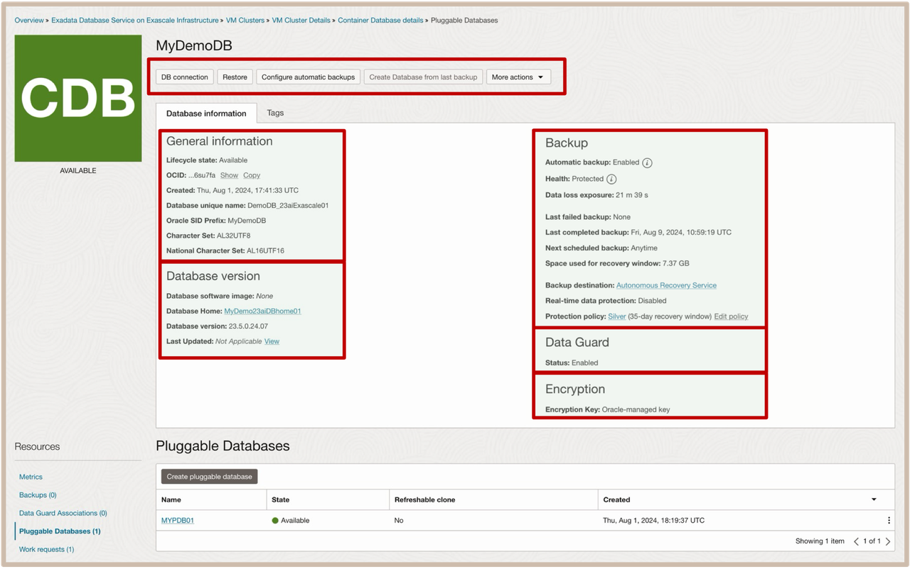
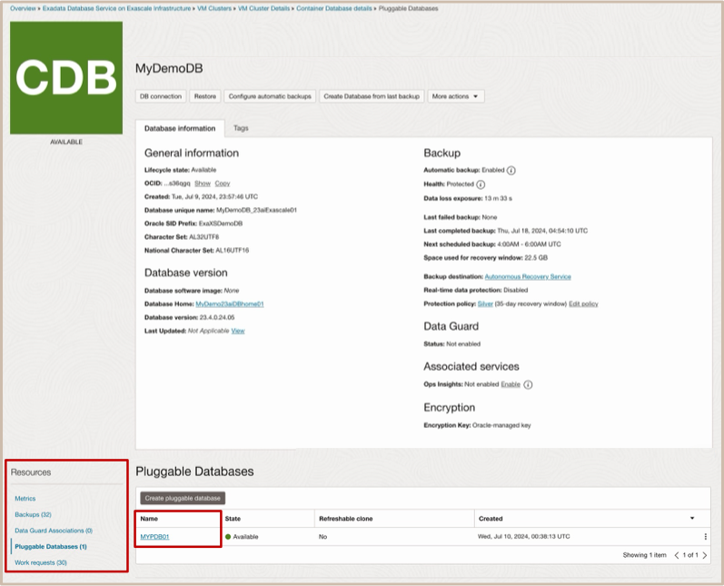
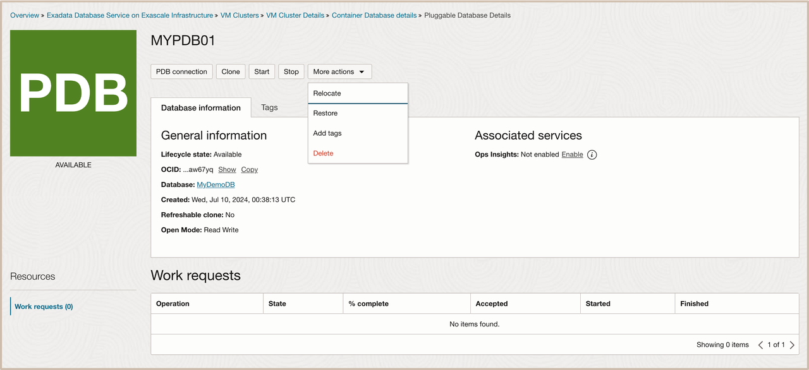
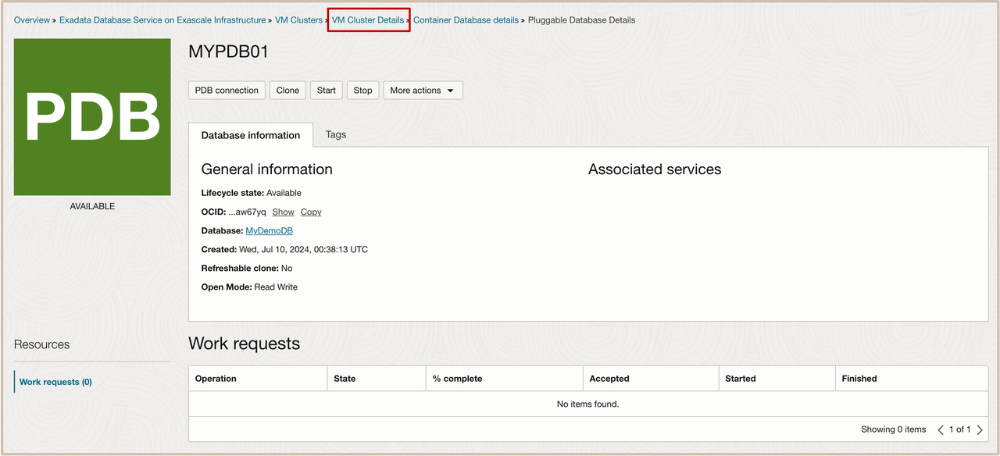
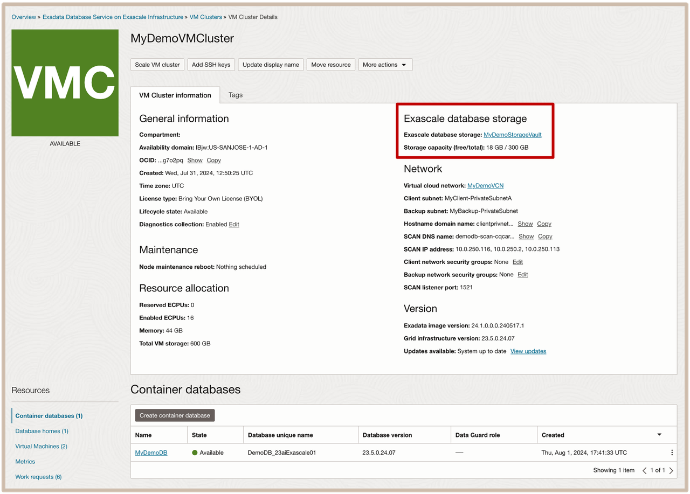
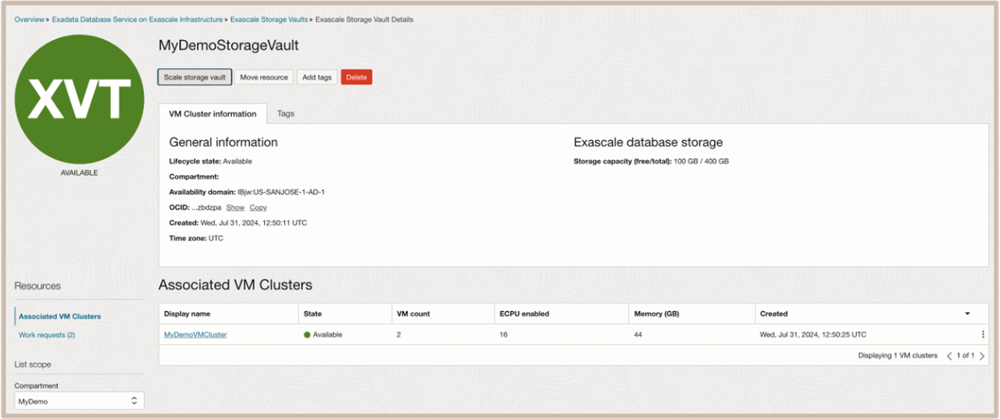

# Discover Oracle Exadata Database Service on Exascale Infrastructure Environment Details using OCI Console

## Introduction

  This lab walks you through the steps to discover how to navigate to the Exadata Database Service on Exascale Infrastructure and discover the environment details for the Exadata VM Cluster, Container Database, Pluggable Database, and the Exascale Storage Vault using the OCI Console.

**Estimated Time:** ***5 minutes***

### Objectives

-   After completing this lab, you should be able to discover Exadata Database Service on Exascale Infrastructure environment details using the OCI Console.

### Prerequisites

This lab requires the completion of the following:

* Completion of **Lab 1**

## Task 1: Discover Exadata VM Cluster Details

1. **Navigate to the Exadata Database Service on Exascale Infrastructure:** 
    * Open the **Navigation Menu**. 
    * Under **Oracle Database**, click **Exadata Database Service on Exascale Infrastructure**.

  

2. **Navigate to the list of availbale cloud Exadata VM cluster in your assigned compartment:**
    * In the left rail, **VM Clusters** is selected by default. 
    * Under **List Scope**, Select your assigned compartment. 
    * Then **click on your clusters highlighted name that has a State of Available** to view the **VM Cluster Details page**. 
   
  

1. On the **VM Cluster Details** page ***Discover the available VM Cluster information:***
    * In the **General Information** Section you can find the following key items:
        * What Compartment the VM Cluster is in.
        * The Availability Domain of the VM Cluster.
        * The OCID of the VM Cluster.
        * The License Type selected for the VM Cluster.
    * In the **Maintenance** Section you can find:
        * Information about scheduled Node Maintenance Reboots.
    * The **Resource Allocation** Section contains the following Cluster Wide Metrics:
        * The numer of Reserved ECPUs available to conduct online scale up operation.
        * The number of Enabled ECPUs across the VM Cluster.
        * The amount of Memory allocated to the VMs across the VM Cluster.
        * The total VM File Ystem Storage allocated to the VMs across the VM Cluster
    * In the **Exascale Database Storage** Section you will find the followign key items:
        * The location of the Exascale Storage Vault servicing this VM Cluster.
        * The amount of Exascale database storage that was allocated and how much is free.
    * The **Network** Section contains the followign key pieces of networking information:
        * The nameof the VCN being used for the subnets and routing rules.
        * The name of the Client SUbnet and Backup Subnet selected for this VM Cluster.
        * The SCAN IPs, SCAN DNS name, and SCAN listener port.
    * In the **Version** Section of the page, you will find the followign key items:
        * The Exadata Image Version.
        * The Grid Infrastructure Version.
        * A link to view any available Updates required to keep your system up to date.

  

4. On the left side of the page, under the **Resources** section: ***Discover the additional VM Cluster resources:***
      * You can click the **Container Database** link to see a list of available databases.
  
      * You can click the **Database Homes** link to see a list of the existing database homes.
  
      * You can click the **Virtual Machines** link to see a list of the Virtual Machines that are allocated to your VM Cluster
  

## Task 2: Discover Container Database (CDB) & Pluggable Database (PDB) Details

1. Navigate to the **Container Database Details** page. 
    * On the left side of the page, under the **Resources** section: Select **Container Database** link. 
    * From the List of existing Container Databases in your compartment, select the name of your **Container Database that has a State of** ***Available*** to view the **Container Database Details** page. 

  

2. On the **Container Database Details** page ***Discover the following Container Database Information***

    * On the **Container Database (CDB) Details** page, you can see a list of actions that can be performed, such as obtaining the connection string, and Restoring, Configuring Automatic Backups, Creating a Database from a Backup, and more actions.
    * In the ***General Information*** Section you can find the following key items:
        * The Lifecycle state of the Container Database.
        * The OCID of the Container Database.
        * The Database Unique Name and Oracle SID Prefix of the Container Database.
    * In the ***Database Version*** Section of the page, you will find the followign key items:
        * The name of the database software image if one was used to creade the Container Database. 
        * The name of the database home that has a link so that you can see what other databases share this home. 
        * The Database version for the Container Database.
        * You will also find a link to view any available Updates required to keep your system up to date.
    * In the ***Backup*** Section you can find:
        * If your container database is configured for Automatic Backups.
        * You can also see if your backups are healthy and know your exact Data Loss exposure.
        * In this section, you can also see when your last backup was, when the next one is scheduled for, and how much storage you are using to backup this container database.
        * The Backup section also includes information about the Backup Destination being used, and identifes the protection poicy being used and if realtime protection feature of the Recovery service is in use.
    * The ***Data Guard*** Section of the page is pretty straight forward:
        * Identifes if the Container Database has a peer Data Guard enabled for it or not.
    * The ***Associated Services*** Section of the page:
        * Informs you if the (optional) **Operations Insights** feature has been enabled for the container database.
    * The ***Encryption*** Section of the page:
        * Provides you with information about the type of encryption key management that is being used. 
   
  
  

3. On the left side of the page, under the **Resources** section: ***Discover the additional Container Database resources:***
    * You can click the **Backups** link to see a list of available database backups.
  
    * You can click the **Data Guard Association** link to see if this database has a Data Guard Peer.
  
    * You can click the **Pluggable Database** link to see a list of the Pluggable Databases that have been created in this Container Database.
  
      
  
4. Now lets ***Discover Details about our Pluggable Databases***
    * From the **Resources** Section of the **Container Database Details** page, Click on the **Pluggable Database** Link
    * Select the ***name of your Pluggable Database*** link to navigate the **Pluggable Database Details** page.

    

5. On the **Pluggable Database Details** page ***Discover the following Pluggable Database Information***
    * On the ***Pluggable Database (PDB) Details*** page, you can see a list of actions that can be performed, such as obtaining the connection string, and Cloning, Starting, Stopping, Relocating, and Restoring the PDB.
    * In the ***General Information*** Section you can find the following key items:
      * The Lifecycle state of the Pluggable Database.
      * The OCID of the Pluggable Database.
      * The linked Name of the Container Database where this PDB resides.
      * In this section, you wil also see information indicating if the PDB is a Refreshable Clone and its Open Mode role.
    * The ***Associated Services*** Section of the page:
      *Informs you if the (optional) Operstions Insights feature has been enabled for the pluggable database.

  

## Task 3: Discover Exascale Storage Vault Details

1. Navigate from the **Pluggable Database Details** page to the **VM Cluster Details** page.

    *  On the **Pluggable Database Details** page, you will see the navigation bread crumb links. ***Click on the VM Cluster Details*** link.

  

2. On the **VM Clusters** page, click on the ***Exascale Storage Vault name*** for your VM Cluster. 
  This will launch the **Exascale Storage Vault Details** page.
  

   
3. On the **Exascale Storage Vault Details** page ***Discover the following Exascale Storage Vault Information***
    * On the **Exascale Storage Vault Details** page, you can see a list of actions that can be performed, such as scaling the storage vault or moving the Vault to another compartment.  
    * In the **General Information** Section of the **VM Cluster Information** tab, you can find the following key items:
        * The Lifecycle state of the Exascale Storage Vault.
        * What Compartment the Exascale Storage Vault is in.
        * The Availability Domain of the Exascale Storage Vault.
        * The OCID of the Exascale Storage Vault.
    * In the **Exascale Database Storage** Section you will find:
        * The amount of Exascale database storage that was allocated and how much is free.
    * On the left side of the page, under the **Resources** section: 
        *   You can click on the **Associated VM Clusters** link to see a list of VM Clusters that are using this storage vault.

  

***!!! Congratulations:*** You may now **proceed to the next lab**.

## Acknowledgements

* **Author** - Leo Alvarado, Eddie Ambler, Tammy Bednar,  Product Management

* **Last Updated By** - Leo Alvarado, Product Management, March 2025.
