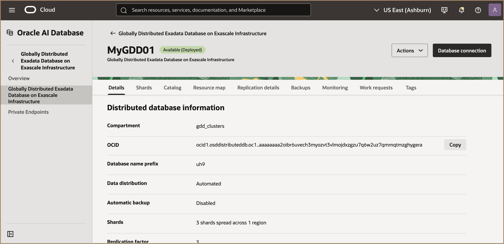
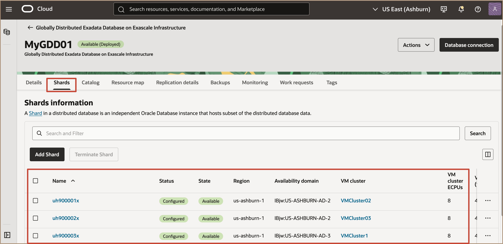
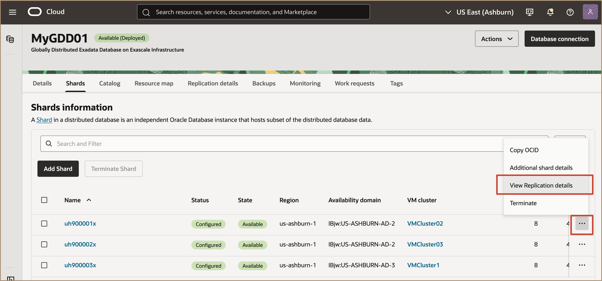
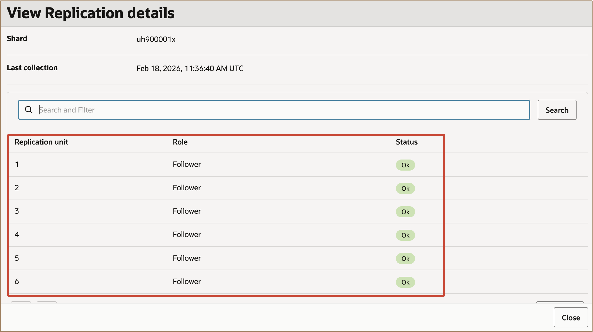
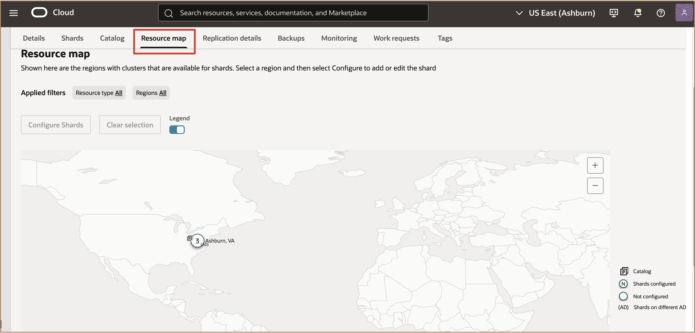
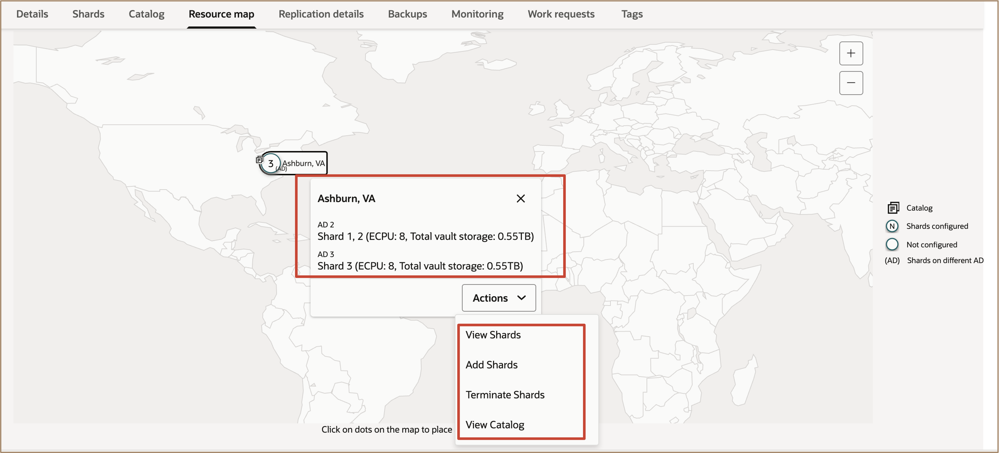
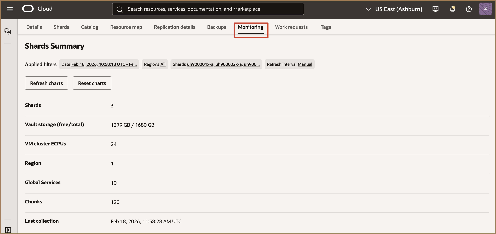
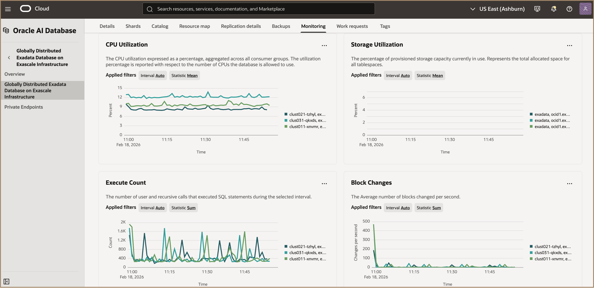

# Discover the Globally Distributed Exadata Database on Exascale Infrastructure Resource

## Introduction

  This lab walks you through to discover the Globally Distributed Exadata Database on Exascale Infrastructure Resource.

**Estimated Time:** ***5 minutes***

### Objectives

-   After completing this lab, you should be able to.... 

### Prerequisites

This lab requires the completion of the following:

* Completion of **Lab 1**

## Task 1: Discover the Globally Distributed Exadata Database on Exascale Infrastructure Resource 

1. Navigate to Globally Distributed Exadata Database on Exascale Infrastructure page.
   
   
   
2. Review the environment details such as region, shard count, and replication type.

   Go to the **Shards** tab to view list of all shards with their configuration settings. 

   

   Select **View Replication Units** in the action Menu to see the status of the replication unit leaders and followers on each shard. 

   

   

   Select **Additional shard details** for more details.
   
3. Go to the **Catalog** tab to view the configuration settings for the catalog database.

   Use the Actions Menu to view configuration details and settings.
   
4. Go to the **Resource map** to display a visual representation of the shards and catalog configuration. 

   

   Hover over the numbers to see some configuration information, including availability domain (AD), and click the information icon for more details.

   

5. **Replication details** displays a list of the replication units by ID number and each member is labeled with the shard it resides on.

   

   Understand preconfigured prerequisites for the Global Distributed Database environment.

6. Click on the **Monitoring** tab to view and monitor the shards.

   

   

***!!! Congratulations:*** You may now **proceed to the next lab**.

## Acknowledgements

* **Author** - Leo Alvarado, Deeksha Shrivastava, Product Management

* **Last Updated By** - Leo Alvarado, Product Management, Feb 2026.
