# Create a Globally Distributed Exadata Database on Exascale Infrastructure Resource

## Introduction

This lab guides you through the process of creating a Globally Distributed Exadata Database on Exascale Infrastructure (Distributed ExaDB-XS) in Oracle Cloud. You will configure the resource, add shards and a catalog database, and set all required networking, security, and advanced options.
 

**Estimated Time:** ***2 Hours 10 minutes***

Watch the video below for a quick walk-through of the lab.
  [Create a Custom Database Software Image](youtube:ggh0pIuPj2g)

### Objectives

-   After completing this lab, you should be able to Create a Globally Distributed Exadata Database on Exascale Infrastructure Resource using the OCI Console.

### Prerequisites

This lab requires completion of the following:

* Successful Login to a Tenancy with a service limit assigned for the **Oracle Exadata Database Service on Exascale Infrastructure**

## Task 1: (***Pre-Created for this Lab***) Review the Exadata Database Service on Exascale Infrastructure Resources

## Task 2: Create a Globally Distributed Exadata Database on Exascale Infrastructure Resource

1. Navigate to the **Globally Distributed Exadata Database on Exascale Infrastructure** list page in your Oracle Cloud Console.
   
   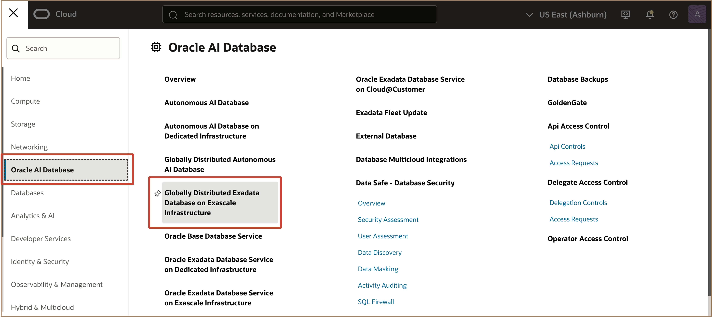

2. Click **Create Database**.
   
   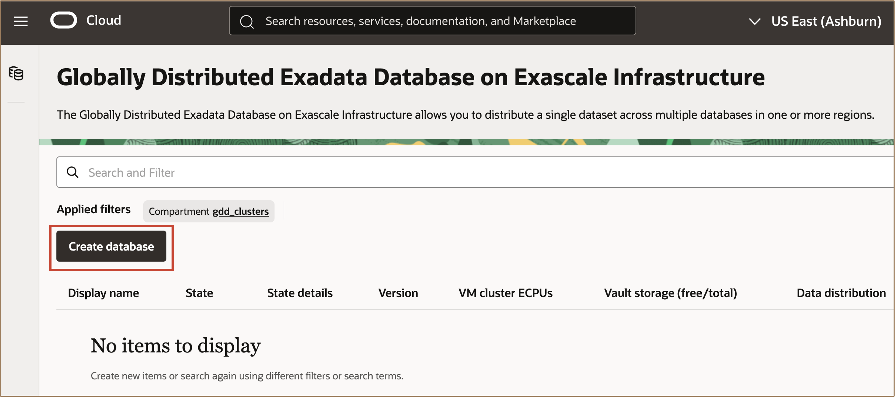

3. **Provide Basic Information**

    Fill in the basic configuration details for your new Distributed ExaDB-XS resource:
    - **Compartment:** Select the compartment where the resource will reside.
    - **Display name:** Enter a descriptive name for the resource. *(This can be changed later.)*
    - **Database name prefix:** Define a prefix to be added to all configured database names for easy identification.
    - **Database version:** Select ***Oracle Database 23ai*** (currently supported release).
   
   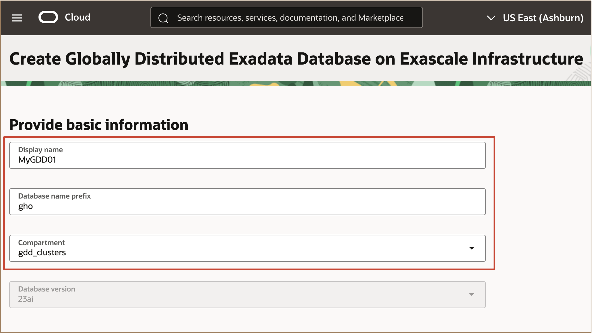

4. **Configure Shards**

    You can set up shards using either the **map view** or **list view**.
    - **Map View:** Click the region where you want to deploy shards, then choose **Configure Shards** to enter their settings.
    - **List View:** Input all settings directly on the Create page.
   
   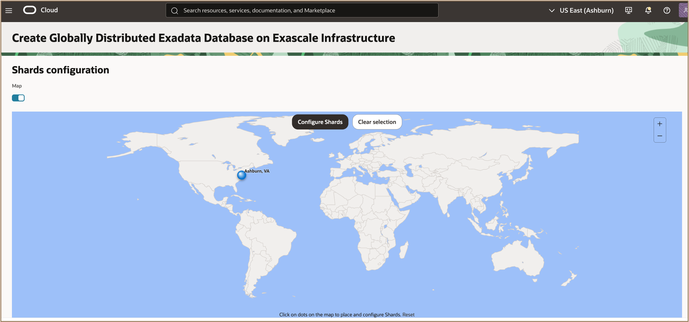

    Provide the following details:
    - **Data distribution:** Only `Automated` (uses partitioning by consistent hash) is currently supported. `User managed` is not supported.
    - **Shards in region (count):** Specify the number of shards in the selected region (up to 10 during creation; more can be added later).
    - **Replication type:** Set this to `Raft`. Raft creates replication units and manages chunk assignment, movement, and workload balancing.
    - **Replication factor:** Select a factor less than the shard count—the number of replicas in a unit, including the leader and its followers.
   
   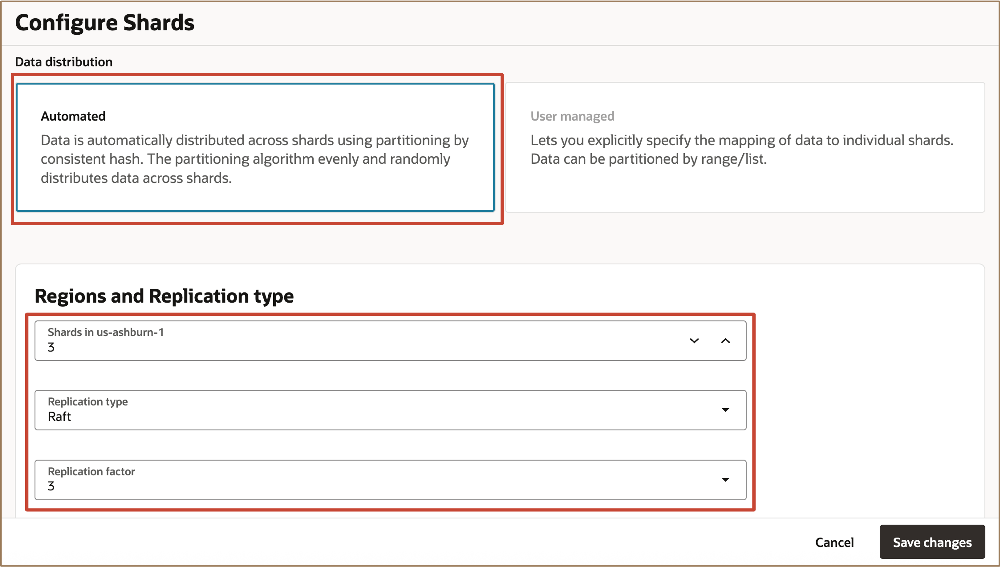

    - **Shards list:** 
        - Use **+ Add Shard** to add each shard.
        - Use **Edit** from the Actions menu to adjust region/cluster placement.
        - Click a VM cluster name to view its details or use **Create VM cluster** to add new clusters as needed.
        - **Recommendation:** Use one VM cluster per database (shard or catalog).
    - *For Exadata VM cluster configuration requirements/recommendations, see [Create Exadata VM Clusters on Exascale Infrastructure].*
   
   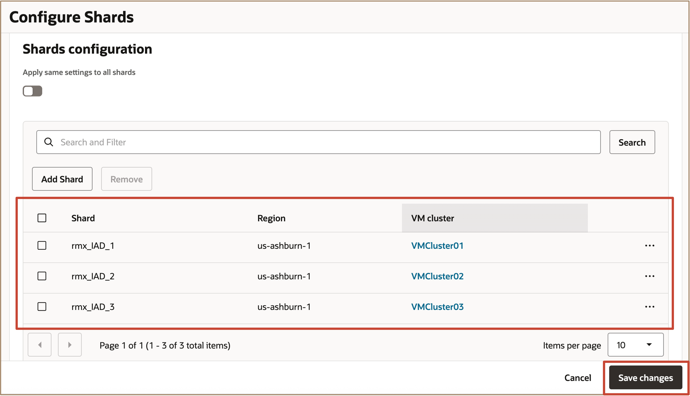
   
   Click on **Save Changes**

   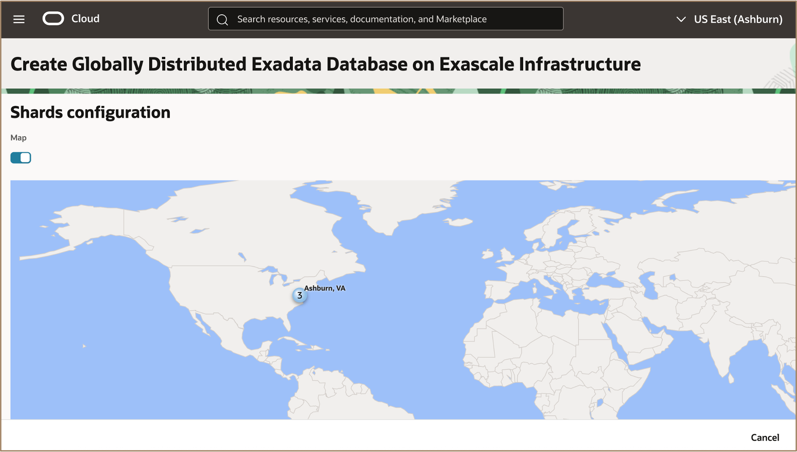
   

5. **Configure Shard Catalog**

    Set up shard catalog settings for your distributed database topology.
    - You may use the same configuration as for shards by enabling the **Same as Shard's configuration** toggle, or disable it to customize settings for the catalog.

    Configure these settings:
    - **Region:** Select the region for the catalog database (serves as primary if Data Guard is enabled).
    - **VM cluster:** Choose the VM cluster for the catalog database.  
        - **Recommendation:** Use separate VM clusters for each database (catalog, shard, standby).
    - **Data Guard:** Enable to create an Oracle Data Guard standby for the catalog in the selected Data Guard region.
    - **Data Guard region:** Select the region where the catalog standby will reside.
    - **Data Guard VM cluster:** Select the VM cluster (in the Data Guard region) to host the standby catalog database.  
        - **Recommendation:** Use one VM cluster per database.
    - *Note: Raft replication type does not apply to the catalog. For catalog replication, use a Data Guard standby.*
   
   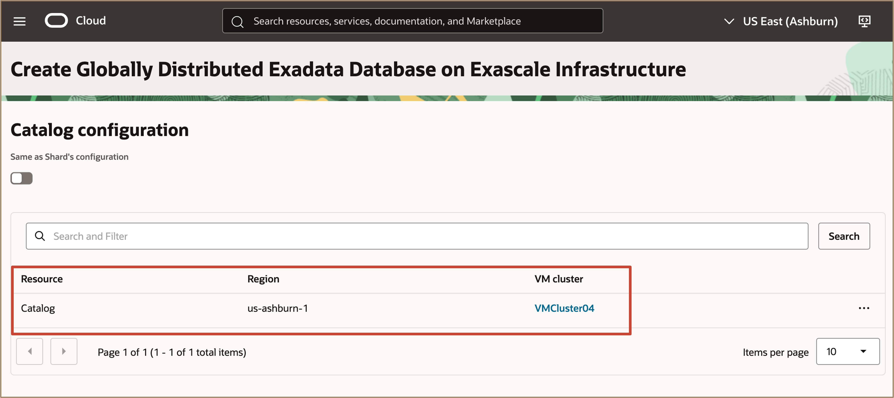
   

6. **Configure Additional Settings**

    Provide the following advanced and security-related configurations:
    - **Create administrator credentials:** Define the ADMIN user for all shard and catalog databases.
   
   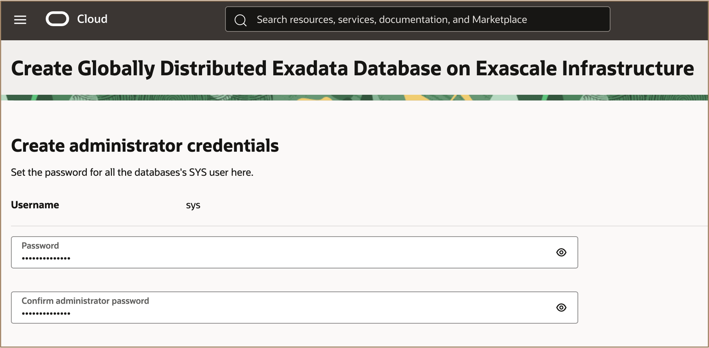

    - **Encryption key:** Select the vault and key created in **Task 5. Configure Security Resources** (from previous environment setup).
    - **Select private endpoint:** Choose the private endpoint created for Distributed ExaDB-XS (from your network configuration setup).
   
   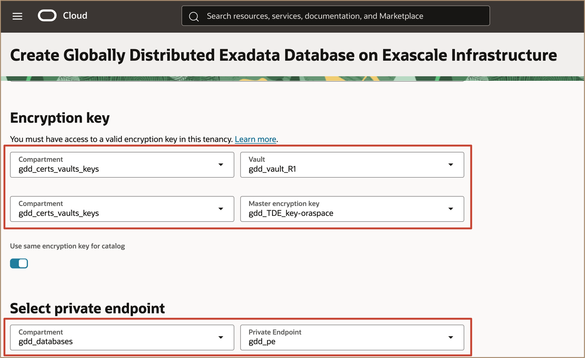

    - **Select character sets:** Choose character sets for all databases.  
        - **Recommendation:** AL32UTF8 (Character set), AL16UTF16 (National character set).
    - **Select ports:** Enter the GSM listener port, ONS port (local), and ONS port (remote).  
        - *Each remote ONS port must be unique for each distributed database.*
   
   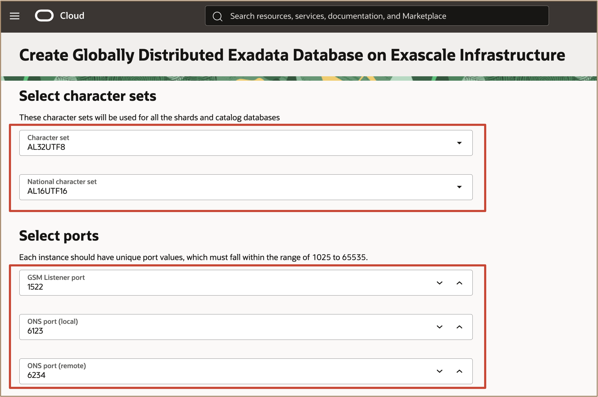

    - **Advanced options: Chunks:** Optionally configure the number of chunks per shard.
    - **Advanced options: Replication unit:** View the number of Raft replication units. Each unit contains a set of chunks and has a leader and replicas distributed across shards.
    - **Advanced options: Backups:** Enable and schedule automated database backups. See Exadata Database Service on Exascale Infrastructure documentation for backup options.
    - **Advanced options: Tags:** Optionally add tags for resource management (these can be added post-creation as well).

7. **Validate and Create the Resource**
    - Click **Validate** to run system checks against your configuration.
   
   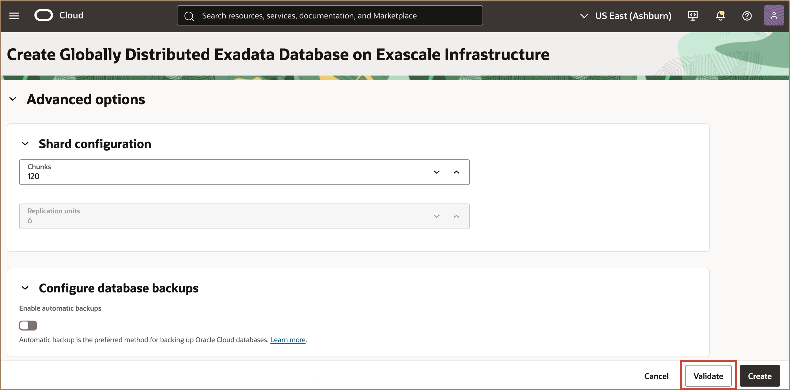

    - Address any validation errors, if present, and re-run validation as needed.
   
   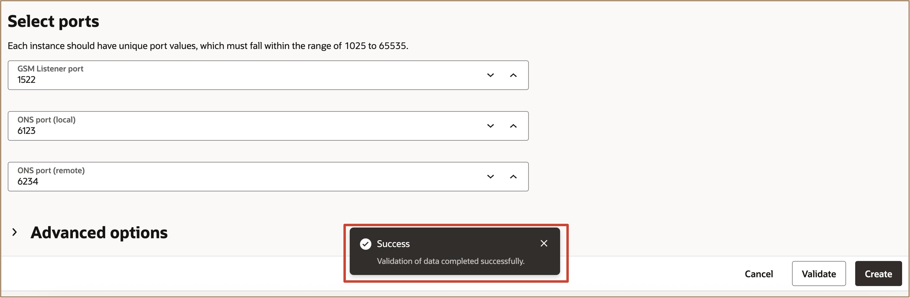

  

8. **Provision the Distributed ExaDB-XS Resource**
    - When validation is successful, click **Create** to begin provisioning.
   
   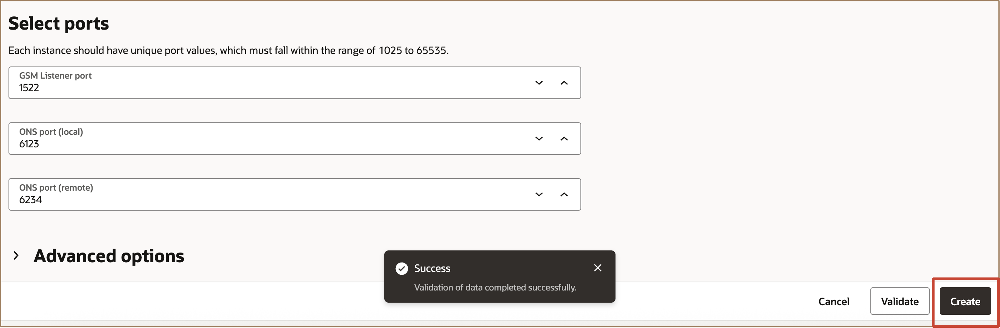

    - **Note:** Creation may take some time as tasks such as compute allocation, software installation, and certificate generation are performed.
    - You can monitor progress via the **State** column or by clicking the resource’s display name and viewing the **Work requests** tab.
   
   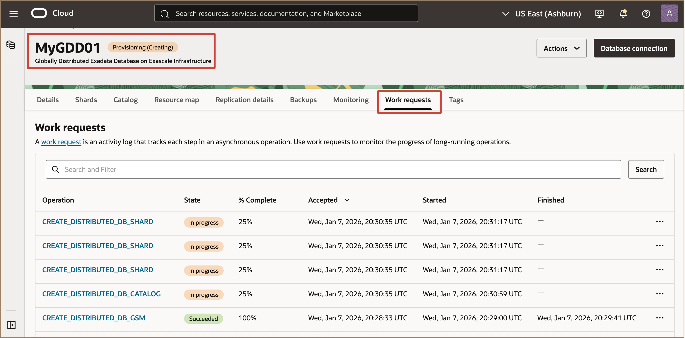

   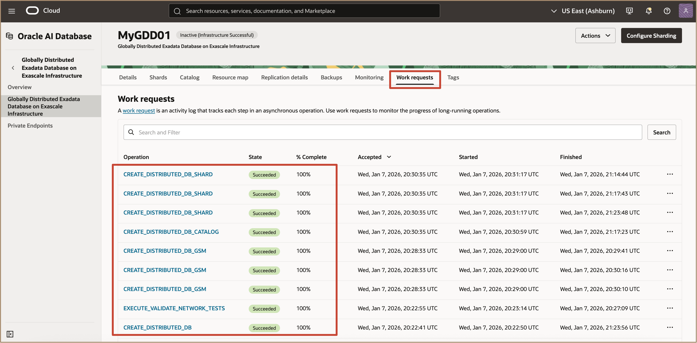

    - Creation is complete when all shards show as "Available" on the **Shards** tab.
   
   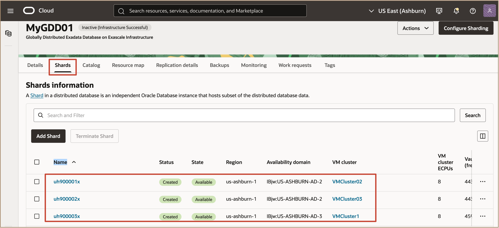

> **Important Notes and Cautions:**
- **Do not move any vaults or keys** after creating a Distributed ExaDB-XS resource. Moving them will disrupt the functioning of the resource.
- For optimal deployment, use one VM cluster per database (shard, catalog, or standby).
- Each remote ONS port number must be unique across Globally Distributed Databases unless you have deleted the previous database entirely.

## Task 3: Deploy a Globally Distributed Exadata Database on Exascale Infrastructure

This lab guides you through deploying your configured Globally Distributed Exadata Database on Exascale Infrastructure (Distributed ExaDB-XS). Deployment should be performed when your initial configuration is complete or after making changes, such as adding or removing a shard.

**Prerequisites**

- You have already created and configured the Distributed ExaDB-XS resource and any desired shards or configuration changes.

> **Note:**  
> You must deploy the Distributed ExaDB-XS within 7 days of completing the initial configuration or adding shards. Failure to deploy within this window requires you to terminate resources and start again.

1. In the **Globally Distributed Exadata Database on Exascale Infrastructure**  page. Select the Distributed ExaDB-XS you are ready to deploy.
   
2. On the details page for the selected resource, choose **Configure Sharding**.
   
   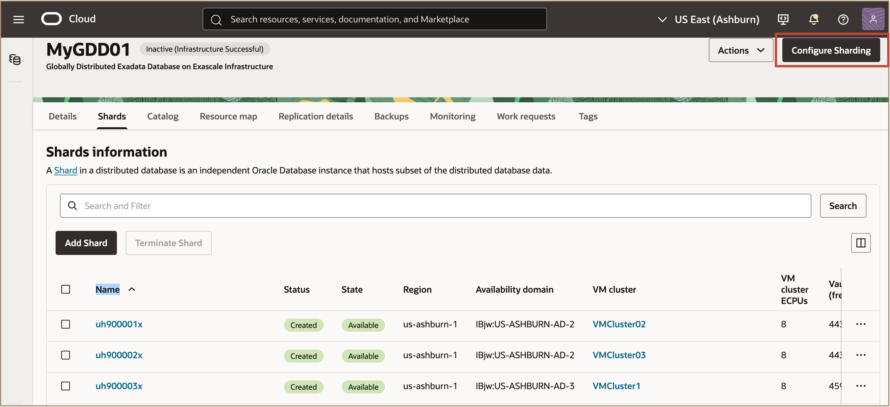

   ***(Optional)*** **Rebalance Shards:**

   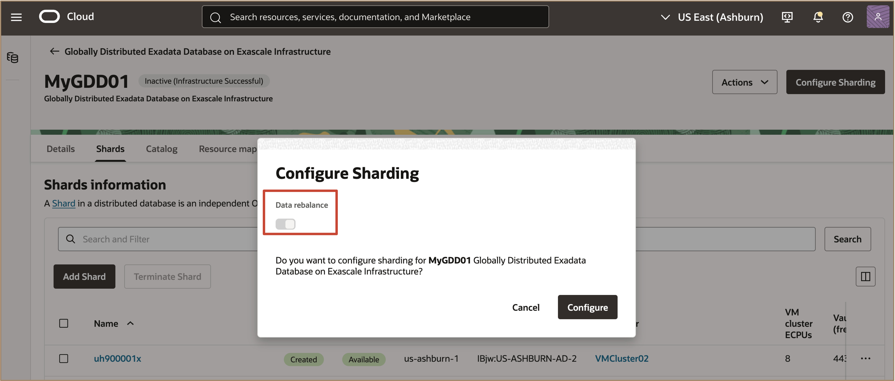
   
   If this is not the initial deployment (i.e., you have added or removed shards), you can select **Data rebalance**.
   
   Rebalancing automatically redistributes data across the configured shards for Automated Sharding type.

3. Select **Configure Sharding** to begin the deployment process.
   
   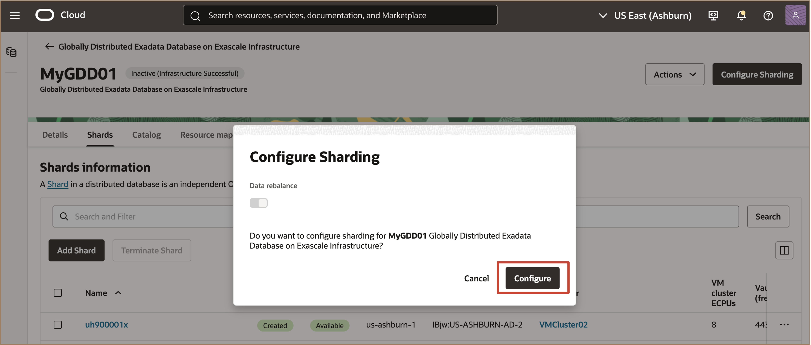

   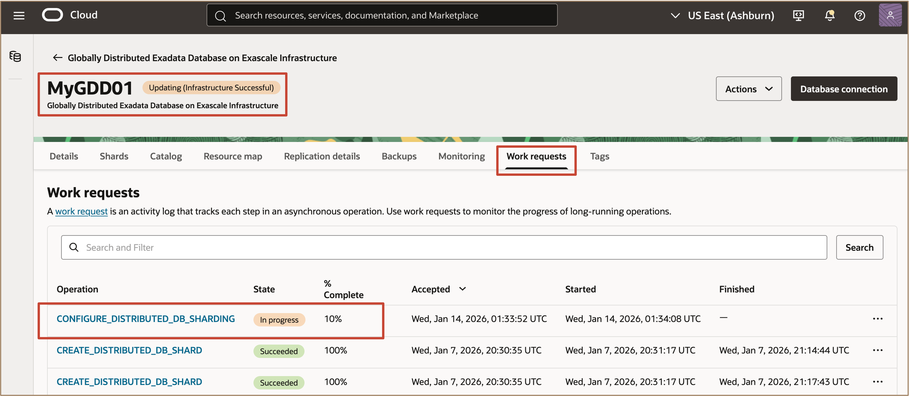

   Monitor the deployment status on the resource details page. Ensure that all validation steps in configuration have been completed before deployment. 

   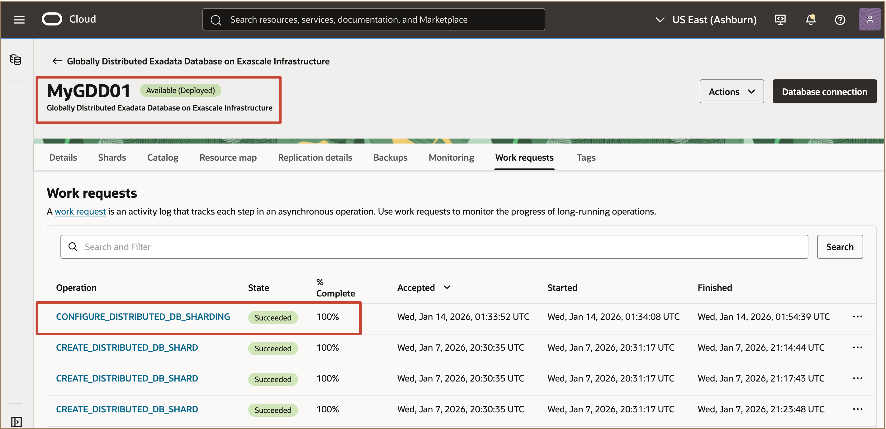

   If deployment is not performed within the 7-day window after configuring or modifying shards, resources must be deleted and recreated.

   

## Task 4: Discover the Globally Distributed Exadata Database on Exascale Infrastructure Resource 

1. Navigate to Distributed ExaDB-XS.
   
2. Review environment details such as region, shard count, and replication type.
   
3. Use the Actions Menu to view configuration details and settings.
   
4. Understand preconfigured prerequisites for the Global Distributed Database environment

    
***!!! Congratulations:*** You may now **proceed to the next lab**. 

## Learn More

* Click [here](https://docs.oracle.com/en-us/iaas/exadb-xs/doc/manage-vm-clusters.html) to learn more about managing the VM clusters on the Exadata Database Service on Exascale Infrastructure.

## Acknowledgements

* **Author** - Leo Alvarado, Deeksha Shrivastava, Shefali Bhargava,  Product Management, Product Management
  
* **Last Updated By** - Leo Alvarado, Product Management, Nov 2025.
