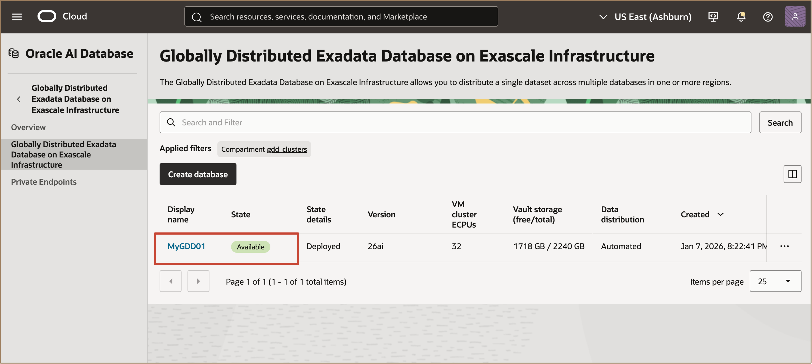
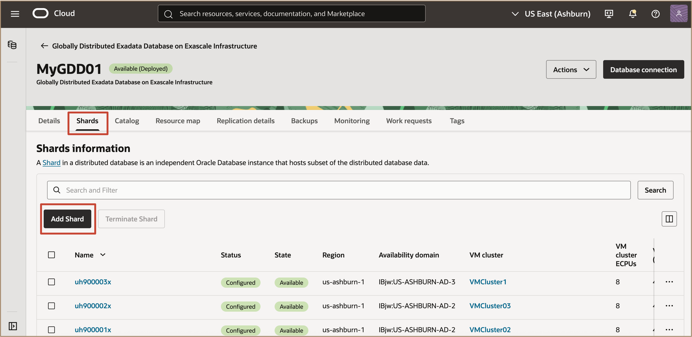
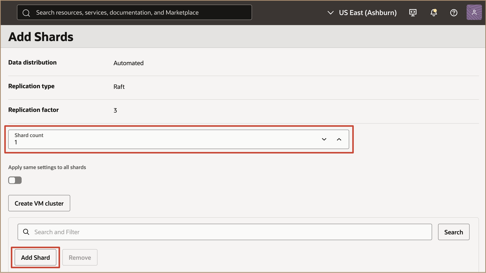
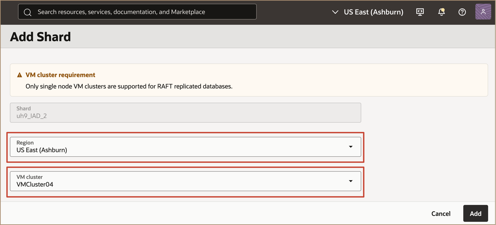

# Managing Oracle Globally Distributed Exadata Database on Exascale Infrastructure

## Introduction

This lab walks you through how to Manage Oracle Globally Distributed Exadata Database on Exascale Infrastructure.
 
  

**Estimated Time:** ***10 minutes***

### **Objectives**

-   After completing this lab, you should be able to 

### **Prerequisites**

This lab requires the completion of the following:

* Successful creation of a VM Cluster on Exadata Database Service on Exascale Infrastructure.

## Task 1: Adding Shards to a Globally Distributed Exadata Database on Exascale Infrastructure

This lab demonstrates how to add new shards to scale out your Globally Distributed Exadata Database on Exascale Infrastructure (Distributed ExaDB-XS). Adding shards enables you to increase the resource capacity and performance by horizontally expanding the database.

* When to Add Shards

You can add shards in two scenarios:
- After creating a Distributed ExaDB-XS resource but *before* deploying it.
- After deploying your Distributed ExaDB-XS and needing to scale out further.

1. In the Oracle Cloud Console, go to the **Globally Distributed Exadata Database on Exascale Infrastructure** list page.
   
   Select the Distributed Exadata Database Service on Exascale Infrastructure Instance to which you intend to add shards.

   

2. On the resource's detail page, under **Shards**, click **Add Shard**.
   
   

   **Configure the New Shard(s)**

    - In the **Add shard** panel, configure each new shard with the following settings:

        - **Shard count**: Specify the number of shards to add (up to 10 per set; further shards can be added after deployment if needed).
        
        

        Click on **Add Shard**

        - **Shard**: Review the display name for each shard or shardspace. The name is populated once you pick a region.
        - **Region**: Select the target region for the new shard.
        - **VM cluster**: Choose a VM cluster available in the selected region.
            > **Note:** It is recommended to use one VM cluster per database (shard or catalog).
        
        

3. **Set Administrator Credentials**: In **Create administrator credentials**, set the password for the ADMIN user of the new shard database.

**Choose Encryption Key**
    - Select the compartment, vault, and master encryption key for the new shard. Use resources configured as per *Task 5. Configure Security Resources* in your environment setup.

**Validate Configuration**
    - Click **Validate** to run system checks and ensure all new shard settings are correct.
    - If errors appear, resolve them and re-run validation.

4. **Add the Shards**: When validation passes, click **Add Shards** to deploy the new shards to your Distributed ExaDB-XS.

> **Notes**
> - If you are *scaling up* a **deployed** Distributed ExaDB-XS, you must deploy the new shards within **7 days** of completing this procedure. If not, you will receive an error and must terminate the new shard resources and start again.
> - If you are *adding shards* to an **undeployed** Distributed ExaDB-XS, you also have **7 days** from completing the original resource creation to add any shards and complete deployment. After 7 days, you must terminate and re-create resources.

## Task 2: Terminate (Deleting) a Shard

Terminating a shard in a Globally Distributed Exadata Database on Exascale Infrastructure (Distributed ExaDB-XS) configuration permanently deletes it and removes all automatic backups.

You cannot recover a terminated shard.

1. On the Globally Distributed Exadata Database on Exascale Infrastructure list page, select a Distributed ExaDB-XS.
   
2. On the Details page, in the Shards section, select the shard, and then select Terminate.
   
3. On the Terminate shard dialog enter the Distributed ExaDB-XS name to confirm that you want to remove the shard.
   
4. Click Remove.

## Learn More

* Click [here](https://docs.public.oneportal.content.oci.oraclecloud.com/en-us/iaas/exadata/doc/ecc-create-first-db.html) to learn more about Creating an Oracle Pluggable Database on Exadata Database Service on Exascale Infrastructure.

## Acknowledgements

* **Author** - Leo Alvarado, Deeksha Shrivastava, Shefali Bhargava,  Product Management, Product Management

* **Last Updated By** - Leo Alvarado, Product Management, Nov 2025.
