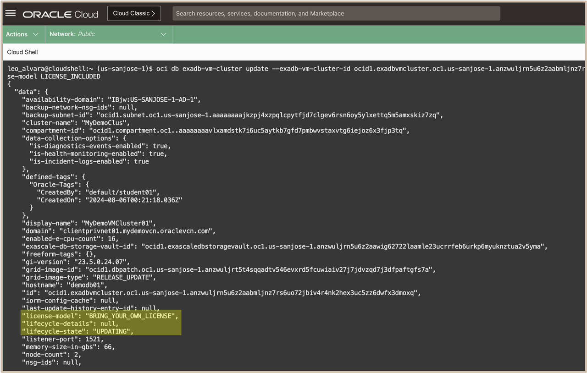
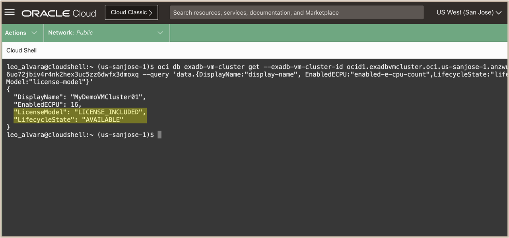

# Change License Type using OCI CLI


## Introduction

This lab walks you through the steps to Change License Type using OCI CLI.

Estimated Lab Time: 15 minutes

<!-- Watch the video below for a quick walk-through of the lab.
[Create an Exadata Database Service on Cloud@Customer Infrastructure](youtube:DCrivNA5bs8)
-->
### Objectives

-   After completing this lab, you should be able to Change License Type using OCI CLI

### Prerequisites

This lab requires completion of the following:

* Completion of **Lab1**

## Task 1: Change License Type using OCI CLI 

1. Open the navigation menu. Under **Oracle Database**, click **Exadata Database Service on Exascale Infrastructure**.
   
2. Select your ***Assigned Compartment***, and Click your assigned **VM Cluster** named ***MyVMClusterXX***.
   
    >**Note:** To use **OCI CLI** for this lab, we will be using the ***OCI Cloud Shell tool*** 
   
3. In the VM Cluster Details page, Copy the VM Cluster OCID by clicking on the ***copy*** button in the ***OCID*** field under the **General Information** section. 
   
   

   Paste the VM Cluster OCID to a text editor.
   
4. Click the **Developer tools** icon in the console header and select ***Cloud Shell*** from the drop-down menu. 
   
   

   This displays the Cloud Shell in a "drawer" at the bottom of the console:

   

5. Run the OCI CLI Command to change the license type of the VM Cluster. 
   
   For this lab, we will change the license type from ***Bring Your Own License (BYOL)*** to ***License Included***. 


      >**Note:** Replace ***{VMClusterId}*** with the VM Cluster OCID copied from *(Task 1 Step 3)*

    ```
    <copy>

      oci db exadb-vm-cluster update --exadb-vm-cluster-id {VMClusterID} --license-model LICENSE_INCLUDED

    </copy>
    ```
   
   **<u>Description:</u>**

   The OCI CLI command syntax is: **oci** ***db*** ***exadb-vm-cluster*** ***update*** ***--exadb-vm-cluster-id*** ***{VMClusterID}*** ***--license-model*** ***LICENSE_INCLUDED*** 

   **<u>Where:</u>**

      * ***db*** is the **service type** for the Oracle Database Cloud Services.
      * ***exadb-vm-cluster*** is the **resource type** for the Exadata VM Cluster on Exascale Infrastructure.
      * ***update*** is the **action** to update the Exadata VM Cluster on Exascale Infrastructure.
      * ***--exadb-vm-cluster-id*** is the **parameter** for the VM Cluster OCID.
      * ***--license-model LICENSE_INCLUDED*** is the **parameter** to change the license type of the VM Cluster to ***<u>License Included</u>***. 
  
   After running the command, you will see similar output below.

   

   You will see that the VM Cluster status ***"lifecycle-state"*** is ***UPDATING***.  

1. Once the change license type operation has been completed, Run the OCI CLI Command to get information about the Exadata VM Cluster on Exascale Infrastructure and to view the new license type for the VM Cluster. 

     >**Note:** Replace ***{VMClusterId}*** with VM Cluster OCID copied from *(Task 1 Step 3)*

    ```
    <copy>

      oci db exadb-vm-cluster get --exadb-vm-cluster-id {VMClusterId} --query 'data.{DisplayName:"display-name", EnabledECPU:"enabled-e-cpu-count",LifecycleState:"lifecycle-state",LicenseModel:"license-model"}'

    </copy>
    ```
   **<u>Description:</u>** 

   The OCI CLI command syntax is: **oci** ***db*** ***exadb-vm-cluster*** ***get*** ***--exadb-vm-cluster-id*** ***{VMClusterID}*** ***--query***

   **<u>Where:</u>**

      * ***db*** is the **service type** for the Oracle Database Cloud Services.
      * ***exadb-vm-cluster*** is the **resource type** for the Exadata VM Cluster on Exascale Infrastructure.
      * ***get*** is the **action** to get information about the Exadata VM Cluster on Exascale Infrastructure.
      * ***--exadb-vm-cluster-id*** is the **parameter** for the VM Cluster OCID.
      * ***--query*** is the query parameter used for structured query options to display the specific VM Cluster data fields and values for ***Display Name***, ***Enabled ECPUs***, ***Lifecycle state***, and ***License model***   
         
   
   After running the command, you will see similar output below.

   

   Pay attention to the following VM Cluster details from the command output: 
      * **Display Name:** ***"MyDemoVMClusterXX"*** 
      * **Enabled ECPUs:** ***16***
      * **License Model:** ***"LICENSE_INCLUDED"***
      * **Lifecycle State:** ***"AVAILABLE"*** 
      


***Congratulations!!!*** You may now **proceed to the next lab**.


## Acknowledgements

* **Author** - Leo Alvarado, Eddie Ambler, Product Management

* **Contributors** - Tammy Bednar, Product Management

* **Last Updated By** - Leo Alvarado, Product Management, August 2024.
