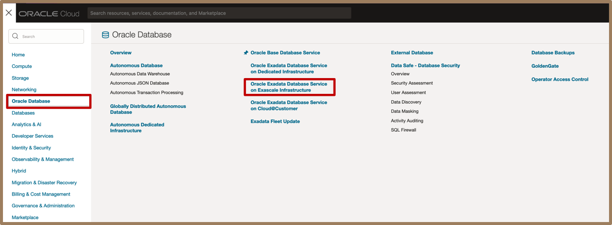
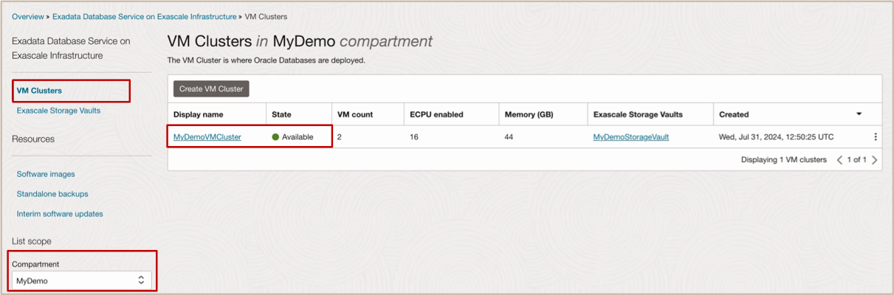
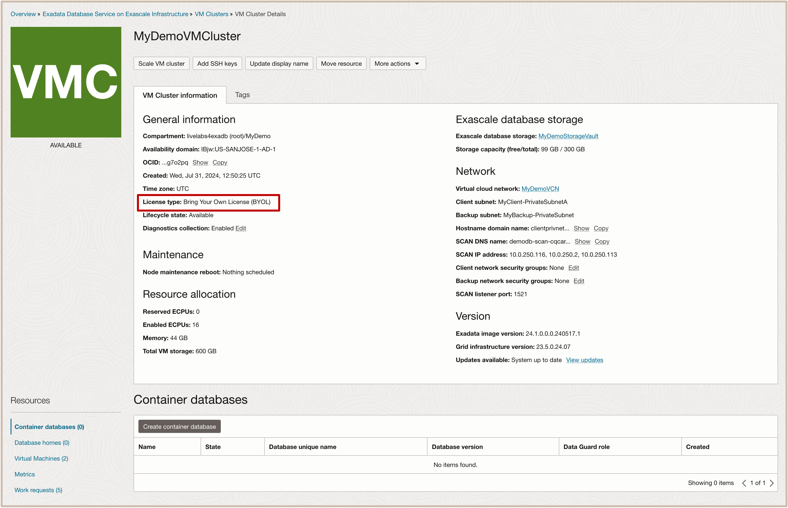
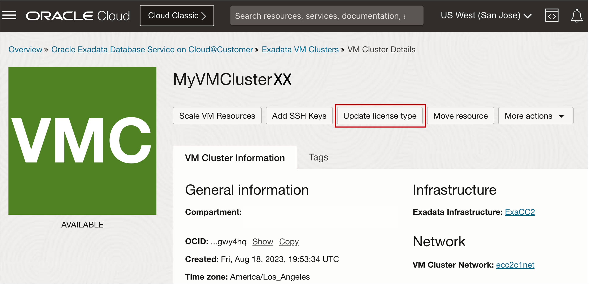
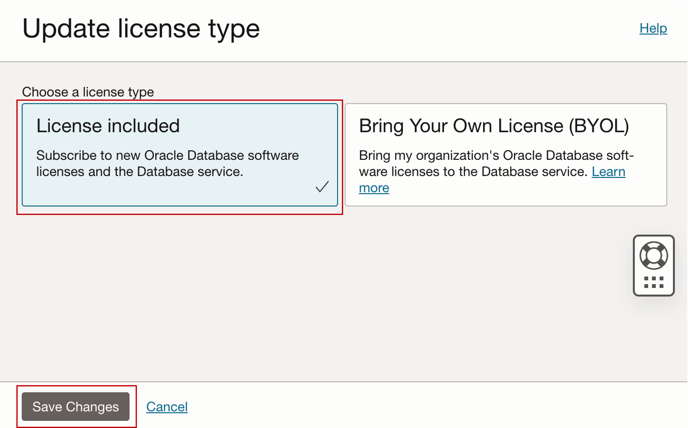

# Change License Type using OCI Console

## Introduction

This lab walks you through the steps to Change License Type using OCI Console.

**Estimated Lab Time:** ***15 minutes***

<!-- Watch the video below for a quick walk-through of the lab.
[Change VM Cluster License Type for Exadata Database Service on Exascale Infrastructure](youtube:<ReplaceMe>)
-->

### Objectives

-   After completing this lab, you should be able to Change License Type of the Exadata VM Cluster by using the OCI Console.

### Prerequisites

This lab requires completion of the following:

* Completion of **Lab1**

## Task 1: Change License Type of Exadata VM Cluster using OCI Console 

1. Navigate to the Exadata Database Service on Exascale Infrastructure using OCI Console

    * Open the **navigation menu** and click ***Oracle Database***. 
    * Under **Oracle Database**, click ***Oracle Database Service on Exascale Infrastructure***.
   
    * **Note:** This will cause the **VM Clusters** page to be displayed.

2. Navigate to your Compartment and VM Cluster

    * On the left rail, ensure that **VM Clusters** is selected (default selection). 
    * For the **List Scope**, select your assigned compartment named ***MyCompartmentXX***. 
    * In the list of displayed VM clusters, click on the name of your **Assigned VM Cluster** named ***MyDemoVMClusterXX***.
  
    * **Note:** This will cause the **VM Cluster Details** page to be displayed.
   
3. On the VM Cluster Details page, take note of the current **License Type** selection
   
   

4. On the VM Cluster Details page, Click **Update License Type** 
   
   

5. Change the license type from **Bring Your Own License (BYOL)** to ***License Included***
   
   
   
6. Click **Save Changes**

7. On the VM Cluster Details page, validate that the **License Type** selection has been changed to ***License Included***
   
   

You may now **proceed to the next lab**

## Acknowledgements

* **Authors** - Eddie Ambler, Leo Alvarado, Product Management

* **Contributors** - Tammy Bednar, Product Management

* **Last Updated By** - Eddie Ambler, Product Management, August 2024.
