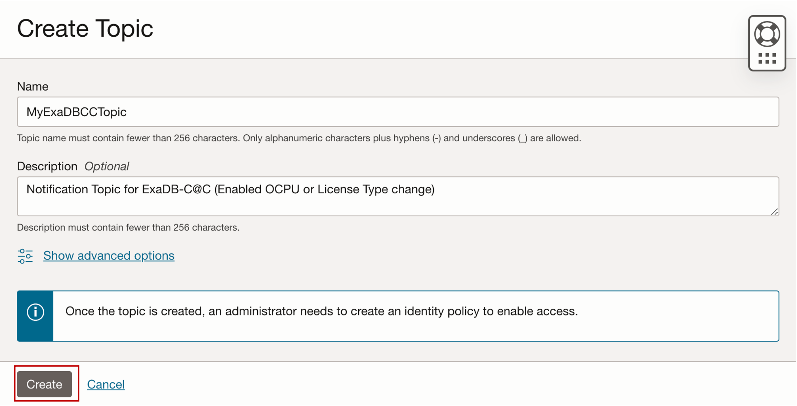
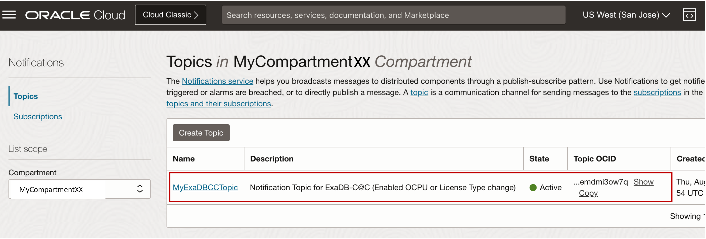
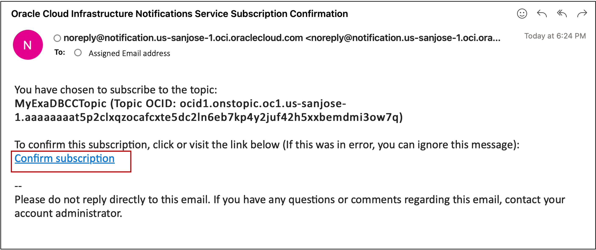
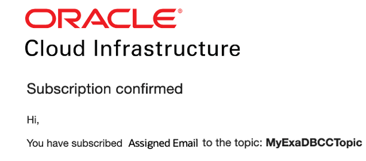
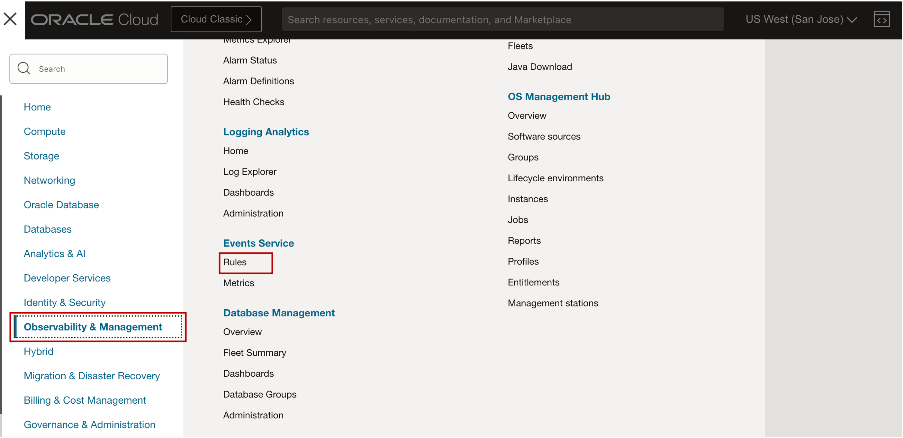
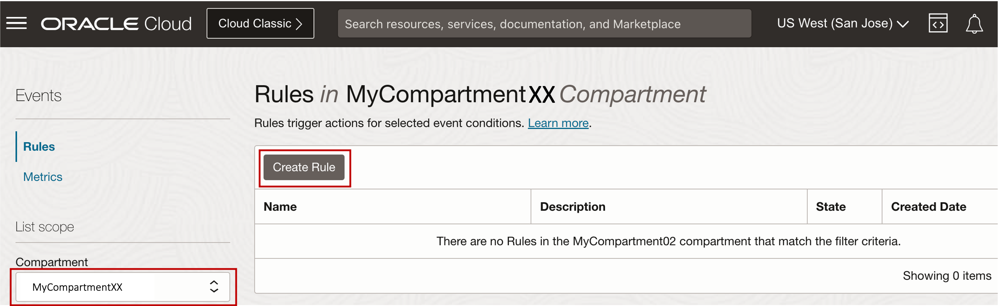
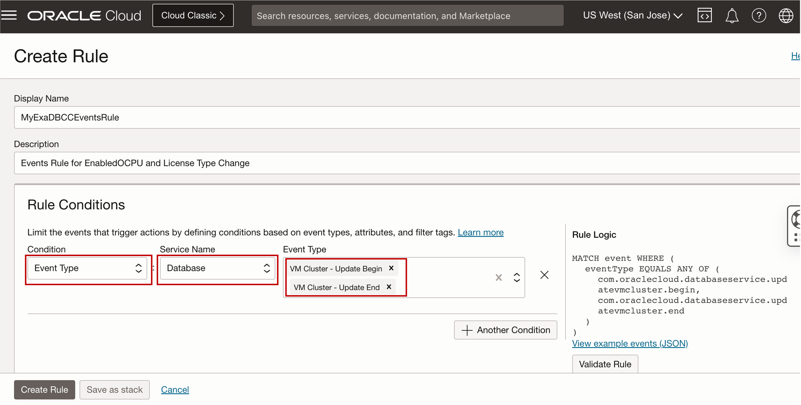

# Configure & Validate Notifications for Monitoring ECPU Scaling changes


## Introduction

This lab walks you through the steps to configure & validate notifications for monitoring ECPU Scaling changes.

Estimated Lab Time: 15 minutes

Watch the video below for a quick walk-through of the lab.
[Configure & Validate Notifications for Monitoring ECPU Scaling changes](youtube:"placeholder")

**How Notifications Work?**

The OCI Notifications service communicates when something happens with your resources in Oracle Cloud Infrastructure.

The Notifications service lets you to set up communication channels for publishing messages using topics  and subscriptions. When a message is published to a topic, the Notifications service sends the message to all of the topic's subscriptions.


**Notifications Concepts**

The following concepts are essential to working with OCI Notifications Service:

***Notification*** - A configuration for sending messages, such as an alarm or event rule. Each message is sent to subscriptions in the specified topic.

***Subscription*** - An endpoint for a topic. Published messages are sent to each subscription for a topic. 

   You can get human-readable messages through supported subscription protocols:

   * **Email**
   * **Function**
   * **HTTPS (Custom URL)**
   * **PagerDuty**
   * **Slack**
   * **SMS**

***Topic*** - A communication channel for sending messages to subscriptions. Each topic name is unique across the tenancy.  

***Event Rules*** - When triggered, an event rule sends an event message to the configured topic. Notifications then deliver the message to active subscriptions.

***Database Service Events***  - Database Service Events enables you to be notified about health issues with your Oracle Databases or other components on the Database Cloud Service. 

**Create Events Rule to Create Notification Automation for Database Service Events**

The Database Service Events feature implementation generates events for Data Plane operations and conditions and Notifications by leveraging the existing OCI Events service and Notification service. Users can subscribe to the Database Service Events and receive notifications. To receive notifications, subscribe to the Database Service Events and get notified using the Oracle Notification service.

### Objectives

-   After completing this lab, you should be able to configure notifications and events rules for monitoring ECPU Scaling changes for Exadata Database Service on Exascale Infrastructure

### Prerequisites

This lab requires completion of the following:

* Completion of **Lab1**

## Task 1: Configure Notification Topic and Subscription for Enabled ECPU change

1. Open the navigation menu and click **Developer Services**. Under **Application Integration**, click **Notifications**.
   
   

2. The **Topics** page is selected by default, select your ***Assigned Compartment*** and Click **Create Topic**.
   
   

3. Provide the Topic name. For this lab, use ***MyExaDBXSTopic*** for the Topic name. 
   
   
   
4. Click **Create**.
   
   

   Once the Topic has been created, you will see the created Topic with the state of ***Active***.

   

5. Click the name of the Topic you created to open the **Topic Details** page. 
   
   

6. On the Topic Details page, click **Create Subscription**.
   
   

7. In the Create Subscription panel, for **Protocol**, select ***Email***. Provide your ***assigned Email Address***, then Click **Create**
   
   

    >**Note:** Notifications creates the email subscription and sends a confirmation URL to your assigned email address. 
   
   The subscription is ***pending*** until confirmation is received.

   

8. Open your assigned Email, Check for the ***OCI Notifications Service Subscription Confirmation*** email, and Click the ***Confirm subscription*** link.
   
   

   By clicking the confirmation link, it will launch a browser displaying that the subscription has been confirmed and that you have subscribed your assigned Email to the Topic you selected. 

   

   You can now see that the subscription is ***Active***. 

    


## Task 2: Create Events Rule to Create Notification Automation for Enabled ECPU Change

1. Open the navigation menu and click **Observability & Management**. Under **Events Service**, click **Rules**.
    
    

2. Select your ***Assigned Compartment*** and Click **Create Rule**
   
    

3. In the Create Rule panel, provide the Rule name. For this lab, use ***MyExaDBXSEventsRule***.
   
    

4. Configure **Rule Conditions**:
   
      * In the **Rule Conditions** section, For Condition, Select ***Event Type***. 
      * For **Service Name**, select ***Database*** 
      * For **Event Type**, Select ***Exadb VM Cluster - Update Begin*** and ***Exadb VM Cluster - Update End***
    
    

5. Configure **Actions**:
   
      * In the **Actions** section, For **Action Type**, Select ***Notifications***. 
      * For **Notifications Compartment**, select your ***Assigned Compartment*** 
      * For **Topic**, Select ***MyExaDBXSTopic*** 
      
  
    

6. Click **Create Rule**
   
    

## Task 3: Validate the Current VM Cluster Resource Allocation and Scale up the Enabled ECPUs  using the Console 

1. Open the navigation menu. Under **Oracle Database**, click **Exadata Database Service on Exascale Infrastructure**.
   
2. Select your ***Assigned Compartment***, and Click your assigned **VM Cluster** named ***MyDemoVMClusterXX***.
   
   

    The VM Cluster Details page displays information about the selected VM cluster. Under the **Resource allocation**, pay attention to the number of ***Enabled ECPUs:*** 

   
   
3. In the VM Cluster Details page, Click **Scale VM Cluster**. 
   
   

   

   Scale Up the number of ***ECPUs enabled per VM*** from ***8 ECPU*** to ***12 ECPU***

   
   
      
4. Click **Save Changes**
   
   >**Note:** ECPU scaling activities are done online with no downtime. Once the scale up operation is complete, the VM Cluster status changes from ***Updating*** to ***Available***.

## Task 4: List VM Cluster Configuration using CLI 

>**Note:** To use OCI CLI for this lab, we will be using the ***OCI Cloud Shell tool***. 
   
1. In the VM Cluster Details page, Copy the VM Cluster OCID by clicking on the ***copy*** button in the ***OCID*** field under the **General Information** section. 
   
   

   Paste the VM Cluster OCID to a text editor.
   
2. Click the **Developer tools** icon in the console header and select ***Cloud Shell*** from the drop-down menu. 
   
   

   This displays the Cloud Shell in a "drawer" at the bottom of the console:

   

3. Run the OCI CLI Command to get the VM Cluster Configuration.

      >**Note:** Replace ***{VMClusterId}*** with VM Cluster OCID copied from *(Task 4 Step 1)*

    ```
    <copy>

      oci db exadb-vm-cluster get --exadb-vm-cluster-id {VMClusterID} --query 'data.{DisplayName:"display-name", EnabledECPU:"enabled-e-cpu-count",LifecycleState:"lifecycle-state"}'

    </copy>
    ```

   After running the command, you will see similar output below.

   

   You can see the new ***Enabled ECPU*** for the VM Cluster and with the ***Lifecycle State*** of ***Available***. 

## Task 5: Confirm Notifications output in the notification email that was configured

1. Open your assigned email. You should be receiving two notification emails. 
   
   Review the details of the following notification email events:
   
      * Start of the ECPU scale up operation - ***(updateexadbvmcluster.begin)*** 
   
      

      * End of the ECPU scale up operation ***(updateexadbvmcluster.end)*** 
  
      

   The Notification email for the Update VM Cluster Events shows the before and After VM Cluster ECPU Allocation. 
   
   Pay attention to the following fields from the notification email message: 
      * ***CPU Core Count*** 
      * ***Reserved CPU Core Count***
      * ***Enabled ECPU Core Count*** 
      * ***Reserved ECPU Core Count***

## Learn More

* Click [here](https://docs.oracle.com/en-us/iaas/exadb-xs/doc/exadata-cloud-infrastructure-events.html) to learn more about Oracle Exadata Database Service on Exascale Infrastructure Events.

## Acknowledgements

* **Author** - Leo Alvarado, Eddie Ambler, Product Management

* **Contributors** - Tammy Bednar, Product Management

* **Last Updated By** - Leo Alvarado, Product Management, August 2024.
