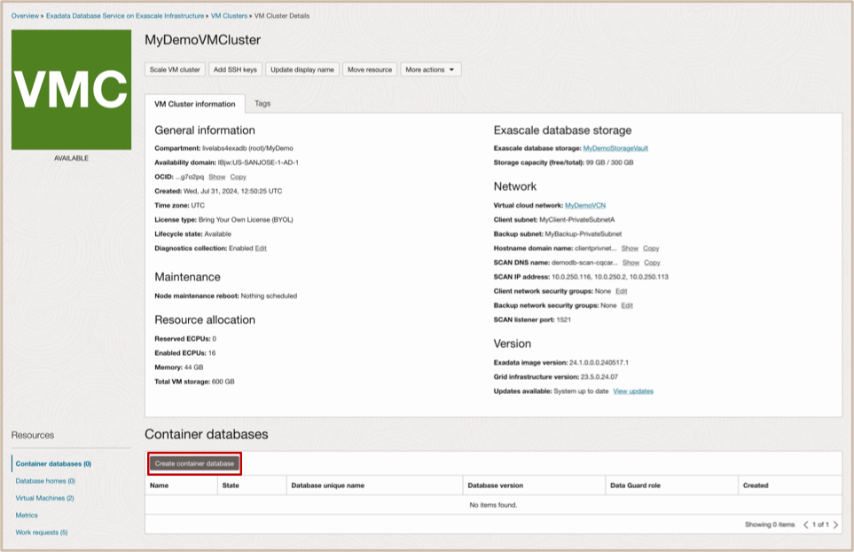
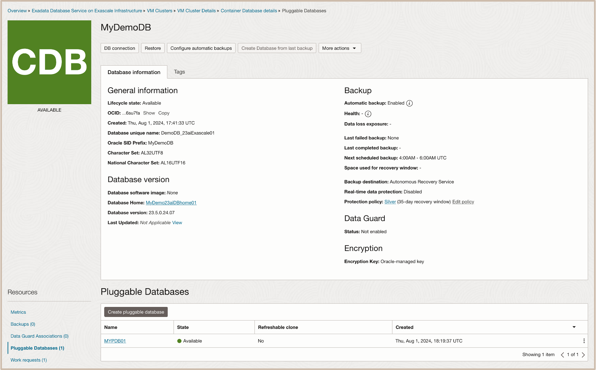

# Create Standby Exadata VM Cluster & Database Home using OCI Console

## Introduction

This lab walks you through how to create an Exadata VM Cluster & Database Home deployed on the Exadata Database Service on Exascale Infrastructure using the OCI Console. This Exadata VM Cluster will be used as a standby target inour upcoming labs.
 

Estimated Time: 2 Hours 10 minutes

Watch the video below for a quick walk-through of the lab.
  [Create a Custom Database Software Image](youtube:placeholder)

### Objectives

-   After completing this lab, you should be able to create an Exadata VM cluster and an Oracle Database Home on the Exadata Database Service on Exascale Infrastructure using the OCI Console.

### Prerequisites

This lab requires completion of the following:

* Successful Login to a Tenancy with a service limit assigned for the **Exadata Database Service on Exascale Infrastructure**

## Task 1: Create an Exadata VM Cluster Resource with Exadata on Exascale Cloud Infrastructure

1. Open the navigation menu. Under **Oracle Database**, click **Exadata Database Service on Exascale Infrastructure**.

  

2. In the left rail, **VM Clusters** is selected by default. Under **List Scope**, Select your assigned standby compartment named ***MyStandbyCompartmentXX***. 
   
  

3. Click **Create VM Cluster** button 
    
    This causes the **Create VM Cluster** page to be displayed.  

4. **Provide the basic information to configure the Exadata VM cluster**.
    * For Compartment: Ensure that the compartment that you want the VM Cluster to be created in is displayed. It should display **your assigned compartment**.

    * For Display Name: Enter ***MyStandbyVMClusterXX*** 

    * For Cluster Name: Enter ***MyDemoClus*** 

    * For Availability Domain: Select the availability domain from the displayed options available. 

 

5. **To Configure the VM cluster, provide the following information:** 
    * For the number of VMs in the cluster: ***Enter 2***
    * For ECPUs enabled per VM: ***Enter 8*** 

      <u>**Size the VM file system storage**</u>: 
    * For system storage capacity per VM (GG): ***Enter 280***

      **Note:**  The VM Filesystems storage includes /u02 capacity, where your Database Homes will go, along with all of the other VM filesystems (/, /boot, /tmp, /var, /var/log, /var/log/audit, /home, swap, kdump, /u01, grid, /u02). Any extra capacity selected beyond system minimums will go into /u02. 

  

6. **Enter Configuration Details for Exascale Database Storage Vault:** 
    * Select **Create new vault**. 

    **For a new vault, specify the following:** 
    * For the **Exascale Vault name:** enter ***MyStandbyStorageVaultXX*** . 
    * For the **Storage Capacity for Databases (GB):** ***enter 300***. 

    **Note:** The minimum size configuration for an Exascale Database Storage Vault is 300 GB. 50 GB of the space that you allocate in your Vault is reserved for an internal ACFS file system. This ACFS file system resides within your Exascale Database Storage Vault, but is reserved for system use. Thus, if you provisioned the minimum of 300 GB in your Exascale Database Storage Vault, then 250 GB of that 300 GB capacity will be available storage for your databases. 

    When you create a new vault, the Provisioning status window opens to provide you with the status of vault creation, and the name of the vault that is being created in the format Vault-YYYYMMDDHHMM indicating the creation date, where YYYY is the year, MM is the month, DD is the day, HH is the hour, and Mm is the minute. 

  

7. **Select the Oracle Grid Infrastructure version and add SSH key:** 
    * **Grid Infrastructure Release and Version fields:** display the Oracle Grid Infrastructure versions available for deployment in the VM cluster.  
    ***Accept the default values for the 23ai release***.

    * **Add your SSH Key for future access to your VMs**. <u>Choose from:</u>

        * **Generate SSH key pair**(Default option) Select this option to generate an SSH keypair. Then in the dialog below click Save private key to download the key, and optionally click Save public key to download the key. 
        * **Upload SSH key files**: Select this option to browse or drag and drop .pub files. 
        * **Paste SSH keys:** Select this option to paste in individual public keys.

  
 

8. **To Configure the network settings, Select VCN and select Client and Backup subnet** 
    * **For the Virtual Cloud Network (VCN):** Click Change Compartment and select compartment named ***MyDemo***.   
    Then select the Virtual Cloud Network named ***MyDemoVCN***.
    
    * **For the Client subnet:** Select the client subnet in the **assigned standby compartment** named ***MyClient-PrivateSubnetBXX***.  
    
    * **For the Backup Subnet:** Click Change Compartment and select compartment named ***MyDemo***.   
    Then select the Backup Subnet named ***MyBackup-PrivateSubnet***.
    
    * **For the Hostname Prefix:** Enter ***MyHostVM***

  

9. **Select license type & choose opt-in choices for Diagnostic & Collections options.**
    * **Choose a license type:** The type of license that you want to use for the VM cluster. Your choice affects metering for billing. ***Select the Bring Your Own License (BYOL) option.*** 

  

10. **Select Diagnostic and Collections Options**
In the Edit Diagnostics Collection Settings dialog, you can enable or disable any of the Diagnostics Collections options. By enabling diagnostics collection and notifications, Oracle Cloud Operations and you will be able to identify, investigate, track, and resolve guest VM issues quickly and effectively. ***Accept the default values***.
    * **Enable Diagnostics Events:** Allows Oracle to collect and publish critical, warning, error, and information events to me. For more information, see Overview of Database Service Events
    * **Enable Health Monitoring:** Allows Oracle to collect health metrics/events such as Oracle Database up/down, disk space usage, and so on, and share them with Oracle Cloud operations. You will also receive notification of some events. 
    * **Enable Incident logs and trace collection:** Allows Oracle to collect incident logs and traces to enable fault diagnosis and issue resolution. 
 
  

11. Click **Create VM Cluster** to proceed with provisioning. 

## Task 2: Create an Oracle Database Home using OCI Console

1. **Navigate to the Exadata Database Service on Exascale Infrastructure:** 
    * Open the navigation menu. 
    * Under **Oracle Database**, click **Exadata Database Service on Exascale Infrastructure**.

  

2. **Navigate to the cloud VM cluster you want to create the database home in:**
    * In the left rail, ensure ***VM Clusters*** is selected. 
    * Under **List Scope**, Select your assigned compartment named ***MyStandbyCompartmentXX***. 
    * Then **click on your VM Clusters** ***assigned name*** to view the **VM Cluster Details page**. 
   
  

3. On the **VM Cluster Details page** under **Resources** Click on **Database Homes** and then click on the ***Create Database Home** button.

  

4. 

8. Click on the **Create Container Database** button to proceed with creating the Container Database.

    
***!!! Congratulations:*** You may now **proceed to the next lab**. 

## Learn More

* Click [here](https://docs.oracle.com/en-us/iaas/exadb-xs/doc/manage-vm-clusters.html) to learn more about managing the VM clusters on the Exadata Database Service on Exascale Infrastructure.

## Acknowledgements

* **Author** - Eddie Ambler, Leo Alvarado, Product Management

* **Contributors** - Tammy Bednar, Product Management

* **Last Updated By** - Eddie Ambler, Product Management, July 2024.
