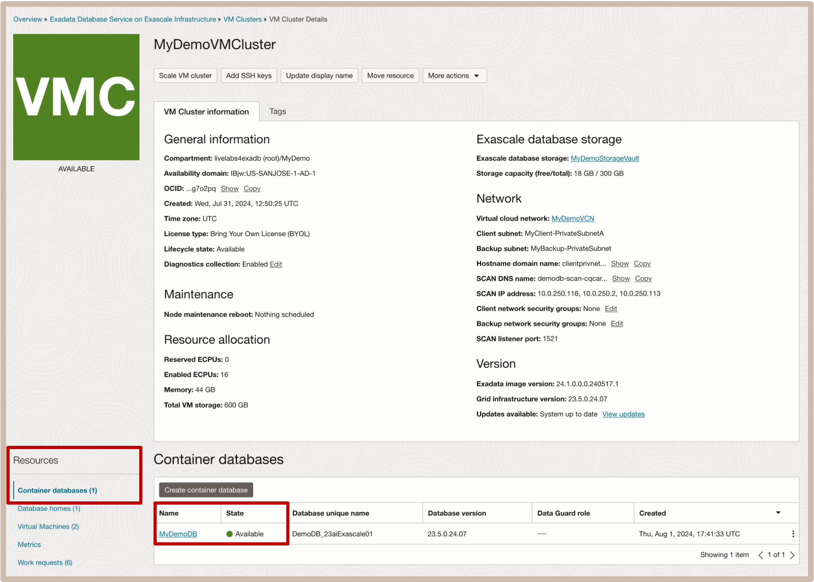
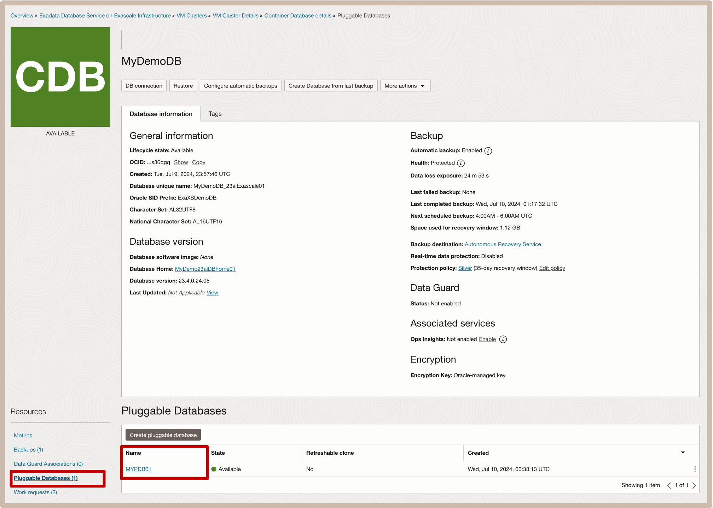
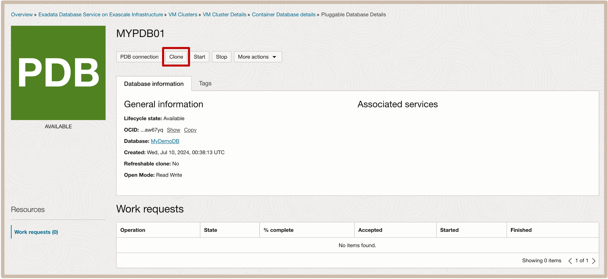
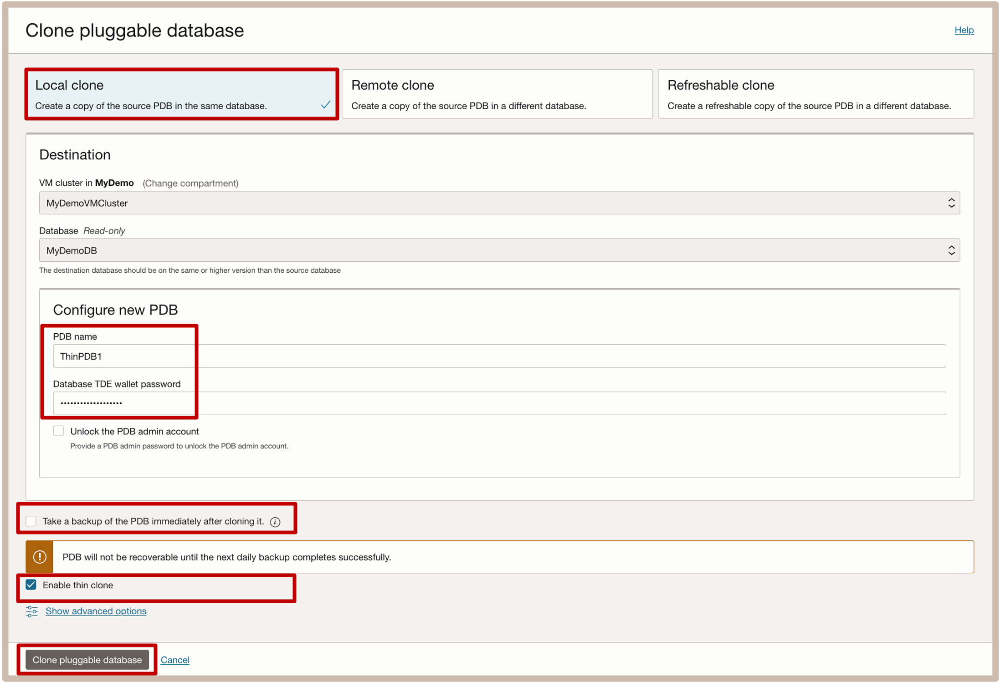
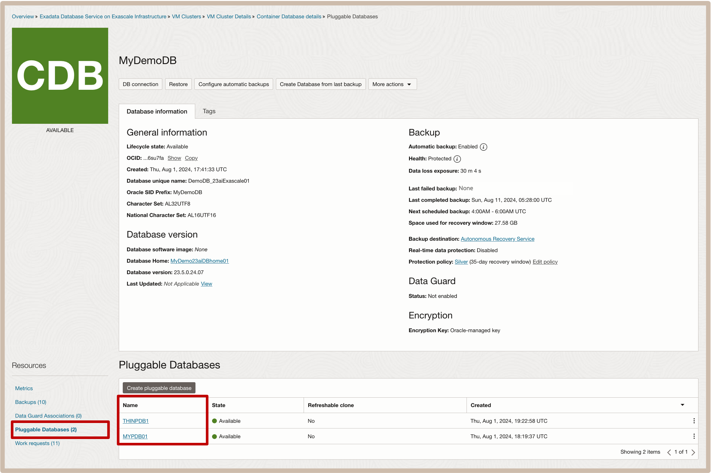

# Create Thin Clone of an Oracle Pluggable Database (PDB) leveraging Exadata Exascale Technology

## Introduction

This lab walks you through how to create a thin cloned Oracle Pluggable Database of a Pluggable Database that is created on Exadata Exascale Infrastructure.
 
  * For Pluggable Databases created on the Exadata Database Service on Exascale Infrastructure (**ExaDB-XS**), you can clone an Oracle Pluggable Database as a standard **clone** or as a **thin clone** (***unique to ExaDB-XS***). 
  * A PDB **clone** is an independent and complete copy of the given database as it existed at the time of the cloning operation. 
  * A PDB **thin clone** is a special type of the Local Clone, that leverages the Exascale redirect-on-write technology, that allows the thin clone PDB to share unchanged storage blocks with the parent PDB. This results in the fast creation of the thin cloned PDB with reduced space consumption.

 * ***The following types of clones are supported:*** 
    * ***Local Clone***: A full copy of the PDB that is created within the same CDB. 
    * ***Thin Clone***: A thin clone copy of the PDB that is created within the same CDB (***Option Only avaiable for Local Clones***). 
    * ***Remote Clone***: A full copy of the PDB that is created in a different CDB. 
    * ***Refreshable Clone***: A refreshable clone enables you to keep your remote clone updated with the source PDB. The only open mode you can have is read-only and refresh cannot be done while it is in read-only mode. 
   

**Estimated Time:** ***10 minutes***

Watch the video below for a quick walk-through of the lab.
  [Create a Thin Clone PDB on ExaDB-XS](youtube:"Place Holder")

### **Objectives**

-   After completing this lab, you should be able to navigate to your VM Cluster, locate your desired Container Database, and create a thin cloned Oracle Pluggable Database on the Exadata Database Service on Exascale Infrastructure using the OCI Console.

### **Prerequisites**

This lab requires the completion of the following:

* Successful creation of a VM Cluster on Exadata Database Service on Exascale Infrastructure.
* Successful creation of Container Database on the VM Cluster, which will also includes the initial PDB.

## Task 1: Create a Thin Clone PDB using OCI Console

1. Navigate to the Exadata Database Service on Exascale Infrastructure using OCI Console

    * Open the **navigation menu** and click ***Oracle Database***. 
    * Under **Oracle Database**, click ***Oracle Database Service on Exascale Infrastructure***.
   
    * **Note:** This will cause the **VM Clusters** page to be displayed.

2. Navigate to your Compartment and VM Cluster

    * On the left rail, ensure that **VM Clusters** is selected (default selection). 
    * For the **List Scope**, select your assigned compartment named ***MyCompartmentXX***. 
    * In the list of displayed VM clusters, click on the name of your **Assigned VM Cluster** named ***MyDemoVMClusterXX***.
  
    * **Note:** This will cause the **VM Cluster Details** page to be displayed.

3. Navigate from the VM Cluster to the Container Database (CDB)

    * On the left rail under the **Resources** section, click on ***Container Databases***, 
    * In the list of Container Databases diplayed, click on the name of the Container Database whose PDB we will create a thin clone of. Click on ***MyDemoDB***. 
  
    * **Note:** This will cause the **Container Database Details** page to be displayed.

4. Navigate from CDB to Pluggable Database (PDB)

    * On the left rail under the **Resources** section, click on ***Pluggable Databases***. 
    * From the list of available Pluggable Databases displayed, click on the name of the Pluggable Database we will create a thin clone of. Click on ***MyPDB01***. 
  
    * **Note:** This will cause the **Pluggable Database Details** page to be displayed.

5. Initiate the **Clone** Pluggable Database action

    * On the **Pluggable Database Details** page, initiate the Clone PDB action by clicking on the ***Clone*** action button.
  
    * **Note:** This will cause the **Clone Pluggable Database** configuration page to be displayed.

6. Configure Clone PDB options and check the box to **Enable Thin Clone**

    * In the **Clone Pluggable Database** configuration page, select the PDB Clone type. Select ***Local Clone***.
    * Provide the information to configure the new PDB. 
        * For the **PDB Name** enter: ***ThinPDB1***
        * For the **Database TDE wallet password** enter: ***Pass4StudentOCW24-#***
        * For this lab we will defer the initial PDB backup by ***unchecking the box*** to **Take a backup of the PDB immediately after cloning**
        * Next, ensure to ***check the box*** to **Enable Thin Clone**
        * Click on the ***Create Pluggable Database*** button to start the clone provisioning process.
  
    * **Note:** that the thin PDB clone will be created and presented as a new PDB.
  

7. List all of the PDBs in the Container Database (CDB). 

    * From the **Pluggable Database Details** page, select the ***Container Database Details*** link in the breadcrumb path at the top of the page.
    * **Note:** that this will cause the **Container Database Details** page to be displayed.
  
    * On the left rail under the **Resources** section, click on ***Pluggable Databases***. 
    * **Note:** that this will cause a list of available Pluggable Databases to be displayed and that the Thin Clone PDB is listed, as just another PDB.
    
    
***Congratulations!!!*** You may now **proceed to the next lab**. 

## Learn More

* Click [here](https://docs.public.oneportal.content.oci.oraclecloud.com/en-us/iaas/exadata/doc/ecc-create-first-db.html) to learn more about Creating an Oracle Pluggable Database on Exadata Database Service on Exascale Infrastructure.

## Acknowledgements

* **Author** - Eddie Ambler, Leo Alvarado, Product Management

* **Contributors** - Tammy Bednar, Product Management

* **Last Updated By** - Eddie Ambler, Product Management, July 2024.
