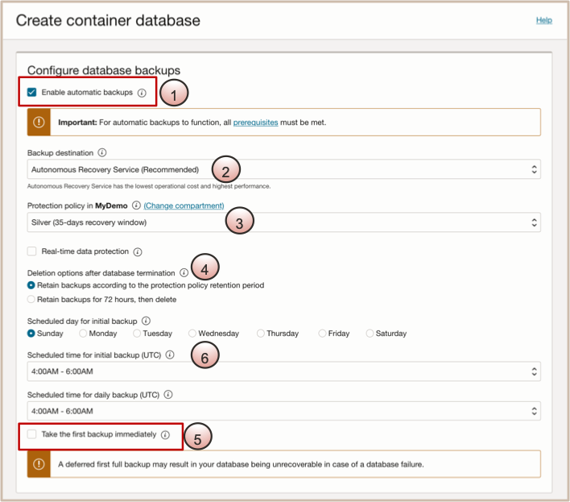

# Create Instance of Exadata Database Service on Exascale Infrasturcture using OCI Console

## Introduction

This lab walks you through how to create an instance of the Exadata Database Service on Exascale Infrasturcture using the OCI Console. 
 

Estimated Time: 2 Hours 10 minutes

Watch the video below for a quick walk-through of the lab.
  [Create a Custom Database Software Image](youtube:jwxxIih3brQ)

### Objectives

-   After completing this lab, you should be able to create an Exadata VM cluster and an Oracle Database on Exascale technology using the OCI Console.

### Prerequisites

This lab requires completion of the following:

* Successful Login to a Tenancy with a service limit assigned for the **Exadata Database Service on Exascale Infrastructure**

## Task 1: (Pre-Created for OCW Only) --> Create an Exadata VM Cluster Resource with Exadata on Exascale Cloud Infrastructure

1. Open the navigation menu. Under **Oracle Database**, click **Exadata Database Service on Exascale Infrastructure**.

  

2. In the left rail, **VM Clusters** is selected by default. Under **List Scope**, Select your assigned compartment named ***MyCompartmentXX***. 
   
  

3. Click **Create VM Cluster** button 
    
    This causes the **Create VM Cluster** page to be displayed.  

4. **Provide the basic information to configure the Exadata VM cluster**.
    * For Compartment: Ensure that the compartment that you want the VM Cluster to be created in is displayed. It should display **your assigned compartment**.

    * For Display Name: Enter ***MyDemoExaDB-XS_VMClusterXX*** 

    * For Cluster Name: Enter ***MyDemoClus*** 

    * For Availability Domain: Select the availability domain from the displayed options available. 

 

5. **To Configure the VM cluster, provide the following information:** 
    * For the number of VMs in the cluster: ***Enter 2***
    * For ECPUs enabled per VM: ***Enter 8***

      ***Reserve 4 additonal ECPUs*** by clicking on **Reserve additional ECPU to increase link** and entering the following:   
    * For **Total ECPUs per VM:** Provide a total number of ECPUs to allocate per VM. ***Enter 12***.  
    * The **ECPUs additional reserved per VM** field which is (read only) will now indicate that there are now **4 reserved ECPUs**. 
    * The **Memory per VM (GB)** field which is (read only) will display the amount of memory allocated to each VM. ***Memory is calculated based on 2.75 GB per total ECPU***. 

      **Size the VM file system storage**: 
    * For system storage capacity per VM (GG): ***Enter 280***

      **Note:**  The VM Filesystems storage includes /u02 capacity, where your Database Homes will go, along with all of the other VM filesystems (/, /boot, /tmp, /var, /var/log, /var/log/audit, /home, swap, kdump, /u01, grid, /u02). Any extra capacity selected beyond system minimums will go into /u02. 

  

6. **Enter Configuration Details for Exascale Database Storage Vault:** 
    * Select **Create new vault**. 

    **For a new vault, specify the following:** 
    * For the **Exascale Vault name:** enter ***MyDemoVaultXX*** . 
    * For the **Storage Capacity for Databases (GB):** ***enter 300***. 

    **Note:** The minimum size configuration for an Exascale Database Storage Vault is 300 GB. 200 GB of the space that you allocate in your Vault is reserved for a 200 GB ACFS file system. This ACFS file system resides within your Exascale Database Storage Vault, but is reserved for system use. Thus, if you provisioned the minimum of 300 GB in your Exascale Database Storage Vault, then 100 GB of that 300 GB capacity will be available storage for your databases. 

    When you create a new vault, the Provisioning status window opens to provide you with the status of vault creation, and the name of the vault that is being created in the format Vault-YYYYMMDDHHMM indicating the creation date, where YYYY is the year, MM is the month, DD is the day, HH is the hour, and Mm is the minute. 

  

7. **Select the Oracle Grid Infrastructure version and add SSH key:** 
    * **Grid Infrastructure Release and Version fields:** display the Oracle Grid Infrastructure versions available for deployment in the VM cluster. ***Accept the default values for the 23ai release***.

    * **Add your SSH Key for future access to your VMs**. Choose from:

      * **Generate SSH key pair**(Default option) Select this option to generate an SSH keypair. Then in the dialog below click Save private key to download the key, and optionally click Save public key to download the key. 
      * **Upload SSH key files**: Select this option to browse or drag and drop .pub files. 
      * **Paste SSH keys:** Select this option to paste in individual public keys.

  
 

8. **To Configure the network settings, Select VCN and select Client and Backup subnet** 
    * **For the Virtual Cloud Network (VCN):** Click Change Compartment and select compartment named ***MyDemo***.  Then select the Virtual Cloud Network named ***MyDemoVCN***.
    * **For the Client subnet:** Select the client subnet in the assigned compartment named ***ClientAXX***. This is the subnet to which the VM cluster should attach. 
    * **For the Backup Subnet:** Click Change Compartment and select compartment named ***MyDemo***.  Then select the Backup Subnet named ***MyPrivateBackupSubnet***.
    * **For the Hostname Prefix:** Enter ***DemoDBXX***

  

9. **Select license type & choose opt-in choices for Diagnostic & Collections options.**
    * **Choose a license type:** The type of license that you want to use for the VM cluster. Your choice affects metering for billing. ***Select the Bring Your Own License (BYOL) option.*** 

  

10. **Select Diagnostic and Collections Options**
In the Edit Diagnostics Collection Settings dialog, you can enable or disable any of the Diagnostics Collections options. By enabling diagnostics collection and notifications, Oracle Cloud Operations and you will be able to identify, investigate, track, and resolve guest VM issues quickly and effectively. ***Accept the default values***.
    * **Enable Diagnostics Events:** Allows Oracle to collect and publish critical, warning, error, and information events to me. For more information, see Overview of Database Service Events
    * **Enable Health Monitoring:** Allows Oracle to collect health metrics/events such as Oracle Database up/down, disk space usage, and so on, and share them with Oracle Cloud operations. You will also receive notification of some events. 
    * **Enable Incident logs and trace collection:** Allows Oracle to collect incident logs and traces to enable fault diagnosis and issue resolution. 
 
  

11. Click **Create VM Cluster** to proceed with provisioning. 

## Task 2: Create an Oracle Database on Exadata Database Service on Exascale Infrastructure using OCI Console

1. **Navigate to the Exadata Database Service on Exascale Infrastructure:** 
    * Open the navigation menu. 
    * Under **Oracle Database**, click **Exadata Database Service on Exascale Infrastructure**.

  

2. **Navigate to the cloud VM cluster you want to create the database in:**
    * In the left rail, **VM Clusters** is selected by default. 
    * Under **List Scope**, Select your assigned compartment named ***MyCompartmentXX***. 
    * Then **click on your clusters highlighted name** to view the **VM Cluster Details page**. 
   
  

3. On the **VM Cluster Details page** Click on **Create Container Database**.

  

4. In the **Create Container Database** page enter the **basic information for creating the container database:** 
    * For the **Database Name:** Enter ***DemoDBXX***
    * For the **Database Unique Name Suffix:** Enter ***DemoDBXX_23aiExascale01***
    * For the **Database Version:** Select ***23ai***
    * For the **Pluggable Database Name:** Enter ***MyPDBXX***

  
   
5. Specify the **Database Home Source and Administrator Credentials:**
    * For the **Database Home source** choose: **Select an Existing Database Home**
    * Select Database Home with display name of ***MyDemo23aiDBhome01***
    * Next configure your **Administrator Credentials:** by entering ***Pass4StudentXX*** as the **password** for the **sys** username.
   
  

6. Now lets **configure Automatic Backups** for the database
    * Select the checkbox for ** Enable Automatic Backups**
    * For the **Backup Destination:** Select ***Autonomous Recovery Service***
    * For the **Protection Policy:** Select ***Silver***
    * For the **Deletion options after database termination:** Select ***Retain backups according to the protection policy retention period***
    * Next, **schedule the Day of the week and time for the initial backup to start:** Select ***Sunday between 4AM and 6AM***.
    * Now wrap up the Automatic Backup configuration by **scheduling the time of day for the daily backups to start:** Select ***4AM to 6AM***

  

7. **Review & Configure Advanced Options** for the Container Database by clicking on the **Show Advanced Options** link.
    * Under the **Management tab** set the Oracle_SID to ***ExaXSDemoDB***  
  
    * Under the **Encryption tab** you can select the desired key management method. Select ***Use Oracle-managed keys***.
  

    * Under the **Tags tab:** you can add free-form tags to your resource.  If you want to apply a defined tag, you must have permissions to use the tag namespace. Remember that you can also apply tags to your resources after they are provisioned.
  

8. Click on the **Create Container Database** button to proceed with creating the Container Database.

***!!! Congratulations:*** You may now **proceed to the next lab**. 

<!--
## Learn More

* Click [here](https://docs.public.oneportal.content.oci.oraclecloud.com/en-us/iaas/exadata/doc/ecc-create-first-db.html) to learn more about Creating an Oracle Database on Exadata Database Service.

-->

## Acknowledgements

* **Author** - Eddie Ambler, Leo Alvarado, Product Management

* **Contributors** - Tammy Bednar, Product Management

* **Last Updated By** - Eddie Ambler, Product Management, July 2024.
