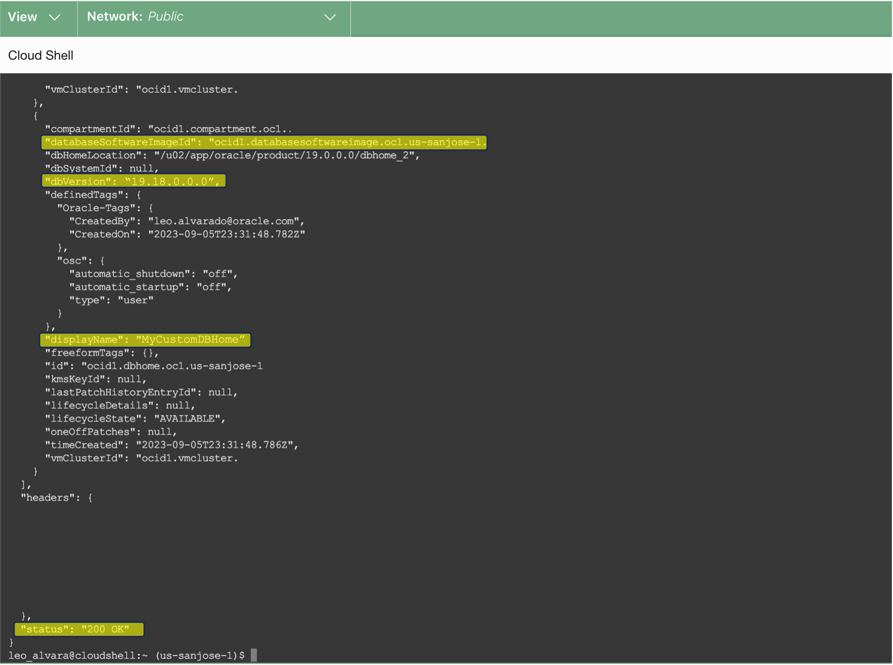

# Discover Environment Details using OCI API


## Introduction

This lab walks you through the steps to discover how to navigate to the Exadata Database Service on Exascale Infrastructure and discover the environment details for the Exadata VM Cluster, Container Database, Pluggable Database, and the Exascale Storage Vault using the OCI API.

Estimated Time: 10 minutes

### Objectives

-   After completing this lab, you should be able to discover Exadata Database Service on Exascale Infrastructure environment details using the OCI API.


### Prerequisites

This lab requires the completion of the following:

* Completion of **Lab 1**

## Task 1: Get the VM Cluster Details using OCI CLI

>**Note:** To use **OCI CLI** for this lab, we will be using the ***OCI Cloud Shell tool***. 
   

1. Click the **Developer tools** icon in the console header and select ***Cloud Shell*** from the drop-down menu. 
   
   

   This displays the Cloud Shell in a "drawer" at the bottom of the console:

   


  >**Note:** For this lab, we will be using the ***OCI Code Editor*** to store the required details in this lab.

2. Click on the ***Expand*** icon in **Actions** and select ***Open Code Editor***. 
   
   
   
   This displays the Code Editor in a side by side view with the Cloud Shell.

   

   Click ***Open*** and select ***PRE2981MC*** folder and open the ***MyWorksheet*** file.

   

   You can use the code editor to copy and paste obtained environment details in the lab.

   

   For better code viewing, under ***View*** select ***View: Toggle Word Wrap***.


3. In the VM Cluster Details page, Copy the VM Cluster OCID by clicking on the ***copy*** button in the ***OCID*** field under the **General Information** section. 
   
   

   
   Paste the VM Cluster OCID value in your code editor.


4. Run the OCI CLI Command to get the VM Cluster Configuration.

      >**Note:** Replace ***{VMClusterId}*** with VM Cluster OCID copied from *(Task 1 Step 3)*

    ```
    <copy>

      oci db exadb-vm-cluster get --exadb-vm-cluster-id {VMClusterID} --query 'data.{DisplayName:"display-name", EnabledECPU:"enabled-e-cpu-count",LifecycleState:"lifecycle-state",CompartmentOCID:"compartment-id"}'

    </copy>
    ```
   **<u>Description:</u>**

   The OCI CLI command syntax is: **oci** ***db*** ***exadb-vm-cluster*** ***get*** ***--exadb-vm-cluster-id*** ***{VMClusterID}*** ***--query***

   **<u>Where:</u>** 

      * ***db*** is the **service type** for the Oracle Database Cloud Services.
      * ***exadb-vm-cluster*** is the **resource type** for the Exadata VM Cluster on Exascale Infrastructure.
      * ***get*** is the **action** to get information about the Exadata VM Cluster on Exascale Infrastructure.
      * ***--exadb-vm-cluster-id*** is the **parameter** for the ***VM Cluster OCID***.
      * ***--query*** is the query parameter used for structured query options to display the specific VM Cluster data fields and values for the ***Display Name***, ***Enabled ECPUs***, ***Lifecycle state***, and ***Compartment OCID***

   After running the command, you will see similar output below.

   

   Pay attention to the following VM Cluster details from the command output: 
      * ***CompartmentOCID***  
      * **Display Name**  
      * **Enabled ECPUs** 
      * **Lifecycle State**  

   Copy the  ***CompartmentOCID*** value and paste it value and paste it in your code editor. 

## Task 2: List the available Database Homes in a compartment using REST API 

1. From the Cloud Shell terminal, make an OCI REST API call to get a list of the available Database Homes in a compartment by running the **OCI RAW-REQUEST** command below:
   
    > **Note:** Replace the API endpoint region "***{region}***" with your **assigned region** and ***"{CompartmentOCID}"*** with the **Compartment OCID** obtained from ***Task 1 Step 3***
   
      ```
        <copy>

          oci raw-request --http-method GET --target-uri "https://database.us-{region}-1.oraclecloud.com/20160918/dbHomes?compartmentId={CompartmentOCID}&lifecycleState=AVAILABLE&limit=10"

        </copy>
      ```

    **<u>Description:</u>** 

    The REST API Request is: ***GET /20160918/dbHomes?compartmentId={CompartmentOCID}&lifecycleState=AVAILABLE&limit=10***

    **<u>Where:</u>** 

      * ***dbHomes*** is the **resource type** for the Oracle Database Home.
      * ***compartmentId*** is the ***Compartment OCID*** of the Compartment where you want to list the available Database Homes.
      * ***lifecycleState=AVAILABLE*** is the **query** to include a filter to return only Database Homes with the lifecycle state of Available.
      * ***limit*** is the **query** to define the maximum number of items to return per page


2. You will see a similar output as below. 
   
   
   
   Copy the **DB Home OCID** value from the ***"id"*** field and paste it in your notepad or text editor.

   Having a Response ***"status": "200 OK"*** means the request was successfully received and was able to get a list of all the database homes in the specified compartment. 
   

## Task 3: List the available Container Databases in a specified compartment using OCI CLI 

1. Run the OCI CLI Command to list the available Container Databases in a specified compartment.

      >**Note:** Replace ***{CompartmentOCID}*** with the Compartment OCID obtained from ***Task 1 Step 3***

    ```
    <copy>

      oci db database list --compartment-id {CompartmentOCID}  --query "data[*].{ContainerDatabase:\"db-name\",ContainerDatabaseOCID:id,State:\"lifecycle-state\"}" --output table

    </copy>
    ```
   
   **<u>Description:</u>**

   The OCI CLI command syntax is: **oci** ***db*** ***database*** ***list*** ***--compartment-id*** ***{CompartmentOCID}*** ***--query***

   **<u>Where:</u>** 

      * ***db*** is the **service type** for the Oracle Database Cloud Services.
      * ***database*** is the **resource type** for the Container Database (CDB).
      * ***list*** is the **action** to lists all Container Databases  (CDBs) in a specified Compartment.
      * ***--compartment-id*** is the **parameter** for the ***Compartment OCID***.
      * ***--query*** is the query parameter used for structured query options to display the specific Container Database data fields and values for the ***Container Database Name***, ***Container Database OCID***, and ***Lifecycle state***

   After running the command, you will see similar output below.

   

   Copy the  ***ContainerDatabaseOCID*** value and paste it in your code editor.

## Task 4: List the available Pluggable Databases (PDBs) in a Container Database (CDB) using REST API 

1. Run the OCI CLI Command to list the available Pluggable Databases in a Container Database.

      >**Note:** Replace ***{ContainerDatabaseOCID}*** with the ***Container Database (CDB) OCID*** obtained from ***Task 3***

    ```
    <copy>

      oci raw-request --http-method GET --target-uri "https://database.us-sanjose-1.oraclecloud.com/20160918/pluggableDatabases?databaseId={ContainerDatabaseOCID}&limit=10"

    </copy>
    ```

   **<u>Description:</u>** 

    The REST API Request is: ***GET /20160918/pluggableDatabases?databaseId={ContainerDatabaseOCID}&limit=10***

    **<u>Where:</u>** 

      * ***pluggableDatabases*** is the **resource type** for the Pluggable Database (PDB).
      * ***databaseId*** is the **Container Database OCID**.
      * ***limit*** is the **query** to define the maximum number of items to return per page

   After running the command, you will see similar output below.

   

   Look for the ***pdbName*** - ***MYPDB01*** and copy the **PDB OCID** value from the ***"id"*** field and paste it in your notepad or text editor. 

   Having a Response ***"status": "200 OK"*** means the request was successfully received and was able to get a list of all the Pluggable Databases in the Container Database.

## Task 5: Create Thin Clone of Pluggable Database (PDB) using REST API

1. Prepare the JSON file for the Create Pluggable Database REST API call request body that contain the Create Thin Clone Pluggable Database Details resource.
   
   For this lab, the JSON file is pre-created; you can view the Create Pluggable Database details by reading the JSON file using the Code Editor.

   Open the ***Code Editor*** tab. Click ***Open***. 

   

   Select the ***PRE2981MC*** folder then select the ***MyThinClonePDB.json*** file and click on ***Open***.

   
   
   Provide the required ***Create Pluggable Database*** details 
   
   

      * **pdbName:** ***"ThinPDB2"***
      * **pdbAdminPassword:** ***"Pass4OCW24Student-#"***
      * **tdeWalletPassword:** ***"Pass4OCW24Student-#"***
      * **containerDatabaseId:** ***"{ContainerDatabaseOCID}"*** - Replace ***{ContainerDatabaseOCID}*** with **CDB OCID** obtained from ***Task 3*** 
      * **pdbCreationTypeDetails:**
          * **creationType:** ***"LOCAL\_CLONE\_PDB"***
          * **sourcePluggableDatabaseId:** ***{PluggableDatabaseOCID}*** - Replace ***{PluggableDatabaseOCID}*** with **PDB OCID** obtained from ***Task 4***
          * **isThinClone:** ***"true"***
             
   
2. Make an OCI REST API call to create thin clone of pluggable database and starts a pluggable database (PDB) in the specified container database (CDB) by running the **OCI RAW-REQUEST** command below:
   
   Open the **OCI Cloud Shell** tab and run the following command

   
   
      ```
      <copy>

        oci raw-request --http-method POST --target-uri "https://database.us-sanjose-1.oraclecloud.com/20160918/pluggableDatabases" --request-body file://MyThinClonePDB.json

      </copy>

      ```
    **<u>Description:</u>** 

    The REST API Request is: ***POST /20160918/pluggableDatabases***

    **<u>Where:</u>** 

      * ***pluggableDatabases*** is the **resource type** for the Pluggable Database (PDB).
      * ***--request-body*** contains the **Create Pluggable Database Details** resource stored in the JSON file ***MyThinClonePDB.json***.

    After running the command, you will see similar output below.

    

    You will see that the Pluggable Database status ***"lifecycle-state"*** is ***PROVISIONING***.

    Having a Response ***"status": "200 OK"*** means the request was successfully received and was able to start the provisioning of the thin clone of a pluggable database.

## Task 6: List Exascale Storage Vault using REST API

1. Make an OCI REST API call to get a list of the Exascale Storage Vaults in the specified compartment by running the **OCI RAW-REQUEST** command below:
   
    > **Note:** Replace ***{CompartmentOCID}*** with the ***Compartment OCID*** obtained from ***Task 1***
   
      ```
        <copy>

          oci raw-request --http-method GET --target-uri "https://database.us-sanjose-1.oraclecloud.com/20160918/exascaleDbStorageVaults?compartmentId={CompartmentOCID}&limit=10"

        </copy>

      ```

  **<u>Description:</u>** 

  The REST API Request is: ***GET /20160918/exascaleDbStorageVaults***

  **<u>Where:</u>** 

      * ***exascaleDbStorageVaults*** is the **resource type** for the Exascale Storage Vault.
      * ***compartmentId*** is the ***Compartment OCID*** of the Compartment where you want to get a list of the available Exascale Storage Vaults.

  After running the command, you will see similar output below.

    

    Having a Response ***"status": "200 OK"*** means the request was successfully received and was able to get a list of the available Exascale Storage Vaults in a specified comparment.


***Congratulations!!!*** You may now **proceed to the next lab**.

## Acknowledgements

* **Author** - Leo Alvarado, Eddie Ambler, Product Management

* **Contributors** - Tammy Bednar, Product Management

* **Last Updated By** - Leo Alvarado, Product Management, August 2024.
