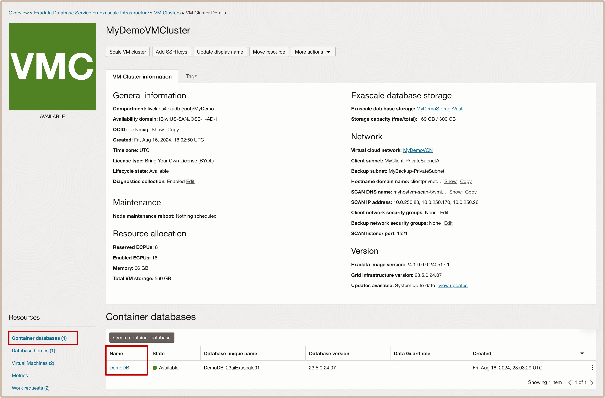
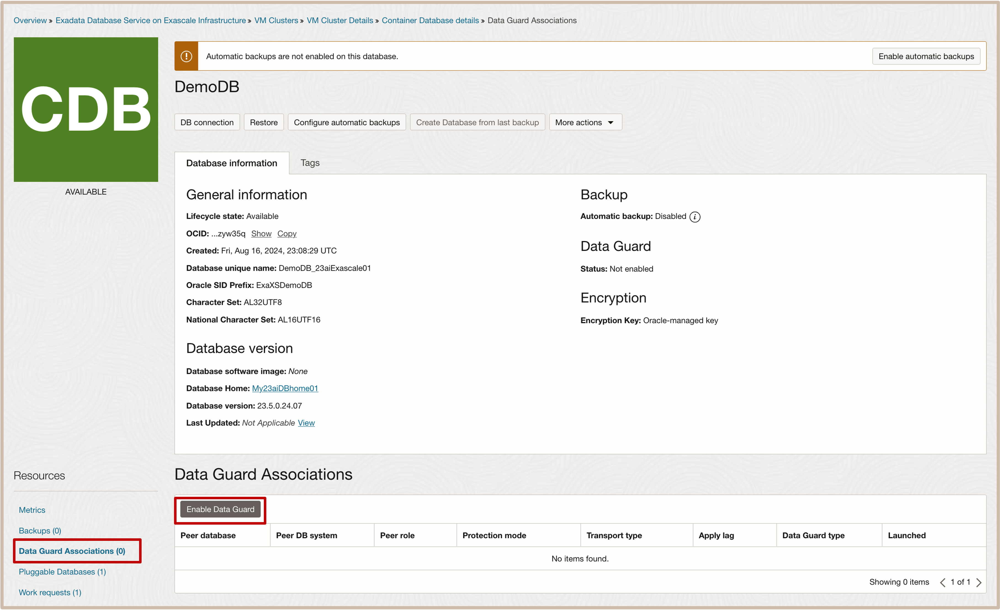
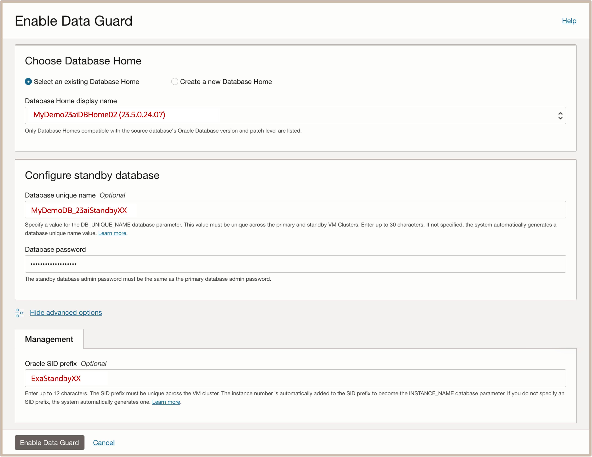

# Enable Data Guard for local HA using OCI Console

## Introduction

This lab walks you through the steps to Enable Data Guard using OCI Console.

Estimated Lab Time: 15 minutes

<!-- Watch the video below for a quick walk-through of the lab.
[Create an Exadata Database Service on Cloud@Customer Infrastructure](youtube:DCrivNA5bs8)
-->
### Objectives

-   After completing this lab, you should be able to Enable Data Guard using OCI Console

### Prerequisites

This lab requires completion of the following:

* Completion of **Lab1**

## Task 1: Enable Data Guard using OCI Console

1. **Navigate to the Exadata Database Service on Exascale Infrastructure:** 
    * Open the **Navigation Menu**. 
    * Under **Oracle Database**, click ***Exadata Database Service on Exascale Infrastructure***.

  

2. **Navigate to the Exadata VM cluster** in your assigned compartment:
    * In the left rail, select ***VM Clusters***. 
    * Under **List Scope**, Select your assigned compartment named ***MyCompartmentXX***. 
    * Then click on the name of ***your VM Cluster*** to view the **VM Cluster Details page**. 
   
  

3. **Navigate to the Continer Database** we want to configure a Data Guard Association for.
    * On the left rail of the **VM Cluster details page**, under **Resources** , select ***Container Databases*** 
    * From the list of the displayed databases **click on the container database named** ***DemoDBXX***. 
   
   

4. Start the **Data Guard Association process**
      * In the Container Database details page, under **Resources**, click on ***Data Guard Associations***.
      * Then click on the ***Enable Data Guard*** button.
   
   

5. In the Enable Data Guard page, **provide the information to configure your Data Guard association.**
    
    **<u>In the Select Peer VM Cluster Section of the page:</u>** 

      * For the **Peer Region**: Select your ***assigned peer region*** 
      * For the **Availability Domain**: Select your ***assigned availabilty domain***
      * Then select the **Compartment** named ***MyDemoStandby*** and Select the **peer VM Cluster** named  ***MyDemoStandbyVMCluster***
  
         >**Note:** The peer Region selected will determine if you are configuring a local standby or a DR standby.  
    
    **<u>In the DataGuard Association Details section of the page:</u>**
    
      * For the **Data Guard type**: you can choose between Active Data Guard or Data Guard. For this lab, select ***Active Data Guard***
    
      * For the **Protection mode**:  you can choose between Maximum Performance and Maximum Availability. For this lab, select ***Maximum Performance***

   

6. **Choose the Database Home and name the standby database:** 
    * For the **Database Home** choose ***Select an existing Database Home*** then select ***MyDemoStandby23aiDBHome02***.

    * For the **Database unique name** for the standby database: enter ***MyDemoDB_23aiStandbyXX*** 
     ( Where ***XX*** is your assigned student # for the workshop).
    
    * For the **Database password**. For this lab, use ***Pass4OCW24-#*** 

    **<u>Under Advanced Options on the Management Tab:</u>**

    * For the **Oracle SID Prefix** enter: **ExaStandby*****XX*** 
     ( Where ***XX*** is your assigned student # for the workshop).

    * Then Click on the **Enable Data Guard** button to start the cloud automation workflow.

   
   
   >*The Data Guard Association process will run in the background. When the association is created, the details for a database and its peer display their respective roles as ***Primary*** or ***Standby***.
  
   

You may now **proceed to the next lab**

## Learn More

* Click [here](https://docs.oracle.com/en-us/iaas/exadb-xs/doc/using-data-guard-with-exadb-xs.html) to learn more about using Oracle Data Guard with Exadata Database Service on Exascale Infrastructure.

## Acknowledgements

* **Author** - Eddie Ambler, Leo Alvarado, Product Management

* **Contributors** - Tammy Bednar, Product Management

* **Last Updated By** - Eddie Ambler, Product Management, August 2024.
