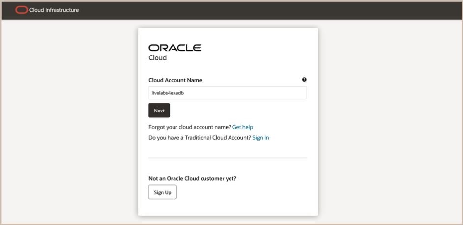
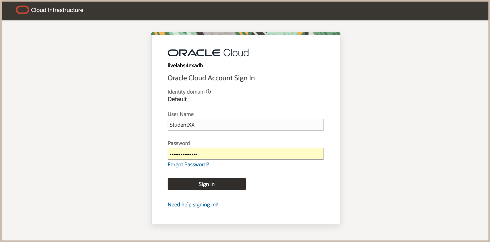
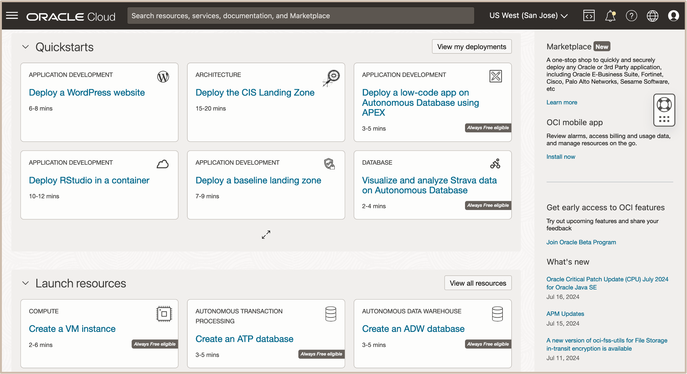

# Get started - Connect to Oracle Cloud Tenancy

## **Introduction**

Oracle Cloud is the industry's broadest and most integrated cloud provider, with deployment options ranging from the public cloud to your data center. Oracle Cloud offers best-in-class services across Software as a Service (SaaS), Platform as a Service (PaaS), Database as a Service (DBaaS), and Infrastructure as a Service (IaaS).

**Estimated Time:** ***5 minutes***

<u>**Types of Cloud Accounts that can be used for this workshop:**</u>

   * ***Oracle Cloud Paid Account***: When your tenancy is provisioned, Oracle sends an email to the default administrator at your company with the sign-in credentials and URL. This administrator can then create a user for each person who needs access to the Oracle Cloud. Check your email or contact your administrator for your credentials and account name.

   * ***Oracle provided Cloud Workshop Account***: This type of environment can be obtained by engaging with your Sales Engineer to coordinate obtaining approval to obtain an Event Code which will provide temporary access to an Oracle provided environment.

<!-- Watch the video below for a quick walk-through of the lab.
[Create Oracle Database](youtube:JJ4Wx0l0gkc)
-->
### **Objectives**

-   For this workshop we will learn how to login to a tenancy provided by the **Oracle Product Management & Sales Teams**. 

### **Prerequisites**

* **Cloud Account Name** - Secure your personal or assigend Oracle Cloud tenancy name that will be used for this workshop.

* **Username** - Secure your personal or assigned username for this workshop

* **Password** - Secure your personal or assigned password for this workshop

* **Required Service Limits** -- If you are using a personal Oracle Cloud tenancy, you will need to ensure that you have service limits assigned for the following resources: Exadata on Exascale Infrastructure - High Capacity >= 600 GB, Exadata on Exascale Infrastructure - Local Storage >= 600 GB, Exadata on Exascale Infrastructure - Total CPU Count >= 24, and Exadata on Exascale Infrastructure - Instance Count >= 2. 

## Task 1: Log in to Oracle provided Oracle Cloud Tenancy

1. Go to [<u>**cloud.oracle.com**</u>](https://cloud.oracle.com/?region=us-sanjose-1&tenant=livelabs4exadb) and enter your **Cloud Account Name** *(**Assigned Tenancy**)*. 
   
   For this workshop, make sure your assigned tenancy named ***livelabs4exadb*** is selected. 
   

   

2. Enter your assigned **username** and **password** and click **Sign In** 

   

3. You are now signed in to Oracle Cloud! 
   
   

You may now **proceed to lab 1**.

## Acknowledgements

* **Author** - Eddie Ambler, Leo Alvarado, Product Management

* **Contributors** - Tammy Bednar, Product Management

* **Last Updated By** - Eddie Ambler, Product Management, July 2024.
