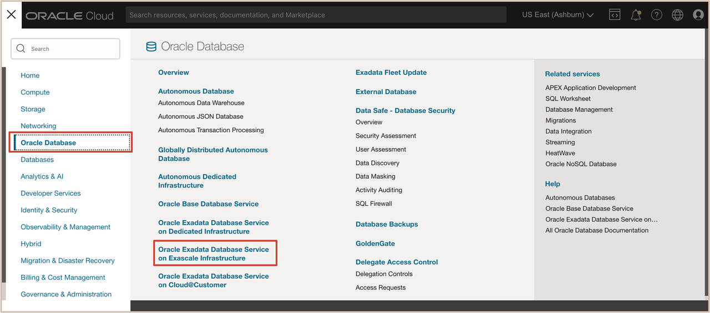
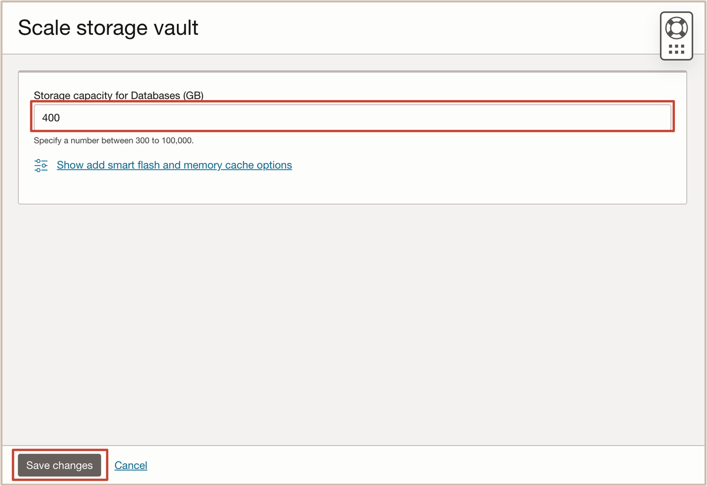
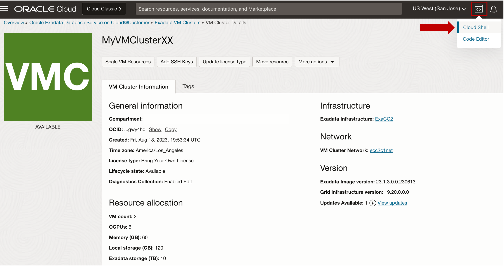
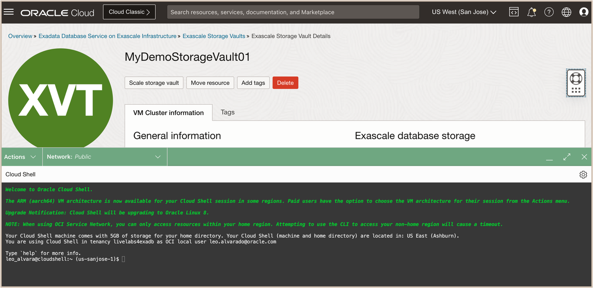

# Scale Exascale Storage Vault Resources


## Introduction

This lab walks you through the steps to Scale the Exascale Storage Vault Resources using the OCI Console.

Estimated Time: 10 minutes

Watch the video below for a quick walk-through of the lab.
[Scale Exascale Storage Vault Resources](youtube:"placeholder")


### Objectives

-   After completing this lab, you should be able to scale the Exascale Storage Vault Resources using the OCI Console.
-   List Exascale Storage Vault configuration using CLI


### Prerequisites

This lab requires the completion of the following:

* Completion of **Lab1**


## Task 1: Scale the Exascale Storage Vault Resources using the OCI Console

1. Open the navigation menu. Under ***Oracle Database***, Click ***Oracle Exadata Database Service on Exascale Infrastructure***.
   
   

2. On the left rail, click **Exascale Storage Vaults**. 
   
   Select the name of your assigned Vault ***MyDemoStorageVaultXX*** that you want to scale. 

   
    
3. The Exascale Storage Vault Details page displays information about the selected Vault. 
   
   Click on ***Scale storage vault***.

   

   On the Scale Storage Vault dialog, enter a number for the capacity for High Capacity storage. 
      >**Note:** This number should be the value for the total storage that you want to have provisioned after the scaling operation completes.
   
   

   For this lab, enter the value of ***400*** for the ***Storage capacity for Databases (GB)***, as we will scale up the Exascale Database Storage Vault from **300 GB to 400 GB**.

   

4. Click ***Save Changes***. Your Vault will be scaled automatically. 
   
      >**Note:** Once the scale up operation is complete, the Exascale Storage Vault status will change from ***Updating*** to ***Available***.

   

   In the Exascale Storage Vault Details page, Copy the Storage Vault OCID by clicking the ***copy*** button in the **OCID** field under the **General Information** section. 
   Paste the copied ***Exascale Storage Vault OCID*** to a text editor.

   

## Task 2: List Exascale Storage Vault Configuration using CLI

   >**Note:** To use **OCI CLI** for this lab, we will be using the ***OCI Cloud Shell tool***. 

1. Click the **Developer tools** icon in the console header and select ***Cloud Shell*** from the drop-down menu. 
   
   

   This displays the Cloud Shell in a "drawer" at the bottom of the console:

   

2. Run the OCI CLI Command to get the Exascale Storage Vault Configuration.

      >**Note:** Replace ***{ExascaleVaultID}*** with the Exascale Storage Vault OCID copied from *(Task 1 Step 4)*

    ```
    <copy>

      oci db exascale-db-storage-vault get --exascale-db-storage-vault-id {ExascaleVaultID}

    </copy>
    ```

   **<u>Description:</u>** 

   The OCI CLI command syntax is: **oci** ***db*** ***exascale-db-storage-vault*** ***get*** ***--exascale-db-storage-vault-id*** ***{ExascaleVaultID}***

   **<u>Where:</u>**

      * ***db*** is the **service type** for the Oracle Database Cloud Services.
      * ***exascale-db-storage-vault*** is the **resource type** for the Exascale Storage Vault.
      * ***get*** is the **action** to get information about the Exascale Storage Vault Configuration.
      * ***--exascale-db-storage-vault-id*** is the **parameter** for the Exascale Storage Vault OCID.

   After running the command, you will see similar output below.

   

   The output of the command displays information about the configuration of the selected  ***Exascale Storage Vault***, such as:

      * ***Storage Vault Display Name***
      * ***Exascale Database Storage Capacity Available size in gbs***
      * ***Exascale Database Storage Capacity Total size in gbs***
      * ***Lifecycle state***
      * ***Exascale Storage Vault Associated VM Cluster Count and OCID***

***Congratulations!!!*** You may now **proceed to the next lab**.

## Acknowledgements

* **Author** - Leo Alvarado, Eddie Ambler, Product Management

* **Contributors** - Tammy Bednar, Product Management

* **Last Updated By** - Leo Alvarado, Product Management, August 2024.
